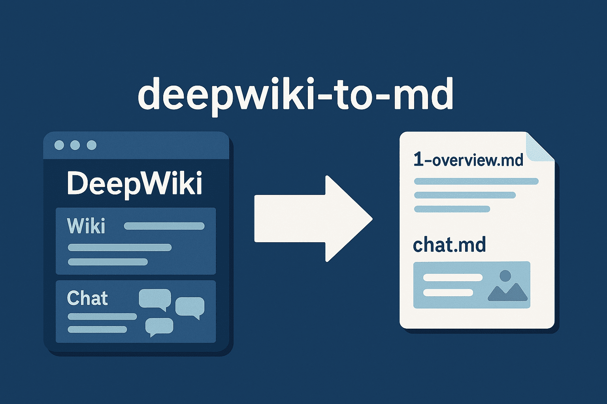
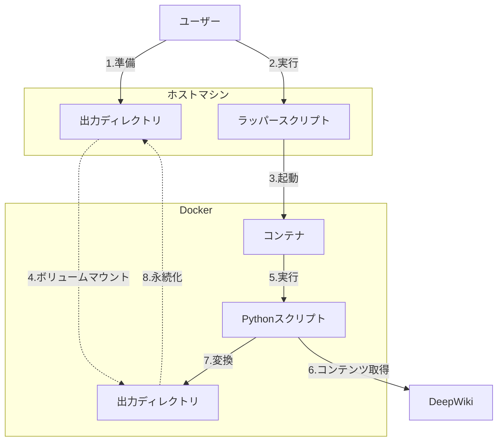

# deepwiki-to-md



## 1. 概要

`deepwiki-to-md`は、DeepWikiのコンテンツ（リポジトリのWikiやチャットログ）をMarkdown形式でローカルに保存するためのCLIツールです。
このプロジェクトにより、ユーザーはDeepWiki上の情報を簡単にエクスポートし、ローカル環境で管理・活用できます。

### 1.1. 目的

1.  DeepWikiのチャットログをMarkdown形式で取得できるようにします。
2.  DeepWikiのWikiコンテンツをMarkdown形式で取得できるようにします。
3.  Mermaidの図も適切に変換・保存して再利用できるようにします。

## 2. Getting Started

### 2.1. インストール

1.  **前提条件**:
    * Dockerがインストールされていること
2.  **ラッパースクリプトのダウンロード**:
    * 任意のディレクトリに配置します。
        ```bash
        # 例: ~/my_deepwiki_exports に配置する場合
        mkdir -p ~/my_deepwiki_exports
        curl -Lo ~/my_deepwiki_exports/deepwiki-to-md https://raw.githubusercontent.com/suwa-sh/deepwiki-to-md/refs/heads/main/bin/deepwiki-to-md
        chmod +x ~/my_deepwiki_exports/deepwiki-to-md
        ```
3.  **ツールの実行**:
    * **リポジトリWikiの取得例**:
        ```bash
        ~/my_deepwiki_exports/deepwiki-to-md wiki https://deepwiki.com/yourgroup/yourrepo
        ```
    * **チャットログの取得例**:
        ```bash
        ~/my_deepwiki_exports/deepwiki-to-md chat https://deepwiki.com/search/yourchatid
        ```

### 2.1. 提供物

1.  **Dockerイメージ (suwash/deepwiki-to-md)**
    * ツール本体のPythonスクリプト、Playwright、必要なブラウザドライバ、その他依存ライブラリを全て含みます。
    * Docker Hubで公開しています。
      * [suwash/deepwiki-to-md](https://hub.docker.com/r/suwash/deepwiki-to-md)
2.  **ラッパースクリプト (`deepwiki-to-md`)**
    * ユーザーが直接ダウンロードして利用するシェルスクリプトです。
    * このスクリプトがDockerコマンドの実行を抽象化します。
    * GitHubで管理しています。
      * [bin/deepwiki-to-md](bin/deepwiki-to-md)

### 2.2. システム構成と動作フロー

以下の図は、`deepwiki-to-md`のシステム構成とユーザーがコマンドを実行した際の動作フローを示します。



**ディレクトリ構造のイメージ（ユーザーのホストマシン上）:**

```
任意のディレクトリ/  ※例: ~/my_deepwiki_exports/
    deepwiki-to-md      <-- ラッパースクリプト本体
    wiki/
        yourgroup/
            yourrepo/
                1-overview.md
                2-details.md
                images/
                    diagram1.svg
    chat/
        yourchatid/
            chat.md
            images/
                diagram1.svg
```

## 3. コマンドライン仕様

基本的なコマンド構文は以下です。
```bash
./deepwiki-to-md <サブコマンド> <URL> [-o <出力ベースディレクトリ>]
```

* `<サブコマンド>`: `wiki` または `chat` を指定します。
* `<URL>`: 対象のDeepWikiページのURLを指定します。
* `-o <出力ベースディレクトリ>` (オプション): Markdownファイルや画像が出力されるベースディレクトリを指定します。デフォルトはラッパースクリプトを配置したディレクトリです。

**例:**

* **リポジトリWikiの取得**:
    ```bash
    ./deepwiki-to-md wiki https://deepwiki.com/yourgroup/yourrepo
    ```
    出力先: `./wiki/yourgroup/yourrepo/`

* **チャットログの取得**:
    ```bash
    ./deepwiki-to-md chat https://deepwiki.com/search/yourchatid
    ```
    出力先: `./chat/yourchatid/`

* **出力ベースディレクトリを指定してリポジトリWikiを取得**:
    ```bash
    ./deepwiki-to-md wiki https://deepwiki.com/yourgroup/yourrepo -o /path/to/custom_output
    ```
    出力先: `/path/to/custom_output/wiki/yourgroup/yourrepo/`
