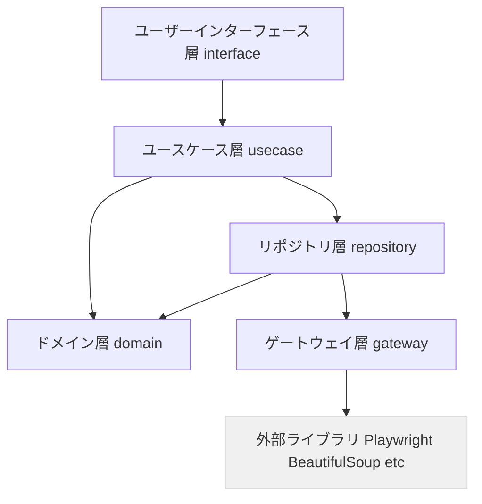
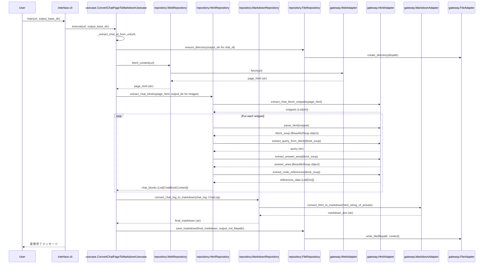

# deepwiki-to-md 開発者向けドキュメント

## 1. アーキテクチャ

`deepwiki-to-md`プロジェクトは、クリーンアーキテクチャを採用しています。
これにより、関心事の分離、テスト容易性の向上、保守性の高いコードベースを実現しています。

### 1.1. アーキテクチャ概要

以下の図は、システムの主要なレイヤーとその依存関係を示します。



| 要素名                                 | 説明                                                                 |
| :------------------------------------- | :------------------------------------------------------------------- |
| ユーザーインターフェース層 (interface)         | ユーザーとの対話（CLI）や外部システムとの入出力を担当します。                |
| ユースケース層 (usecase)             | アプリケーション固有のビジネスロジックを実装し、ドメイン層とリポジトリ層を調整します。 |
| ドメイン層 (domain)                  | コアなビジネスロジックとエンティティ（データ構造）を含みます。外部依存を持ちません。     |
| リポジトリ層 (repository)            | ドメインオブジェクトとデータ永続化（ゲートウェイ経由）の間の抽象化レイヤーです。       |
| ゲートウェイ層 (gateway)             | 外部ライブラリや外部サービスとの具体的な通信を実装するアダプターを含みます。         |
| 外部ライブラリ (Playwright, BeautifulSoup等) | Webアクセス、HTML解析、Markdown変換などを行うサードパーティ製のライブラリです。  |

### 1.2. レイヤー構成とディレクトリ構造

ソースコードは以下のディレクトリ構造で各層に対応して配置されます。
```
src/
├── domain/
│   ├── __init__.py
│   ├── constants.py         # SVG処理などの定数
│   └── entities.py          # すべてのエンティティクラス (MermaidDiagram, ChatBlockContent, WikiPage, WikiSite 等)
│
├── usecase/
│   ├── __init__.py
│   ├── chat_page_usecase.py # ConvertChatPageToMarkdownUsecase
│   └── wiki_site_usecase.py # ConvertWikiSiteToMarkdownUsecase
│
├── repository/
│   ├── __init__.py
│   ├── web_repository.py    # WebRepository
│   ├── html_repository.py   # HtmlRepository
│   ├── markdown_repository.py # MarkdownRepository
│   └── file_repository.py   # FileRepository
│
├── gateway/
│   ├── __init__.py
│   ├── web_adapter.py       # WebAdapter (Playwright使用)
│   ├── html_adapter.py      # HtmlAdapter (BeautifulSoup使用)
│   ├── markdown_adapter.py  # MarkdownAdapter (markdownify使用)
│   └── file_adapter.py      # FileAdapter (os操作)
│
└── interface/
    ├── __init__.py
    └── cli.py               # CLI処理と例外ハンドリング
```

**各層の責務:**

* **ドメイン層 (`domain`)**:
    * ビジネスロジックとエンティティ（例: `MermaidDiagram`, `ChatBlockContent`, `WikiPage`, `WikiSite`）を含みます。
    * これらのクラスは、外部依存を持たない純粋なビジネスロジックを表現します。
* **ユースケース層 (`usecase`)**:
    * ドメイン層のエンティティやロジック、およびリポジトリ層を通じて、具体的なアプリケーションの機能（例: チャットページ変換、Wikiサイト変換）を実現する手順を実装します。
    * 複雑なビジネスロジックはドメイン層に委譲します。
* **リポジトリ層 (`repository`)**:
    * ドメインオブジェクトと外部リソース（Webページ、ファイルシステムなど）間のデータの永続化や取得を抽象化します。
    * ゲートウェイ層のアダプターを利用して、具体的なデータ操作を行います。
    * 入力と出力はドメイン層の型を使用します。
* **ゲートウェイ層 (`gateway`)**:
    * 外部システムやライブラリ（Playwright, BeautifulSoup, markdownify, OS機能など）との具体的な通信や操作を担当するアダプターを配置します。
* **ユーザーインターフェース層 (`interface`)**:
    * CLI（コマンドラインインターフェース）を提供し、ユーザーからの入力を受け付け、ユースケースを実行し、結果を表示します。
    * 例外処理もこの層で集約的に行うことを基本とします。

### 1.3. 設計上の決定事項

1.  **Repository**:
    * 入力と出力はドメイン層の型を使用します。
    * 外部依存（アダプター）の結果をドメインオブジェクトに変換します。
2.  **Usecase**:
    * ドメイン層とRepositoryを組み合わせる手順のみを実装します。
    * 複雑なビジネスロジックはドメイン層に移動させます。
3.  **例外処理**:
    * 基本的には`cli`レイヤー（ユーザーインターフェース層）でのみ例外をキャッチします。
    * アダプターでは、必要に応じてリトライ処理のために例外を扱うことがあります。
4.  **モジュール分割**:
    * 単一責任の原則に従い、各クラスが特定の役割に特化するようにします。
    * 依存関係を明示的に管理し、循環依存を回避します。
5.  **Playwrightの使用**:
    * Playwrightを使用してDeepWikiコンテンツにアクセスします。ブラウザ自動化によりSPA（Single Page Application）で動的に生成されるコンテンツも取得可能です。

### 1.4. 主要なデータフロー (チャット変換時)

以下は、ユーザーがチャット変換コマンドを実行した際の主要なデータフローを示すシーケンス図です。



| 要素名                                         | 説明                                                                         |
| :--------------------------------------------- | :--------------------------------------------------------------------------- |
| User                                           | エンドユーザーです。                                                               |
| CLI (interface.cli)                            | コマンドラインインターフェースを受け付け、ユースケースを呼び出します。                         |
| Usecase (ConvertChatPageToMarkdownUsecase)     | チャットページ変換のビジネスロジックフローを制御します。                                 |
| WebRepo (repository.WebRepository)             | Webコンテンツの取得を抽象化します。                                                      |
| HtmlRepo (repository.HtmlRepository)           | HTMLの解析とドメインオブジェクトへの変換を抽象化します。                                     |
| MDRepo (repository.MarkdownRepository)         | ドメインオブジェクトからMarkdownへの変換を抽象化します。                                   |
| FileRepo (repository.FileRepository)           | ファイルシステムの操作を抽象化します。                                                     |
| WebAdapter (gateway.WebAdapter)                | Playwrightを使い、実際にWebページを取得します。                                          |
| HtmlAdapter (gateway.HtmlAdapter)              | BeautifulSoupを使い、HTML要素を抽出・解析します。                                        |
| MDAdapter (gateway.MarkdownAdapter)            | markdownifyを使い、HTMLをMarkdownに変換します。                                        |
| FileAdapter (gateway.FileAdapter)              | OS標準機能等を使い、ファイルやディレクトリを操作します。                                       |
| `_extract_chat_id_from_url(url)`               | URLからチャットIDを抽出する内部処理です。                                                |
| `ensure_directory(...)`                        | 指定されたパスにディレクトリが存在することを確認し、なければ作成します。                             |
| `Workspace_content(url)`                           | 指定URLのHTMLコンテンツを取得します。                                                    |
| `extract_chat_blocks(...)`                     | HTMLからチャットの各ブロック(質問、回答、参照コードなど)を抽出します。                             |
| `convert_chat_log_to_markdown(...)`            | 抽出されたチャットブロック情報を元に、最終的なMarkdown文字列を生成します。                         |
| `save_markdown(...)`                           | 生成されたMarkdown文字列を指定されたファイルパスに保存します。                                   |


### 1.5. 設計パターン

本プロジェクトでは、以下の設計パターンを活用しています。

1.  **アダプターパターン**:
    * 外部ライブラリ（Playwright, BeautifulSoup, markdownify, osモジュール）との連携を抽象化するために、各ゲートウェイコンポーネント（`WebAdapter`, `HtmlAdapter`, `MarkdownAdapter`, `FileAdapter`）で採用しています。これにより、ライブラリの変更がシステム全体に与える影響を最小限に抑えます。
2.  **リポジトリパターン**:
    * データアクセスロジック（Web、HTML解析、Markdown変換、ファイル操作）をドメイン層から分離し、抽象化するために採用しています。各リポジトリ（`WebRepository`, `HtmlRepository`, `MarkdownRepository`, `FileRepository`）が対応します。
3.  **データクラスの活用**:
    * ドメインエンティティ（`ChatBlockContent`, `ProcessedAnswer`, `MermaidDiagram`, `WikiPage`, `WikiSite`など）は、Pythonの`dataclass`を積極的に利用して実装しています。これにより、データ構造の定義を簡潔にし、関連する操作メソッドをクラスに持たせることができます。
4.  **依存性の注入 (Dependency Injection)**:
    * ユースケース層のクラスやリポジトリ層のクラスは、コンストラクタを通じて、依存する他のコンポーネント（他のリポジトリやアダプター）を受け取ります。
        ```python
        # ユースケースクラスのコンストラクタ例
        class ConvertWikiSiteToMarkdownUsecase:
            def __init__(
                self,
                web_repository: WebRepository,
                html_repository: HtmlRepository,
                markdown_repository: MarkdownRepository,
                file_repository: FileRepository,
            ):
                self.web_repository = web_repository
                self.html_repository = html_repository
                self.markdown_repository = markdown_repository
                self.file_repository = file_repository
        ```
    * これにより、以下の利点があります。
        * **テスト容易性の向上**: モックオブジェクトを容易に注入でき、単体テストがしやすくなります。
        * **結合度の低減**: クラス間の依存関係が明確になり、疎結合な設計を促進します。
        * **拡張性の向上**: 依存コンポーネントの実装を差し替えることが容易になります。
5.  **コマンドパターン**:
    * CLIインターフェースにおいて、`chat`コマンドと`wiki`コマンドは、統一されたインターフェース（サブコマンドとURL、オプションの出力ディレクトリ）で利用できるように実装されています。各コマンドの具体的な処理は、それぞれのユースケースクラスにカプセル化されています。
6.  **URL解析と自動ディレクトリ構造**:
    * 入力されたURLを解析し、コンテンツの種類（wikiかchatか）や識別子（組織名/リポジトリ名、チャットID）を抽出します。
    * 抽出した情報に基づいて、出力先のディレクトリ構造を自動的に生成します。
        * **wiki**: `{output_base_dir}/wiki/{organization}/{repository}/`
        * **chat**: `{output_base_dir}/chat/{chat_id}/`

## 2. 開発環境


### 2.1. 環境構築

```bash
# リポジトリのクローン
git clone https://github.com/suwash/deepwiki-to-md.git
cd deepwiki-to-md
code .
# dev containerを開く

# テストの実行
./test/size_L/test_chat.sh
./test/size_L/test_wiki.sh
```

### 2.2. imageの公開

```bash
# ホストマシン上で実行
docker login -u <username>
./scripts/buildpack.sh
```

### 2.3. Devcontainer設定

VSCode Devcontainerを使用して、統一された開発環境を提供します。

-   **Pythonバージョン**: 3.12
-   **`.devcontainer/Dockerfile`**:
    * ベースイメージ: Python 3.12
    * Playwrightと対応ブラウザ（Chromium）のインストール
    * システム依存関係（例: `libwebkit2gtk-4.0-dev`, `build-essential`, `curl`）のインストール
-   **`.devcontainer/devcontainer.json`**:
    * VSCodeとの連携設定（例: `remoteUser`）
    * 推奨されるVSCode拡張機能:
        * `ms-python.python` (Python)
        * `ms-python.pylance` (Pylance)
        * `charliermarsh.ruff` (Ruff)
    * フォーマット設定: Ruffを使用したコードの自動整形を有効化します。
    * GitHub CLI機能の追加。

### 2.4. 開発ツール

-   **Rye** (推奨、または Poetry/PDM/pip-tools): Pythonのパッケージングと依存関係管理に使用します。
-   **Ruff**: 高速なPythonリンターおよびフォーマッターとして使用し、コード品質を維持します。
-   **Pytest**: テストフレームワークとして使用し、ユニットテストや統合テストを記述・実行します。

## 3. テスト戦略

品質の高いソフトウェアを提供するため、多層的なテスト戦略を採用します。

### 3.1. テストサイズによる分類

テストはそのスコープと依存関係の範囲に応じて分類します。

-   **Sサイズテスト (ユニットテスト)** (`test/size_S/`)
    * Pytestを使用し、インメモリで完結するテストを記述します。
    * 外部依存（ファイルシステム、ネットワーク、外部ライブラリの具象実装）はモックを使用します。
    * 個々の関数やクラスメソッドのロジックを検証します。
-   **Mサイズテスト (統合テスト)** (`test/size_M/`)
    * Pytestを使用し、複数のコンポーネント間の連携をテストします。
    * ファイルシステム操作や、ローカルで完結する範囲の外部ライブラリ（モック化が困難または不適切な場合）との結合を含みます。
    * localhost内で完結するテストとします。
-   **Lサイズテスト (E2Eテスト/システムテスト)** (`test/size_L/`)
    * システムのエントリーポイント（CLI）から実行し、全体の動作を確認します。
    * 実際のDeepWikiサイト（テスト用または公開サイト）へのアクセスを含みます。
    * ハッピーパス（正常系）の動作確認を主目的とします。

### 3.2. レイヤーごとのSサイズテストの焦点

-   **ユースケース層**:
    * ドメイン層のエンティティやロジック、リポジトリを正しく組み合わせて、期待される結果を生成できるかテストします。依存するアダプターはモック化します。
    * ハッピーパスを中心にテストし、検出されたバグについては回帰テストとしてケースを追加します。
-   **ドメイン層**:
    * エンティティのメソッドやビジネスロジックを網羅的にテストします。
-   **リポジトリ層**:
    * アダプターからのデータを受け取り、ドメインオブジェクトへ正しく変換できるか、またはその逆をテストします。アダプターはモック化します。
    * このテストはユースケース層からのテストに含めて実施することも可能です。
-   **ゲートウェイ層**:
    * 外部ライブラリの呼び出し方が正しいか、ライブラリからの戻り値を期待通りに処理できるかをテストします。外部ライブラリ自体はモック化します。
    * このテストはリポジトリ層またはユースケース層からのテストに含めて実施することも可能です。

### 3.3. テストのルール

-   **テストは実行可能な仕様書を目指します**:
    * テストコード自体が、対象機能の仕様を明確に表現するようにします。
    * ループや複雑な分岐は避け、テストケースをシンプルに保ちます。
    * 期待値や入力値は原則としてベタ書きします。可読性や保守性のために変数を使用することは許容します。
-   **Given / When / Then (または Arrange / Act / Assert) 形式でステップを記述します**:
    * テストの前提条件 (Given/Arrange)、実行する操作 (When/Act)、期待される結果 (Then/Assert) を明確に分離します。
-   **テスト関数名でテストケースの内容がわかるようにします**:
    * 例: `test_{対象クラス名}_{対象メソッド名}_引数がNoneの場合_例外が発生すること`

### 3.4. テストの実行方法

- Lサイズテスト
  - **`./test/size_L/test_chat.sh, test_wiki.sh`**:
    - 特定の固定URLを使用して`deepwiki-to-md chat`コマンドを実行します。
    - 出力されたMarkdownファイルや画像ファイルの内容が、期待される結果（スナップショットなど）と一致するかを検証します。
    - 終了コード:
      - `0`: 成功
      - `0以外`: 失敗

## 4. 拡張ポイント

クリーンアーキテクチャと疎結合な設計により、将来的な機能拡張や変更に柔軟に対応できます。

### 4.1. 新規機能追加

-   既存のアーキテクチャパターン（ドメイン、ユースケース、リポジトリ、ゲートウェイ、インターフェース）に従うことで、新しい機能（例: 新しいDeepWikiのコンテンツタイプへの対応、異なる出力形式のサポート）を体系的に追加できます。
-   CLIインターフェースも既存のコマンドパターン（サブコマンド、URL、オプション）に沿って拡張できます。

### 4.2. テスト容易性

-   各レイヤーが明確に分離されているため、モックオブジェクトを使用した単体テストが容易です。
-   `src/test_integration.py` (Mサイズテストの例) のように、特定コンポーネント間の統合テストも効率的に実装できます。

### 4.3. インフラストラクチャ（外部ライブラリ）の切り替え

-   特定の外部ライブラリの仕様変更や、より優れた代替ライブラリへの移行が必要になった場合、影響範囲は主にゲートウェイ層のアダプタークラスに限定されます。
    * 例: Playwrightの代わりにSeleniumを使用する場合、`WebAdapter`の実装を変更し、インターフェース（メソッドシグネチャ）を維持すれば、上位レイヤーへの影響は最小限で済みます。
    * 例: markdownifyの代わりに別のHTML→Markdown変換ライブラリを使用する場合、`MarkdownAdapter`の実装を変更します。

### 4.4. 出力形式のカスタマイズ

-   ファイル命名規則やディレクトリ構造を変更したい場合は、主にユースケース層のURL解析ロジックや出力パス生成ロジックの修正で対応可能です。
-   ユーザーがテンプレートを指定して出力形式をカスタマイズできるような機能を追加する場合、Markdown変換処理を担当するリポジトリやアダプター、およびユースケース層に拡張を加えることになります。CLIにも新たなオプションを追加します。
