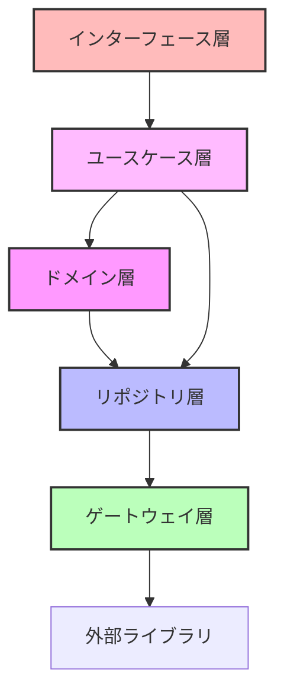
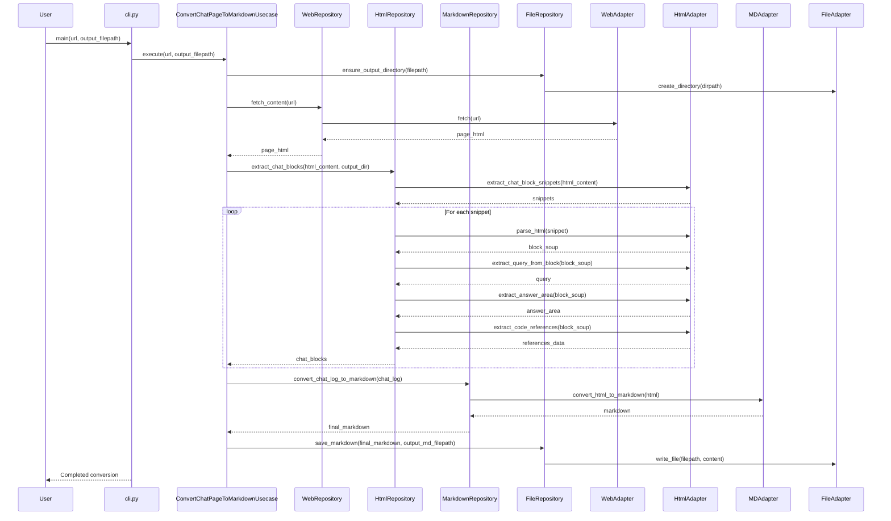

# システムパターン - deepwiki-to-md

## アーキテクチャ概要

deepwiki-to-mdプロジェクトは、クリーンアーキテクチャを採用し、リファクタリングにより以下の層構造で実装しました：



## レイヤー構成

### 1. ドメイン層 (domain)

コアなビジネスロジックとエンティティを含みます：

- `MermaidDiagram` - Mermaid図のSVG処理とファイル保存
- `CodeReference` - コードファイル参照の表現
- `CodeReferenceCollection` - コード参照のコレクション
- `ProcessedAnswer` - Mermaid図を処理したあとの回答
- `ChatBlockContent` - チャットブロックのコンテンツ表現
- `ChatLog` - チャットブロックのコレクション

これらのクラスは、外部依存を持たない純粋なビジネスロジックを表現しています。

### 2. リポジトリ層 (repository)

ドメインオブジェクトとゲートウェイ層の間の変換を担当：

- `WebRepository` - Web取得操作のリポジトリ
- `HtmlRepository` - HTML解析のリポジトリ
- `MarkdownRepository` - Markdown変換のリポジトリ
- `FileRepository` - ファイルシステム操作のリポジトリ

### 3. ゲートウェイ層 (gateway)

外部ライブラリとの通信を抽象化するアダプター：

- `WebAdapter` - Playwrightを使用したページコンテンツ取得
- `HtmlAdapter` - BeautifulSoupを使用したHTML解析
- `MarkdownAdapter` - markdownifyを使用したMarkdown変換
- `FileAdapter` - OSモジュールを使用したファイル操作

### 4. ユースケース層 (usecase)

アプリケーション固有のビジネスロジックを実装：

- `ConvertChatPageToMarkdownUsecase` - チャットページをマークダウンに変換するユースケース

### 5. インターフェース層 (interface)

ユーザーとの対話を担当：

- `cli.py` - コマンドラインインターフェースと例外ハンドリング

## 主要なデータフロー



## 設計パターン

### 1. アダプターパターン

外部ライブラリとの連携を抽象化するアダプターパターンを採用：
- `WebAdapter` - Playwrightをラップ
- `HtmlAdapter` - BeautifulSoupをラップ
- `MarkdownAdapter` - markdownifyをラップ
- `FileAdapter` - OSモジュールをラップ

### 2. リポジトリパターン

データアクセスを抽象化し、ドメインオブジェクトと外部データの変換を担当：
- `WebRepository` - Webアクセスを抽象化
- `HtmlRepository` - HTML解析を抽象化
- `MarkdownRepository` - Markdown変換を抽象化
- `FileRepository` - ファイル操作を抽象化

### 3. データクラスの活用

ドメインオブジェクトはデータクラスとして実装し、操作メソッドを付加：
- `ChatBlockContent` - チャットブロックのデータと操作
- `ProcessedAnswer` - 処理済み回答のデータと操作
- `MermaidDiagram` - Mermaid図のデータとSVG操作

### 4. 依存性の注入

ユースケースとリポジトリは、コンストラクタで依存するコンポーネントを注入：
```python
def __init__(
    self,
    web_repository: WebRepository,
    html_repository: HtmlRepository,
    markdown_repository: MarkdownRepository,
    file_repository: FileRepository,
):
    # 依存コンポーネントの設定
```

これにより：
- テスト容易性の向上（モックオブジェクトの注入が可能）
- 結合度の低減（依存関係の明示化）
- 拡張性の向上（新しい実装への差し替えが容易）

## 拡張ポイント

### 1. 新規機能追加

- 現在の抽象化により、新機能の追加が容易（`deepwiki-to-md wiki`など）
- 同じアーキテクチャパターンで新機能を実装可能

### 2. テスト容易性

- 各層が明確に分離されているため、モックを使った単体テストが可能
- インテグレーションテスト (`test_integration.py`) も容易に実装可能

### 3. インフラストラクチャの切り替え

- 必要に応じて異なるライブラリに差し替え可能
  - 例: Playwrightの代わりにSeleniumを使用する場合、`WebAdapter`のみ変更
  - 例: markdownifyの代わりに別のHTML→Markdown変換ライブラリを使用する場合、`MarkdownAdapter`のみ変更
