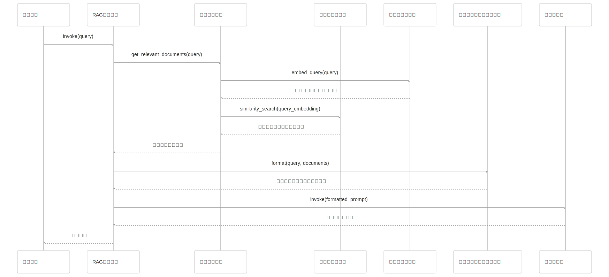
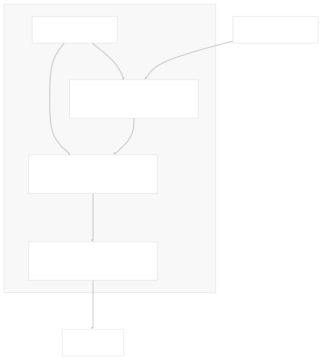

# Query

> c4モデル、データモデル、シーケンス図 を図解して

# Answer

LangChainのアーキテクチャを図解するために、C4モデル、データモデル、シーケンス図を作成します。

## C4モデル図

C4モデルはシステムアーキテクチャを表現するための4つのレベル（コンテキスト、コンテナ、コンポーネント、コード）で構成されています。LangChainのC4モデルを以下に示します。

### コンテキストレベル（システム全体の概要）

### コンテナレベル（主要パッケージ構成）

### コンポーネントレベル（主要コンポーネント）

## データモデル

LangChainの主要なデータモデルを図解します。

## シーケンス図

LangChainの主要なシーケンス図を以下に示します。

### 基本的なLLM呼び出しシーケンス

### RAG（検索拡張生成）シーケンス

### ツール呼び出しを含むエージェントシーケンス

### プロバイダー統合パターン

## LCEL（LangChain Expression Language）パイプライン

## RAG（検索拡張生成）アーキテクチャ

# Notes

この回答では、LangChainフレームワークのアーキテクチャを、C4モデル（コンテキスト、コンテナ、コンポーネント）、データモデル、およびシーケンス図を使って図解しました。C4モデルではLangChainのエコシステム全体から主要パッケージ、コンポーネントまでの階層構造を示しました。データモデルではDocument、Message、Generationなどの主要なデータ構造を示しました。シーケンス図では基本的なLLM呼び出し、RAG、エージェント、プロバイダー統合のフローを示しました。また、LCELパイプラインとRAGアーキテクチャの図も追加しました。

Wiki pages you might want to explore:

* [LangChain Overview (langchain-ai/langchain)](/langchain-ai/langchain/1-langchain-overview)
* [Provider Integrations (langchain-ai/langchain)](/langchain-ai/langchain/3-provider-integrations)

---

# Query

> RAGの処理フローを図解して

# Answer

# RAGの処理フロー図解

RAG（Retrieval Augmented Generation）は、LangChainの主要な機能の一つで、外部知識を活用して言語モデルの回答を生成するプロセスです。RAGの処理フローは主に「インデックス作成（Indexing）」と「検索と生成（Retrieval and Generation）」の2つの主要なフェーズに分かれています。

## RAGの全体的な処理フロー

## 1. インデックス作成フェーズの詳細

このフェーズは通常オフラインで実行され、データソースからデータを取得し、検索可能な形式でインデックスを作成します。

## 2. 検索と生成フェーズの詳細

このフェーズは実行時に行われ、ユーザークエリを受け取り、関連するデータを検索し、それを使用して回答を生成します。

## RAGの詳細なシーケンス図

RAGの処理フローをシーケンス図で表現すると、各コンポーネント間の相互作用がより明確になります。

## LangGraphを使用したRAGの実装例

最新のLangChainでは、RAGの実装にLangGraphを使用することが推奨されています。 rag.ipynb:53

## RAGのインデックス作成プロセスの詳細

RAGのインデックス作成プロセスは、ドキュメントの読み込み、分割、埋め込み、保存の4つのステップで構成されています。 rag.ipynb:40-45

## RAGの検索と生成プロセスの詳細

検索と生成プロセスは、ユーザークエリを受け取り、関連するドキュメントを検索し、それらを使用して回答を生成します。 rag.ipynb:47-51

## RAGの実装例

RAGの実装は、ドキュメントローダー、テキスト分割器、埋め込みモデル、ベクトルストア、レトリーバー、プロンプトテンプレート、言語モデルなどのコンポーネントを組み合わせて行います。以下は、典型的なRAG実装のフローを示しています。

# Notes

この回答では、RAG（Retrieval Augmented Generation）の処理フローを様々な図を使って説明しました。RAGは主に「インデックス作成」と「検索と生成」の2つのフェーズに分かれており、それぞれのフェーズの詳細なステップとコンポーネント間の相互作用を図解しました。また、LangChainのドキュメントに基づいて、RAGの実装例とLangGraphを使用した最新の実装アプローチについても説明しました。RAGは外部知識を活用して言語モデルの回答を生成するための強力な手法であり、LangChainはその実装を簡素化するためのフレームワークを提供しています。

Wiki pages you might want to explore:

* [Chains and Agents (langchain-ai/langchain)](/langchain-ai/langchain/5-chains-and-agents)

## Code References
- [langchain-ai/langchain/docs/docs/tutorials/rag.ipynb](https://github.com/langchain-ai/langchain/blob/0c723af4/docs/docs/tutorials/rag.ipynb)
