# LangChain Overview

[Index your code with Devin](/private-repo)

[DeepWiki](https://deepwiki.com)

[DeepWiki](/)

[langchain-ai/langchain](https://github.com/langchain-ai/langchain "Open repository")

[Index your code with

Devin](/private-repo)Share

Last indexed: 29 September 2025 ([54ea62](https://github.com/langchain-ai/langchain/commits/54ea6205))

* [LangChain Overview](/langchain-ai/langchain/1-langchain-overview)
* [Package Ecosystem](/langchain-ai/langchain/1.1-package-ecosystem)
* [Core Architecture](/langchain-ai/langchain/2-core-architecture)
* [Runnable Interface and LCEL](/langchain-ai/langchain/2.1-runnable-interface-and-lcel)
* [Language Models and Chat Models](/langchain-ai/langchain/2.2-language-models-and-chat-models)
* [Messages and Communication](/langchain-ai/langchain/2.3-messages-and-communication)
* [Tools and Function Calling](/langchain-ai/langchain/2.4-tools-and-function-calling)
* [Provider Integrations](/langchain-ai/langchain/3-provider-integrations)
* [Major Provider Integrations](/langchain-ai/langchain/3.1-major-provider-integrations)
* [Local and Self-Hosted Models](/langchain-ai/langchain/3.2-local-and-self-hosted-models)
* [Community Integrations](/langchain-ai/langchain/3.3-community-integrations)
* [Application Development](/langchain-ai/langchain/4-application-development)
* [Common Patterns and Use Cases](/langchain-ai/langchain/4.1-common-patterns-and-use-cases)
* [CLI and Project Management](/langchain-ai/langchain/4.2-cli-and-project-management)
* [Text Processing and Document Handling](/langchain-ai/langchain/4.3-text-processing-and-document-handling)
* [Next-Generation Agents](/langchain-ai/langchain/4.4-next-generation-agents)
* [Evaluation and Testing](/langchain-ai/langchain/5-evaluation-and-testing)
* [Standard Testing Framework](/langchain-ai/langchain/5.1-standard-testing-framework)
* [LangSmith Evaluation](/langchain-ai/langchain/5.2-langsmith-evaluation)
* [Developer Experience](/langchain-ai/langchain/6-developer-experience)
* [Package Structure and Build System](/langchain-ai/langchain/6.1-package-structure-and-build-system)
* [CI/CD and Release Process](/langchain-ai/langchain/6.2-cicd-and-release-process)
* [Documentation System](/langchain-ai/langchain/7-documentation-system)
* [User Documentation](/langchain-ai/langchain/7.1-user-documentation)
* [API Reference Generation](/langchain-ai/langchain/7.2-api-reference-generation)

Menu

# LangChain Overview

Relevant source files

* [docs/docs/how\_to/document\_loader\_web.ipynb](https://github.com/langchain-ai/langchain/blob/54ea6205/docs/docs/how_to/document_loader_web.ipynb)
* [docs/docs/integrations/chat/aimlapi.ipynb](https://github.com/langchain-ai/langchain/blob/54ea6205/docs/docs/integrations/chat/aimlapi.ipynb)
* [docs/docs/integrations/chat/gradientai.ipynb](https://github.com/langchain-ai/langchain/blob/54ea6205/docs/docs/integrations/chat/gradientai.ipynb)
* [docs/docs/integrations/document\_loaders/hyperbrowser.ipynb](https://github.com/langchain-ai/langchain/blob/54ea6205/docs/docs/integrations/document_loaders/hyperbrowser.ipynb)
* [docs/docs/integrations/document\_loaders/index.mdx](https://github.com/langchain-ai/langchain/blob/54ea6205/docs/docs/integrations/document_loaders/index.mdx)
* [docs/docs/integrations/document\_loaders/notion.ipynb](https://github.com/langchain-ai/langchain/blob/54ea6205/docs/docs/integrations/document_loaders/notion.ipynb)
* [docs/docs/integrations/document\_loaders/xml.ipynb](https://github.com/langchain-ai/langchain/blob/54ea6205/docs/docs/integrations/document_loaders/xml.ipynb)
* [docs/docs/integrations/llms/aimlapi.ipynb](https://github.com/langchain-ai/langchain/blob/54ea6205/docs/docs/integrations/llms/aimlapi.ipynb)
* [docs/docs/integrations/providers/aimlapi.ipynb](https://github.com/langchain-ai/langchain/blob/54ea6205/docs/docs/integrations/providers/aimlapi.ipynb)
* [docs/docs/integrations/providers/anchor\_browser.mdx](https://github.com/langchain-ai/langchain/blob/54ea6205/docs/docs/integrations/providers/anchor_browser.mdx)
* [docs/docs/integrations/providers/anthropic.mdx](https://github.com/langchain-ai/langchain/blob/54ea6205/docs/docs/integrations/providers/anthropic.mdx)
* [docs/docs/integrations/providers/gradientai.mdx](https://github.com/langchain-ai/langchain/blob/54ea6205/docs/docs/integrations/providers/gradientai.mdx)
* [docs/docs/integrations/providers/hyperbrowser.mdx](https://github.com/langchain-ai/langchain/blob/54ea6205/docs/docs/integrations/providers/hyperbrowser.mdx)
* [docs/docs/integrations/providers/microsoft.mdx](https://github.com/langchain-ai/langchain/blob/54ea6205/docs/docs/integrations/providers/microsoft.mdx)
* [docs/docs/integrations/providers/notion.mdx](https://github.com/langchain-ai/langchain/blob/54ea6205/docs/docs/integrations/providers/notion.mdx)
* [docs/docs/integrations/providers/toolbox-langchain.mdx](https://github.com/langchain-ai/langchain/blob/54ea6205/docs/docs/integrations/providers/toolbox-langchain.mdx)
* [docs/docs/integrations/text\_embedding/aimlapi.ipynb](https://github.com/langchain-ai/langchain/blob/54ea6205/docs/docs/integrations/text_embedding/aimlapi.ipynb)
* [docs/docs/integrations/tools/anchor\_browser.ipynb](https://github.com/langchain-ai/langchain/blob/54ea6205/docs/docs/integrations/tools/anchor_browser.ipynb)
* [docs/docs/integrations/tools/hyperbrowser\_browser\_agent\_tools.ipynb](https://github.com/langchain-ai/langchain/blob/54ea6205/docs/docs/integrations/tools/hyperbrowser_browser_agent_tools.ipynb)
* [docs/docs/integrations/tools/hyperbrowser\_web\_scraping\_tools.ipynb](https://github.com/langchain-ai/langchain/blob/54ea6205/docs/docs/integrations/tools/hyperbrowser_web_scraping_tools.ipynb)
* [docs/docs/integrations/tools/toolbox.ipynb](https://github.com/langchain-ai/langchain/blob/54ea6205/docs/docs/integrations/tools/toolbox.ipynb)
* [docs/docs/integrations/vectorstores/opengauss.ipynb](https://github.com/langchain-ai/langchain/blob/54ea6205/docs/docs/integrations/vectorstores/opengauss.ipynb)
* [docs/docs/integrations/vectorstores/pgvectorstore.ipynb](https://github.com/langchain-ai/langchain/blob/54ea6205/docs/docs/integrations/vectorstores/pgvectorstore.ipynb)
* [docs/docs/integrations/vectorstores/sqlserver.ipynb](https://github.com/langchain-ai/langchain/blob/54ea6205/docs/docs/integrations/vectorstores/sqlserver.ipynb)
* [docs/scripts/packages\_yml\_get\_downloads.py](https://github.com/langchain-ai/langchain/blob/54ea6205/docs/scripts/packages_yml_get_downloads.py)
* [docs/scripts/partner\_pkg\_table.py](https://github.com/langchain-ai/langchain/blob/54ea6205/docs/scripts/partner_pkg_table.py)
* [docs/scripts/tool\_feat\_table.py](https://github.com/langchain-ai/langchain/blob/54ea6205/docs/scripts/tool_feat_table.py)
* [docs/scripts/vectorstore\_feat\_table.py](https://github.com/langchain-ai/langchain/blob/54ea6205/docs/scripts/vectorstore_feat_table.py)
* [docs/src/theme/FeatureTables.js](https://github.com/langchain-ai/langchain/blob/54ea6205/docs/src/theme/FeatureTables.js)
* [docs/src/theme/VectorStoreTabs.js](https://github.com/langchain-ai/langchain/blob/54ea6205/docs/src/theme/VectorStoreTabs.js)
* [libs/core/langchain\_core/\_\_init\_\_.py](https://github.com/langchain-ai/langchain/blob/54ea6205/libs/core/langchain_core/__init__.py)
* [libs/core/langchain\_core/vectorstores/\_\_init\_\_.py](https://github.com/langchain-ai/langchain/blob/54ea6205/libs/core/langchain_core/vectorstores/__init__.py)
* [libs/core/langchain\_core/version.py](https://github.com/langchain-ai/langchain/blob/54ea6205/libs/core/langchain_core/version.py)
* [libs/core/pyproject.toml](https://github.com/langchain-ai/langchain/blob/54ea6205/libs/core/pyproject.toml)
* [libs/core/uv.lock](https://github.com/langchain-ai/langchain/blob/54ea6205/libs/core/uv.lock)
* [libs/langchain/pyproject.toml](https://github.com/langchain-ai/langchain/blob/54ea6205/libs/langchain/pyproject.toml)
* [libs/langchain/tests/unit\_tests/test\_dependencies.py](https://github.com/langchain-ai/langchain/blob/54ea6205/libs/langchain/tests/unit_tests/test_dependencies.py)
* [libs/langchain/uv.lock](https://github.com/langchain-ai/langchain/blob/54ea6205/libs/langchain/uv.lock)
* [libs/packages.yml](https://github.com/langchain-ai/langchain/blob/54ea6205/libs/packages.yml)

This document provides a high-level introduction to the LangChain framework repository, covering its architecture, core abstractions, and package ecosystem. LangChain is a framework for building applications powered by large language models (LLMs), designed around composable components and standardized interfaces.

For information about specific package structures and build systems, see [Package Structure and Build System](/langchain-ai/langchain/6.1-package-structure-and-build-system). For details on provider integrations, see [Provider Integrations](/langchain-ai/langchain/3-provider-integrations). For application development patterns, see [Application Development](/langchain-ai/langchain/4-application-development).

## Framework Purpose and Design

LangChain simplifies LLM application development through a layered architecture built on composable abstractions. The framework provides standardized interfaces for language models, tools, retrievers, and other components, enabling developers to swap implementations and combine functionality through a unified composition system.

**Core Design Principles**:

* **Composability**: All components implement the `Runnable` interface for consistent invocation patterns
* **Modularity**: Clear separation between core abstractions and provider-specific implementations
* **Interoperability**: Standardized interfaces allow mixing components from different providers
* **Extensibility**: Plugin architecture for custom integrations and tools

Sources: [README.md21-24](https://github.com/langchain-ai/langchain/blob/54ea6205/README.md#L21-L24) [libs/core/README.md14-18](https://github.com/langchain-ai/langchain/blob/54ea6205/libs/core/README.md#L14-L18) [docs/docs/introduction.mdx8-14](https://github.com/langchain-ai/langchain/blob/54ea6205/docs/docs/introduction.mdx#L8-L14)

## Monorepo Architecture

LangChain is organized as a coordinated monorepo containing multiple packages with clear dependency relationships and shared development infrastructure.

### Package Dependency Structure

**Package Ecosystem Overview**

Sources: [libs/langchain/pyproject.toml9-18](https://github.com/langchain-ai/langchain/blob/54ea6205/libs/langchain/pyproject.toml#L9-L18) [libs/core/pyproject.toml9-17](https://github.com/langchain-ai/langchain/blob/54ea6205/libs/core/pyproject.toml#L9-L17) [docs/docs/concepts/architecture.mdx19-21](https://github.com/langchain-ai/langchain/blob/54ea6205/docs/docs/concepts/architecture.mdx#L19-L21)

## Core Abstractions and Interfaces

### Runnable Interface System

The `Runnable` interface is the foundation of LangChain's composability, implemented by all major components to provide consistent invocation patterns and composition capabilities.

**Core Runnable Interface Methods**:

* `invoke(input, config)` - Synchronous execution
* `ainvoke(input, config)` - Asynchronous execution
* `batch(inputs, config)` - Batch processing
* `stream(input, config)` - Streaming execution

Sources: [libs/core/langchain\_core/runnables/base.py1-50](https://github.com/langchain-ai/langchain/blob/54ea6205/libs/core/langchain_core/runnables/base.py#L1-L50) [libs/core/README.md30-38](https://github.com/langchain-ai/langchain/blob/54ea6205/libs/core/README.md#L30-L38)

### Tool System Architecture

LangChain's tool system enables function calling capabilities through a standardized interface that supports both simple functions and complex structured operations.

**Tool Schema Generation**: The `@tool` decorator automatically generates Pydantic schemas from function signatures using `create_schema_from_function`.

Sources: [libs/core/langchain\_core/tools/base.py395-500](https://github.com/langchain-ai/langchain/blob/54ea6205/libs/core/langchain_core/tools/base.py#L395-L500) [libs/core/langchain\_core/tools/convert.py71-100](https://github.com/langchain-ai/langchain/blob/54ea6205/libs/core/langchain_core/tools/convert.py#L71-L100) [libs/core/langchain\_core/utils/function\_calling.py392-506](https://github.com/langchain-ai/langchain/blob/54ea6205/libs/core/langchain_core/utils/function_calling.py#L392-L506)

### Message System

LangChain implements a structured message system for communication between users, AI models, and tools, supporting various content types and metadata.

**Message Content Block Types**: `TOOL_MESSAGE_BLOCK_TYPES = ("text", "image_url", "image", "json", "search_result", "custom_tool_call_output", "document")`

Sources: [libs/core/langchain\_core/messages/base.py1-100](https://github.com/langchain-ai/langchain/blob/54ea6205/libs/core/langchain_core/messages/base.py#L1-L100) [libs/core/langchain\_core/messages/tool.py1-50](https://github.com/langchain-ai/langchain/blob/54ea6205/libs/core/langchain_core/messages/tool.py#L1-L50) [libs/core/langchain\_core/tools/base.py77-86](https://github.com/langchain-ai/langchain/blob/54ea6205/libs/core/langchain_core/tools/base.py#L77-L86)

## Package Management and Development Infrastructure

### Coordinated Release System

The monorepo uses a sophisticated package registry system to coordinate dependencies and releases across all packages.

**Dependency Management**: Each package declares dependencies in `pyproject.toml` with version constraints, and `uv.lock` files ensure reproducible builds.

Sources: [libs/langchain/pyproject.toml1-25](https://github.com/langchain-ai/langchain/blob/54ea6205/libs/langchain/pyproject.toml#L1-L25) [libs/core/pyproject.toml1-30](https://github.com/langchain-ai/langchain/blob/54ea6205/libs/core/pyproject.toml#L1-L30) [libs/langchain/tests/unit\_tests/test\_dependencies.py23-44](https://github.com/langchain-ai/langchain/blob/54ea6205/libs/langchain/tests/unit_tests/test_dependencies.py#L23-L44)

## Application Patterns and Composition

### LangChain Expression Language (LCEL)

LCEL enables declarative composition of LangChain components through the Runnable interface, supporting complex data flows and parallel execution.

**LCEL Syntax Examples**:

* `chain = prompt | model | parser` - Sequential composition
* `parallel = {"llm": model, "context": retriever}` - Parallel execution
* `chain.invoke(input, config=config)` - Execution with configuration

Sources: [libs/core/langchain\_core/runnables/base.py100-200](https://github.com/langchain-ai/langchain/blob/54ea6205/libs/core/langchain_core/runnables/base.py#L100-L200) [docs/docs/introduction.mdx29-41](https://github.com/langchain-ai/langchain/blob/54ea6205/docs/docs/introduction.mdx#L29-L41)

### Hub Integration System

LangChain Hub provides a centralized repository for sharing prompts, chains, and other components, integrated through the `langchain.hub` module.

**Hub Integration**: The hub system automatically handles component metadata including owner, repository, and commit hash information.

Sources: [libs/langchain/langchain/hub.py40-129](https://github.com/langchain-ai/langchain/blob/54ea6205/libs/langchain/langchain/hub.py#L40-L129) [libs/langchain/tests/integration\_tests/test\_hub.py8-13](https://github.com/langchain-ai/langchain/blob/54ea6205/libs/langchain/tests/integration_tests/test_hub.py#L8-L13)

This overview establishes the foundational understanding of LangChain's architecture and design patterns. For detailed information on specific subsystems, refer to the specialized pages covering each area in depth.

Dismiss

Refresh this wiki

Enter email to refresh

### On this page

* [LangChain Overview](#langchain-overview)
* [Framework Purpose and Design](#framework-purpose-and-design)
* [Monorepo Architecture](#monorepo-architecture)
* [Package Dependency Structure](#package-dependency-structure)
* [Core Abstractions and Interfaces](#core-abstractions-and-interfaces)
* [Runnable Interface System](#runnable-interface-system)
* [Tool System Architecture](#tool-system-architecture)
* [Message System](#message-system)
* [Package Management and Development Infrastructure](#package-management-and-development-infrastructure)
* [Coordinated Release System](#coordinated-release-system)
* [Application Patterns and Composition](#application-patterns-and-composition)
* [LangChain Expression Language (LCEL)](#langchain-expression-language-lcel)
* [Hub Integration System](#hub-integration-system)

Ask Devin about langchain-ai/langchain

Deep Research