# Local and Self-Hosted Models

[Index your code with Devin](/private-repo)

[DeepWiki](https://deepwiki.com)

[DeepWiki](/)

[langchain-ai/langchain](https://github.com/langchain-ai/langchain "Open repository")

[Index your code with

Devin](/private-repo)Share

Last indexed: 29 September 2025 ([54ea62](https://github.com/langchain-ai/langchain/commits/54ea6205))

* [LangChain Overview](/langchain-ai/langchain/1-langchain-overview)
* [Package Ecosystem](/langchain-ai/langchain/1.1-package-ecosystem)
* [Core Architecture](/langchain-ai/langchain/2-core-architecture)
* [Runnable Interface and LCEL](/langchain-ai/langchain/2.1-runnable-interface-and-lcel)
* [Language Models and Chat Models](/langchain-ai/langchain/2.2-language-models-and-chat-models)
* [Messages and Communication](/langchain-ai/langchain/2.3-messages-and-communication)
* [Tools and Function Calling](/langchain-ai/langchain/2.4-tools-and-function-calling)
* [Provider Integrations](/langchain-ai/langchain/3-provider-integrations)
* [Major Provider Integrations](/langchain-ai/langchain/3.1-major-provider-integrations)
* [Local and Self-Hosted Models](/langchain-ai/langchain/3.2-local-and-self-hosted-models)
* [Community Integrations](/langchain-ai/langchain/3.3-community-integrations)
* [Application Development](/langchain-ai/langchain/4-application-development)
* [Common Patterns and Use Cases](/langchain-ai/langchain/4.1-common-patterns-and-use-cases)
* [CLI and Project Management](/langchain-ai/langchain/4.2-cli-and-project-management)
* [Text Processing and Document Handling](/langchain-ai/langchain/4.3-text-processing-and-document-handling)
* [Next-Generation Agents](/langchain-ai/langchain/4.4-next-generation-agents)
* [Evaluation and Testing](/langchain-ai/langchain/5-evaluation-and-testing)
* [Standard Testing Framework](/langchain-ai/langchain/5.1-standard-testing-framework)
* [LangSmith Evaluation](/langchain-ai/langchain/5.2-langsmith-evaluation)
* [Developer Experience](/langchain-ai/langchain/6-developer-experience)
* [Package Structure and Build System](/langchain-ai/langchain/6.1-package-structure-and-build-system)
* [CI/CD and Release Process](/langchain-ai/langchain/6.2-cicd-and-release-process)
* [Documentation System](/langchain-ai/langchain/7-documentation-system)
* [User Documentation](/langchain-ai/langchain/7.1-user-documentation)
* [API Reference Generation](/langchain-ai/langchain/7.2-api-reference-generation)

Menu

# Local and Self-Hosted Models

Relevant source files

* [libs/partners/ollama/Makefile](https://github.com/langchain-ai/langchain/blob/54ea6205/libs/partners/ollama/Makefile)
* [libs/partners/ollama/langchain\_ollama/\_\_init\_\_.py](https://github.com/langchain-ai/langchain/blob/54ea6205/libs/partners/ollama/langchain_ollama/__init__.py)
* [libs/partners/ollama/langchain\_ollama/\_utils.py](https://github.com/langchain-ai/langchain/blob/54ea6205/libs/partners/ollama/langchain_ollama/_utils.py)
* [libs/partners/ollama/langchain\_ollama/chat\_models.py](https://github.com/langchain-ai/langchain/blob/54ea6205/libs/partners/ollama/langchain_ollama/chat_models.py)
* [libs/partners/ollama/langchain\_ollama/embeddings.py](https://github.com/langchain-ai/langchain/blob/54ea6205/libs/partners/ollama/langchain_ollama/embeddings.py)
* [libs/partners/ollama/langchain\_ollama/llms.py](https://github.com/langchain-ai/langchain/blob/54ea6205/libs/partners/ollama/langchain_ollama/llms.py)
* [libs/partners/ollama/pyproject.toml](https://github.com/langchain-ai/langchain/blob/54ea6205/libs/partners/ollama/pyproject.toml)
* [libs/partners/ollama/tests/integration\_tests/chat\_models/test\_chat\_models.py](https://github.com/langchain-ai/langchain/blob/54ea6205/libs/partners/ollama/tests/integration_tests/chat_models/test_chat_models.py)
* [libs/partners/ollama/tests/integration\_tests/chat\_models/test\_chat\_models\_reasoning.py](https://github.com/langchain-ai/langchain/blob/54ea6205/libs/partners/ollama/tests/integration_tests/chat_models/test_chat_models_reasoning.py)
* [libs/partners/ollama/tests/integration\_tests/chat\_models/test\_chat\_models\_standard.py](https://github.com/langchain-ai/langchain/blob/54ea6205/libs/partners/ollama/tests/integration_tests/chat_models/test_chat_models_standard.py)
* [libs/partners/ollama/tests/integration\_tests/test\_llms.py](https://github.com/langchain-ai/langchain/blob/54ea6205/libs/partners/ollama/tests/integration_tests/test_llms.py)
* [libs/partners/ollama/tests/unit\_tests/test\_chat\_models.py](https://github.com/langchain-ai/langchain/blob/54ea6205/libs/partners/ollama/tests/unit_tests/test_chat_models.py)
* [libs/partners/ollama/tests/unit\_tests/test\_embeddings.py](https://github.com/langchain-ai/langchain/blob/54ea6205/libs/partners/ollama/tests/unit_tests/test_embeddings.py)
* [libs/partners/ollama/tests/unit\_tests/test\_llms.py](https://github.com/langchain-ai/langchain/blob/54ea6205/libs/partners/ollama/tests/unit_tests/test_llms.py)
* [libs/partners/ollama/uv.lock](https://github.com/langchain-ai/langchain/blob/54ea6205/libs/partners/ollama/uv.lock)

This page covers LangChain's integration with local and self-hosted language models, focusing on deployment patterns, configuration, and integration approaches. Local models provide advantages including data privacy, reduced latency, cost control, and independence from cloud providers.

The primary example is the Ollama integration, which demonstrates the canonical patterns for integrating local model solutions into LangChain. The same architectural principles apply to other self-hosted model deployments.

For information about major cloud provider integrations like OpenAI and Anthropic, see [Major Provider Integrations](/langchain-ai/langchain/3.1-major-provider-integrations). For community-maintained integrations, see [Community Integrations](/langchain-ai/langchain/3.3-community-integrations).

## Ollama Integration Overview

The `langchain-ollama` package provides comprehensive integration with [Ollama](https://ollama.com/), a tool for running large language models locally. This integration supports chat models, traditional LLMs, and embeddings through a unified interface that abstracts the underlying HTTP communication with local Ollama servers.

Sources: [libs/partners/ollama/langchain\_ollama/\_\_init\_\_.py18-20](https://github.com/langchain-ai/langchain/blob/54ea6205/libs/partners/ollama/langchain_ollama/__init__.py#L18-L20) [libs/partners/ollama/langchain\_ollama/chat\_models.py54](https://github.com/langchain-ai/langchain/blob/54ea6205/libs/partners/ollama/langchain_ollama/chat_models.py#L54-L54) [libs/partners/ollama/langchain\_ollama/llms.py19](https://github.com/langchain-ai/langchain/blob/54ea6205/libs/partners/ollama/langchain_ollama/llms.py#L19-L19) [libs/partners/ollama/langchain\_ollama/embeddings.py8](https://github.com/langchain-ai/langchain/blob/54ea6205/libs/partners/ollama/langchain_ollama/embeddings.py#L8-L8)

## Core Components

### ChatOllama Class

`ChatOllama` extends `BaseChatModel` to provide chat functionality with streaming support, tool calling, and structured output capabilities. It manages both synchronous and asynchronous Ollama clients internally.

Sources: [libs/partners/ollama/langchain\_ollama/chat\_models.py222-626](https://github.com/langchain-ai/langchain/blob/54ea6205/libs/partners/ollama/langchain_ollama/chat_models.py#L222-L626) [libs/partners/ollama/langchain\_ollama/chat\_models.py628-719](https://github.com/langchain-ai/langchain/blob/54ea6205/libs/partners/ollama/langchain_ollama/chat_models.py#L628-L719) [libs/partners/ollama/langchain\_ollama/chat\_models.py173-191](https://github.com/langchain-ai/langchain/blob/54ea6205/libs/partners/ollama/langchain_ollama/chat_models.py#L173-L191)

### OllamaLLM Class

`OllamaLLM` extends `BaseLLM` for traditional text generation workflows. It supports reasoning mode for compatible models and provides comprehensive parameter control.

| Parameter Category | Key Parameters | Description |
| --- | --- | --- |
| Generation | `num_predict`, `temperature`, `seed` | Control output generation |
| Sampling | `top_k`, `top_p`, `mirostat` | Sampling strategy configuration |
| Performance | `num_gpu`, `num_thread`, `num_ctx` | Hardware and context configuration |
| Advanced | `reasoning`, `format` | Reasoning mode and output formatting |

Sources: [libs/partners/ollama/langchain\_ollama/llms.py26-325](https://github.com/langchain-ai/langchain/blob/54ea6205/libs/partners/ollama/langchain_ollama/llms.py#L26-L325)

### OllamaEmbeddings Class

`OllamaEmbeddings` implements the `Embeddings` interface for generating vector embeddings using local Ollama models. It supports both document and query embeddings with configurable model parameters.

Sources: [libs/partners/ollama/langchain\_ollama/embeddings.py20-316](https://github.com/langchain-ai/langchain/blob/54ea6205/libs/partners/ollama/langchain_ollama/embeddings.py#L20-L316)

## Architecture and Client Management

### Client Initialization Pattern

All Ollama classes use a consistent pattern for managing HTTP clients through Pydantic model validators:

Sources: [libs/partners/ollama/langchain\_ollama/chat\_models.py609-626](https://github.com/langchain-ai/langchain/blob/54ea6205/libs/partners/ollama/langchain_ollama/chat_models.py#L609-L626) [libs/partners/ollama/langchain\_ollama/\_utils.py7-43](https://github.com/langchain-ai/langchain/blob/54ea6205/libs/partners/ollama/langchain_ollama/_utils.py#L7-L43)

### Model Validation System

The `validate_model` utility function provides robust model validation with comprehensive error handling:

| Error Type | Condition | Action |
| --- | --- | --- |
| `ConnectError` | Ollama server unreachable | Raise `ValueError` with connection guidance |
| `ResponseError` | Ollama API error | Raise `ValueError` with server log guidance |
| Model not found | Model name not in local models | Raise `ValueError` with available models list |

The validation supports both exact model name matches and tag-based matching (e.g., `llama3.1` matches `llama3.1:latest`).

Sources: [libs/partners/ollama/langchain\_ollama/\_utils.py22-30](https://github.com/langchain-ai/langchain/blob/54ea6205/libs/partners/ollama/langchain_ollama/_utils.py#L22-L30)

## Advanced Features

### Tool Calling Support

`ChatOllama` provides comprehensive tool calling capabilities with robust argument parsing:

Sources: [libs/partners/ollama/langchain\_ollama/chat\_models.py135-171](https://github.com/langchain-ai/langchain/blob/54ea6205/libs/partners/ollama/langchain_ollama/chat_models.py#L135-L171) [libs/partners/ollama/langchain\_ollama/chat\_models.py82-133](https://github.com/langchain-ai/langchain/blob/54ea6205/libs/partners/ollama/langchain_ollama/chat_models.py#L82-L133)

### Reasoning Mode

Models that support reasoning (like `deepseek-r1`) can operate in different reasoning modes:

| Mode | Value | Behavior |
| --- | --- | --- |
| Disabled | `False` | No reasoning performed |
| Default | `None` | Model's default behavior, thinking tags in content |
| Enabled | `True` | Reasoning captured in `additional_kwargs["reasoning_content"]` |
| Custom | `str` (e.g., `"high"`) | Model-specific reasoning intensity |

The reasoning content is extracted from the `thinking` field in Ollama responses and excluded from the main content when `reasoning=True`.

Sources: [libs/partners/ollama/langchain\_ollama/chat\_models.py421-440](https://github.com/langchain-ai/langchain/blob/54ea6205/libs/partners/ollama/langchain_ollama/chat_models.py#L421-L440) [libs/partners/ollama/langchain\_ollama/chat\_models.py878-884](https://github.com/langchain-ai/langchain/blob/54ea6205/libs/partners/ollama/langchain_ollama/chat_models.py#L878-L884)

### Structured Output

Both function calling and JSON schema methods are supported for structured output:

Sources: Based on test patterns in [libs/partners/ollama/tests/integration\_tests/chat\_models/test\_chat\_models.py16-68](https://github.com/langchain-ai/langchain/blob/54ea6205/libs/partners/ollama/tests/integration_tests/chat_models/test_chat_models.py#L16-L68)

## Package Configuration and Dependencies

### Core Dependencies

The package maintains minimal dependencies for local model execution:

| Dependency | Version Constraint | Purpose |
| --- | --- | --- |
| `ollama` | `>=0.5.3,<1.0.0` | Official Ollama Python client |
| `langchain-core` | `<1.0.0,>=0.3.76` | LangChain base abstractions |

Sources: [libs/partners/ollama/pyproject.toml9-12](https://github.com/langchain-ai/langchain/blob/54ea6205/libs/partners/ollama/pyproject.toml#L9-L12)

### Development and Testing

The package includes comprehensive testing infrastructure with model-specific configuration:

Sources: [libs/partners/ollama/Makefile14-16](https://github.com/langchain-ai/langchain/blob/54ea6205/libs/partners/ollama/Makefile#L14-L16) [libs/partners/ollama/tests/integration\_tests/chat\_models/test\_chat\_models\_standard.py27-46](https://github.com/langchain-ai/langchain/blob/54ea6205/libs/partners/ollama/tests/integration_tests/chat_models/test_chat_models_standard.py#L27-L46)

Dismiss

Refresh this wiki

Enter email to refresh

### On this page

* [Local and Self-Hosted Models](#local-and-self-hosted-models)
* [Ollama Integration Overview](#ollama-integration-overview)
* [Core Components](#core-components)
* [ChatOllama Class](#chatollama-class)
* [OllamaLLM Class](#ollamallm-class)
* [OllamaEmbeddings Class](#ollamaembeddings-class)
* [Architecture and Client Management](#architecture-and-client-management)
* [Client Initialization Pattern](#client-initialization-pattern)
* [Model Validation System](#model-validation-system)
* [Advanced Features](#advanced-features)
* [Tool Calling Support](#tool-calling-support)
* [Reasoning Mode](#reasoning-mode)
* [Structured Output](#structured-output)
* [Package Configuration and Dependencies](#package-configuration-and-dependencies)
* [Core Dependencies](#core-dependencies)
* [Development and Testing](#development-and-testing)

Ask Devin about langchain-ai/langchain

Deep Research