# Community Integrations

[Index your code with Devin](/private-repo)

[DeepWiki](https://deepwiki.com)

[DeepWiki](/)

[langchain-ai/langchain](https://github.com/langchain-ai/langchain "Open repository")

[Index your code with

Devin](/private-repo)Share

Last indexed: 29 September 2025 ([54ea62](https://github.com/langchain-ai/langchain/commits/54ea6205))

* [LangChain Overview](/langchain-ai/langchain/1-langchain-overview)
* [Package Ecosystem](/langchain-ai/langchain/1.1-package-ecosystem)
* [Core Architecture](/langchain-ai/langchain/2-core-architecture)
* [Runnable Interface and LCEL](/langchain-ai/langchain/2.1-runnable-interface-and-lcel)
* [Language Models and Chat Models](/langchain-ai/langchain/2.2-language-models-and-chat-models)
* [Messages and Communication](/langchain-ai/langchain/2.3-messages-and-communication)
* [Tools and Function Calling](/langchain-ai/langchain/2.4-tools-and-function-calling)
* [Provider Integrations](/langchain-ai/langchain/3-provider-integrations)
* [Major Provider Integrations](/langchain-ai/langchain/3.1-major-provider-integrations)
* [Local and Self-Hosted Models](/langchain-ai/langchain/3.2-local-and-self-hosted-models)
* [Community Integrations](/langchain-ai/langchain/3.3-community-integrations)
* [Application Development](/langchain-ai/langchain/4-application-development)
* [Common Patterns and Use Cases](/langchain-ai/langchain/4.1-common-patterns-and-use-cases)
* [CLI and Project Management](/langchain-ai/langchain/4.2-cli-and-project-management)
* [Text Processing and Document Handling](/langchain-ai/langchain/4.3-text-processing-and-document-handling)
* [Next-Generation Agents](/langchain-ai/langchain/4.4-next-generation-agents)
* [Evaluation and Testing](/langchain-ai/langchain/5-evaluation-and-testing)
* [Standard Testing Framework](/langchain-ai/langchain/5.1-standard-testing-framework)
* [LangSmith Evaluation](/langchain-ai/langchain/5.2-langsmith-evaluation)
* [Developer Experience](/langchain-ai/langchain/6-developer-experience)
* [Package Structure and Build System](/langchain-ai/langchain/6.1-package-structure-and-build-system)
* [CI/CD and Release Process](/langchain-ai/langchain/6.2-cicd-and-release-process)
* [Documentation System](/langchain-ai/langchain/7-documentation-system)
* [User Documentation](/langchain-ai/langchain/7.1-user-documentation)
* [API Reference Generation](/langchain-ai/langchain/7.2-api-reference-generation)

Menu

# Community Integrations

Relevant source files

* [docs/docs/how\_to/document\_loader\_web.ipynb](https://github.com/langchain-ai/langchain/blob/54ea6205/docs/docs/how_to/document_loader_web.ipynb)
* [docs/docs/integrations/chat/aimlapi.ipynb](https://github.com/langchain-ai/langchain/blob/54ea6205/docs/docs/integrations/chat/aimlapi.ipynb)
* [docs/docs/integrations/chat/gradientai.ipynb](https://github.com/langchain-ai/langchain/blob/54ea6205/docs/docs/integrations/chat/gradientai.ipynb)
* [docs/docs/integrations/chat/xai.ipynb](https://github.com/langchain-ai/langchain/blob/54ea6205/docs/docs/integrations/chat/xai.ipynb)
* [docs/docs/integrations/document\_loaders/hyperbrowser.ipynb](https://github.com/langchain-ai/langchain/blob/54ea6205/docs/docs/integrations/document_loaders/hyperbrowser.ipynb)
* [docs/docs/integrations/document\_loaders/index.mdx](https://github.com/langchain-ai/langchain/blob/54ea6205/docs/docs/integrations/document_loaders/index.mdx)
* [docs/docs/integrations/document\_loaders/notion.ipynb](https://github.com/langchain-ai/langchain/blob/54ea6205/docs/docs/integrations/document_loaders/notion.ipynb)
* [docs/docs/integrations/document\_loaders/xml.ipynb](https://github.com/langchain-ai/langchain/blob/54ea6205/docs/docs/integrations/document_loaders/xml.ipynb)
* [docs/docs/integrations/llms/aimlapi.ipynb](https://github.com/langchain-ai/langchain/blob/54ea6205/docs/docs/integrations/llms/aimlapi.ipynb)
* [docs/docs/integrations/providers/aimlapi.ipynb](https://github.com/langchain-ai/langchain/blob/54ea6205/docs/docs/integrations/providers/aimlapi.ipynb)
* [docs/docs/integrations/providers/anchor\_browser.mdx](https://github.com/langchain-ai/langchain/blob/54ea6205/docs/docs/integrations/providers/anchor_browser.mdx)
* [docs/docs/integrations/providers/anthropic.mdx](https://github.com/langchain-ai/langchain/blob/54ea6205/docs/docs/integrations/providers/anthropic.mdx)
* [docs/docs/integrations/providers/gradientai.mdx](https://github.com/langchain-ai/langchain/blob/54ea6205/docs/docs/integrations/providers/gradientai.mdx)
* [docs/docs/integrations/providers/hyperbrowser.mdx](https://github.com/langchain-ai/langchain/blob/54ea6205/docs/docs/integrations/providers/hyperbrowser.mdx)
* [docs/docs/integrations/providers/microsoft.mdx](https://github.com/langchain-ai/langchain/blob/54ea6205/docs/docs/integrations/providers/microsoft.mdx)
* [docs/docs/integrations/providers/notion.mdx](https://github.com/langchain-ai/langchain/blob/54ea6205/docs/docs/integrations/providers/notion.mdx)
* [docs/docs/integrations/providers/toolbox-langchain.mdx](https://github.com/langchain-ai/langchain/blob/54ea6205/docs/docs/integrations/providers/toolbox-langchain.mdx)
* [docs/docs/integrations/providers/xai.ipynb](https://github.com/langchain-ai/langchain/blob/54ea6205/docs/docs/integrations/providers/xai.ipynb)
* [docs/docs/integrations/text\_embedding/aimlapi.ipynb](https://github.com/langchain-ai/langchain/blob/54ea6205/docs/docs/integrations/text_embedding/aimlapi.ipynb)
* [docs/docs/integrations/tools/anchor\_browser.ipynb](https://github.com/langchain-ai/langchain/blob/54ea6205/docs/docs/integrations/tools/anchor_browser.ipynb)
* [docs/docs/integrations/tools/hyperbrowser\_browser\_agent\_tools.ipynb](https://github.com/langchain-ai/langchain/blob/54ea6205/docs/docs/integrations/tools/hyperbrowser_browser_agent_tools.ipynb)
* [docs/docs/integrations/tools/hyperbrowser\_web\_scraping\_tools.ipynb](https://github.com/langchain-ai/langchain/blob/54ea6205/docs/docs/integrations/tools/hyperbrowser_web_scraping_tools.ipynb)
* [docs/docs/integrations/tools/toolbox.ipynb](https://github.com/langchain-ai/langchain/blob/54ea6205/docs/docs/integrations/tools/toolbox.ipynb)
* [docs/docs/integrations/vectorstores/opengauss.ipynb](https://github.com/langchain-ai/langchain/blob/54ea6205/docs/docs/integrations/vectorstores/opengauss.ipynb)
* [docs/docs/integrations/vectorstores/pgvectorstore.ipynb](https://github.com/langchain-ai/langchain/blob/54ea6205/docs/docs/integrations/vectorstores/pgvectorstore.ipynb)
* [docs/docs/integrations/vectorstores/sqlserver.ipynb](https://github.com/langchain-ai/langchain/blob/54ea6205/docs/docs/integrations/vectorstores/sqlserver.ipynb)
* [docs/scripts/packages\_yml\_get\_downloads.py](https://github.com/langchain-ai/langchain/blob/54ea6205/docs/scripts/packages_yml_get_downloads.py)
* [docs/scripts/partner\_pkg\_table.py](https://github.com/langchain-ai/langchain/blob/54ea6205/docs/scripts/partner_pkg_table.py)
* [docs/scripts/tool\_feat\_table.py](https://github.com/langchain-ai/langchain/blob/54ea6205/docs/scripts/tool_feat_table.py)
* [docs/scripts/vectorstore\_feat\_table.py](https://github.com/langchain-ai/langchain/blob/54ea6205/docs/scripts/vectorstore_feat_table.py)
* [docs/src/theme/FeatureTables.js](https://github.com/langchain-ai/langchain/blob/54ea6205/docs/src/theme/FeatureTables.js)
* [docs/src/theme/VectorStoreTabs.js](https://github.com/langchain-ai/langchain/blob/54ea6205/docs/src/theme/VectorStoreTabs.js)
* [libs/packages.yml](https://github.com/langchain-ai/langchain/blob/54ea6205/libs/packages.yml)
* [libs/partners/fireworks/langchain\_fireworks/\_\_init\_\_.py](https://github.com/langchain-ai/langchain/blob/54ea6205/libs/partners/fireworks/langchain_fireworks/__init__.py)
* [libs/partners/fireworks/langchain\_fireworks/chat\_models.py](https://github.com/langchain-ai/langchain/blob/54ea6205/libs/partners/fireworks/langchain_fireworks/chat_models.py)
* [libs/partners/fireworks/langchain\_fireworks/embeddings.py](https://github.com/langchain-ai/langchain/blob/54ea6205/libs/partners/fireworks/langchain_fireworks/embeddings.py)
* [libs/partners/fireworks/langchain\_fireworks/llms.py](https://github.com/langchain-ai/langchain/blob/54ea6205/libs/partners/fireworks/langchain_fireworks/llms.py)
* [libs/partners/fireworks/tests/integration\_tests/test\_chat\_models.py](https://github.com/langchain-ai/langchain/blob/54ea6205/libs/partners/fireworks/tests/integration_tests/test_chat_models.py)
* [libs/partners/fireworks/tests/integration\_tests/test\_compile.py](https://github.com/langchain-ai/langchain/blob/54ea6205/libs/partners/fireworks/tests/integration_tests/test_compile.py)
* [libs/partners/fireworks/tests/integration\_tests/test\_llms.py](https://github.com/langchain-ai/langchain/blob/54ea6205/libs/partners/fireworks/tests/integration_tests/test_llms.py)
* [libs/partners/fireworks/tests/integration\_tests/test\_standard.py](https://github.com/langchain-ai/langchain/blob/54ea6205/libs/partners/fireworks/tests/integration_tests/test_standard.py)
* [libs/partners/fireworks/tests/unit\_tests/\_\_snapshots\_\_/test\_standard.ambr](https://github.com/langchain-ai/langchain/blob/54ea6205/libs/partners/fireworks/tests/unit_tests/__snapshots__/test_standard.ambr)
* [libs/partners/fireworks/tests/unit\_tests/test\_embeddings\_standard.py](https://github.com/langchain-ai/langchain/blob/54ea6205/libs/partners/fireworks/tests/unit_tests/test_embeddings_standard.py)
* [libs/partners/fireworks/tests/unit\_tests/test\_llms.py](https://github.com/langchain-ai/langchain/blob/54ea6205/libs/partners/fireworks/tests/unit_tests/test_llms.py)
* [libs/partners/fireworks/tests/unit\_tests/test\_standard.py](https://github.com/langchain-ai/langchain/blob/54ea6205/libs/partners/fireworks/tests/unit_tests/test_standard.py)
* [libs/partners/groq/langchain\_groq/chat\_models.py](https://github.com/langchain-ai/langchain/blob/54ea6205/libs/partners/groq/langchain_groq/chat_models.py)
* [libs/partners/groq/scripts/check\_imports.py](https://github.com/langchain-ai/langchain/blob/54ea6205/libs/partners/groq/scripts/check_imports.py)
* [libs/partners/groq/tests/integration\_tests/test\_chat\_models.py](https://github.com/langchain-ai/langchain/blob/54ea6205/libs/partners/groq/tests/integration_tests/test_chat_models.py)
* [libs/partners/groq/tests/integration\_tests/test\_compile.py](https://github.com/langchain-ai/langchain/blob/54ea6205/libs/partners/groq/tests/integration_tests/test_compile.py)
* [libs/partners/groq/tests/integration\_tests/test\_standard.py](https://github.com/langchain-ai/langchain/blob/54ea6205/libs/partners/groq/tests/integration_tests/test_standard.py)
* [libs/partners/groq/tests/unit\_tests/\_\_snapshots\_\_/test\_standard.ambr](https://github.com/langchain-ai/langchain/blob/54ea6205/libs/partners/groq/tests/unit_tests/__snapshots__/test_standard.ambr)
* [libs/partners/groq/tests/unit\_tests/fake/callbacks.py](https://github.com/langchain-ai/langchain/blob/54ea6205/libs/partners/groq/tests/unit_tests/fake/callbacks.py)
* [libs/partners/groq/tests/unit\_tests/test\_chat\_models.py](https://github.com/langchain-ai/langchain/blob/54ea6205/libs/partners/groq/tests/unit_tests/test_chat_models.py)
* [libs/partners/groq/tests/unit\_tests/test\_standard.py](https://github.com/langchain-ai/langchain/blob/54ea6205/libs/partners/groq/tests/unit_tests/test_standard.py)
* [libs/partners/mistralai/langchain\_mistralai/chat\_models.py](https://github.com/langchain-ai/langchain/blob/54ea6205/libs/partners/mistralai/langchain_mistralai/chat_models.py)
* [libs/partners/mistralai/tests/integration\_tests/test\_chat\_models.py](https://github.com/langchain-ai/langchain/blob/54ea6205/libs/partners/mistralai/tests/integration_tests/test_chat_models.py)
* [libs/partners/mistralai/tests/integration\_tests/test\_standard.py](https://github.com/langchain-ai/langchain/blob/54ea6205/libs/partners/mistralai/tests/integration_tests/test_standard.py)
* [libs/partners/mistralai/tests/unit\_tests/\_\_snapshots\_\_/test\_standard.ambr](https://github.com/langchain-ai/langchain/blob/54ea6205/libs/partners/mistralai/tests/unit_tests/__snapshots__/test_standard.ambr)
* [libs/partners/mistralai/tests/unit\_tests/test\_chat\_models.py](https://github.com/langchain-ai/langchain/blob/54ea6205/libs/partners/mistralai/tests/unit_tests/test_chat_models.py)
* [libs/partners/mistralai/tests/unit\_tests/test\_standard.py](https://github.com/langchain-ai/langchain/blob/54ea6205/libs/partners/mistralai/tests/unit_tests/test_standard.py)
* [libs/partners/openai/tests/unit\_tests/chat\_models/\_\_snapshots\_\_/test\_azure\_standard.ambr](https://github.com/langchain-ai/langchain/blob/54ea6205/libs/partners/openai/tests/unit_tests/chat_models/__snapshots__/test_azure_standard.ambr)
* [libs/partners/openai/tests/unit\_tests/chat\_models/\_\_snapshots\_\_/test\_base\_standard.ambr](https://github.com/langchain-ai/langchain/blob/54ea6205/libs/partners/openai/tests/unit_tests/chat_models/__snapshots__/test_base_standard.ambr)
* [libs/partners/xai/Makefile](https://github.com/langchain-ai/langchain/blob/54ea6205/libs/partners/xai/Makefile)
* [libs/partners/xai/langchain\_xai/chat\_models.py](https://github.com/langchain-ai/langchain/blob/54ea6205/libs/partners/xai/langchain_xai/chat_models.py)
* [libs/partners/xai/scripts/check\_imports.py](https://github.com/langchain-ai/langchain/blob/54ea6205/libs/partners/xai/scripts/check_imports.py)
* [libs/partners/xai/tests/integration\_tests/test\_chat\_models\_standard.py](https://github.com/langchain-ai/langchain/blob/54ea6205/libs/partners/xai/tests/integration_tests/test_chat_models_standard.py)
* [libs/partners/xai/tests/integration\_tests/test\_compile.py](https://github.com/langchain-ai/langchain/blob/54ea6205/libs/partners/xai/tests/integration_tests/test_compile.py)
* [libs/partners/xai/tests/unit\_tests/\_\_snapshots\_\_/test\_chat\_models\_standard.ambr](https://github.com/langchain-ai/langchain/blob/54ea6205/libs/partners/xai/tests/unit_tests/__snapshots__/test_chat_models_standard.ambr)
* [libs/partners/xai/tests/unit\_tests/test\_secrets.py](https://github.com/langchain-ai/langchain/blob/54ea6205/libs/partners/xai/tests/unit_tests/test_secrets.py)

This page documents the community integration ecosystem within LangChain, covering third-party packages that extend LangChain's functionality with new providers, tools, and capabilities. These integrations are maintained by the community outside the core langchain-ai organization but follow standardized patterns for compatibility and discoverability.

For information about official provider integrations maintained by the LangChain team, see [Major Provider Integrations](/langchain-ai/langchain/3.1-major-provider-integrations). For local and self-hosted model integrations, see [Local and Self-Hosted Models](/langchain-ai/langchain/3.2-local-and-self-hosted-models).

## Community Integration Architecture

Community integrations in LangChain follow a decentralized model where external developers and organizations can create and maintain their own integration packages while remaining discoverable and compatible with the broader LangChain ecosystem.



**Community Integration Distribution Model**

Sources: [libs/packages.yml1-754](https://github.com/langchain-ai/langchain/blob/54ea6205/libs/packages.yml#L1-L754)

## Central Registry System

The `packages.yml` file serves as the central registry for all LangChain packages, including community integrations. This registry enables discoverability, documentation generation, and ecosystem management.



**Registry-based Package Discovery**

The registry system tracks key metadata for each community integration:

| Field | Purpose | Example |
| --- | --- | --- |
| `name` | PyPI package name | `langchain-voyageai` |
| `repo` | GitHub repository | `voyage-ai/langchain-voyageai` |
| `downloads` | Monthly download count | `42000` |
| `js` | JavaScript package name | `@langchain/voyageai` |
| `provider_page` | Documentation path | `voyage_ai` |

Sources: [libs/packages.yml158-162](https://github.com/langchain-ai/langchain/blob/54ea6205/libs/packages.yml#L158-L162) [libs/packages.yml83-87](https://github.com/langchain-ai/langchain/blob/54ea6205/libs/packages.yml#L83-L87) [libs/packages.yml420-424](https://github.com/langchain-ai/langchain/blob/54ea6205/libs/packages.yml#L420-L424) [libs/packages.yml393-397](https://github.com/langchain-ai/langchain/blob/54ea6205/libs/packages.yml#L393-L397)

## Integration Patterns and Standards

Community integrations follow the same architectural patterns as official integrations, implementing base abstractions from `langchain-core` to ensure compatibility and consistency.



**Community Integration Implementation Patterns**

Community integrations typically implement these core patterns:

1. **Base Class Extension**: Inherit from appropriate `langchain-core` base classes
2. **Configuration Management**: Use Pydantic models for configuration with environment variable support
3. **Error Handling**: Implement retry logic and proper error propagation
4. **Testing**: Include standard tests for compliance verification
5. **Documentation**: Provide usage examples and API documentation

Sources: [libs/partners/mistralai/langchain\_mistralai/chat\_models.py388-425](https://github.com/langchain-ai/langchain/blob/54ea6205/libs/partners/mistralai/langchain_mistralai/chat_models.py#L388-L425) [libs/partners/groq/langchain\_groq/chat\_models.py65-394](https://github.com/langchain-ai/langchain/blob/54ea6205/libs/partners/groq/langchain_groq/chat_models.py#L65-L394)

## Community Integration Categories

Community integrations span various categories of functionality, extending LangChain's capabilities across different domains.

### LLM and Chat Model Providers



**Community LLM Provider Examples**

### Vector Stores and Databases



**Community Database Integration Examples**

### Tools and Data Sources


**Community Tool Integration Categories**

Sources: [libs/packages.yml421-424](https://github.com/langchain-ai/langchain/blob/54ea6205/libs/packages.yml#L421-L424) [libs/packages.yml367-370](https://github.com/langchain-ai/langchain/blob/54ea6205/libs/packages.yml#L367-L370) [libs/packages.yml675-678](https://github.com/langchain-ai/langchain/blob/54ea6205/libs/packages.yml#L675-L678) [libs/packages.yml277-281](https://github.com/langchain-ai/langchain/blob/54ea6205/libs/packages.yml#L277-L281) [libs/packages.yml589-593](https://github.com/langchain-ai/langchain/blob/54ea6205/libs/packages.yml#L589-L593)

## Integration Standards and Testing

Community integrations are expected to follow standard testing patterns to ensure compatibility and reliability within the LangChain ecosystem.



**Standard Testing Implementation Pattern**

Community integrations implement standard test suites to verify compatibility:

```
class TestCommunityIntegration(ChatModelIntegrationTests):
    @property
    def chat_model_class(self) -> type[BaseChatModel]:
        return CommunityModel
    
    @property
    def chat_model_params(self) -> dict:
        return {"model": "model-name", "temperature": 0}
```

Sources: [libs/partners/groq/tests/integration\_tests/test\_standard.py18-43](https://github.com/langchain-ai/langchain/blob/54ea6205/libs/partners/groq/tests/integration_tests/test_standard.py#L18-L43) [libs/partners/fireworks/tests/integration\_tests/test\_standard.py13-34](https://github.com/langchain-ai/langchain/blob/54ea6205/libs/partners/fireworks/tests/integration_tests/test_standard.py#L13-L34) [libs/partners/mistralai/tests/integration\_tests/test\_standard.py12-24](https://github.com/langchain-ai/langchain/blob/54ea6205/libs/partners/mistralai/tests/integration_tests/test_standard.py#L12-L24)

## Discovery and Documentation System

Community integrations are automatically discovered and included in LangChain's documentation through the central registry system and automated generation processes.



**Automated Documentation Generation**

The documentation system automatically generates:

1. **Provider Index Pages**: Listing all available integrations with download statistics
2. **Feature Comparison Tables**: Comparing capabilities across providers
3. **API Reference**: Automatically generated from source code
4. **Usage Examples**: Standardized examples for each integration type

Sources: [docs/scripts/partner\_pkg\_table.py89-153](https://github.com/langchain-ai/langchain/blob/54ea6205/docs/scripts/partner_pkg_table.py#L89-L153) [docs/src/theme/FeatureTables.js1-462](https://github.com/langchain-ai/langchain/blob/54ea6205/docs/src/theme/FeatureTables.js#L1-L462)

## Creating Community Integrations

Community members can create new integrations by following the established patterns and registering them in the central ecosystem.

### Package Structure Requirements

```
langchain-provider/
├── pyproject.toml              # Package configuration
├── langchain_provider/         # Main package
│   ├── __init__.py
│   ├── chat_models.py         # Chat model implementations
│   ├── embeddings.py          # Embedding implementations
│   └── tools.py               # Tool implementations
├── tests/
│   ├── integration_tests/     # Standard compliance tests
│   └── unit_tests/           # Unit tests
└── docs/                      # Documentation

```

### Registration Process

1. **Package Creation**: Create integration package following naming convention `langchain-{provider}`
2. **Standard Implementation**: Implement base classes from `langchain-core`
3. **Testing**: Add standard compliance tests
4. **Registry Addition**: Submit PR to add package entry to `packages.yml`
5. **Documentation**: Create provider documentation page

### Example Registry Entry

```
- name: langchain-newprovider
  path: .
  repo: organization/langchain-newprovider
  downloads: 1000
  downloads_updated_at: '2025-01-01T00:00:00.000000+00:00'
  provider_page: newprovider
  js: '@langchain/newprovider'
```

Sources: [libs/packages.yml1-754](https://github.com/langchain-ai/langchain/blob/54ea6205/libs/packages.yml#L1-L754) [docs/scripts/packages\_yml\_get\_downloads.py29-56](https://github.com/langchain-ai/langchain/blob/54ea6205/docs/scripts/packages_yml_get_downloads.py#L29-L56)

Dismiss

Refresh this wiki

Enter email to refresh

### On this page

* [Community Integrations](#community-integrations)
* [Community Integration Architecture](#community-integration-architecture)
* [Central Registry System](#central-registry-system)
* [Integration Patterns and Standards](#integration-patterns-and-standards)
* [Community Integration Categories](#community-integration-categories)
* [LLM and Chat Model Providers](#llm-and-chat-model-providers)
* [Vector Stores and Databases](#vector-stores-and-databases)
* [Tools and Data Sources](#tools-and-data-sources)
* [Integration Standards and Testing](#integration-standards-and-testing)
* [Discovery and Documentation System](#discovery-and-documentation-system)
* [Creating Community Integrations](#creating-community-integrations)
* [Package Structure Requirements](#package-structure-requirements)
* [Registration Process](#registration-process)
* [Example Registry Entry](#example-registry-entry)

Ask Devin about langchain-ai/langchain

Deep Research