# Application Development

[Index your code with Devin](/private-repo)

[DeepWiki](https://deepwiki.com)

[DeepWiki](/)

[langchain-ai/langchain](https://github.com/langchain-ai/langchain "Open repository")

[Index your code with

Devin](/private-repo)Share

Last indexed: 29 September 2025 ([54ea62](https://github.com/langchain-ai/langchain/commits/54ea6205))

* [LangChain Overview](/langchain-ai/langchain/1-langchain-overview)
* [Package Ecosystem](/langchain-ai/langchain/1.1-package-ecosystem)
* [Core Architecture](/langchain-ai/langchain/2-core-architecture)
* [Runnable Interface and LCEL](/langchain-ai/langchain/2.1-runnable-interface-and-lcel)
* [Language Models and Chat Models](/langchain-ai/langchain/2.2-language-models-and-chat-models)
* [Messages and Communication](/langchain-ai/langchain/2.3-messages-and-communication)
* [Tools and Function Calling](/langchain-ai/langchain/2.4-tools-and-function-calling)
* [Provider Integrations](/langchain-ai/langchain/3-provider-integrations)
* [Major Provider Integrations](/langchain-ai/langchain/3.1-major-provider-integrations)
* [Local and Self-Hosted Models](/langchain-ai/langchain/3.2-local-and-self-hosted-models)
* [Community Integrations](/langchain-ai/langchain/3.3-community-integrations)
* [Application Development](/langchain-ai/langchain/4-application-development)
* [Common Patterns and Use Cases](/langchain-ai/langchain/4.1-common-patterns-and-use-cases)
* [CLI and Project Management](/langchain-ai/langchain/4.2-cli-and-project-management)
* [Text Processing and Document Handling](/langchain-ai/langchain/4.3-text-processing-and-document-handling)
* [Next-Generation Agents](/langchain-ai/langchain/4.4-next-generation-agents)
* [Evaluation and Testing](/langchain-ai/langchain/5-evaluation-and-testing)
* [Standard Testing Framework](/langchain-ai/langchain/5.1-standard-testing-framework)
* [LangSmith Evaluation](/langchain-ai/langchain/5.2-langsmith-evaluation)
* [Developer Experience](/langchain-ai/langchain/6-developer-experience)
* [Package Structure and Build System](/langchain-ai/langchain/6.1-package-structure-and-build-system)
* [CI/CD and Release Process](/langchain-ai/langchain/6.2-cicd-and-release-process)
* [Documentation System](/langchain-ai/langchain/7-documentation-system)
* [User Documentation](/langchain-ai/langchain/7.1-user-documentation)
* [API Reference Generation](/langchain-ai/langchain/7.2-api-reference-generation)

Menu

# Application Development

Relevant source files

* [.github/scripts/check\_diff.py](https://github.com/langchain-ai/langchain/blob/54ea6205/.github/scripts/check_diff.py)
* [docs/docs/concepts/tool\_calling.mdx](https://github.com/langchain-ai/langchain/blob/54ea6205/docs/docs/concepts/tool_calling.mdx)
* [docs/docs/example\_data/nke-10k-2023.pdf](https://github.com/langchain-ai/langchain/blob/54ea6205/docs/docs/example_data/nke-10k-2023.pdf)
* [docs/docs/how\_to/agent\_executor.ipynb](https://github.com/langchain-ai/langchain/blob/54ea6205/docs/docs/how_to/agent_executor.ipynb)
* [docs/docs/how\_to/callbacks\_custom\_events.ipynb](https://github.com/langchain-ai/langchain/blob/54ea6205/docs/docs/how_to/callbacks_custom_events.ipynb)
* [docs/docs/how\_to/character\_text\_splitter.ipynb](https://github.com/langchain-ai/langchain/blob/54ea6205/docs/docs/how_to/character_text_splitter.ipynb)
* [docs/docs/how\_to/configure.ipynb](https://github.com/langchain-ai/langchain/blob/54ea6205/docs/docs/how_to/configure.ipynb)
* [docs/docs/how\_to/custom\_tools.ipynb](https://github.com/langchain-ai/langchain/blob/54ea6205/docs/docs/how_to/custom_tools.ipynb)
* [docs/docs/how\_to/dynamic\_chain.ipynb](https://github.com/langchain-ai/langchain/blob/54ea6205/docs/docs/how_to/dynamic_chain.ipynb)
* [docs/docs/how\_to/example\_selectors\_langsmith.ipynb](https://github.com/langchain-ai/langchain/blob/54ea6205/docs/docs/how_to/example_selectors_langsmith.ipynb)
* [docs/docs/how\_to/extraction\_examples.ipynb](https://github.com/langchain-ai/langchain/blob/54ea6205/docs/docs/how_to/extraction_examples.ipynb)
* [docs/docs/how\_to/few\_shot\_examples.ipynb](https://github.com/langchain-ai/langchain/blob/54ea6205/docs/docs/how_to/few_shot_examples.ipynb)
* [docs/docs/how\_to/few\_shot\_examples\_chat.ipynb](https://github.com/langchain-ai/langchain/blob/54ea6205/docs/docs/how_to/few_shot_examples_chat.ipynb)
* [docs/docs/how\_to/function\_calling.ipynb](https://github.com/langchain-ai/langchain/blob/54ea6205/docs/docs/how_to/function_calling.ipynb)
* [docs/docs/how\_to/index.mdx](https://github.com/langchain-ai/langchain/blob/54ea6205/docs/docs/how_to/index.mdx)
* [docs/docs/how\_to/inspect.ipynb](https://github.com/langchain-ai/langchain/blob/54ea6205/docs/docs/how_to/inspect.ipynb)
* [docs/docs/how\_to/logprobs.ipynb](https://github.com/langchain-ai/langchain/blob/54ea6205/docs/docs/how_to/logprobs.ipynb)
* [docs/docs/how\_to/message\_history.ipynb](https://github.com/langchain-ai/langchain/blob/54ea6205/docs/docs/how_to/message_history.ipynb)
* [docs/docs/how\_to/parent\_document\_retriever.ipynb](https://github.com/langchain-ai/langchain/blob/54ea6205/docs/docs/how_to/parent_document_retriever.ipynb)
* [docs/docs/how\_to/paul\_graham\_essay.txt](https://github.com/langchain-ai/langchain/blob/54ea6205/docs/docs/how_to/paul_graham_essay.txt)
* [docs/docs/how\_to/qa\_chat\_history\_how\_to.ipynb](https://github.com/langchain-ai/langchain/blob/54ea6205/docs/docs/how_to/qa_chat_history_how_to.ipynb)
* [docs/docs/how\_to/qa\_sources.ipynb](https://github.com/langchain-ai/langchain/blob/54ea6205/docs/docs/how_to/qa_sources.ipynb)
* [docs/docs/how\_to/qa\_streaming.ipynb](https://github.com/langchain-ai/langchain/blob/54ea6205/docs/docs/how_to/qa_streaming.ipynb)
* [docs/docs/how\_to/recursive\_text\_splitter.ipynb](https://github.com/langchain-ai/langchain/blob/54ea6205/docs/docs/how_to/recursive_text_splitter.ipynb)
* [docs/docs/how\_to/sequence.ipynb](https://github.com/langchain-ai/langchain/blob/54ea6205/docs/docs/how_to/sequence.ipynb)
* [docs/docs/how\_to/streaming.ipynb](https://github.com/langchain-ai/langchain/blob/54ea6205/docs/docs/how_to/streaming.ipynb)
* [docs/docs/how\_to/tool\_artifacts.ipynb](https://github.com/langchain-ai/langchain/blob/54ea6205/docs/docs/how_to/tool_artifacts.ipynb)
* [docs/docs/how\_to/tool\_calling.ipynb](https://github.com/langchain-ai/langchain/blob/54ea6205/docs/docs/how_to/tool_calling.ipynb)
* [docs/docs/how\_to/tool\_calling\_parallel.ipynb](https://github.com/langchain-ai/langchain/blob/54ea6205/docs/docs/how_to/tool_calling_parallel.ipynb)
* [docs/docs/how\_to/tool\_choice.ipynb](https://github.com/langchain-ai/langchain/blob/54ea6205/docs/docs/how_to/tool_choice.ipynb)
* [docs/docs/how\_to/tool\_configure.ipynb](https://github.com/langchain-ai/langchain/blob/54ea6205/docs/docs/how_to/tool_configure.ipynb)
* [docs/docs/how\_to/tool\_results\_pass\_to\_model.ipynb](https://github.com/langchain-ai/langchain/blob/54ea6205/docs/docs/how_to/tool_results_pass_to_model.ipynb)
* [docs/docs/how\_to/tool\_runtime.ipynb](https://github.com/langchain-ai/langchain/blob/54ea6205/docs/docs/how_to/tool_runtime.ipynb)
* [docs/docs/how\_to/tool\_stream\_events.ipynb](https://github.com/langchain-ai/langchain/blob/54ea6205/docs/docs/how_to/tool_stream_events.ipynb)
* [docs/docs/how\_to/tool\_streaming.ipynb](https://github.com/langchain-ai/langchain/blob/54ea6205/docs/docs/how_to/tool_streaming.ipynb)
* [docs/docs/how\_to/tools\_prompting.ipynb](https://github.com/langchain-ai/langchain/blob/54ea6205/docs/docs/how_to/tools_prompting.ipynb)
* [docs/docs/how\_to/trim\_messages.ipynb](https://github.com/langchain-ai/langchain/blob/54ea6205/docs/docs/how_to/trim_messages.ipynb)
* [docs/docs/integrations/document\_loaders/image\_captions.ipynb](https://github.com/langchain-ai/langchain/blob/54ea6205/docs/docs/integrations/document_loaders/image_captions.ipynb)
* [docs/docs/integrations/document\_transformers/google\_cloud\_vertexai\_rerank.ipynb](https://github.com/langchain-ai/langchain/blob/54ea6205/docs/docs/integrations/document_transformers/google_cloud_vertexai_rerank.ipynb)
* [docs/docs/integrations/tools/stripe.ipynb](https://github.com/langchain-ai/langchain/blob/54ea6205/docs/docs/integrations/tools/stripe.ipynb)
* [docs/docs/tutorials/agents.ipynb](https://github.com/langchain-ai/langchain/blob/54ea6205/docs/docs/tutorials/agents.ipynb)
* [docs/docs/tutorials/chatbot.ipynb](https://github.com/langchain-ai/langchain/blob/54ea6205/docs/docs/tutorials/chatbot.ipynb)
* [docs/docs/tutorials/classification.ipynb](https://github.com/langchain-ai/langchain/blob/54ea6205/docs/docs/tutorials/classification.ipynb)
* [docs/docs/tutorials/extraction.ipynb](https://github.com/langchain-ai/langchain/blob/54ea6205/docs/docs/tutorials/extraction.ipynb)
* [docs/docs/tutorials/index.mdx](https://github.com/langchain-ai/langchain/blob/54ea6205/docs/docs/tutorials/index.mdx)
* [docs/docs/tutorials/llm\_chain.ipynb](https://github.com/langchain-ai/langchain/blob/54ea6205/docs/docs/tutorials/llm_chain.ipynb)
* [docs/docs/tutorials/qa\_chat\_history.ipynb](https://github.com/langchain-ai/langchain/blob/54ea6205/docs/docs/tutorials/qa_chat_history.ipynb)
* [docs/docs/tutorials/rag.ipynb](https://github.com/langchain-ai/langchain/blob/54ea6205/docs/docs/tutorials/rag.ipynb)
* [docs/docs/tutorials/retrievers.ipynb](https://github.com/langchain-ai/langchain/blob/54ea6205/docs/docs/tutorials/retrievers.ipynb)
* [docs/docs/tutorials/sql\_qa.ipynb](https://github.com/langchain-ai/langchain/blob/54ea6205/docs/docs/tutorials/sql_qa.ipynb)
* [docs/docs/tutorials/summarization.ipynb](https://github.com/langchain-ai/langchain/blob/54ea6205/docs/docs/tutorials/summarization.ipynb)
* [docs/src/theme/Compatibility.js](https://github.com/langchain-ai/langchain/blob/54ea6205/docs/src/theme/Compatibility.js)
* [docs/src/theme/Prerequisites.js](https://github.com/langchain-ai/langchain/blob/54ea6205/docs/src/theme/Prerequisites.js)
* [docs/static/img/langsmith\_evaluate.png](https://github.com/langchain-ai/langchain/blob/54ea6205/docs/static/img/langsmith_evaluate.png)
* [libs/cli/Makefile](https://github.com/langchain-ai/langchain/blob/54ea6205/libs/cli/Makefile)
* [libs/cli/langchain\_cli/\_\_init\_\_.py](https://github.com/langchain-ai/langchain/blob/54ea6205/libs/cli/langchain_cli/__init__.py)
* [libs/cli/langchain\_cli/cli.py](https://github.com/langchain-ai/langchain/blob/54ea6205/libs/cli/langchain_cli/cli.py)
* [libs/cli/langchain\_cli/constants.py](https://github.com/langchain-ai/langchain/blob/54ea6205/libs/cli/langchain_cli/constants.py)
* [libs/cli/langchain\_cli/dev\_scripts.py](https://github.com/langchain-ai/langchain/blob/54ea6205/libs/cli/langchain_cli/dev_scripts.py)
* [libs/cli/langchain\_cli/integration\_template/Makefile](https://github.com/langchain-ai/langchain/blob/54ea6205/libs/cli/langchain_cli/integration_template/Makefile)
* [libs/cli/langchain\_cli/integration\_template/integration\_template/chat\_models.py](https://github.com/langchain-ai/langchain/blob/54ea6205/libs/cli/langchain_cli/integration_template/integration_template/chat_models.py)
* [libs/cli/langchain\_cli/integration\_template/pyproject.toml](https://github.com/langchain-ai/langchain/blob/54ea6205/libs/cli/langchain_cli/integration_template/pyproject.toml)
* [libs/cli/langchain\_cli/namespaces/\_\_init\_\_.py](https://github.com/langchain-ai/langchain/blob/54ea6205/libs/cli/langchain_cli/namespaces/__init__.py)
* [libs/cli/langchain\_cli/namespaces/app.py](https://github.com/langchain-ai/langchain/blob/54ea6205/libs/cli/langchain_cli/namespaces/app.py)
* [libs/cli/langchain\_cli/namespaces/integration.py](https://github.com/langchain-ai/langchain/blob/54ea6205/libs/cli/langchain_cli/namespaces/integration.py)
* [libs/cli/langchain\_cli/namespaces/migrate/generate/generic.py](https://github.com/langchain-ai/langchain/blob/54ea6205/libs/cli/langchain_cli/namespaces/migrate/generate/generic.py)
* [libs/cli/langchain\_cli/namespaces/migrate/generate/partner.py](https://github.com/langchain-ai/langchain/blob/54ea6205/libs/cli/langchain_cli/namespaces/migrate/generate/partner.py)
* [libs/cli/langchain\_cli/namespaces/migrate/generate/utils.py](https://github.com/langchain-ai/langchain/blob/54ea6205/libs/cli/langchain_cli/namespaces/migrate/generate/utils.py)
* [libs/cli/langchain\_cli/namespaces/template.py](https://github.com/langchain-ai/langchain/blob/54ea6205/libs/cli/langchain_cli/namespaces/template.py)
* [libs/cli/langchain\_cli/project\_template/pyproject.toml](https://github.com/langchain-ai/langchain/blob/54ea6205/libs/cli/langchain_cli/project_template/pyproject.toml)
* [libs/cli/langchain\_cli/utils/\_\_init\_\_.py](https://github.com/langchain-ai/langchain/blob/54ea6205/libs/cli/langchain_cli/utils/__init__.py)
* [libs/cli/langchain\_cli/utils/events.py](https://github.com/langchain-ai/langchain/blob/54ea6205/libs/cli/langchain_cli/utils/events.py)
* [libs/cli/langchain\_cli/utils/git.py](https://github.com/langchain-ai/langchain/blob/54ea6205/libs/cli/langchain_cli/utils/git.py)
* [libs/cli/langchain\_cli/utils/github.py](https://github.com/langchain-ai/langchain/blob/54ea6205/libs/cli/langchain_cli/utils/github.py)
* [libs/cli/langchain\_cli/utils/packages.py](https://github.com/langchain-ai/langchain/blob/54ea6205/libs/cli/langchain_cli/utils/packages.py)
* [libs/cli/langchain\_cli/utils/pyproject.py](https://github.com/langchain-ai/langchain/blob/54ea6205/libs/cli/langchain_cli/utils/pyproject.py)
* [libs/cli/pyproject.toml](https://github.com/langchain-ai/langchain/blob/54ea6205/libs/cli/pyproject.toml)
* [libs/cli/scripts/generate\_migrations.py](https://github.com/langchain-ai/langchain/blob/54ea6205/libs/cli/scripts/generate_migrations.py)
* [libs/cli/tests/unit\_tests/migrate/cli\_runner/folder.py](https://github.com/langchain-ai/langchain/blob/54ea6205/libs/cli/tests/unit_tests/migrate/cli_runner/folder.py)
* [libs/cli/tests/unit\_tests/migrate/cli\_runner/test\_cli.py](https://github.com/langchain-ai/langchain/blob/54ea6205/libs/cli/tests/unit_tests/migrate/cli_runner/test_cli.py)
* [libs/cli/tests/unit\_tests/migrate/generate/test\_langchain\_migration.py](https://github.com/langchain-ai/langchain/blob/54ea6205/libs/cli/tests/unit_tests/migrate/generate/test_langchain_migration.py)
* [libs/cli/tests/unit\_tests/test\_utils.py](https://github.com/langchain-ai/langchain/blob/54ea6205/libs/cli/tests/unit_tests/test_utils.py)
* [libs/cli/uv.lock](https://github.com/langchain-ai/langchain/blob/54ea6205/libs/cli/uv.lock)

This page provides practical guidance for building applications with LangChain, covering development tooling, common application patterns, and recommended workflows. It focuses on the end-to-end process of creating, structuring, and managing LangChain applications using the provided CLI tools and established patterns.

For information about the core abstractions that power these applications, see [Core Architecture](/langchain-ai/langchain/2-core-architecture). For details on integrating specific LLM providers, see [Provider Integrations](/langchain-ai/langchain/3-provider-integrations).

## Development Lifecycle Overview

LangChain application development follows a structured lifecycle from initial project creation through deployment and maintenance:

**LangChain Application Development Lifecycle**

Sources: [libs/cli/langchain\_cli/namespaces/app.py35-125](https://github.com/langchain-ai/langchain/blob/54ea6205/libs/cli/langchain_cli/namespaces/app.py#L35-L125) [libs/cli/langchain\_cli/namespaces/template.py18-85](https://github.com/langchain-ai/langchain/blob/54ea6205/libs/cli/langchain_cli/namespaces/template.py#L18-L85) [libs/cli/langchain\_cli/namespaces/integration.py59-151](https://github.com/langchain-ai/langchain/blob/54ea6205/libs/cli/langchain_cli/namespaces/integration.py#L59-L151)

## CLI Tooling and Project Management

The `langchain-cli` package provides comprehensive tooling for LangChain application development, offering three main command namespaces for different development scenarios.

### Core CLI Structure

**CLI Command Structure and Workflows**

### Application Project Management

The `langchain app` commands manage full LangChain applications with multiple components:

| Command | Purpose | Key Parameters |
| --- | --- | --- |
| `langchain app new` | Create new LangServe application | `--package`, `--pip`, `--non-interactive` |
| `langchain app add` | Add templates to existing app | `--api-path`, `--repo`, `--branch`, `--pip` |
| `langchain app remove` | Remove templates from app | API paths to remove |
| `langchain app serve` | Start development server | `--port`, `--host`, `--app` |

The project creation process generates a standard structure:

**LangChain Application Project Structure**

Sources: [libs/cli/langchain\_cli/namespaces/app.py99-125](https://github.com/langchain-ai/langchain/blob/54ea6205/libs/cli/langchain_cli/namespaces/app.py#L99-L125) [libs/cli/langchain\_cli/namespaces/app.py180-300](https://github.com/langchain-ai/langchain/blob/54ea6205/libs/cli/langchain_cli/namespaces/app.py#L180-L300)

### Template Development

Templates are reusable LangChain components that can be shared and integrated into applications:

**Template Structure and LangServe Integration**

Sources: [libs/cli/langchain\_cli/namespaces/template.py26-85](https://github.com/langchain-ai/langchain/blob/54ea6205/libs/cli/langchain_cli/namespaces/template.py#L26-L85) [libs/cli/langchain\_cli/utils/packages.py15-45](https://github.com/langchain-ai/langchain/blob/54ea6205/libs/cli/langchain_cli/utils/packages.py#L15-L45)

## Common Application Patterns

LangChain applications typically follow established patterns that combine core abstractions to solve specific use cases.

### RAG (Retrieval Augmented Generation)

The RAG pattern combines document retrieval with language model generation:

**RAG Application Architecture**

Sources: [docs/docs/tutorials/rag.ipynb210-275](https://github.com/langchain-ai/langchain/blob/54ea6205/docs/docs/tutorials/rag.ipynb#L210-L275) [docs/docs/tutorials/rag.ipynb594-650](https://github.com/langchain-ai/langchain/blob/54ea6205/docs/docs/tutorials/rag.ipynb#L594-L650)

### Agent Applications

Agent applications use language models to decide which tools to invoke:

**Agent Application Flow**

Sources: [docs/docs/tutorials/agents.ipynb44-54](https://github.com/langchain-ai/langchain/blob/54ea6205/docs/docs/tutorials/agents.ipynb#L44-L54) [docs/docs/tutorials/agents.ipynb442-451](https://github.com/langchain-ai/langchain/blob/54ea6205/docs/docs/tutorials/agents.ipynb#L442-L451) [docs/docs/tutorials/agents.ipynb675-690](https://github.com/langchain-ai/langchain/blob/54ea6205/docs/docs/tutorials/agents.ipynb#L675-L690)

### Chatbot Applications

Chatbots maintain conversation state across multiple interactions:

**Chatbot Memory Management**

Sources: [docs/docs/tutorials/chatbot.ipynb675-690](https://github.com/langchain-ai/langchain/blob/54ea6205/docs/docs/tutorials/chatbot.ipynb#L675-L690) [docs/docs/tutorials/llm\_chain.ipynb267-313](https://github.com/langchain-ai/langchain/blob/54ea6205/docs/docs/tutorials/llm_chain.ipynb#L267-L313)

## Development Workflows

### Local Development and Testing

The CLI provides integrated development server capabilities:

**Development Server Architecture**

### Package Management Workflow

Template and dependency management follows a Git-based approach:

**Package Addition Workflow**

Sources: [libs/cli/langchain\_cli/namespaces/app.py178-300](https://github.com/langchain-ai/langchain/blob/54ea6205/libs/cli/langchain_cli/namespaces/app.py#L178-L300) [libs/cli/langchain\_cli/utils/git.py141-195](https://github.com/langchain-ai/langchain/blob/54ea6205/libs/cli/langchain_cli/utils/git.py#L141-L195)

## Project Structure and Organization

### Standard Application Layout

LangChain applications follow a consistent directory structure that separates concerns and enables modular development:

| Directory/File | Purpose | Key Components |
| --- | --- | --- |
| `pyproject.toml` | Project metadata and dependencies | Package name, dependencies, tool configuration |
| `app/server.py` | FastAPI application entry point | LangServe route definitions, app configuration |
| `packages/` | Reusable template components | Individual template directories |
| `README.md` | Project documentation | Setup instructions, usage examples |

### Integration Points

Applications integrate with the broader LangChain ecosystem through standardized interfaces:

**LangChain Application Integration Ecosystem**

Sources: [libs/cli/langchain\_cli/namespaces/app.py359-371](https://github.com/langchain-ai/langchain/blob/54ea6205/libs/cli/langchain_cli/namespaces/app.py#L359-L371) [docs/docs/tutorials/rag.ipynb575-581](https://github.com/langchain-ai/langchain/blob/54ea6205/docs/docs/tutorials/rag.ipynb#L575-L581) [docs/docs/tutorials/agents.ipynb175-196](https://github.com/langchain-ai/langchain/blob/54ea6205/docs/docs/tutorials/agents.ipynb#L175-L196)

Dismiss

Refresh this wiki

Enter email to refresh

### On this page

* [Application Development](#application-development)
* [Development Lifecycle Overview](#development-lifecycle-overview)
* [CLI Tooling and Project Management](#cli-tooling-and-project-management)
* [Core CLI Structure](#core-cli-structure)
* [Application Project Management](#application-project-management)
* [Template Development](#template-development)
* [Common Application Patterns](#common-application-patterns)
* [RAG (Retrieval Augmented Generation)](#rag-retrieval-augmented-generation)
* [Agent Applications](#agent-applications)
* [Chatbot Applications](#chatbot-applications)
* [Development Workflows](#development-workflows)
* [Local Development and Testing](#local-development-and-testing)
* [Package Management Workflow](#package-management-workflow)
* [Project Structure and Organization](#project-structure-and-organization)
* [Standard Application Layout](#standard-application-layout)
* [Integration Points](#integration-points)

Ask Devin about langchain-ai/langchain

Deep Research