# Common Patterns and Use Cases

[Index your code with Devin](/private-repo)

[DeepWiki](https://deepwiki.com)

[DeepWiki](/)

[langchain-ai/langchain](https://github.com/langchain-ai/langchain "Open repository")

[Index your code with

Devin](/private-repo)Share

Last indexed: 29 September 2025 ([54ea62](https://github.com/langchain-ai/langchain/commits/54ea6205))

* [LangChain Overview](/langchain-ai/langchain/1-langchain-overview)
* [Package Ecosystem](/langchain-ai/langchain/1.1-package-ecosystem)
* [Core Architecture](/langchain-ai/langchain/2-core-architecture)
* [Runnable Interface and LCEL](/langchain-ai/langchain/2.1-runnable-interface-and-lcel)
* [Language Models and Chat Models](/langchain-ai/langchain/2.2-language-models-and-chat-models)
* [Messages and Communication](/langchain-ai/langchain/2.3-messages-and-communication)
* [Tools and Function Calling](/langchain-ai/langchain/2.4-tools-and-function-calling)
* [Provider Integrations](/langchain-ai/langchain/3-provider-integrations)
* [Major Provider Integrations](/langchain-ai/langchain/3.1-major-provider-integrations)
* [Local and Self-Hosted Models](/langchain-ai/langchain/3.2-local-and-self-hosted-models)
* [Community Integrations](/langchain-ai/langchain/3.3-community-integrations)
* [Application Development](/langchain-ai/langchain/4-application-development)
* [Common Patterns and Use Cases](/langchain-ai/langchain/4.1-common-patterns-and-use-cases)
* [CLI and Project Management](/langchain-ai/langchain/4.2-cli-and-project-management)
* [Text Processing and Document Handling](/langchain-ai/langchain/4.3-text-processing-and-document-handling)
* [Next-Generation Agents](/langchain-ai/langchain/4.4-next-generation-agents)
* [Evaluation and Testing](/langchain-ai/langchain/5-evaluation-and-testing)
* [Standard Testing Framework](/langchain-ai/langchain/5.1-standard-testing-framework)
* [LangSmith Evaluation](/langchain-ai/langchain/5.2-langsmith-evaluation)
* [Developer Experience](/langchain-ai/langchain/6-developer-experience)
* [Package Structure and Build System](/langchain-ai/langchain/6.1-package-structure-and-build-system)
* [CI/CD and Release Process](/langchain-ai/langchain/6.2-cicd-and-release-process)
* [Documentation System](/langchain-ai/langchain/7-documentation-system)
* [User Documentation](/langchain-ai/langchain/7.1-user-documentation)
* [API Reference Generation](/langchain-ai/langchain/7.2-api-reference-generation)

Menu

# Common Patterns and Use Cases

Relevant source files

* [docs/docs/concepts/tool\_calling.mdx](https://github.com/langchain-ai/langchain/blob/54ea6205/docs/docs/concepts/tool_calling.mdx)
* [docs/docs/example\_data/nke-10k-2023.pdf](https://github.com/langchain-ai/langchain/blob/54ea6205/docs/docs/example_data/nke-10k-2023.pdf)
* [docs/docs/how\_to/agent\_executor.ipynb](https://github.com/langchain-ai/langchain/blob/54ea6205/docs/docs/how_to/agent_executor.ipynb)
* [docs/docs/how\_to/callbacks\_custom\_events.ipynb](https://github.com/langchain-ai/langchain/blob/54ea6205/docs/docs/how_to/callbacks_custom_events.ipynb)
* [docs/docs/how\_to/character\_text\_splitter.ipynb](https://github.com/langchain-ai/langchain/blob/54ea6205/docs/docs/how_to/character_text_splitter.ipynb)
* [docs/docs/how\_to/configure.ipynb](https://github.com/langchain-ai/langchain/blob/54ea6205/docs/docs/how_to/configure.ipynb)
* [docs/docs/how\_to/custom\_tools.ipynb](https://github.com/langchain-ai/langchain/blob/54ea6205/docs/docs/how_to/custom_tools.ipynb)
* [docs/docs/how\_to/dynamic\_chain.ipynb](https://github.com/langchain-ai/langchain/blob/54ea6205/docs/docs/how_to/dynamic_chain.ipynb)
* [docs/docs/how\_to/example\_selectors\_langsmith.ipynb](https://github.com/langchain-ai/langchain/blob/54ea6205/docs/docs/how_to/example_selectors_langsmith.ipynb)
* [docs/docs/how\_to/extraction\_examples.ipynb](https://github.com/langchain-ai/langchain/blob/54ea6205/docs/docs/how_to/extraction_examples.ipynb)
* [docs/docs/how\_to/few\_shot\_examples.ipynb](https://github.com/langchain-ai/langchain/blob/54ea6205/docs/docs/how_to/few_shot_examples.ipynb)
* [docs/docs/how\_to/few\_shot\_examples\_chat.ipynb](https://github.com/langchain-ai/langchain/blob/54ea6205/docs/docs/how_to/few_shot_examples_chat.ipynb)
* [docs/docs/how\_to/function\_calling.ipynb](https://github.com/langchain-ai/langchain/blob/54ea6205/docs/docs/how_to/function_calling.ipynb)
* [docs/docs/how\_to/index.mdx](https://github.com/langchain-ai/langchain/blob/54ea6205/docs/docs/how_to/index.mdx)
* [docs/docs/how\_to/inspect.ipynb](https://github.com/langchain-ai/langchain/blob/54ea6205/docs/docs/how_to/inspect.ipynb)
* [docs/docs/how\_to/logprobs.ipynb](https://github.com/langchain-ai/langchain/blob/54ea6205/docs/docs/how_to/logprobs.ipynb)
* [docs/docs/how\_to/message\_history.ipynb](https://github.com/langchain-ai/langchain/blob/54ea6205/docs/docs/how_to/message_history.ipynb)
* [docs/docs/how\_to/parent\_document\_retriever.ipynb](https://github.com/langchain-ai/langchain/blob/54ea6205/docs/docs/how_to/parent_document_retriever.ipynb)
* [docs/docs/how\_to/paul\_graham\_essay.txt](https://github.com/langchain-ai/langchain/blob/54ea6205/docs/docs/how_to/paul_graham_essay.txt)
* [docs/docs/how\_to/qa\_chat\_history\_how\_to.ipynb](https://github.com/langchain-ai/langchain/blob/54ea6205/docs/docs/how_to/qa_chat_history_how_to.ipynb)
* [docs/docs/how\_to/qa\_sources.ipynb](https://github.com/langchain-ai/langchain/blob/54ea6205/docs/docs/how_to/qa_sources.ipynb)
* [docs/docs/how\_to/qa\_streaming.ipynb](https://github.com/langchain-ai/langchain/blob/54ea6205/docs/docs/how_to/qa_streaming.ipynb)
* [docs/docs/how\_to/recursive\_text\_splitter.ipynb](https://github.com/langchain-ai/langchain/blob/54ea6205/docs/docs/how_to/recursive_text_splitter.ipynb)
* [docs/docs/how\_to/sequence.ipynb](https://github.com/langchain-ai/langchain/blob/54ea6205/docs/docs/how_to/sequence.ipynb)
* [docs/docs/how\_to/streaming.ipynb](https://github.com/langchain-ai/langchain/blob/54ea6205/docs/docs/how_to/streaming.ipynb)
* [docs/docs/how\_to/tool\_artifacts.ipynb](https://github.com/langchain-ai/langchain/blob/54ea6205/docs/docs/how_to/tool_artifacts.ipynb)
* [docs/docs/how\_to/tool\_calling.ipynb](https://github.com/langchain-ai/langchain/blob/54ea6205/docs/docs/how_to/tool_calling.ipynb)
* [docs/docs/how\_to/tool\_calling\_parallel.ipynb](https://github.com/langchain-ai/langchain/blob/54ea6205/docs/docs/how_to/tool_calling_parallel.ipynb)
* [docs/docs/how\_to/tool\_choice.ipynb](https://github.com/langchain-ai/langchain/blob/54ea6205/docs/docs/how_to/tool_choice.ipynb)
* [docs/docs/how\_to/tool\_configure.ipynb](https://github.com/langchain-ai/langchain/blob/54ea6205/docs/docs/how_to/tool_configure.ipynb)
* [docs/docs/how\_to/tool\_results\_pass\_to\_model.ipynb](https://github.com/langchain-ai/langchain/blob/54ea6205/docs/docs/how_to/tool_results_pass_to_model.ipynb)
* [docs/docs/how\_to/tool\_runtime.ipynb](https://github.com/langchain-ai/langchain/blob/54ea6205/docs/docs/how_to/tool_runtime.ipynb)
* [docs/docs/how\_to/tool\_stream\_events.ipynb](https://github.com/langchain-ai/langchain/blob/54ea6205/docs/docs/how_to/tool_stream_events.ipynb)
* [docs/docs/how\_to/tool\_streaming.ipynb](https://github.com/langchain-ai/langchain/blob/54ea6205/docs/docs/how_to/tool_streaming.ipynb)
* [docs/docs/how\_to/tools\_prompting.ipynb](https://github.com/langchain-ai/langchain/blob/54ea6205/docs/docs/how_to/tools_prompting.ipynb)
* [docs/docs/how\_to/trim\_messages.ipynb](https://github.com/langchain-ai/langchain/blob/54ea6205/docs/docs/how_to/trim_messages.ipynb)
* [docs/docs/integrations/document\_loaders/image\_captions.ipynb](https://github.com/langchain-ai/langchain/blob/54ea6205/docs/docs/integrations/document_loaders/image_captions.ipynb)
* [docs/docs/integrations/document\_transformers/google\_cloud\_vertexai\_rerank.ipynb](https://github.com/langchain-ai/langchain/blob/54ea6205/docs/docs/integrations/document_transformers/google_cloud_vertexai_rerank.ipynb)
* [docs/docs/integrations/tools/stripe.ipynb](https://github.com/langchain-ai/langchain/blob/54ea6205/docs/docs/integrations/tools/stripe.ipynb)
* [docs/docs/tutorials/agents.ipynb](https://github.com/langchain-ai/langchain/blob/54ea6205/docs/docs/tutorials/agents.ipynb)
* [docs/docs/tutorials/chatbot.ipynb](https://github.com/langchain-ai/langchain/blob/54ea6205/docs/docs/tutorials/chatbot.ipynb)
* [docs/docs/tutorials/classification.ipynb](https://github.com/langchain-ai/langchain/blob/54ea6205/docs/docs/tutorials/classification.ipynb)
* [docs/docs/tutorials/extraction.ipynb](https://github.com/langchain-ai/langchain/blob/54ea6205/docs/docs/tutorials/extraction.ipynb)
* [docs/docs/tutorials/index.mdx](https://github.com/langchain-ai/langchain/blob/54ea6205/docs/docs/tutorials/index.mdx)
* [docs/docs/tutorials/llm\_chain.ipynb](https://github.com/langchain-ai/langchain/blob/54ea6205/docs/docs/tutorials/llm_chain.ipynb)
* [docs/docs/tutorials/qa\_chat\_history.ipynb](https://github.com/langchain-ai/langchain/blob/54ea6205/docs/docs/tutorials/qa_chat_history.ipynb)
* [docs/docs/tutorials/rag.ipynb](https://github.com/langchain-ai/langchain/blob/54ea6205/docs/docs/tutorials/rag.ipynb)
* [docs/docs/tutorials/retrievers.ipynb](https://github.com/langchain-ai/langchain/blob/54ea6205/docs/docs/tutorials/retrievers.ipynb)
* [docs/docs/tutorials/sql\_qa.ipynb](https://github.com/langchain-ai/langchain/blob/54ea6205/docs/docs/tutorials/sql_qa.ipynb)
* [docs/docs/tutorials/summarization.ipynb](https://github.com/langchain-ai/langchain/blob/54ea6205/docs/docs/tutorials/summarization.ipynb)
* [docs/src/theme/Compatibility.js](https://github.com/langchain-ai/langchain/blob/54ea6205/docs/src/theme/Compatibility.js)
* [docs/src/theme/Prerequisites.js](https://github.com/langchain-ai/langchain/blob/54ea6205/docs/src/theme/Prerequisites.js)
* [docs/static/img/langsmith\_evaluate.png](https://github.com/langchain-ai/langchain/blob/54ea6205/docs/static/img/langsmith_evaluate.png)

This document covers the most common application patterns implemented using LangChain components, focusing on practical implementations found in the codebase. These patterns represent proven approaches for building LLM-powered applications including chatbots, retrieval systems, agents, and data processing pipelines. Each pattern includes specific code entities and implementation details from the LangChain tutorials and examples.

For underlying architecture concepts, see [Core Architecture](https://github.com/langchain-ai/langchain/blob/54ea6205/Core Architecture) For component-specific implementation details, see the [How-to guides](https://github.com/langchain-ai/langchain/blob/54ea6205/How-to guides)

## Core Application Patterns

### Question Answering with RAG

#### RAG Application Architecture

Retrieval Augmented Generation (RAG) implements a two-phase approach: offline indexing and runtime retrieval-generation. The pattern connects external knowledge sources to language models through vector similarity search.


#### Basic RAG Implementation

The core RAG implementation uses `StateGraph` to orchestrate retrieval and generation steps:

```
class State(TypedDict):
    question: str
    context: List[Document]
    answer: str

def retrieve(state: State):
    retrieved_docs = vector_store.similarity_search(state["question"])
    return {"context": retrieved_docs}

def generate(state: State):
    docs_content = "\n\n".join(doc.page_content for doc in state["context"])
    messages = prompt.invoke({"question": state["question"], "context": docs_content})
    response = llm.invoke(messages)
    return {"answer": response.content}
```

#### Conversational RAG

Conversational RAG extends the basic pattern by incorporating chat history and query contextualization. This requires preprocessing user queries to be standalone before retrieval.


Key implementation patterns:

* `RunnablePassthrough.assign()` for query contextualization
* `RunnableBranch` for conditional chat history handling
* `ChatPromptTemplate.from_messages()` with role-based templates
* `StrOutputParser()` for response formatting

*Sources: [docs/docs/tutorials/rag.ipynb210-280](https://github.com/langchain-ai/langchain/blob/54ea6205/docs/docs/tutorials/rag.ipynb#L210-L280) [docs/docs/tutorials/qa\_chat\_history.ipynb300-450](https://github.com/langchain-ai/langchain/blob/54ea6205/docs/docs/tutorials/qa_chat_history.ipynb#L300-L450) [docs/docs/how\_to/qa\_chat\_history\_how\_to.ipynb200-350](https://github.com/langchain-ai/langchain/blob/54ea6205/docs/docs/how_to/qa_chat_history_how_to.ipynb#L200-L350)*

### Conversational Agents with Tool Use

#### ReAct Agent Architecture

Agents implement a reasoning-and-acting loop where language models choose tools, execute them, and iterate based on results. The `create_react_agent` from LangGraph provides a prebuilt implementation of this pattern.


#### Tool Definition Patterns

Tools can be created using multiple approaches, each with different levels of control and complexity:

| Pattern | Implementation | Use Case |
| --- | --- | --- |
| Function Decorator | `@tool` | Simple functions with type hints |
| Structured Tool | `StructuredTool.from_function()` | Functions with custom schemas |
| BaseTool Subclass | `class CustomTool(BaseTool)` | Maximum control and async support |
| Runnable Conversion | `chain.as_tool()` | Converting existing chains |

#### Tool Implementation Examples

```
# Simple tool with @tool decorator
@tool
def multiply(a: int, b: int) -> int:
    """Multiply two numbers."""
    return a * b

# Structured tool with custom schema
class CalculatorInput(BaseModel):
    a: int = Field(description="first number")
    b: int = Field(description="second number")

calculator = StructuredTool.from_function(
    func=multiply,
    name="Calculator",
    description="multiply numbers",
    args_schema=CalculatorInput,
)

# Custom BaseTool subclass
class CustomCalculatorTool(BaseTool):
    name: str = "Calculator"
    description: str = "useful for math calculations"
    args_schema: Optional[ArgsSchema] = CalculatorInput
    
    def _run(self, a: int, b: int, run_manager: Optional[CallbackManagerForToolRun] = None) -> int:
        return a * b
```

#### Agent Streaming and Memory

Agents support multiple streaming modes and persistent memory across conversations:

* `stream(stream_mode="values")` - streams complete state updates
* `stream(stream_mode="messages")` - streams individual tokens
* `MemorySaver` provides in-memory conversation persistence
* `thread_id` configuration enables multiple conversation threads

*Sources: [docs/docs/tutorials/agents.ipynb38-55](https://github.com/langchain-ai/langchain/blob/54ea6205/docs/docs/tutorials/agents.ipynb#L38-L55) [docs/docs/how\_to/custom\_tools.ipynb48-84](https://github.com/langchain-ai/langchain/blob/54ea6205/docs/docs/how_to/custom_tools.ipynb#L48-L84) [docs/docs/how\_to/tool\_calling.ipynb255-260](https://github.com/langchain-ai/langchain/blob/54ea6205/docs/docs/how_to/tool_calling.ipynb#L255-L260) [docs/docs/how\_to/agent\_executor.ipynb440-450](https://github.com/langchain-ai/langchain/blob/54ea6205/docs/docs/how_to/agent_executor.ipynb#L440-L450)*

### Chatbots with Memory

#### Stateful Conversation Management

Chatbots require persistent message history to maintain context across conversation turns. LangGraph's `MessagesState` and checkpointing system provide automatic state management.


#### Basic Chatbot Implementation

The minimal chatbot implementation uses a single node that invokes the chat model:

```
from langgraph.graph import START, MessagesState, StateGraph
from langgraph.checkpoint.memory import MemorySaver

# Define the graph
workflow = StateGraph(state_schema=MessagesState)

def call_model(state: MessagesState):
    response = model.invoke(state["messages"])
    return {"messages": response}

# Add node and compile
workflow.add_edge(START, "model")
workflow.add_node("model", call_model)

# Add memory
memory = MemorySaver()
app = workflow.compile(checkpointer=memory)
```

#### Multi-turn Conversation Patterns

Chatbots handle multiple conversation patterns through persistent state:

* **Context Continuity**: Previous messages remain accessible via `state["messages"]`
* **Thread Isolation**: Different `thread_id` values create separate conversations
* **Memory Persistence**: `MemorySaver` maintains history between sessions
* **Streaming Responses**: Both token-level and message-level streaming supported

#### Advanced Chatbot Features

Extended chatbot implementations can include:

* **System Prompts**: Using `SystemMessage` for consistent behavior
* **Message Trimming**: Managing context window limits with `trim_messages()`
* **Tool Integration**: Combining chat with tool calling capabilities
* **Custom State**: Extending `MessagesState` with additional fields

*Sources: [docs/docs/tutorials/chatbot.ipynb252-270](https://github.com/langchain-ai/langchain/blob/54ea6205/docs/docs/tutorials/chatbot.ipynb#L252-L270) [docs/docs/how\_to/message\_history.ipynb50-150](https://github.com/langchain-ai/langchain/blob/54ea6205/docs/docs/how_to/message_history.ipynb#L50-L150) [docs/docs/how\_to/trim\_messages.ipynb25-100](https://github.com/langchain-ai/langchain/blob/54ea6205/docs/docs/how_to/trim_messages.ipynb#L25-L100)*

## Implementation Patterns

### Structured Data Extraction

#### Extraction Chain Architecture

Structured extraction transforms unstructured text into defined schemas using chat models with tool calling or structured output capabilities. The pattern uses Pydantic models to define the target schema and parsing logic.


#### Classification Patterns

Classification uses structured output to categorize text into predefined labels:

```
class Classification(BaseModel):
    """Classify the sentiment of the given text."""
    sentiment: Literal["happy", "neutral", "sad"] = Field(
        description="The sentiment of the text"
    )
    aggressiveness: int = Field(
        description="How aggressive the text is on a scale from 1 to 10"
    )

tagging_prompt = ChatPromptTemplate.from_template(
    """
Extract the desired information from the following passage.

<passage>
{passage}
</passage>
"""
)

llm = ChatOpenAI(temperature=0, model="gpt-4o-mini")
tagging_chain = tagging_prompt | llm.with_structured_output(Classification)
```

#### Information Extraction Implementation

Complex extraction handles nested data structures and relationships:

| Schema Pattern | Implementation | Use Case |
| --- | --- | --- |
| Simple Fields | `str`, `int`, `float` with `Field()` | Basic attribute extraction |
| Optional Fields | `Optional[type] = Field(default=None)` | Handling missing data |
| List Fields | `List[BaseModel]` | Multiple instances |
| Nested Objects | `BaseModel` composition | Hierarchical data |
| Enums/Literals | `Literal["option1", "option2"]` | Constrained choices |

#### Few-Shot Extraction Enhancement

Extraction quality improves significantly with reference examples:

```
# Example-enhanced prompt
examples = [
    ("Harrison worked at Kensho", {"name": "Harrison", "company": "Kensho"}),
    ("Ankush went to Princeton", {"name": "Ankush", "university": "Princeton"}),
]

example_prompt = ChatPromptTemplate.from_messages([
    ("human", "{input}"),
    ("ai", "{output}"),
])

few_shot_prompt = FewShotChatMessagePromptTemplate(
    example_prompt=example_prompt,
    examples=examples,
)
```

#### Error Handling and Validation

Robust extraction implements retry mechanisms and validation:

* `PydanticOutputParser` with error recovery
* `OutputFixingParser` for malformed outputs
* Custom validation using Pydantic validators
* Fallback to alternative extraction strategies

*Sources: [docs/docs/tutorials/extraction.ipynb50-150](https://github.com/langchain-ai/langchain/blob/54ea6205/docs/docs/tutorials/extraction.ipynb#L50-L150) [docs/docs/tutorials/classification.ipynb90-200](https://github.com/langchain-ai/langchain/blob/54ea6205/docs/docs/tutorials/classification.ipynb#L90-L200) [docs/docs/how\_to/extraction\_examples.ipynb100-250](https://github.com/langchain-ai/langchain/blob/54ea6205/docs/docs/how_to/extraction_examples.ipynb#L100-L250)*

### Text Processing Pipelines

#### Document Processing Architecture

Text processing pipelines transform raw documents into searchable, structured formats through loading, splitting, embedding, and indexing phases.


#### Text Splitter Configurations

Different text splitters handle specific document types and requirements:

| Splitter Type | Configuration | Best For |
| --- | --- | --- |
| `RecursiveCharacterTextSplitter` | `chunk_size=1000, chunk_overlap=200` | General text documents |
| `MarkdownHeaderTextSplitter` | `headers_to_split_on=[("#", "Header 1")]` | Markdown structure preservation |
| `CodeTextSplitter` | `language="python", chunk_size=50` | Source code with syntax awareness |
| `TokenTextSplitter` | `chunk_size=100, chunk_overlap=20` | Token-precise splitting |

#### Document Loading Patterns

Document loaders provide specialized handling for different data sources:

```
# PDF with custom parsing
loader = PyPDFLoader("../example_data/nke-10k-2023.pdf")
docs = loader.load()

# Web scraping with BeautifulSoup
bs4_strainer = bs4.SoupStrainer(class_=("post-title", "post-header", "post-content"))
loader = WebBaseLoader(
    web_paths=("https://lilianweng.github.io/posts/2023-06-23-agent/",),
    bs_kwargs={"parse_only": bs4_strainer},
)

# Directory loading with glob patterns
loader = DirectoryLoader("./data", glob="*.txt", loader_cls=TextLoader)
```

#### Semantic Chunking and Metadata

Advanced processing includes semantic-aware chunking and metadata preservation:

* **Semantic Chunking**: `SemanticChunker` groups semantically related content
* **Metadata Preservation**: `start_index`, `source`, `page` tracking
* **Character Splitting**: Recursive approach using `["\n\n", "\n", " ", ""]` separators
* **Document Transformation**: Custom transformers for domain-specific processing

*Sources: [docs/docs/tutorials/retrievers.ipynb127-135](https://github.com/langchain-ai/langchain/blob/54ea6205/docs/docs/tutorials/retrievers.ipynb#L127-L135) [docs/docs/tutorials/rag.ipynb433-442](https://github.com/langchain-ai/langchain/blob/54ea6205/docs/docs/tutorials/rag.ipynb#L433-L442) [docs/docs/how\_to/recursive\_text\_splitter.ipynb1-50](https://github.com/langchain-ai/langchain/blob/54ea6205/docs/docs/how_to/recursive_text_splitter.ipynb#L1-L50)*

### Streaming and Real-time Processing

#### Streaming Interface Architecture

LangChain's `Runnable` interface provides multiple streaming approaches for responsive applications, from simple token streaming to complex intermediate step streaming.


#### Token-Level Streaming Implementation

Basic streaming implementation for real-time token delivery:

```
# Synchronous streaming
chunks = []
for chunk in model.stream("what color is the sky?"):
    chunks.append(chunk)
    print(chunk.content, end="|", flush=True)

# Asynchronous streaming
async for chunk in model.astream("what color is the sky?"):
    print(chunk.content, end="|", flush=True)
```

#### Chain Streaming Patterns

Different chain components support streaming at various levels:

| Component | Streaming Support | Output Type |
| --- | --- | --- |
| `ChatModel` | Full token streaming | `AIMessageChunk` |
| `LLM` | String token streaming | `str` chunks |
| `PromptTemplate` | Single chunk output | `PromptValue` |
| `OutputParser` | Varies by parser | Parsed chunks |
| `Runnable` chains | Propagated streaming | Mixed types |

#### Event Streaming for Complex Chains

`astream_events()` provides detailed insight into multi-step processes:

```
async for event in chain.astream_events(
    {"question": "What is Task Decomposition?"}, 
    version="v1"
):
    if event["event"] == "on_chat_model_stream":
        if event["name"] == "ChatAnthropic":
            data = event["data"]
            if data["chunk"].content:
                print(data["chunk"].content, end="|")
```

#### Streaming Configuration and Control

Advanced streaming includes configuration options and filtering:

* **Event Filtering**: `include_names`, `include_types`, `include_tags`
* **Stream Modes**: `"values"`, `"updates"`, `"messages"` for LangGraph
* **Buffer Management**: Handling partial outputs and error states
* **Custom Streaming**: Implementing streaming in custom `Runnable` classes

*Sources: [docs/docs/how\_to/streaming.ipynb110-140](https://github.com/langchain-ai/langchain/blob/54ea6205/docs/docs/how_to/streaming.ipynb#L110-L140) [docs/docs/tutorials/agents.ipynb630-650](https://github.com/langchain-ai/langchain/blob/54ea6205/docs/docs/tutorials/agents.ipynb#L630-L650) [docs/docs/how\_to/tool\_stream\_events.ipynb50-100](https://github.com/langchain-ai/langchain/blob/54ea6205/docs/docs/how_to/tool_stream_events.ipynb#L50-L100)*

## Advanced Orchestration Patterns

### Multi-Step Query Processing

#### Query Analysis and Refinement

Complex questions require multi-step processing including query analysis, iterative retrieval, and response synthesis. LangGraph's conditional routing enables dynamic workflows based on intermediate results.


#### Multi-Query Retrieval Implementation

Multi-query retrieval generates diverse search queries to improve retrieval coverage:

```
# Query generation chain
query_prompt = ChatPromptTemplate.from_template(
    """You are an AI language model assistant. Your task is to generate five 
    different versions of the given user question to retrieve relevant documents 
    from a vector database.
    
    Original question: {question}
    """
)

generate_queries = (
    query_prompt 
    | ChatOpenAI(temperature=0)
    | StrOutputParser() 
    | (lambda x: x.split("\n"))
)

# Multi-retrieval chain
def get_unique_union(documents: List[List]):
    """Unique union of retrieved docs"""
    flattened_docs = [dumps(doc) for sublist in documents for doc in sublist]
    unique_docs = list(set(flattened_docs))
    return [loads(doc) for doc in unique_docs]

retrieval_chain = generate_queries | retriever.map() | get_unique_union
```

#### Conditional Routing Patterns

LangGraph supports conditional workflows through routing functions:

```
def route_question(state):
    """Route question to appropriate processing path"""
    question = state["question"]
    
    if len(question.split()) < 5:
        return "simple_retrieval"
    elif "multiple" in question.lower() or "compare" in question.lower():
        return "multi_step_analysis"
    else:
        return "standard_rag"

# Graph with conditional edges
workflow.add_conditional_edges(
    "analyze_query",
    route_question,
    {
        "simple_retrieval": "basic_rag",
        "multi_step_analysis": "complex_rag", 
        "standard_rag": "standard_rag"
    }
)
```

### Summarization Strategies

#### Document Summarization Patterns

Large document summarization uses multiple strategies depending on content size and structure:


#### Map-Reduce Implementation

Map-reduce handles large document collections through parallel processing:

```
# Map step: summarize individual documents
map_template = """The following is a document:
{docs}

Based on this, please summarize the main themes.
Helpful Answer:"""

map_prompt = ChatPromptTemplate.from_template(map_template)
map_chain = map_prompt | model | StrOutputParser()

# Reduce step: combine summaries
reduce_template = """The following is set of summaries:
{docs}

Take these and distill it into a final, consolidated summary.
Helpful Answer:"""

reduce_prompt = ChatPromptTemplate.from_template(reduce_template)
reduce_chain = reduce_prompt | model | StrOutputParser()

# Combined map-reduce
map_reduce = (map_chain.map() | reduce_chain)
```

*Sources: [docs/docs/tutorials/qa\_chat\_history.ipynb450-550](https://github.com/langchain-ai/langchain/blob/54ea6205/docs/docs/tutorials/qa_chat_history.ipynb#L450-L550) [docs/docs/tutorials/summarization.ipynb200-400](https://github.com/langchain-ai/langchain/blob/54ea6205/docs/docs/tutorials/summarization.ipynb#L200-L400) [docs/docs/how\_to/MultiQueryRetriever.ipynb100-200](https://github.com/langchain-ai/langchain/blob/54ea6205/docs/docs/how_to/MultiQueryRetriever.ipynb#L100-L200)*

### SQL Query Generation

#### Text-to-SQL Architecture

Natural language SQL querying involves schema understanding, query generation, execution, and natural language response formatting through a structured pipeline.


#### SQL Agent Implementation

SQL agents can iteratively refine queries and explore database schema:

```
# SQL Agent tools
@tool
def list_tables_tool(tool_input: str) -> str:
    """List the available tables in the database."""
    return db.get_usable_table_names()

@tool  
def get_schema_tool(table_names: str) -> str:
    """Get the schema and sample rows for the specified tables."""
    return db.get_table_info([t.strip() for t in table_names.split(",")])

@tool
def db_query_tool(query: str) -> str:
    """Execute a SQL query against the database and get back the result."""
    result = db.run(query)
    return result

# Create SQL agent
sql_agent = create_react_agent(
    model, [list_tables_tool, get_schema_tool, db_query_tool], checkpointer=memory
)
```

#### Query Validation and Error Handling

Robust SQL systems include validation and error recovery:

| Validation Type | Implementation | Purpose |
| --- | --- | --- |
| Syntax Checking | `sqlparse.parse()` | Validate SQL syntax |
| Schema Validation | Table/column existence checks | Prevent execution errors |
| Query Limiting | `LIMIT` clause injection | Prevent resource exhaustion |
| Result Size Control | Row count limits | Manage response size |

#### Multi-Table Query Patterns

Complex queries require understanding relationships and join patterns:

```
# Query prompt with schema context
query_prompt = ChatPromptTemplate.from_template("""
Given the following SQL tables, answer the user's question.

Tables:
{table_info}

Question: {question}

Write a SQL query that answers the question. Only return the SQL query.
""")

# Query with error handling
def safe_execute_query(query: str) -> str:
    try:
        result = db.run(query)
        return result
    except Exception as e:
        return f"Error executing query: {str(e)}"
```

*Sources: [docs/docs/tutorials/sql\_qa.ipynb105-150](https://github.com/langchain-ai/langchain/blob/54ea6205/docs/docs/tutorials/sql_qa.ipynb#L105-L150) [docs/docs/tutorials/sql\_qa.ipynb300-450](https://github.com/langchain-ai/langchain/blob/54ea6205/docs/docs/tutorials/sql_qa.ipynb#L300-L450) [docs/docs/how\_to/sql\_prompting.ipynb1-100](https://github.com/langchain-ai/langchain/blob/54ea6205/docs/docs/how_to/sql_prompting.ipynb#L1-L100)*

### Tool Composition and Chaining

#### Tool Creation Hierarchy

Tools in LangChain follow a hierarchy of complexity and control, from simple function decorators to full custom implementations:


#### Tool Binding and Model Integration

Tools integrate with chat models through the `bind_tools()` method:

```
# Define tools with different patterns
@tool
def search_tool(query: str) -> str:
    """Search for information online."""
    return tavily_search.invoke(query)

@tool  
def calculator_tool(expression: str) -> str:
    """Evaluate mathematical expressions."""
    return str(eval(expression))

# Bind tools to model
tools = [search_tool, calculator_tool]
model_with_tools = ChatOpenAI().bind_tools(tools)

# Tool calling response
response = model_with_tools.invoke("What is 2+2 and what's the weather?")
print(response.tool_calls)
```

#### Tool Composition Patterns

Complex workflows combine multiple tools through conditional logic:

| Composition Pattern | Implementation | Use Case |
| --- | --- | --- |
| Sequential Chaining | Tool output → next tool input | Data transformation pipelines |
| Conditional Routing | Route based on tool results | Decision trees |
| Parallel Execution | Multiple tools simultaneously | Information gathering |
| Retry Logic | Fallback tool chains | Error recovery |

#### Runtime Tool Configuration

Advanced tools access runtime configuration for dynamic behavior:

```
from langchain_core.tools import tool
from langchain_core.runnables import RunnableConfig

@tool
def get_user_info(query: str, config: RunnableConfig) -> str:
    """Get user-specific information."""
    user_id = config.get("configurable", {}).get("user_id", "default")
    return f"Info for user {user_id}: {query}"

# Tool with runtime secrets
@tool
def api_call_tool(endpoint: str, config: RunnableConfig) -> str:
    """Make API call with runtime credentials."""
    api_key = config.get("configurable", {}).get("api_key")
    # Use api_key for authenticated request
    return f"API response from {endpoint}"
```

*Sources: [docs/docs/how\_to/custom\_tools.ipynb70-85](https://github.com/langchain-ai/langchain/blob/54ea6205/docs/docs/how_to/custom_tools.ipynb#L70-L85) [docs/docs/how\_to/tool\_calling.ipynb255-260](https://github.com/langchain-ai/langchain/blob/54ea6205/docs/docs/how_to/tool_calling.ipynb#L255-L260) [docs/docs/how\_to/tool\_runtime.ipynb100-200](https://github.com/langchain-ai/langchain/blob/54ea6205/docs/docs/how_to/tool_runtime.ipynb#L100-L200) [docs/docs/how\_to/tool\_configure.ipynb50-100](https://github.com/langchain-ai/langchain/blob/54ea6205/docs/docs/how_to/tool_configure.ipynb#L50-L100)*

### Provider Integration Patterns

#### Unified Model Interface

LangChain abstracts provider differences through standardized interfaces, enabling interchangeable components across different AI providers and services.


#### Component Provider Matrix

| Component Type | Standard Interface | Key Providers | Configuration |
| --- | --- | --- | --- |
| Chat Models | `BaseChatModel` | OpenAI, Anthropic, MistralAI, Groq | `init_chat_model("provider:model")` |
| Embeddings | `Embeddings` | OpenAI, HuggingFace, Cohere | `OpenAIEmbeddings(model="text-embedding-3-small")` |
| Vector Stores | `VectorStore` | Chroma, Pinecone, FAISS, Weaviate | `Chroma(embedding_function=embeddings)` |
| Document Loaders | `BaseLoader` | PyPDF, Web, CSV, Database | `PyPDFLoader(file_path)` |

#### Universal Model Initialization

The `init_chat_model()` function provides consistent initialization across providers:

```
from langchain.chat_models import init_chat_model

# Provider-specific initialization
openai_model = init_chat_model("openai:gpt-4o-mini", temperature=0)
anthropic_model = init_chat_model("anthropic:claude-3-5-sonnet-latest", max_tokens=1000)
groq_model = init_chat_model("groq:llama-3.1-70b-versatile", temperature=0.1)

# Environment-based initialization
model = init_chat_model()  # Uses OPENAI_API_KEY by default

# Configuration with parameters
model = init_chat_model(
    model="gpt-4o-mini",
    temperature=0,
    max_tokens=1000,
    timeout=60,
)
```

#### Cross-Provider Tool Compatibility

Tool calling interfaces standardize across providers despite different underlying implementations:

```
# Universal tool calling pattern
def multiply(a: int, b: int) -> int:
    """Multiply two numbers."""
    return a * b

# Works across providers
openai_with_tools = init_chat_model("openai:gpt-4o-mini").bind_tools([multiply])
anthropic_with_tools = init_chat_model("anthropic:claude-3-5-sonnet").bind_tools([multiply])
groq_with_tools = init_chat_model("groq:llama-3.1-70b-versatile").bind_tools([multiply])

# Standardized response format
response = openai_with_tools.invoke("What is 3 * 4?")
tool_calls = response.tool_calls  # Same format across providers
```

#### Provider-Specific Optimizations

While maintaining interface consistency, providers can expose unique capabilities:

* **OpenAI**: Function calling, structured outputs, response format control
* **Anthropic**: Extended thinking, system prompts, message roles
* **Groq**: High-speed inference, streaming optimizations
* **Ollama**: Local deployment, custom model loading

*Sources: [docs/docs/tutorials/agents.ipynb50-55](https://github.com/langchain-ai/langchain/blob/54ea6205/docs/docs/tutorials/agents.ipynb#L50-L55) [docs/docs/tutorials/llm\_chain.ipynb140-150](https://github.com/langchain-ai/langchain/blob/54ea6205/docs/docs/tutorials/llm_chain.ipynb#L140-L150) [docs/docs/how\_to/custom\_tools.ipynb340-350](https://github.com/langchain-ai/langchain/blob/54ea6205/docs/docs/how_to/custom_tools.ipynb#L340-L350)*

### Error Handling and Observability

Production patterns include retry logic, fallbacks, and comprehensive tracing:

* `fallbacks()` method for model redundancy
* LangSmith integration for trace monitoring
* Custom callback handlers for logging
* Structured error handling in tool execution

*Sources: docs/docs/how\_to/streaming.ipynb:300-400, docs/docs/tutorials/llm\_chain.ipynb:80-120*

Dismiss

Refresh this wiki

Enter email to refresh

### On this page

* [Common Patterns and Use Cases](#common-patterns-and-use-cases)
* [Core Application Patterns](#core-application-patterns)
* [Question Answering with RAG](#question-answering-with-rag)
* [RAG Application Architecture](#rag-application-architecture)
* [Basic RAG Implementation](#basic-rag-implementation)
* [Conversational RAG](#conversational-rag)
* [Conversational Agents with Tool Use](#conversational-agents-with-tool-use)
* [ReAct Agent Architecture](#react-agent-architecture)
* [Tool Definition Patterns](#tool-definition-patterns)
* [Tool Implementation Examples](#tool-implementation-examples)
* [Agent Streaming and Memory](#agent-streaming-and-memory)
* [Chatbots with Memory](#chatbots-with-memory)
* [Stateful Conversation Management](#stateful-conversation-management)
* [Basic Chatbot Implementation](#basic-chatbot-implementation)
* [Multi-turn Conversation Patterns](#multi-turn-conversation-patterns)
* [Advanced Chatbot Features](#advanced-chatbot-features)
* [Implementation Patterns](#implementation-patterns)
* [Structured Data Extraction](#structured-data-extraction)
* [Extraction Chain Architecture](#extraction-chain-architecture)
* [Classification Patterns](#classification-patterns)
* [Information Extraction Implementation](#information-extraction-implementation)
* [Few-Shot Extraction Enhancement](#few-shot-extraction-enhancement)
* [Error Handling and Validation](#error-handling-and-validation)
* [Text Processing Pipelines](#text-processing-pipelines)
* [Document Processing Architecture](#document-processing-architecture)
* [Text Splitter Configurations](#text-splitter-configurations)
* [Document Loading Patterns](#document-loading-patterns)
* [Semantic Chunking and Metadata](#semantic-chunking-and-metadata)
* [Streaming and Real-time Processing](#streaming-and-real-time-processing)
* [Streaming Interface Architecture](#streaming-interface-architecture)
* [Token-Level Streaming Implementation](#token-level-streaming-implementation)
* [Chain Streaming Patterns](#chain-streaming-patterns)
* [Event Streaming for Complex Chains](#event-streaming-for-complex-chains)
* [Streaming Configuration and Control](#streaming-configuration-and-control)
* [Advanced Orchestration Patterns](#advanced-orchestration-patterns)
* [Multi-Step Query Processing](#multi-step-query-processing)
* [Query Analysis and Refinement](#query-analysis-and-refinement)
* [Multi-Query Retrieval Implementation](#multi-query-retrieval-implementation)
* [Conditional Routing Patterns](#conditional-routing-patterns)
* [Summarization Strategies](#summarization-strategies)
* [Document Summarization Patterns](#document-summarization-patterns)
* [Map-Reduce Implementation](#map-reduce-implementation)
* [SQL Query Generation](#sql-query-generation)
* [Text-to-SQL Architecture](#text-to-sql-architecture)
* [SQL Agent Implementation](#sql-agent-implementation)
* [Query Validation and Error Handling](#query-validation-and-error-handling)
* [Multi-Table Query Patterns](#multi-table-query-patterns)
* [Tool Composition and Chaining](#tool-composition-and-chaining)
* [Tool Creation Hierarchy](#tool-creation-hierarchy)
* [Tool Binding and Model Integration](#tool-binding-and-model-integration)
* [Tool Composition Patterns](#tool-composition-patterns)
* [Runtime Tool Configuration](#runtime-tool-configuration)
* [Provider Integration Patterns](#provider-integration-patterns)
* [Unified Model Interface](#unified-model-interface)
* [Component Provider Matrix](#component-provider-matrix)
* [Universal Model Initialization](#universal-model-initialization)
* [Cross-Provider Tool Compatibility](#cross-provider-tool-compatibility)
* [Provider-Specific Optimizations](#provider-specific-optimizations)
* [Error Handling and Observability](#error-handling-and-observability)

Ask Devin about langchain-ai/langchain

Deep Research