# CLI and Project Management

[Index your code with Devin](/private-repo)

[DeepWiki](https://deepwiki.com)

[DeepWiki](/)

[langchain-ai/langchain](https://github.com/langchain-ai/langchain "Open repository")

[Index your code with

Devin](/private-repo)Share

Last indexed: 29 September 2025 ([54ea62](https://github.com/langchain-ai/langchain/commits/54ea6205))

* [LangChain Overview](/langchain-ai/langchain/1-langchain-overview)
* [Package Ecosystem](/langchain-ai/langchain/1.1-package-ecosystem)
* [Core Architecture](/langchain-ai/langchain/2-core-architecture)
* [Runnable Interface and LCEL](/langchain-ai/langchain/2.1-runnable-interface-and-lcel)
* [Language Models and Chat Models](/langchain-ai/langchain/2.2-language-models-and-chat-models)
* [Messages and Communication](/langchain-ai/langchain/2.3-messages-and-communication)
* [Tools and Function Calling](/langchain-ai/langchain/2.4-tools-and-function-calling)
* [Provider Integrations](/langchain-ai/langchain/3-provider-integrations)
* [Major Provider Integrations](/langchain-ai/langchain/3.1-major-provider-integrations)
* [Local and Self-Hosted Models](/langchain-ai/langchain/3.2-local-and-self-hosted-models)
* [Community Integrations](/langchain-ai/langchain/3.3-community-integrations)
* [Application Development](/langchain-ai/langchain/4-application-development)
* [Common Patterns and Use Cases](/langchain-ai/langchain/4.1-common-patterns-and-use-cases)
* [CLI and Project Management](/langchain-ai/langchain/4.2-cli-and-project-management)
* [Text Processing and Document Handling](/langchain-ai/langchain/4.3-text-processing-and-document-handling)
* [Next-Generation Agents](/langchain-ai/langchain/4.4-next-generation-agents)
* [Evaluation and Testing](/langchain-ai/langchain/5-evaluation-and-testing)
* [Standard Testing Framework](/langchain-ai/langchain/5.1-standard-testing-framework)
* [LangSmith Evaluation](/langchain-ai/langchain/5.2-langsmith-evaluation)
* [Developer Experience](/langchain-ai/langchain/6-developer-experience)
* [Package Structure and Build System](/langchain-ai/langchain/6.1-package-structure-and-build-system)
* [CI/CD and Release Process](/langchain-ai/langchain/6.2-cicd-and-release-process)
* [Documentation System](/langchain-ai/langchain/7-documentation-system)
* [User Documentation](/langchain-ai/langchain/7.1-user-documentation)
* [API Reference Generation](/langchain-ai/langchain/7.2-api-reference-generation)

Menu

# CLI and Project Management

Relevant source files

* [.github/scripts/check\_diff.py](https://github.com/langchain-ai/langchain/blob/54ea6205/.github/scripts/check_diff.py)
* [libs/cli/Makefile](https://github.com/langchain-ai/langchain/blob/54ea6205/libs/cli/Makefile)
* [libs/cli/langchain\_cli/\_\_init\_\_.py](https://github.com/langchain-ai/langchain/blob/54ea6205/libs/cli/langchain_cli/__init__.py)
* [libs/cli/langchain\_cli/cli.py](https://github.com/langchain-ai/langchain/blob/54ea6205/libs/cli/langchain_cli/cli.py)
* [libs/cli/langchain\_cli/constants.py](https://github.com/langchain-ai/langchain/blob/54ea6205/libs/cli/langchain_cli/constants.py)
* [libs/cli/langchain\_cli/dev\_scripts.py](https://github.com/langchain-ai/langchain/blob/54ea6205/libs/cli/langchain_cli/dev_scripts.py)
* [libs/cli/langchain\_cli/integration\_template/Makefile](https://github.com/langchain-ai/langchain/blob/54ea6205/libs/cli/langchain_cli/integration_template/Makefile)
* [libs/cli/langchain\_cli/integration\_template/integration\_template/chat\_models.py](https://github.com/langchain-ai/langchain/blob/54ea6205/libs/cli/langchain_cli/integration_template/integration_template/chat_models.py)
* [libs/cli/langchain\_cli/integration\_template/pyproject.toml](https://github.com/langchain-ai/langchain/blob/54ea6205/libs/cli/langchain_cli/integration_template/pyproject.toml)
* [libs/cli/langchain\_cli/namespaces/\_\_init\_\_.py](https://github.com/langchain-ai/langchain/blob/54ea6205/libs/cli/langchain_cli/namespaces/__init__.py)
* [libs/cli/langchain\_cli/namespaces/app.py](https://github.com/langchain-ai/langchain/blob/54ea6205/libs/cli/langchain_cli/namespaces/app.py)
* [libs/cli/langchain\_cli/namespaces/integration.py](https://github.com/langchain-ai/langchain/blob/54ea6205/libs/cli/langchain_cli/namespaces/integration.py)
* [libs/cli/langchain\_cli/namespaces/migrate/generate/generic.py](https://github.com/langchain-ai/langchain/blob/54ea6205/libs/cli/langchain_cli/namespaces/migrate/generate/generic.py)
* [libs/cli/langchain\_cli/namespaces/migrate/generate/partner.py](https://github.com/langchain-ai/langchain/blob/54ea6205/libs/cli/langchain_cli/namespaces/migrate/generate/partner.py)
* [libs/cli/langchain\_cli/namespaces/migrate/generate/utils.py](https://github.com/langchain-ai/langchain/blob/54ea6205/libs/cli/langchain_cli/namespaces/migrate/generate/utils.py)
* [libs/cli/langchain\_cli/namespaces/template.py](https://github.com/langchain-ai/langchain/blob/54ea6205/libs/cli/langchain_cli/namespaces/template.py)
* [libs/cli/langchain\_cli/project\_template/pyproject.toml](https://github.com/langchain-ai/langchain/blob/54ea6205/libs/cli/langchain_cli/project_template/pyproject.toml)
* [libs/cli/langchain\_cli/utils/\_\_init\_\_.py](https://github.com/langchain-ai/langchain/blob/54ea6205/libs/cli/langchain_cli/utils/__init__.py)
* [libs/cli/langchain\_cli/utils/events.py](https://github.com/langchain-ai/langchain/blob/54ea6205/libs/cli/langchain_cli/utils/events.py)
* [libs/cli/langchain\_cli/utils/git.py](https://github.com/langchain-ai/langchain/blob/54ea6205/libs/cli/langchain_cli/utils/git.py)
* [libs/cli/langchain\_cli/utils/github.py](https://github.com/langchain-ai/langchain/blob/54ea6205/libs/cli/langchain_cli/utils/github.py)
* [libs/cli/langchain\_cli/utils/packages.py](https://github.com/langchain-ai/langchain/blob/54ea6205/libs/cli/langchain_cli/utils/packages.py)
* [libs/cli/langchain\_cli/utils/pyproject.py](https://github.com/langchain-ai/langchain/blob/54ea6205/libs/cli/langchain_cli/utils/pyproject.py)
* [libs/cli/pyproject.toml](https://github.com/langchain-ai/langchain/blob/54ea6205/libs/cli/pyproject.toml)
* [libs/cli/scripts/generate\_migrations.py](https://github.com/langchain-ai/langchain/blob/54ea6205/libs/cli/scripts/generate_migrations.py)
* [libs/cli/tests/unit\_tests/migrate/cli\_runner/folder.py](https://github.com/langchain-ai/langchain/blob/54ea6205/libs/cli/tests/unit_tests/migrate/cli_runner/folder.py)
* [libs/cli/tests/unit\_tests/migrate/cli\_runner/test\_cli.py](https://github.com/langchain-ai/langchain/blob/54ea6205/libs/cli/tests/unit_tests/migrate/cli_runner/test_cli.py)
* [libs/cli/tests/unit\_tests/migrate/generate/test\_langchain\_migration.py](https://github.com/langchain-ai/langchain/blob/54ea6205/libs/cli/tests/unit_tests/migrate/generate/test_langchain_migration.py)
* [libs/cli/tests/unit\_tests/test\_utils.py](https://github.com/langchain-ai/langchain/blob/54ea6205/libs/cli/tests/unit_tests/test_utils.py)
* [libs/cli/uv.lock](https://github.com/langchain-ai/langchain/blob/54ea6205/libs/cli/uv.lock)

The LangChain CLI provides comprehensive project management capabilities for developing, managing, and deploying LangChain applications. This system encompasses application scaffolding, template management, integration development, and automated code migrations across the LangChain ecosystem.

For information about the core abstractions that these CLI tools work with, see [Core Architecture](/langchain-ai/langchain/2-core-architecture). For details about testing frameworks that integrate with these tools, see [Standard Testing Framework](/langchain-ai/langchain/5.1-standard-testing-framework).

## CLI Architecture

The LangChain CLI is built using the `typer` framework and organized into distinct command namespaces, each handling specific aspects of project management.

**Main CLI Entry Point**

The CLI is structured around a main `typer.Typer` application that delegates to specialized namespace handlers:

Sources: [libs/cli/langchain\_cli/cli.py16-28](https://github.com/langchain-ai/langchain/blob/54ea6205/libs/cli/langchain_cli/cli.py#L16-L28) [libs/cli/pyproject.toml27-29](https://github.com/langchain-ai/langchain/blob/54ea6205/libs/cli/pyproject.toml#L27-L29)

## Application Management

The `app` namespace provides comprehensive lifecycle management for LangServe applications, from creation to deployment.

### Project Creation and Structure

The `new` command creates a complete LangServe application structure with configurable package dependencies:

| Parameter | Purpose | Default |
| --- | --- | --- |
| `name` | Application directory name | Interactive prompt |
| `--package` | Initial packages to include | None |
| `--pip/--no-pip` | Install as editable dependencies | False |

Sources: [libs/cli/langchain\_cli/namespaces/app.py35-125](https://github.com/langchain-ai/langchain/blob/54ea6205/libs/cli/langchain_cli/namespaces/app.py#L35-L125)

### Dependency Management

The CLI provides sophisticated dependency resolution supporting multiple source types:

The dependency parsing supports complex specifications including subdirectories and git references:

Sources: [libs/cli/langchain\_cli/utils/git.py34-127](https://github.com/langchain-ai/langchain/blob/54ea6205/libs/cli/langchain_cli/utils/git.py#L34-L127) [libs/cli/langchain\_cli/namespaces/app.py178-194](https://github.com/langchain-ai/langchain/blob/54ea6205/libs/cli/langchain_cli/namespaces/app.py#L178-L194)

### Server Management

The CLI includes integrated development servers for both applications and individual templates:

Sources: [libs/cli/langchain\_cli/cli.py62-84](https://github.com/langchain-ai/langchain/blob/54ea6205/libs/cli/langchain_cli/cli.py#L62-L84) [libs/cli/langchain\_cli/namespaces/app.py344-371](https://github.com/langchain-ai/langchain/blob/54ea6205/libs/cli/langchain_cli/namespaces/app.py#L344-L371) [libs/cli/langchain\_cli/dev\_scripts.py12-71](https://github.com/langchain-ai/langchain/blob/54ea6205/libs/cli/langchain_cli/dev_scripts.py#L12-L71)

## Template Development

Templates are reusable LangChain components that can be shared and integrated into applications.

### Template Structure

Templates follow a standardized structure with `pyproject.toml` configuration specifying the exported chain:

| Configuration | Purpose | Location |
| --- | --- | --- |
| `tool.langserve.export_module` | Python module containing chain | `pyproject.toml` |
| `tool.langserve.export_attr` | Chain attribute name | `pyproject.toml` |
| `tool.poetry.name` | Package name | `pyproject.toml` |

Sources: [libs/cli/langchain\_cli/namespaces/template.py18-85](https://github.com/langchain-ai/langchain/blob/54ea6205/libs/cli/langchain_cli/namespaces/template.py#L18-L85) [libs/cli/langchain\_cli/utils/packages.py54-76](https://github.com/langchain-ai/langchain/blob/54ea6205/libs/cli/langchain_cli/utils/packages.py#L54-L76) [libs/cli/langchain\_cli/utils/github.py9-43](https://github.com/langchain-ai/langchain/blob/54ea6205/libs/cli/langchain_cli/utils/github.py#L9-L43)

## Integration Development

The CLI provides comprehensive tooling for developing integration packages that connect external services to LangChain.

### Integration Package Creation

The integration system uses template-based code generation with systematic naming conventions:

| Placeholder | Purpose | Example |
| --- | --- | --- |
| `__package_name__` | Full package name | `langchain-my-integration` |
| `__module_name__` | Python module name | `langchain_my_integration` |
| `__ModuleName__` | Class name prefix | `MyIntegration` |
| `__MODULE_NAME__` | Environment variable prefix | `MY_INTEGRATION_API_KEY` |

Sources: [libs/cli/langchain\_cli/namespaces/integration.py29-56](https://github.com/langchain-ai/langchain/blob/54ea6205/libs/cli/langchain_cli/namespaces/integration.py#L29-L56) [libs/cli/langchain\_cli/namespaces/integration.py91-189](https://github.com/langchain-ai/langchain/blob/54ea6205/libs/cli/langchain_cli/namespaces/integration.py#L91-L189) [libs/cli/langchain\_cli/integration\_template/integration\_template/chat\_models.py19-426](https://github.com/langchain-ai/langchain/blob/54ea6205/libs/cli/langchain_cli/integration_template/integration_template/chat_models.py#L19-L426)

### Integration Documentation

Sources: [libs/cli/langchain\_cli/namespaces/integration.py191-260](https://github.com/langchain-ai/langchain/blob/54ea6205/libs/cli/langchain_cli/namespaces/integration.py#L191-L260)

## Code Migration System

The CLI includes sophisticated code migration capabilities for automatically updating imports and dependencies across LangChain package reorganizations.

### Migration Architecture

The migration system analyzes package structures and generates transformation rules:

| Migration Type | Purpose | Implementation |
| --- | --- | --- |
| Generic migrations | Package-to-package moves | `generate_simplified_migrations()` |
| Partner migrations | LangChain partner packages | `get_migrations_for_partner_package()` |
| Grit patterns | Executable transformations | `dump_migrations_as_grit()` |

Sources: [libs/cli/langchain\_cli/namespaces/migrate/generate/generic.py9-183](https://github.com/langchain-ai/langchain/blob/54ea6205/libs/cli/langchain_cli/namespaces/migrate/generate/generic.py#L9-L183) [libs/cli/langchain\_cli/namespaces/migrate/generate/grit.py17-53](https://github.com/langchain-ai/langchain/blob/54ea6205/libs/cli/langchain_cli/namespaces/migrate/generate/grit.py#L17-L53) [libs/cli/scripts/generate\_migrations.py53-100](https://github.com/langchain-ai/langchain/blob/54ea6205/libs/cli/scripts/generate_migrations.py#L53-L100)

### Migration Pattern Generation

Sources: [libs/cli/langchain\_cli/namespaces/migrate/generate/utils.py21-223](https://github.com/langchain-ai/langchain/blob/54ea6205/libs/cli/langchain_cli/namespaces/migrate/generate/utils.py#L21-L223) [libs/cli/langchain\_cli/namespaces/migrate/generate/generic.py144-183](https://github.com/langchain-ai/langchain/blob/54ea6205/libs/cli/langchain_cli/namespaces/migrate/generate/generic.py#L144-L183)

## Project Structure Management

The CLI includes utilities for managing complex project structures across the LangChain monorepo.

### Package Discovery and Management

The CLI handles complex dependency management scenarios including local development workflows:

Sources: [libs/cli/langchain\_cli/utils/packages.py11-76](https://github.com/langchain-ai/langchain/blob/54ea6205/libs/cli/langchain_cli/utils/packages.py#L11-L76) [libs/cli/langchain\_cli/utils/pyproject.py17-50](https://github.com/langchain-ai/langchain/blob/54ea6205/libs/cli/langchain_cli/utils/pyproject.py#L17-L50)

### Development Workflow Integration

The CLI integrates with the broader LangChain development ecosystem, including automated testing and quality assurance pipelines:

Sources: [.github/scripts/check\_diff.py43-337](https://github.com/langchain-ai/langchain/blob/54ea6205/.github/scripts/check_diff.py#L43-L337) [libs/cli/Makefile18-53](https://github.com/langchain-ai/langchain/blob/54ea6205/libs/cli/Makefile#L18-L53) [libs/cli/langchain\_cli/integration\_template/Makefile12-64](https://github.com/langchain-ai/langchain/blob/54ea6205/libs/cli/langchain_cli/integration_template/Makefile#L12-L64)

Dismiss

Refresh this wiki

Enter email to refresh

### On this page

* [CLI and Project Management](#cli-and-project-management)
* [CLI Architecture](#cli-architecture)
* [Application Management](#application-management)
* [Project Creation and Structure](#project-creation-and-structure)
* [Dependency Management](#dependency-management)
* [Server Management](#server-management)
* [Template Development](#template-development)
* [Template Structure](#template-structure)
* [Integration Development](#integration-development)
* [Integration Package Creation](#integration-package-creation)
* [Integration Documentation](#integration-documentation)
* [Code Migration System](#code-migration-system)
* [Migration Architecture](#migration-architecture)
* [Migration Pattern Generation](#migration-pattern-generation)
* [Project Structure Management](#project-structure-management)
* [Package Discovery and Management](#package-discovery-and-management)
* [Development Workflow Integration](#development-workflow-integration)

Ask Devin about langchain-ai/langchain

Deep Research