# Text Processing and Document Handling

[Index your code with Devin](/private-repo)

[DeepWiki](https://deepwiki.com)

[DeepWiki](/)

[langchain-ai/langchain](https://github.com/langchain-ai/langchain "Open repository")

[Index your code with

Devin](/private-repo)Share

Last indexed: 29 September 2025 ([54ea62](https://github.com/langchain-ai/langchain/commits/54ea6205))

* [LangChain Overview](/langchain-ai/langchain/1-langchain-overview)
* [Package Ecosystem](/langchain-ai/langchain/1.1-package-ecosystem)
* [Core Architecture](/langchain-ai/langchain/2-core-architecture)
* [Runnable Interface and LCEL](/langchain-ai/langchain/2.1-runnable-interface-and-lcel)
* [Language Models and Chat Models](/langchain-ai/langchain/2.2-language-models-and-chat-models)
* [Messages and Communication](/langchain-ai/langchain/2.3-messages-and-communication)
* [Tools and Function Calling](/langchain-ai/langchain/2.4-tools-and-function-calling)
* [Provider Integrations](/langchain-ai/langchain/3-provider-integrations)
* [Major Provider Integrations](/langchain-ai/langchain/3.1-major-provider-integrations)
* [Local and Self-Hosted Models](/langchain-ai/langchain/3.2-local-and-self-hosted-models)
* [Community Integrations](/langchain-ai/langchain/3.3-community-integrations)
* [Application Development](/langchain-ai/langchain/4-application-development)
* [Common Patterns and Use Cases](/langchain-ai/langchain/4.1-common-patterns-and-use-cases)
* [CLI and Project Management](/langchain-ai/langchain/4.2-cli-and-project-management)
* [Text Processing and Document Handling](/langchain-ai/langchain/4.3-text-processing-and-document-handling)
* [Next-Generation Agents](/langchain-ai/langchain/4.4-next-generation-agents)
* [Evaluation and Testing](/langchain-ai/langchain/5-evaluation-and-testing)
* [Standard Testing Framework](/langchain-ai/langchain/5.1-standard-testing-framework)
* [LangSmith Evaluation](/langchain-ai/langchain/5.2-langsmith-evaluation)
* [Developer Experience](/langchain-ai/langchain/6-developer-experience)
* [Package Structure and Build System](/langchain-ai/langchain/6.1-package-structure-and-build-system)
* [CI/CD and Release Process](/langchain-ai/langchain/6.2-cicd-and-release-process)
* [Documentation System](/langchain-ai/langchain/7-documentation-system)
* [User Documentation](/langchain-ai/langchain/7.1-user-documentation)
* [API Reference Generation](/langchain-ai/langchain/7.2-api-reference-generation)

Menu

# Text Processing and Document Handling

Relevant source files

* [libs/text-splitters/Makefile](https://github.com/langchain-ai/langchain/blob/54ea6205/libs/text-splitters/Makefile)
* [libs/text-splitters/langchain\_text\_splitters/\_\_init\_\_.py](https://github.com/langchain-ai/langchain/blob/54ea6205/libs/text-splitters/langchain_text_splitters/__init__.py)
* [libs/text-splitters/langchain\_text\_splitters/base.py](https://github.com/langchain-ai/langchain/blob/54ea6205/libs/text-splitters/langchain_text_splitters/base.py)
* [libs/text-splitters/langchain\_text\_splitters/character.py](https://github.com/langchain-ai/langchain/blob/54ea6205/libs/text-splitters/langchain_text_splitters/character.py)
* [libs/text-splitters/langchain\_text\_splitters/html.py](https://github.com/langchain-ai/langchain/blob/54ea6205/libs/text-splitters/langchain_text_splitters/html.py)
* [libs/text-splitters/langchain\_text\_splitters/json.py](https://github.com/langchain-ai/langchain/blob/54ea6205/libs/text-splitters/langchain_text_splitters/json.py)
* [libs/text-splitters/langchain\_text\_splitters/jsx.py](https://github.com/langchain-ai/langchain/blob/54ea6205/libs/text-splitters/langchain_text_splitters/jsx.py)
* [libs/text-splitters/langchain\_text\_splitters/konlpy.py](https://github.com/langchain-ai/langchain/blob/54ea6205/libs/text-splitters/langchain_text_splitters/konlpy.py)
* [libs/text-splitters/langchain\_text\_splitters/markdown.py](https://github.com/langchain-ai/langchain/blob/54ea6205/libs/text-splitters/langchain_text_splitters/markdown.py)
* [libs/text-splitters/langchain\_text\_splitters/nltk.py](https://github.com/langchain-ai/langchain/blob/54ea6205/libs/text-splitters/langchain_text_splitters/nltk.py)
* [libs/text-splitters/langchain\_text\_splitters/sentence\_transformers.py](https://github.com/langchain-ai/langchain/blob/54ea6205/libs/text-splitters/langchain_text_splitters/sentence_transformers.py)
* [libs/text-splitters/langchain\_text\_splitters/spacy.py](https://github.com/langchain-ai/langchain/blob/54ea6205/libs/text-splitters/langchain_text_splitters/spacy.py)
* [libs/text-splitters/pyproject.toml](https://github.com/langchain-ai/langchain/blob/54ea6205/libs/text-splitters/pyproject.toml)
* [libs/text-splitters/tests/integration\_tests/test\_nlp\_text\_splitters.py](https://github.com/langchain-ai/langchain/blob/54ea6205/libs/text-splitters/tests/integration_tests/test_nlp_text_splitters.py)
* [libs/text-splitters/tests/unit\_tests/conftest.py](https://github.com/langchain-ai/langchain/blob/54ea6205/libs/text-splitters/tests/unit_tests/conftest.py)
* [libs/text-splitters/tests/unit\_tests/test\_text\_splitters.py](https://github.com/langchain-ai/langchain/blob/54ea6205/libs/text-splitters/tests/unit_tests/test_text_splitters.py)
* [libs/text-splitters/uv.lock](https://github.com/langchain-ai/langchain/blob/54ea6205/libs/text-splitters/uv.lock)

This document covers LangChain's text processing and document handling capabilities, specifically the `langchain-text-splitters` package that provides utilities for intelligently splitting text into manageable chunks while preserving semantic structure. For information about core document abstractions and transformers, see [Messages and Communication](/langchain-ai/langchain/2.3-messages-and-communication). For details about vector storage and retrieval patterns that often consume these processed documents, see [Common Patterns and Use Cases](/langchain-ai/langchain/4.1-common-patterns-and-use-cases).

## Purpose and Scope

The text splitters package addresses the fundamental challenge of preparing text for LLM processing by breaking down large documents into semantically meaningful chunks that respect context boundaries. The system provides a unified interface for splitting various document formats while maintaining metadata relationships and supporting configurable chunking strategies based on tokens, characters, or semantic boundaries.

## Architecture Overview

The text splitters architecture follows a hierarchical design pattern with base abstractions that can be specialized for different content types and splitting strategies.

### Core Class Hierarchy



Sources: [libs/text-splitters/langchain\_text\_splitters/\_\_init\_\_.py1-84](https://github.com/langchain-ai/langchain/blob/54ea6205/libs/text-splitters/langchain_text_splitters/__init__.py#L1-L84) [libs/text-splitters/langchain\_text\_splitters/base.py47-243](https://github.com/langchain-ai/langchain/blob/54ea6205/libs/text-splitters/langchain_text_splitters/base.py#L47-L243) [libs/text-splitters/langchain\_text\_splitters/character.py11-170](https://github.com/langchain-ai/langchain/blob/54ea6205/libs/text-splitters/langchain_text_splitters/character.py#L11-L170)

### Text Processing Pipeline



Sources: [libs/text-splitters/langchain\_text\_splitters/base.py47-171](https://github.com/langchain-ai/langchain/blob/54ea6205/libs/text-splitters/langchain_text_splitters/base.py#L47-L171)

## Core Abstractions

### TextSplitter Base Class

The `TextSplitter` class defines the fundamental interface for all text splitting operations. It provides configuration for chunk sizing, overlap management, and metadata handling.

Key methods and properties:

* `split_text(text: str) -> list[str]` - Abstract method implemented by subclasses
* `create_documents()` - Converts text chunks to `Document` objects with metadata
* `split_documents()` - Processes existing `Document` objects
* `_merge_splits()` - Combines smaller pieces into appropriately sized chunks

Configuration parameters:

* `chunk_size` - Maximum size of each chunk (default: 4000)
* `chunk_overlap` - Characters to overlap between chunks (default: 200)
* `length_function` - Function to measure chunk length (default: `len`)
* `keep_separator` - Whether to preserve separators in chunks
* `add_start_index` - Include start position in document metadata

Sources: [libs/text-splitters/langchain\_text\_splitters/base.py47-243](https://github.com/langchain-ai/langchain/blob/54ea6205/libs/text-splitters/langchain_text_splitters/base.py#L47-L243)

### Tokenizer Integration

The system supports multiple tokenization strategies through the `Tokenizer` dataclass and integration with popular tokenization libraries:



Sources: [libs/text-splitters/langchain\_text\_splitters/base.py173-234](https://github.com/langchain-ai/langchain/blob/54ea6205/libs/text-splitters/langchain_text_splitters/base.py#L173-L234) [libs/text-splitters/langchain\_text\_splitters/sentence\_transformers.py17-112](https://github.com/langchain-ai/langchain/blob/54ea6205/libs/text-splitters/langchain_text_splitters/sentence_transformers.py#L17-L112)

## Text Splitting Strategies

### Character-Based Splitting

#### CharacterTextSplitter

The simplest splitter that divides text on a specified separator character or string. It supports regex separators and configurable separator handling.

Key features:

* Configurable separator (default: `"\n\n"`)
* Regex separator support via `is_separator_regex`
* Separator preservation options (`keep_separator`)

Sources: [libs/text-splitters/langchain\_text\_splitters/character.py11-52](https://github.com/langchain-ai/langchain/blob/54ea6205/libs/text-splitters/langchain_text_splitters/character.py#L11-L52)

#### RecursiveCharacterTextSplitter

A more sophisticated approach that tries multiple separators in order of preference, recursively splitting until chunks meet size requirements.

Default separator hierarchy:

```
["\n\n", "\n", " ", ""]
```

Language-specific configurations available through `from_language()` class method support specialized separators for programming languages including Python, JavaScript, Java, Go, and others.

Sources: [libs/text-splitters/langchain\_text\_splitters/character.py81-170](https://github.com/langchain-ai/langchain/blob/54ea6205/libs/text-splitters/langchain_text_splitters/character.py#L81-L170) [libs/text-splitters/langchain\_text\_splitters/character.py172-586](https://github.com/langchain-ai/langchain/blob/54ea6205/libs/text-splitters/langchain_text_splitters/character.py#L172-L586)

### Token-Based Splitting

#### TokenTextSplitter

Splits text based on token counts rather than character counts, using configurable tokenizers for precise token boundary management.

Integration with popular tokenization libraries:

* **tiktoken**: OpenAI's tokenizer (`encoding_name`, `model_name` parameters)
* **transformers**: HuggingFace tokenizers
* **sentence-transformers**: Embedding model tokenizers

Sources: [libs/text-splitters/langchain\_text\_splitters/base.py244-304](https://github.com/langchain-ai/langchain/blob/54ea6205/libs/text-splitters/langchain_text_splitters/base.py#L244-L304)

## Format-Specific Splitters

### HTML Processing

The HTML splitters provide multiple strategies for processing HTML documents while preserving semantic structure:



#### HTMLHeaderTextSplitter

Splits HTML content based on header tags (`h1`, `h2`, etc.) and creates hierarchical metadata reflecting document structure.

Configuration:

* `headers_to_split_on` - List of `(tag, metadata_key)` tuples
* `return_each_element` - Whether to return individual elements or aggregate content

Sources: [libs/text-splitters/langchain\_text\_splitters/html.py88-343](https://github.com/langchain-ai/langchain/blob/54ea6205/libs/text-splitters/langchain_text_splitters/html.py#L88-L343)

#### HTMLSemanticPreservingSplitter

Preserves full HTML elements while converting to Markdown-like format. Supports custom handlers for specific tags and maintains semantic integrity.

Features:

* Preserves tables, lists, and other structured elements
* Converts links to Markdown format
* Custom tag handlers via `custom_handlers` parameter
* Image and media preservation options

Sources: [libs/text-splitters/langchain\_text\_splitters/html.py528-1000](https://github.com/langchain-ai/langchain/blob/54ea6205/libs/text-splitters/langchain_text_splitters/html.py#L528-L1000)

### Markdown Processing

#### MarkdownHeaderTextSplitter

Processes Markdown documents by detecting headers and creating hierarchical metadata structure. Supports both standard (`#`, `##`) and custom header patterns.

Key capabilities:

* Header hierarchy tracking
* Code block detection and preservation
* Custom header pattern support
* Configurable header stripping

Sources: [libs/text-splitters/langchain\_text\_splitters/markdown.py23-267](https://github.com/langchain-ai/langchain/blob/54ea6205/libs/text-splitters/langchain_text_splitters/markdown.py#L23-L267)

#### ExperimentalMarkdownSyntaxTextSplitter

Enhanced Markdown processor that retains original whitespace while extracting structured metadata including headers, code blocks, and horizontal rules.

Sources: [libs/text-splitters/langchain\_text\_splitters/markdown.py284-500](https://github.com/langchain-ai/langchain/blob/54ea6205/libs/text-splitters/langchain_text_splitters/markdown.py#L284-L500)

### Code-Specific Splitters

#### Language-Aware Splitting

The `RecursiveCharacterTextSplitter.from_language()` method provides specialized separators for programming languages:

| Language | Key Separators | Class/Function Boundaries |
| --- | --- | --- |
| Python | `\nclass` , `\ndef` , `\n\tdef` | Classes and functions |
| JavaScript | `\nfunction` , `\nconst` , `\nclass` | Functions and declarations |
| Java | `\nclass` , `\npublic` , `\nprivate` | Classes and methods |
| Go | `\nfunc` , `\ntype` , `\nvar` | Functions and types |

Sources: [libs/text-splitters/langchain\_text\_splitters/character.py154-586](https://github.com/langchain-ai/langchain/blob/54ea6205/libs/text-splitters/langchain_text_splitters/character.py#L154-L586)

#### JSFrameworkTextSplitter

Specialized splitter for React, Vue, and Svelte code that dynamically extracts component tags and uses them as splitting boundaries.

Process:

1. Extract component tags using regex: `r"<\s*([a-zA-Z0-9]+)[^>]*>"`
2. Create component-based separators
3. Combine with JavaScript syntax separators
4. Apply recursive splitting strategy

Sources: [libs/text-splitters/langchain\_text\_splitters/jsx.py9-103](https://github.com/langchain-ai/langchain/blob/54ea6205/libs/text-splitters/langchain_text_splitters/jsx.py#L9-L103)

### JSON Processing

#### RecursiveJsonSplitter

Handles JSON documents by preserving hierarchical structure while splitting into manageable chunks.

Features:

* Nested structure preservation
* Configurable chunk size thresholds
* List-to-dictionary conversion option
* Path-based value setting

Key methods:

* `split_json()` - Returns list of JSON dictionaries
* `split_text()` - Returns list of JSON strings
* `_list_to_dict_preprocessing()` - Converts arrays to indexed dictionaries

Sources: [libs/text-splitters/langchain\_text\_splitters/json.py12-155](https://github.com/langchain-ai/langchain/blob/54ea6205/libs/text-splitters/langchain_text_splitters/json.py#L12-L155)

## NLP-Based Splitters

### Sentence-Level Splitting

The system provides multiple sentence-aware splitting strategies:



#### NLTKTextSplitter

Uses NLTK's sentence tokenization with support for span tokenization to preserve original text positions.

Configuration:

* `language` - Language for sentence detection (default: "english")
* `use_span_tokenize` - Return position spans instead of text segments

Sources: [libs/text-splitters/langchain\_text\_splitters/nltk.py17-60](https://github.com/langchain-ai/langchain/blob/54ea6205/libs/text-splitters/langchain_text_splitters/nltk.py#L17-L60)

#### SpacyTextSplitter

Leverages spaCy's sentence segmentation with configurable pipeline selection.

Options:

* `pipeline` - spaCy model name or "sentencizer" for faster processing
* `max_length` - Maximum text length for spaCy processing
* `strip_whitespace` - Whitespace handling configuration

Sources: [libs/text-splitters/langchain\_text\_splitters/spacy.py19-67](https://github.com/langchain-ai/langchain/blob/54ea6205/libs/text-splitters/langchain_text_splitters/spacy.py#L19-L67)

## Document Integration

### Document Creation and Metadata

Text splitters integrate seamlessly with LangChain's `Document` objects, preserving and enhancing metadata throughout the splitting process:

| Metadata Field | Purpose | Source |
| --- | --- | --- |
| `start_index` | Character position in original text | `add_start_index=True` |
| Header hierarchy | Document structure from HTML/Markdown | Header splitters |
| Custom metadata | User-provided document properties | `metadatas` parameter |

The `create_documents()` method handles metadata propagation and can add positional information for chunk traceability.

Sources: [libs/text-splitters/langchain\_text\_splitters/base.py94-112](https://github.com/langchain-ai/langchain/blob/54ea6205/libs/text-splitters/langchain_text_splitters/base.py#L94-L112)

### Batch Processing

All splitters support batch processing through `split_documents()` which processes multiple `Document` objects while preserving individual metadata contexts.

Sources: [libs/text-splitters/langchain\_text\_splitters/base.py114-120](https://github.com/langchain-ai/langchain/blob/54ea6205/libs/text-splitters/langchain_text_splitters/base.py#L114-L120)

## Configuration and Optimization

### Chunk Size Strategy

The optimal chunk size depends on the target LLM's context window and the specific use case:

* **Small chunks (200-500 tokens)**: Better for precise retrieval, semantic search
* **Medium chunks (500-1000 tokens)**: Balanced approach for most applications
* **Large chunks (1000+ tokens)**: Better context preservation, fewer API calls

### Overlap Management

Chunk overlap ensures context continuity across boundaries. The `_merge_splits()` method handles overlap by:

1. Accumulating text until `chunk_size` limit
2. Creating overlap by retaining text from previous chunk
3. Continuing until overlap threshold reached

Sources: [libs/text-splitters/langchain\_text\_splitters/base.py128-170](https://github.com/langchain-ai/langchain/blob/54ea6205/libs/text-splitters/langchain_text_splitters/base.py#L128-L170)

### Performance Considerations

* **Character-based splitters**: Fastest, suitable for simple text
* **Token-based splitters**: More accurate for LLM compatibility, slower
* **NLP-based splitters**: Most accurate for semantic boundaries, slowest
* **Format-specific splitters**: Optimized for structured content preservation

The package includes comprehensive test coverage demonstrating expected behavior across different configurations and edge cases.

Sources: [libs/text-splitters/tests/unit\_tests/test\_text\_splitters.py1-2000](https://github.com/langchain-ai/langchain/blob/54ea6205/libs/text-splitters/tests/unit_tests/test_text_splitters.py#L1-L2000)

Dismiss

Refresh this wiki

Enter email to refresh

### On this page

* [Text Processing and Document Handling](#text-processing-and-document-handling)
* [Purpose and Scope](#purpose-and-scope)
* [Architecture Overview](#architecture-overview)
* [Core Class Hierarchy](#core-class-hierarchy)
* [Text Processing Pipeline](#text-processing-pipeline)
* [Core Abstractions](#core-abstractions)
* [TextSplitter Base Class](#textsplitter-base-class)
* [Tokenizer Integration](#tokenizer-integration)
* [Text Splitting Strategies](#text-splitting-strategies)
* [Character-Based Splitting](#character-based-splitting)
* [CharacterTextSplitter](#charactertextsplitter)
* [RecursiveCharacterTextSplitter](#recursivecharactertextsplitter)
* [Token-Based Splitting](#token-based-splitting)
* [TokenTextSplitter](#tokentextsplitter)
* [Format-Specific Splitters](#format-specific-splitters)
* [HTML Processing](#html-processing)
* [HTMLHeaderTextSplitter](#htmlheadertextsplitter)
* [HTMLSemanticPreservingSplitter](#htmlsemanticpreservingsplitter)
* [Markdown Processing](#markdown-processing)
* [MarkdownHeaderTextSplitter](#markdownheadertextsplitter)
* [ExperimentalMarkdownSyntaxTextSplitter](#experimentalmarkdownsyntaxtextsplitter)
* [Code-Specific Splitters](#code-specific-splitters)
* [Language-Aware Splitting](#language-aware-splitting)
* [JSFrameworkTextSplitter](#jsframeworktextsplitter)
* [JSON Processing](#json-processing)
* [RecursiveJsonSplitter](#recursivejsonsplitter)
* [NLP-Based Splitters](#nlp-based-splitters)
* [Sentence-Level Splitting](#sentence-level-splitting)
* [NLTKTextSplitter](#nltktextsplitter)
* [SpacyTextSplitter](#spacytextsplitter)
* [Document Integration](#document-integration)
* [Document Creation and Metadata](#document-creation-and-metadata)
* [Batch Processing](#batch-processing)
* [Configuration and Optimization](#configuration-and-optimization)
* [Chunk Size Strategy](#chunk-size-strategy)
* [Overlap Management](#overlap-management)
* [Performance Considerations](#performance-considerations)

Ask Devin about langchain-ai/langchain

Deep Research