# Next-Generation Agents

[Index your code with Devin](/private-repo)

[DeepWiki](https://deepwiki.com)

[DeepWiki](/)

[langchain-ai/langchain](https://github.com/langchain-ai/langchain "Open repository")

[Index your code with

Devin](/private-repo)Share

Last indexed: 29 September 2025 ([54ea62](https://github.com/langchain-ai/langchain/commits/54ea6205))

* [LangChain Overview](/langchain-ai/langchain/1-langchain-overview)
* [Package Ecosystem](/langchain-ai/langchain/1.1-package-ecosystem)
* [Core Architecture](/langchain-ai/langchain/2-core-architecture)
* [Runnable Interface and LCEL](/langchain-ai/langchain/2.1-runnable-interface-and-lcel)
* [Language Models and Chat Models](/langchain-ai/langchain/2.2-language-models-and-chat-models)
* [Messages and Communication](/langchain-ai/langchain/2.3-messages-and-communication)
* [Tools and Function Calling](/langchain-ai/langchain/2.4-tools-and-function-calling)
* [Provider Integrations](/langchain-ai/langchain/3-provider-integrations)
* [Major Provider Integrations](/langchain-ai/langchain/3.1-major-provider-integrations)
* [Local and Self-Hosted Models](/langchain-ai/langchain/3.2-local-and-self-hosted-models)
* [Community Integrations](/langchain-ai/langchain/3.3-community-integrations)
* [Application Development](/langchain-ai/langchain/4-application-development)
* [Common Patterns and Use Cases](/langchain-ai/langchain/4.1-common-patterns-and-use-cases)
* [CLI and Project Management](/langchain-ai/langchain/4.2-cli-and-project-management)
* [Text Processing and Document Handling](/langchain-ai/langchain/4.3-text-processing-and-document-handling)
* [Next-Generation Agents](/langchain-ai/langchain/4.4-next-generation-agents)
* [Evaluation and Testing](/langchain-ai/langchain/5-evaluation-and-testing)
* [Standard Testing Framework](/langchain-ai/langchain/5.1-standard-testing-framework)
* [LangSmith Evaluation](/langchain-ai/langchain/5.2-langsmith-evaluation)
* [Developer Experience](/langchain-ai/langchain/6-developer-experience)
* [Package Structure and Build System](/langchain-ai/langchain/6.1-package-structure-and-build-system)
* [CI/CD and Release Process](/langchain-ai/langchain/6.2-cicd-and-release-process)
* [Documentation System](/langchain-ai/langchain/7-documentation-system)
* [User Documentation](/langchain-ai/langchain/7.1-user-documentation)
* [API Reference Generation](/langchain-ai/langchain/7.2-api-reference-generation)

Menu

# Next-Generation Agents

Relevant source files

* [libs/langchain/tests/integration\_tests/chat\_models/test\_base.py](https://github.com/langchain-ai/langchain/blob/54ea6205/libs/langchain/tests/integration_tests/chat_models/test_base.py)
* [libs/langchain\_v1/langchain/\_internal/\_lazy\_import.py](https://github.com/langchain-ai/langchain/blob/54ea6205/libs/langchain_v1/langchain/_internal/_lazy_import.py)
* [libs/langchain\_v1/langchain/\_internal/\_prompts.py](https://github.com/langchain-ai/langchain/blob/54ea6205/libs/langchain_v1/langchain/_internal/_prompts.py)
* [libs/langchain\_v1/langchain/\_internal/\_typing.py](https://github.com/langchain-ai/langchain/blob/54ea6205/libs/langchain_v1/langchain/_internal/_typing.py)
* [libs/langchain\_v1/langchain/agents/\_internal/\_typing.py](https://github.com/langchain-ai/langchain/blob/54ea6205/libs/langchain_v1/langchain/agents/_internal/_typing.py)
* [libs/langchain\_v1/langchain/agents/middleware/\_\_init\_\_.py](https://github.com/langchain-ai/langchain/blob/54ea6205/libs/langchain_v1/langchain/agents/middleware/__init__.py)
* [libs/langchain\_v1/langchain/agents/middleware/human\_in\_the\_loop.py](https://github.com/langchain-ai/langchain/blob/54ea6205/libs/langchain_v1/langchain/agents/middleware/human_in_the_loop.py)
* [libs/langchain\_v1/langchain/agents/middleware/prompt\_caching.py](https://github.com/langchain-ai/langchain/blob/54ea6205/libs/langchain_v1/langchain/agents/middleware/prompt_caching.py)
* [libs/langchain\_v1/langchain/agents/middleware/summarization.py](https://github.com/langchain-ai/langchain/blob/54ea6205/libs/langchain_v1/langchain/agents/middleware/summarization.py)
* [libs/langchain\_v1/langchain/agents/middleware/types.py](https://github.com/langchain-ai/langchain/blob/54ea6205/libs/langchain_v1/langchain/agents/middleware/types.py)
* [libs/langchain\_v1/langchain/agents/middleware\_agent.py](https://github.com/langchain-ai/langchain/blob/54ea6205/libs/langchain_v1/langchain/agents/middleware_agent.py)
* [libs/langchain\_v1/langchain/agents/react\_agent.py](https://github.com/langchain-ai/langchain/blob/54ea6205/libs/langchain_v1/langchain/agents/react_agent.py)
* [libs/langchain\_v1/langchain/agents/structured\_output.py](https://github.com/langchain-ai/langchain/blob/54ea6205/libs/langchain_v1/langchain/agents/structured_output.py)
* [libs/langchain\_v1/langchain/chat\_models/base.py](https://github.com/langchain-ai/langchain/blob/54ea6205/libs/langchain_v1/langchain/chat_models/base.py)
* [libs/langchain\_v1/langchain/embeddings/base.py](https://github.com/langchain-ai/langchain/blob/54ea6205/libs/langchain_v1/langchain/embeddings/base.py)
* [libs/langchain\_v1/langchain/embeddings/cache.py](https://github.com/langchain-ai/langchain/blob/54ea6205/libs/langchain_v1/langchain/embeddings/cache.py)
* [libs/langchain\_v1/langchain/storage/encoder\_backed.py](https://github.com/langchain-ai/langchain/blob/54ea6205/libs/langchain_v1/langchain/storage/encoder_backed.py)
* [libs/langchain\_v1/pyproject.toml](https://github.com/langchain-ai/langchain/blob/54ea6205/libs/langchain_v1/pyproject.toml)
* [libs/langchain\_v1/tests/integration\_tests/chat\_models/test\_base.py](https://github.com/langchain-ai/langchain/blob/54ea6205/libs/langchain_v1/tests/integration_tests/chat_models/test_base.py)
* [libs/langchain\_v1/tests/unit\_tests/agents/\_\_snapshots\_\_/test\_middleware\_agent.ambr](https://github.com/langchain-ai/langchain/blob/54ea6205/libs/langchain_v1/tests/unit_tests/agents/__snapshots__/test_middleware_agent.ambr)
* [libs/langchain\_v1/tests/unit\_tests/agents/test\_middleware\_agent.py](https://github.com/langchain-ai/langchain/blob/54ea6205/libs/langchain_v1/tests/unit_tests/agents/test_middleware_agent.py)
* [libs/langchain\_v1/tests/unit\_tests/agents/test\_middleware\_decorators.py](https://github.com/langchain-ai/langchain/blob/54ea6205/libs/langchain_v1/tests/unit_tests/agents/test_middleware_decorators.py)
* [libs/langchain\_v1/tests/unit\_tests/chat\_models/test\_chat\_models.py](https://github.com/langchain-ai/langchain/blob/54ea6205/libs/langchain_v1/tests/unit_tests/chat_models/test_chat_models.py)
* [libs/langchain\_v1/tests/unit\_tests/conftest.py](https://github.com/langchain-ai/langchain/blob/54ea6205/libs/langchain_v1/tests/unit_tests/conftest.py)
* [libs/langchain\_v1/tests/unit\_tests/embeddings/test\_caching.py](https://github.com/langchain-ai/langchain/blob/54ea6205/libs/langchain_v1/tests/unit_tests/embeddings/test_caching.py)
* [libs/langchain\_v1/tests/unit\_tests/test\_imports.py](https://github.com/langchain-ai/langchain/blob/54ea6205/libs/langchain_v1/tests/unit_tests/test_imports.py)
* [libs/langchain\_v1/uv.lock](https://github.com/langchain-ai/langchain/blob/54ea6205/libs/langchain_v1/uv.lock)

This document covers the experimental langchain\_v1 agent system, a middleware-based architecture that provides composable, stateful agents with improved extensibility and human-in-the-loop capabilities. This represents a significant evolution from traditional LangChain agents, built on LangGraph's stateful execution engine.

For information about the standard agent implementations, see [Common Patterns and Use Cases](/langchain-ai/langchain/4.1-common-patterns-and-use-cases). For text processing capabilities used by agents, see [Text Processing and Document Handling](/langchain-ai/langchain/4.3-text-processing-and-document-handling).

## Overview and Architecture

The next-generation agent system introduces a middleware-based architecture where agent behavior can be customized through composable middleware components. Unlike traditional agents that follow fixed execution patterns, this system allows developers to inject custom logic at specific points in the agent lifecycle.

### Core Components

Sources: [libs/langchain\_v1/langchain/agents/middleware\_agent.py136-502](https://github.com/langchain-ai/langchain/blob/54ea6205/libs/langchain_v1/langchain/agents/middleware_agent.py#L136-L502) [libs/langchain\_v1/langchain/agents/middleware/types.py88-144](https://github.com/langchain-ai/langchain/blob/54ea6205/libs/langchain_v1/langchain/agents/middleware/types.py#L88-L144)

### Middleware Lifecycle

The middleware system provides three main hooks for customizing agent behavior:

| Hook | Purpose | Return Type | When Called |
| --- | --- | --- | --- |
| `before_model` | Pre-processing logic before model invocation | `dict[str, Any] | None` | Before each model call |
| `modify_model_request` | Modify the request sent to the model | `ModelRequest` | Just before model invocation |
| `after_model` | Post-processing logic after model response | `dict[str, Any] | None` | After each model response |

Sources: [libs/langchain\_v1/langchain/agents/middleware\_agent.py470-501](https://github.com/langchain-ai/langchain/blob/54ea6205/libs/langchain_v1/langchain/agents/middleware_agent.py#L470-L501) [libs/langchain\_v1/langchain/agents/middleware/types.py129-143](https://github.com/langchain-ai/langchain/blob/54ea6205/libs/langchain_v1/langchain/agents/middleware/types.py#L129-L143)

## Middleware System

### AgentMiddleware Base Class

The `AgentMiddleware` class serves as the foundation for all middleware components:

Sources: [libs/langchain\_v1/langchain/agents/middleware/types.py110-143](https://github.com/langchain-ai/langchain/blob/54ea6205/libs/langchain_v1/langchain/agents/middleware/types.py#L110-L143) [libs/langchain\_v1/langchain/agents/middleware/human\_in\_the\_loop.py110-147](https://github.com/langchain-ai/langchain/blob/54ea6205/libs/langchain_v1/langchain/agents/middleware/human_in_the_loop.py#L110-L147) [libs/langchain\_v1/langchain/agents/middleware/summarization.py61-82](https://github.com/langchain-ai/langchain/blob/54ea6205/libs/langchain_v1/langchain/agents/middleware/summarization.py#L61-L82) [libs/langchain\_v1/langchain/agents/middleware/prompt\_caching.py9-41](https://github.com/langchain-ai/langchain/blob/54ea6205/libs/langchain_v1/langchain/agents/middleware/prompt_caching.py#L9-L41)

### Jump Capabilities

Middleware can redirect execution flow using the `jump_to` mechanism:

Sources: [libs/langchain\_v1/langchain/agents/middleware/types.py48-49](https://github.com/langchain-ai/langchain/blob/54ea6205/libs/langchain_v1/langchain/agents/middleware/types.py#L48-L49) [libs/langchain\_v1/langchain/agents/middleware\_agent.py505-512](https://github.com/langchain-ai/langchain/blob/54ea6205/libs/langchain_v1/langchain/agents/middleware_agent.py#L505-L512)

## Built-in Middleware Components

### HumanInTheLoopMiddleware

Provides human approval capabilities for tool calls with configurable interaction options:

Sources: [libs/langchain\_v1/langchain/agents/middleware/human\_in\_the\_loop.py110-258](https://github.com/langchain-ai/langchain/blob/54ea6205/libs/langchain_v1/langchain/agents/middleware/human_in_the_loop.py#L110-L258)

### SummarizationMiddleware

Automatically manages conversation history by summarizing older messages when token limits are approached:

Sources: [libs/langchain\_v1/langchain/agents/middleware/summarization.py61-234](https://github.com/langchain-ai/langchain/blob/54ea6205/libs/langchain_v1/langchain/agents/middleware/summarization.py#L61-L234)

### AnthropicPromptCachingMiddleware

Optimizes API usage by implementing Anthropic's prompt caching for conversation prefixes:

Sources: [libs/langchain\_v1/langchain/agents/middleware/prompt\_caching.py9-84](https://github.com/langchain-ai/langchain/blob/54ea6205/libs/langchain_v1/langchain/agents/middleware/prompt_caching.py#L9-L84)

## State Management

### AgentState Schema

The `AgentState` provides a structured approach to managing agent state:

Sources: [libs/langchain\_v1/langchain/agents/middleware/types.py88-104](https://github.com/langchain-ai/langchain/blob/54ea6205/libs/langchain_v1/langchain/agents/middleware/types.py#L88-L104)

### Schema Resolution

The system supports custom state schemas through middleware, with automatic merging and omission handling:

Sources: [libs/langchain\_v1/langchain/agents/middleware\_agent.py42-84](https://github.com/langchain-ai/langchain/blob/54ea6205/libs/langchain_v1/langchain/agents/middleware_agent.py#L42-L84) [libs/langchain\_v1/langchain/agents/middleware/types.py67-86](https://github.com/langchain-ai/langchain/blob/54ea6205/libs/langchain_v1/langchain/agents/middleware/types.py#L67-L86)

## Graph Construction and Execution

### Dynamic Graph Building

The `create_agent` function dynamically constructs a LangGraph StateGraph based on the provided middleware:

Sources: [libs/langchain\_v1/langchain/agents/middleware\_agent.py136-502](https://github.com/langchain-ai/langchain/blob/54ea6205/libs/langchain_v1/langchain/agents/middleware_agent.py#L136-L502)

### Execution Flow Patterns

Different middleware configurations result in different graph topologies:

#### Simple Agent (No Middleware)

#### Agent with Before/After Middleware

#### Agent with Tools

Sources: [libs/langchain\_v1/tests/unit\_tests/agents/\_\_snapshots\_\_/test\_middleware\_agent.ambr1-300](https://github.com/langchain-ai/langchain/blob/54ea6205/libs/langchain_v1/tests/unit_tests/agents/__snapshots__/test_middleware_agent.ambr#L1-L300)

## Structured Output Support

The system provides built-in support for structured responses through two strategies:

### Tool Strategy

Converts response schemas into LangChain tools for structured output:

### Provider Strategy

Uses provider-native structured output capabilities:

Sources: [libs/langchain\_v1/langchain/agents/structured\_output.py1-370](https://github.com/langchain-ai/langchain/blob/54ea6205/libs/langchain_v1/langchain/agents/structured_output.py#L1-L370) [libs/langchain\_v1/langchain/agents/middleware\_agent.py156-178](https://github.com/langchain-ai/langchain/blob/54ea6205/libs/langchain_v1/langchain/agents/middleware_agent.py#L156-L178)

## Decorator Interface

The system provides convenient decorators for creating simple middleware:

Sources: [libs/langchain\_v1/langchain/agents/middleware/types.py202-456](https://github.com/langchain-ai/langchain/blob/54ea6205/libs/langchain_v1/langchain/agents/middleware/types.py#L202-L456)

## Integration with LangGraph

The next-generation agent system is built on LangGraph's execution engine, providing:

* **Stateful Execution**: Persistent state across agent steps
* **Checkpointing**: Built-in state persistence and recovery
* **Streaming**: Real-time execution monitoring
* **Interrupts**: Human-in-the-loop capabilities
* **Parallel Execution**: Concurrent tool execution where applicable

Sources: [libs/langchain\_v1/langchain/agents/middleware\_agent.py1-18](https://github.com/langchain-ai/langchain/blob/54ea6205/libs/langchain_v1/langchain/agents/middleware_agent.py#L1-L18) [libs/langchain\_v1/langchain/agents/middleware/human\_in\_the\_loop.py6](https://github.com/langchain-ai/langchain/blob/54ea6205/libs/langchain_v1/langchain/agents/middleware/human_in_the_loop.py#L6-L6)

Dismiss

Refresh this wiki

Enter email to refresh

### On this page

* [Next-Generation Agents](#next-generation-agents)
* [Overview and Architecture](#overview-and-architecture)
* [Core Components](#core-components)
* [Middleware Lifecycle](#middleware-lifecycle)
* [Middleware System](#middleware-system)
* [AgentMiddleware Base Class](#agentmiddleware-base-class)
* [Jump Capabilities](#jump-capabilities)
* [Built-in Middleware Components](#built-in-middleware-components)
* [HumanInTheLoopMiddleware](#humanintheloopmiddleware)
* [SummarizationMiddleware](#summarizationmiddleware)
* [AnthropicPromptCachingMiddleware](#anthropicpromptcachingmiddleware)
* [State Management](#state-management)
* [AgentState Schema](#agentstate-schema)
* [Schema Resolution](#schema-resolution)
* [Graph Construction and Execution](#graph-construction-and-execution)
* [Dynamic Graph Building](#dynamic-graph-building)
* [Execution Flow Patterns](#execution-flow-patterns)
* [Simple Agent (No Middleware)](#simple-agent-no-middleware)
* [Agent with Before/After Middleware](#agent-with-beforeafter-middleware)
* [Agent with Tools](#agent-with-tools)
* [Structured Output Support](#structured-output-support)
* [Tool Strategy](#tool-strategy)
* [Provider Strategy](#provider-strategy)
* [Decorator Interface](#decorator-interface)
* [Integration with LangGraph](#integration-with-langgraph)

Ask Devin about langchain-ai/langchain

Deep Research