# Evaluation and Testing

[Index your code with Devin](/private-repo)

[DeepWiki](https://deepwiki.com)

[DeepWiki](/)

[langchain-ai/langchain](https://github.com/langchain-ai/langchain "Open repository")

[Index your code with

Devin](/private-repo)Share

Last indexed: 29 September 2025 ([54ea62](https://github.com/langchain-ai/langchain/commits/54ea6205))

* [LangChain Overview](/langchain-ai/langchain/1-langchain-overview)
* [Package Ecosystem](/langchain-ai/langchain/1.1-package-ecosystem)
* [Core Architecture](/langchain-ai/langchain/2-core-architecture)
* [Runnable Interface and LCEL](/langchain-ai/langchain/2.1-runnable-interface-and-lcel)
* [Language Models and Chat Models](/langchain-ai/langchain/2.2-language-models-and-chat-models)
* [Messages and Communication](/langchain-ai/langchain/2.3-messages-and-communication)
* [Tools and Function Calling](/langchain-ai/langchain/2.4-tools-and-function-calling)
* [Provider Integrations](/langchain-ai/langchain/3-provider-integrations)
* [Major Provider Integrations](/langchain-ai/langchain/3.1-major-provider-integrations)
* [Local and Self-Hosted Models](/langchain-ai/langchain/3.2-local-and-self-hosted-models)
* [Community Integrations](/langchain-ai/langchain/3.3-community-integrations)
* [Application Development](/langchain-ai/langchain/4-application-development)
* [Common Patterns and Use Cases](/langchain-ai/langchain/4.1-common-patterns-and-use-cases)
* [CLI and Project Management](/langchain-ai/langchain/4.2-cli-and-project-management)
* [Text Processing and Document Handling](/langchain-ai/langchain/4.3-text-processing-and-document-handling)
* [Next-Generation Agents](/langchain-ai/langchain/4.4-next-generation-agents)
* [Evaluation and Testing](/langchain-ai/langchain/5-evaluation-and-testing)
* [Standard Testing Framework](/langchain-ai/langchain/5.1-standard-testing-framework)
* [LangSmith Evaluation](/langchain-ai/langchain/5.2-langsmith-evaluation)
* [Developer Experience](/langchain-ai/langchain/6-developer-experience)
* [Package Structure and Build System](/langchain-ai/langchain/6.1-package-structure-and-build-system)
* [CI/CD and Release Process](/langchain-ai/langchain/6.2-cicd-and-release-process)
* [Documentation System](/langchain-ai/langchain/7-documentation-system)
* [User Documentation](/langchain-ai/langchain/7.1-user-documentation)
* [API Reference Generation](/langchain-ai/langchain/7.2-api-reference-generation)

Menu

# Evaluation and Testing

Relevant source files

* [docs/docs/concepts/tool\_calling.mdx](https://github.com/langchain-ai/langchain/blob/54ea6205/docs/docs/concepts/tool_calling.mdx)
* [docs/docs/example\_data/nke-10k-2023.pdf](https://github.com/langchain-ai/langchain/blob/54ea6205/docs/docs/example_data/nke-10k-2023.pdf)
* [docs/docs/how\_to/agent\_executor.ipynb](https://github.com/langchain-ai/langchain/blob/54ea6205/docs/docs/how_to/agent_executor.ipynb)
* [docs/docs/how\_to/callbacks\_custom\_events.ipynb](https://github.com/langchain-ai/langchain/blob/54ea6205/docs/docs/how_to/callbacks_custom_events.ipynb)
* [docs/docs/how\_to/character\_text\_splitter.ipynb](https://github.com/langchain-ai/langchain/blob/54ea6205/docs/docs/how_to/character_text_splitter.ipynb)
* [docs/docs/how\_to/configure.ipynb](https://github.com/langchain-ai/langchain/blob/54ea6205/docs/docs/how_to/configure.ipynb)
* [docs/docs/how\_to/custom\_tools.ipynb](https://github.com/langchain-ai/langchain/blob/54ea6205/docs/docs/how_to/custom_tools.ipynb)
* [docs/docs/how\_to/dynamic\_chain.ipynb](https://github.com/langchain-ai/langchain/blob/54ea6205/docs/docs/how_to/dynamic_chain.ipynb)
* [docs/docs/how\_to/example\_selectors\_langsmith.ipynb](https://github.com/langchain-ai/langchain/blob/54ea6205/docs/docs/how_to/example_selectors_langsmith.ipynb)
* [docs/docs/how\_to/extraction\_examples.ipynb](https://github.com/langchain-ai/langchain/blob/54ea6205/docs/docs/how_to/extraction_examples.ipynb)
* [docs/docs/how\_to/few\_shot\_examples.ipynb](https://github.com/langchain-ai/langchain/blob/54ea6205/docs/docs/how_to/few_shot_examples.ipynb)
* [docs/docs/how\_to/few\_shot\_examples\_chat.ipynb](https://github.com/langchain-ai/langchain/blob/54ea6205/docs/docs/how_to/few_shot_examples_chat.ipynb)
* [docs/docs/how\_to/function\_calling.ipynb](https://github.com/langchain-ai/langchain/blob/54ea6205/docs/docs/how_to/function_calling.ipynb)
* [docs/docs/how\_to/index.mdx](https://github.com/langchain-ai/langchain/blob/54ea6205/docs/docs/how_to/index.mdx)
* [docs/docs/how\_to/inspect.ipynb](https://github.com/langchain-ai/langchain/blob/54ea6205/docs/docs/how_to/inspect.ipynb)
* [docs/docs/how\_to/logprobs.ipynb](https://github.com/langchain-ai/langchain/blob/54ea6205/docs/docs/how_to/logprobs.ipynb)
* [docs/docs/how\_to/message\_history.ipynb](https://github.com/langchain-ai/langchain/blob/54ea6205/docs/docs/how_to/message_history.ipynb)
* [docs/docs/how\_to/parent\_document\_retriever.ipynb](https://github.com/langchain-ai/langchain/blob/54ea6205/docs/docs/how_to/parent_document_retriever.ipynb)
* [docs/docs/how\_to/paul\_graham\_essay.txt](https://github.com/langchain-ai/langchain/blob/54ea6205/docs/docs/how_to/paul_graham_essay.txt)
* [docs/docs/how\_to/qa\_chat\_history\_how\_to.ipynb](https://github.com/langchain-ai/langchain/blob/54ea6205/docs/docs/how_to/qa_chat_history_how_to.ipynb)
* [docs/docs/how\_to/qa\_sources.ipynb](https://github.com/langchain-ai/langchain/blob/54ea6205/docs/docs/how_to/qa_sources.ipynb)
* [docs/docs/how\_to/qa\_streaming.ipynb](https://github.com/langchain-ai/langchain/blob/54ea6205/docs/docs/how_to/qa_streaming.ipynb)
* [docs/docs/how\_to/recursive\_text\_splitter.ipynb](https://github.com/langchain-ai/langchain/blob/54ea6205/docs/docs/how_to/recursive_text_splitter.ipynb)
* [docs/docs/how\_to/sequence.ipynb](https://github.com/langchain-ai/langchain/blob/54ea6205/docs/docs/how_to/sequence.ipynb)
* [docs/docs/how\_to/streaming.ipynb](https://github.com/langchain-ai/langchain/blob/54ea6205/docs/docs/how_to/streaming.ipynb)
* [docs/docs/how\_to/tool\_artifacts.ipynb](https://github.com/langchain-ai/langchain/blob/54ea6205/docs/docs/how_to/tool_artifacts.ipynb)
* [docs/docs/how\_to/tool\_calling.ipynb](https://github.com/langchain-ai/langchain/blob/54ea6205/docs/docs/how_to/tool_calling.ipynb)
* [docs/docs/how\_to/tool\_calling\_parallel.ipynb](https://github.com/langchain-ai/langchain/blob/54ea6205/docs/docs/how_to/tool_calling_parallel.ipynb)
* [docs/docs/how\_to/tool\_choice.ipynb](https://github.com/langchain-ai/langchain/blob/54ea6205/docs/docs/how_to/tool_choice.ipynb)
* [docs/docs/how\_to/tool\_configure.ipynb](https://github.com/langchain-ai/langchain/blob/54ea6205/docs/docs/how_to/tool_configure.ipynb)
* [docs/docs/how\_to/tool\_results\_pass\_to\_model.ipynb](https://github.com/langchain-ai/langchain/blob/54ea6205/docs/docs/how_to/tool_results_pass_to_model.ipynb)
* [docs/docs/how\_to/tool\_runtime.ipynb](https://github.com/langchain-ai/langchain/blob/54ea6205/docs/docs/how_to/tool_runtime.ipynb)
* [docs/docs/how\_to/tool\_stream\_events.ipynb](https://github.com/langchain-ai/langchain/blob/54ea6205/docs/docs/how_to/tool_stream_events.ipynb)
* [docs/docs/how\_to/tool\_streaming.ipynb](https://github.com/langchain-ai/langchain/blob/54ea6205/docs/docs/how_to/tool_streaming.ipynb)
* [docs/docs/how\_to/tools\_prompting.ipynb](https://github.com/langchain-ai/langchain/blob/54ea6205/docs/docs/how_to/tools_prompting.ipynb)
* [docs/docs/how\_to/trim\_messages.ipynb](https://github.com/langchain-ai/langchain/blob/54ea6205/docs/docs/how_to/trim_messages.ipynb)
* [docs/docs/integrations/document\_loaders/image\_captions.ipynb](https://github.com/langchain-ai/langchain/blob/54ea6205/docs/docs/integrations/document_loaders/image_captions.ipynb)
* [docs/docs/integrations/document\_transformers/google\_cloud\_vertexai\_rerank.ipynb](https://github.com/langchain-ai/langchain/blob/54ea6205/docs/docs/integrations/document_transformers/google_cloud_vertexai_rerank.ipynb)
* [docs/docs/integrations/tools/stripe.ipynb](https://github.com/langchain-ai/langchain/blob/54ea6205/docs/docs/integrations/tools/stripe.ipynb)
* [docs/docs/tutorials/agents.ipynb](https://github.com/langchain-ai/langchain/blob/54ea6205/docs/docs/tutorials/agents.ipynb)
* [docs/docs/tutorials/chatbot.ipynb](https://github.com/langchain-ai/langchain/blob/54ea6205/docs/docs/tutorials/chatbot.ipynb)
* [docs/docs/tutorials/classification.ipynb](https://github.com/langchain-ai/langchain/blob/54ea6205/docs/docs/tutorials/classification.ipynb)
* [docs/docs/tutorials/extraction.ipynb](https://github.com/langchain-ai/langchain/blob/54ea6205/docs/docs/tutorials/extraction.ipynb)
* [docs/docs/tutorials/index.mdx](https://github.com/langchain-ai/langchain/blob/54ea6205/docs/docs/tutorials/index.mdx)
* [docs/docs/tutorials/llm\_chain.ipynb](https://github.com/langchain-ai/langchain/blob/54ea6205/docs/docs/tutorials/llm_chain.ipynb)
* [docs/docs/tutorials/qa\_chat\_history.ipynb](https://github.com/langchain-ai/langchain/blob/54ea6205/docs/docs/tutorials/qa_chat_history.ipynb)
* [docs/docs/tutorials/rag.ipynb](https://github.com/langchain-ai/langchain/blob/54ea6205/docs/docs/tutorials/rag.ipynb)
* [docs/docs/tutorials/retrievers.ipynb](https://github.com/langchain-ai/langchain/blob/54ea6205/docs/docs/tutorials/retrievers.ipynb)
* [docs/docs/tutorials/sql\_qa.ipynb](https://github.com/langchain-ai/langchain/blob/54ea6205/docs/docs/tutorials/sql_qa.ipynb)
* [docs/docs/tutorials/summarization.ipynb](https://github.com/langchain-ai/langchain/blob/54ea6205/docs/docs/tutorials/summarization.ipynb)
* [docs/src/theme/Compatibility.js](https://github.com/langchain-ai/langchain/blob/54ea6205/docs/src/theme/Compatibility.js)
* [docs/src/theme/Prerequisites.js](https://github.com/langchain-ai/langchain/blob/54ea6205/docs/src/theme/Prerequisites.js)
* [docs/static/img/langsmith\_evaluate.png](https://github.com/langchain-ai/langchain/blob/54ea6205/docs/static/img/langsmith_evaluate.png)
* [libs/cli/langchain\_cli/package\_template/pyproject.toml](https://github.com/langchain-ai/langchain/blob/54ea6205/libs/cli/langchain_cli/package_template/pyproject.toml)
* [libs/standard-tests/langchain\_tests/\_\_init\_\_.py](https://github.com/langchain-ai/langchain/blob/54ea6205/libs/standard-tests/langchain_tests/__init__.py)
* [libs/standard-tests/langchain\_tests/base.py](https://github.com/langchain-ai/langchain/blob/54ea6205/libs/standard-tests/langchain_tests/base.py)
* [libs/standard-tests/langchain\_tests/conftest.py](https://github.com/langchain-ai/langchain/blob/54ea6205/libs/standard-tests/langchain_tests/conftest.py)
* [libs/standard-tests/langchain\_tests/integration\_tests/\_\_init\_\_.py](https://github.com/langchain-ai/langchain/blob/54ea6205/libs/standard-tests/langchain_tests/integration_tests/__init__.py)
* [libs/standard-tests/langchain\_tests/integration\_tests/base\_store.py](https://github.com/langchain-ai/langchain/blob/54ea6205/libs/standard-tests/langchain_tests/integration_tests/base_store.py)
* [libs/standard-tests/langchain\_tests/integration\_tests/cache.py](https://github.com/langchain-ai/langchain/blob/54ea6205/libs/standard-tests/langchain_tests/integration_tests/cache.py)
* [libs/standard-tests/langchain\_tests/integration\_tests/chat\_models.py](https://github.com/langchain-ai/langchain/blob/54ea6205/libs/standard-tests/langchain_tests/integration_tests/chat_models.py)
* [libs/standard-tests/langchain\_tests/integration\_tests/embeddings.py](https://github.com/langchain-ai/langchain/blob/54ea6205/libs/standard-tests/langchain_tests/integration_tests/embeddings.py)
* [libs/standard-tests/langchain\_tests/integration\_tests/indexer.py](https://github.com/langchain-ai/langchain/blob/54ea6205/libs/standard-tests/langchain_tests/integration_tests/indexer.py)
* [libs/standard-tests/langchain\_tests/integration\_tests/retrievers.py](https://github.com/langchain-ai/langchain/blob/54ea6205/libs/standard-tests/langchain_tests/integration_tests/retrievers.py)
* [libs/standard-tests/langchain\_tests/integration\_tests/tools.py](https://github.com/langchain-ai/langchain/blob/54ea6205/libs/standard-tests/langchain_tests/integration_tests/tools.py)
* [libs/standard-tests/langchain\_tests/integration\_tests/vectorstores.py](https://github.com/langchain-ai/langchain/blob/54ea6205/libs/standard-tests/langchain_tests/integration_tests/vectorstores.py)
* [libs/standard-tests/langchain\_tests/unit\_tests/chat\_models.py](https://github.com/langchain-ai/langchain/blob/54ea6205/libs/standard-tests/langchain_tests/unit_tests/chat_models.py)
* [libs/standard-tests/langchain\_tests/unit\_tests/embeddings.py](https://github.com/langchain-ai/langchain/blob/54ea6205/libs/standard-tests/langchain_tests/unit_tests/embeddings.py)
* [libs/standard-tests/langchain\_tests/unit\_tests/tools.py](https://github.com/langchain-ai/langchain/blob/54ea6205/libs/standard-tests/langchain_tests/unit_tests/tools.py)
* [libs/standard-tests/langchain\_tests/utils/pydantic.py](https://github.com/langchain-ai/langchain/blob/54ea6205/libs/standard-tests/langchain_tests/utils/pydantic.py)
* [libs/standard-tests/pyproject.toml](https://github.com/langchain-ai/langchain/blob/54ea6205/libs/standard-tests/pyproject.toml)
* [libs/standard-tests/scripts/check\_imports.py](https://github.com/langchain-ai/langchain/blob/54ea6205/libs/standard-tests/scripts/check_imports.py)
* [libs/standard-tests/tests/integration\_tests/\_\_init\_\_.py](https://github.com/langchain-ai/langchain/blob/54ea6205/libs/standard-tests/tests/integration_tests/__init__.py)
* [libs/standard-tests/tests/unit\_tests/custom\_chat\_model.py](https://github.com/langchain-ai/langchain/blob/54ea6205/libs/standard-tests/tests/unit_tests/custom_chat_model.py)
* [libs/standard-tests/tests/unit\_tests/test\_basic\_tool.py](https://github.com/langchain-ai/langchain/blob/54ea6205/libs/standard-tests/tests/unit_tests/test_basic_tool.py)
* [libs/standard-tests/tests/unit\_tests/test\_custom\_chat\_model.py](https://github.com/langchain-ai/langchain/blob/54ea6205/libs/standard-tests/tests/unit_tests/test_custom_chat_model.py)
* [libs/standard-tests/tests/unit\_tests/test\_in\_memory\_base\_store.py](https://github.com/langchain-ai/langchain/blob/54ea6205/libs/standard-tests/tests/unit_tests/test_in_memory_base_store.py)
* [libs/standard-tests/tests/unit\_tests/test\_in\_memory\_cache.py](https://github.com/langchain-ai/langchain/blob/54ea6205/libs/standard-tests/tests/unit_tests/test_in_memory_cache.py)
* [libs/standard-tests/uv.lock](https://github.com/langchain-ai/langchain/blob/54ea6205/libs/standard-tests/uv.lock)

This document covers LangChain's comprehensive testing and evaluation framework, which provides standardized test suites for ensuring compliance and consistency across LangChain implementations, as well as integration with LangSmith for observability and evaluation in development and production environments.

The evaluation and testing ecosystem consists of two primary components: the `langchain-standard-tests` package that provides compliance testing for LangChain integrations, and LangSmith integration for tracing, monitoring, and evaluating LLM applications. For information about building applications with LangChain components, see [Application Development](/langchain-ai/langchain/4-application-development). For details on package structure and dependency management, see [Package Structure and Build System](/langchain-ai/langchain/6.1-package-structure-and-build-system).

## Testing Framework Architecture

The LangChain testing framework is built around a hierarchical structure of base test classes that provide standardized testing patterns for different types of LangChain components.



**Sources**: [libs/standard-tests/langchain\_tests/base.py1-12](https://github.com/langchain-ai/langchain/blob/54ea6205/libs/standard-tests/langchain_tests/base.py#L1-L12) [libs/standard-tests/langchain\_tests/unit\_tests/chat\_models.py66-72](https://github.com/langchain-ai/langchain/blob/54ea6205/libs/standard-tests/langchain_tests/unit_tests/chat_models.py#L66-L72) [libs/standard-tests/langchain\_tests/integration\_tests/chat\_models.py143-175](https://github.com/langchain-ai/langchain/blob/54ea6205/libs/standard-tests/langchain_tests/integration_tests/chat_models.py#L143-L175) [libs/standard-tests/langchain\_tests/integration\_tests/vectorstores.py21-101](https://github.com/langchain-ai/langchain/blob/54ea6205/libs/standard-tests/langchain_tests/integration_tests/vectorstores.py#L21-L101)

The framework provides several key abstractions:

| Test Class | Purpose | Target Components |
| --- | --- | --- |
| `BaseStandardTests` | Root class for all standard tests | All components |
| `ChatModelTests` | Base for chat model testing | Chat models |
| `ChatModelUnitTests` | Unit testing for chat models | Individual chat model classes |
| `ChatModelIntegrationTests` | Integration testing for chat models | Live chat model APIs |
| `VectorStoreIntegrationTests` | Testing vector store implementations | Vector databases |
| `RetrieversIntegrationTests` | Testing retriever implementations | Document retrievers |

## Standard Testing Framework

The `langchain-standard-tests` package provides a comprehensive suite of standardized tests that ensure consistency and compliance across all LangChain integrations.

### Package Structure

The standard tests package is defined in [libs/standard-tests/pyproject.toml1-119](https://github.com/langchain-ai/langchain/blob/54ea6205/libs/standard-tests/pyproject.toml#L1-L119) with the following key dependencies:

* `pytest` and `pytest-asyncio` for test execution
* `pytest-benchmark` and `pytest-codspeed` for performance testing
* `pytest-recording` and `vcrpy` for HTTP interaction recording
* `syrupy` for snapshot testing
* `httpx` for HTTP client testing

### Chat Model Testing

Chat model testing follows a two-tier approach: unit tests for basic functionality and integration tests for live API testing.



**Sources**: [libs/standard-tests/langchain\_tests/unit\_tests/chat\_models.py268-324](https://github.com/langchain-ai/langchain/blob/54ea6205/libs/standard-tests/langchain_tests/unit_tests/chat_models.py#L268-L324) [libs/standard-tests/langchain\_tests/integration\_tests/chat\_models.py143-200](https://github.com/langchain-ai/langchain/blob/54ea6205/libs/standard-tests/langchain_tests/integration_tests/chat_models.py#L143-L200)

Implementers must provide two key properties:

* `chat_model_class`: The chat model class to test
* `chat_model_params`: Initialization parameters for the model

The framework automatically detects capabilities through inspection:

* `has_tool_calling`: Determined by whether `bind_tools` is overridden
* `has_structured_output`: Determined by whether `with_structured_output` is overridden
* Feature support flags like `supports_image_inputs`, `supports_anthropic_inputs`

### Core Test Methods

The integration test suite validates essential chat model functionality:

| Test Method | Purpose | Validation |
| --- | --- | --- |
| `test_invoke` | Basic invocation | Returns valid `AIMessage` |
| `test_ainvoke` | Async invocation | Async compatibility |
| `test_stream` | Streaming responses | Yields `AIMessageChunk` objects |
| `test_astream` | Async streaming | Async streaming compatibility |
| `test_batch` | Batch processing | Handles multiple inputs |
| `test_conversation` | Multi-turn chat | Maintains conversation context |

Example implementation pattern from [libs/standard-tests/langchain\_tests/integration\_tests/chat\_models.py702-727](https://github.com/langchain-ai/langchain/blob/54ea6205/libs/standard-tests/langchain_tests/integration_tests/chat_models.py#L702-L727):

```
def test_invoke(self, model: BaseChatModel) -> None:
    result = model.invoke("Hello")
    assert result is not None
    assert isinstance(result, AIMessage)
    assert isinstance(result.text(), str)
    assert len(result.content) > 0
```

### Vector Store Testing

Vector store testing focuses on CRUD operations, similarity search, and metadata handling.



**Sources**: [libs/standard-tests/langchain\_tests/integration\_tests/vectorstores.py21-133](https://github.com/langchain-ai/langchain/blob/54ea6205/libs/standard-tests/langchain_tests/integration_tests/vectorstores.py#L21-L133)

Vector store tests use a standardized `DeterministicFakeEmbedding` with embedding size 6 to ensure consistent, reproducible results across test runs. The test suite validates:

* Document addition and retrieval
* Similarity search with and without scores
* Metadata filtering capabilities
* ID-based document access
* Document deletion functionality

### VCR Testing for Performance and Cost Management

For integration tests that make HTTP calls, the framework supports VCR (Video Cassette Recorder) testing to cache responses and enable benchmarking.



**Sources**: [libs/standard-tests/langchain\_tests/integration\_tests/chat\_models.py539-691](https://github.com/langchain-ai/langchain/blob/54ea6205/libs/standard-tests/langchain_tests/integration_tests/chat_models.py#L539-L691)

VCR configuration automatically filters sensitive headers and supports compressed cassettes for efficient storage. This enables reproducible performance testing without API costs.

## LangSmith Integration

LangSmith provides comprehensive observability and evaluation capabilities for LangChain applications through automatic tracing, monitoring, and evaluation workflows.

### Tracing and Observability

LangSmith tracing is enabled through environment variables and automatically captures execution traces for all LangChain operations.



**Sources**: [docs/docs/how\_to/index.mdx350-376](https://github.com/langchain-ai/langchain/blob/54ea6205/docs/docs/how_to/index.mdx#L350-L376) [docs/docs/tutorials/agents.ipynb175-196](https://github.com/langchain-ai/langchain/blob/54ea6205/docs/docs/tutorials/agents.ipynb#L175-L196)

Configuration is achieved through environment variables:

* `LANGSMITH_TRACING="true"` enables tracing
* `LANGSMITH_API_KEY` provides authentication
* `LANGSMITH_PROJECT` specifies the project name

### Evaluation Workflows

LangSmith provides evaluation capabilities that integrate seamlessly with LangChain development workflows:

| Evaluation Type | Purpose | Integration Point |
| --- | --- | --- |
| Dataset Evaluation | Test against curated examples | [Example selectors from LangSmith datasets](https://github.com/langchain-ai/langchain/blob/54ea6205/Example selectors from LangSmith datasets) |
| Performance Metrics | Measure speed and accuracy | Automatic in traces |
| A/B Testing | Compare model variants | Project-based organization |
| Regression Testing | Prevent performance degradation | Continuous integration |

### Development Integration

LangSmith traces are automatically generated for tutorial examples and can be referenced for debugging:

Example trace references from tutorials:

* [RAG tutorial trace](https://smith.langchain.com/public/65030797-7efa-4356-a7bd-b54b3dc70e17/r) - Shows retrieval and generation steps
* [Agent tutorial trace](https://smith.langchain.com/public/28311faa-e135-4d6a-ab6b-caecf6482aaa/r) - Demonstrates tool calling behavior

**Sources**: [docs/docs/tutorials/rag.ipynb282-285](https://github.com/langchain-ai/langchain/blob/54ea6205/docs/docs/tutorials/rag.ipynb#L282-L285) [docs/docs/tutorials/agents.ipynb496-499](https://github.com/langchain-ai/langchain/blob/54ea6205/docs/docs/tutorials/agents.ipynb#L496-L499)

## Testing Implementation Patterns

### Implementing Tests for New Integrations

When creating a new LangChain integration, implementers follow these patterns:

1. **Inherit from appropriate base class**: Choose `ChatModelUnitTests`, `ChatModelIntegrationTests`, or other specialized classes
2. **Implement required properties**: Provide `chat_model_class` and `chat_model_params`
3. **Configure feature flags**: Override properties like `has_tool_calling`, `supports_image_inputs` as needed
4. **Add VCR configuration**: For integration tests making HTTP calls

Example implementation structure:

```
class TestMyChatModelIntegration(ChatModelIntegrationTests):
    @property
    def chat_model_class(self) -> Type[MyChatModel]:
        return MyChatModel
    
    @property
    def chat_model_params(self) -> dict:
        return {"model": "model-001", "temperature": 0}
```

### Test Execution and CI Integration

The testing framework integrates with the broader LangChain CI/CD pipeline described in [CI/CD and Release Process](/langchain-ai/langchain/6.2-cicd-and-release-process). Tests are executed using pytest with specific markers:

* `@pytest.mark.requires` - Tests requiring specific dependencies
* `@pytest.mark.scheduled` - Tests for scheduled execution
* `@pytest.mark.compile` - Compilation tests

**Sources**: [libs/standard-tests/pyproject.toml110-119](https://github.com/langchain-ai/langchain/blob/54ea6205/libs/standard-tests/pyproject.toml#L110-L119) [libs/standard-tests/langchain\_tests/integration\_tests/chat\_models.py143-175](https://github.com/langchain-ai/langchain/blob/54ea6205/libs/standard-tests/langchain_tests/integration_tests/chat_models.py#L143-L175)

The framework ensures consistent testing standards across all LangChain integrations while providing flexibility for component-specific requirements and enabling comprehensive evaluation workflows through LangSmith integration.

Dismiss

Refresh this wiki

Enter email to refresh

### On this page

* [Evaluation and Testing](#evaluation-and-testing)
* [Testing Framework Architecture](#testing-framework-architecture)
* [Standard Testing Framework](#standard-testing-framework)
* [Package Structure](#package-structure)
* [Chat Model Testing](#chat-model-testing)
* [Core Test Methods](#core-test-methods)
* [Vector Store Testing](#vector-store-testing)
* [VCR Testing for Performance and Cost Management](#vcr-testing-for-performance-and-cost-management)
* [LangSmith Integration](#langsmith-integration)
* [Tracing and Observability](#tracing-and-observability)
* [Evaluation Workflows](#evaluation-workflows)
* [Development Integration](#development-integration)
* [Testing Implementation Patterns](#testing-implementation-patterns)
* [Implementing Tests for New Integrations](#implementing-tests-for-new-integrations)
* [Test Execution and CI Integration](#test-execution-and-ci-integration)

Ask Devin about langchain-ai/langchain

Deep Research