# Standard Testing Framework

[Index your code with Devin](/private-repo)

[DeepWiki](https://deepwiki.com)

[DeepWiki](/)

[langchain-ai/langchain](https://github.com/langchain-ai/langchain "Open repository")

[Index your code with

Devin](/private-repo)Share

Last indexed: 29 September 2025 ([54ea62](https://github.com/langchain-ai/langchain/commits/54ea6205))

* [LangChain Overview](/langchain-ai/langchain/1-langchain-overview)
* [Package Ecosystem](/langchain-ai/langchain/1.1-package-ecosystem)
* [Core Architecture](/langchain-ai/langchain/2-core-architecture)
* [Runnable Interface and LCEL](/langchain-ai/langchain/2.1-runnable-interface-and-lcel)
* [Language Models and Chat Models](/langchain-ai/langchain/2.2-language-models-and-chat-models)
* [Messages and Communication](/langchain-ai/langchain/2.3-messages-and-communication)
* [Tools and Function Calling](/langchain-ai/langchain/2.4-tools-and-function-calling)
* [Provider Integrations](/langchain-ai/langchain/3-provider-integrations)
* [Major Provider Integrations](/langchain-ai/langchain/3.1-major-provider-integrations)
* [Local and Self-Hosted Models](/langchain-ai/langchain/3.2-local-and-self-hosted-models)
* [Community Integrations](/langchain-ai/langchain/3.3-community-integrations)
* [Application Development](/langchain-ai/langchain/4-application-development)
* [Common Patterns and Use Cases](/langchain-ai/langchain/4.1-common-patterns-and-use-cases)
* [CLI and Project Management](/langchain-ai/langchain/4.2-cli-and-project-management)
* [Text Processing and Document Handling](/langchain-ai/langchain/4.3-text-processing-and-document-handling)
* [Next-Generation Agents](/langchain-ai/langchain/4.4-next-generation-agents)
* [Evaluation and Testing](/langchain-ai/langchain/5-evaluation-and-testing)
* [Standard Testing Framework](/langchain-ai/langchain/5.1-standard-testing-framework)
* [LangSmith Evaluation](/langchain-ai/langchain/5.2-langsmith-evaluation)
* [Developer Experience](/langchain-ai/langchain/6-developer-experience)
* [Package Structure and Build System](/langchain-ai/langchain/6.1-package-structure-and-build-system)
* [CI/CD and Release Process](/langchain-ai/langchain/6.2-cicd-and-release-process)
* [Documentation System](/langchain-ai/langchain/7-documentation-system)
* [User Documentation](/langchain-ai/langchain/7.1-user-documentation)
* [API Reference Generation](/langchain-ai/langchain/7.2-api-reference-generation)

Menu

# Standard Testing Framework

Relevant source files

* [libs/cli/langchain\_cli/package\_template/pyproject.toml](https://github.com/langchain-ai/langchain/blob/54ea6205/libs/cli/langchain_cli/package_template/pyproject.toml)
* [libs/standard-tests/langchain\_tests/\_\_init\_\_.py](https://github.com/langchain-ai/langchain/blob/54ea6205/libs/standard-tests/langchain_tests/__init__.py)
* [libs/standard-tests/langchain\_tests/base.py](https://github.com/langchain-ai/langchain/blob/54ea6205/libs/standard-tests/langchain_tests/base.py)
* [libs/standard-tests/langchain\_tests/conftest.py](https://github.com/langchain-ai/langchain/blob/54ea6205/libs/standard-tests/langchain_tests/conftest.py)
* [libs/standard-tests/langchain\_tests/integration\_tests/\_\_init\_\_.py](https://github.com/langchain-ai/langchain/blob/54ea6205/libs/standard-tests/langchain_tests/integration_tests/__init__.py)
* [libs/standard-tests/langchain\_tests/integration\_tests/base\_store.py](https://github.com/langchain-ai/langchain/blob/54ea6205/libs/standard-tests/langchain_tests/integration_tests/base_store.py)
* [libs/standard-tests/langchain\_tests/integration\_tests/cache.py](https://github.com/langchain-ai/langchain/blob/54ea6205/libs/standard-tests/langchain_tests/integration_tests/cache.py)
* [libs/standard-tests/langchain\_tests/integration\_tests/chat\_models.py](https://github.com/langchain-ai/langchain/blob/54ea6205/libs/standard-tests/langchain_tests/integration_tests/chat_models.py)
* [libs/standard-tests/langchain\_tests/integration\_tests/embeddings.py](https://github.com/langchain-ai/langchain/blob/54ea6205/libs/standard-tests/langchain_tests/integration_tests/embeddings.py)
* [libs/standard-tests/langchain\_tests/integration\_tests/indexer.py](https://github.com/langchain-ai/langchain/blob/54ea6205/libs/standard-tests/langchain_tests/integration_tests/indexer.py)
* [libs/standard-tests/langchain\_tests/integration\_tests/retrievers.py](https://github.com/langchain-ai/langchain/blob/54ea6205/libs/standard-tests/langchain_tests/integration_tests/retrievers.py)
* [libs/standard-tests/langchain\_tests/integration\_tests/tools.py](https://github.com/langchain-ai/langchain/blob/54ea6205/libs/standard-tests/langchain_tests/integration_tests/tools.py)
* [libs/standard-tests/langchain\_tests/integration\_tests/vectorstores.py](https://github.com/langchain-ai/langchain/blob/54ea6205/libs/standard-tests/langchain_tests/integration_tests/vectorstores.py)
* [libs/standard-tests/langchain\_tests/unit\_tests/chat\_models.py](https://github.com/langchain-ai/langchain/blob/54ea6205/libs/standard-tests/langchain_tests/unit_tests/chat_models.py)
* [libs/standard-tests/langchain\_tests/unit\_tests/embeddings.py](https://github.com/langchain-ai/langchain/blob/54ea6205/libs/standard-tests/langchain_tests/unit_tests/embeddings.py)
* [libs/standard-tests/langchain\_tests/unit\_tests/tools.py](https://github.com/langchain-ai/langchain/blob/54ea6205/libs/standard-tests/langchain_tests/unit_tests/tools.py)
* [libs/standard-tests/langchain\_tests/utils/pydantic.py](https://github.com/langchain-ai/langchain/blob/54ea6205/libs/standard-tests/langchain_tests/utils/pydantic.py)
* [libs/standard-tests/pyproject.toml](https://github.com/langchain-ai/langchain/blob/54ea6205/libs/standard-tests/pyproject.toml)
* [libs/standard-tests/scripts/check\_imports.py](https://github.com/langchain-ai/langchain/blob/54ea6205/libs/standard-tests/scripts/check_imports.py)
* [libs/standard-tests/tests/integration\_tests/\_\_init\_\_.py](https://github.com/langchain-ai/langchain/blob/54ea6205/libs/standard-tests/tests/integration_tests/__init__.py)
* [libs/standard-tests/tests/unit\_tests/custom\_chat\_model.py](https://github.com/langchain-ai/langchain/blob/54ea6205/libs/standard-tests/tests/unit_tests/custom_chat_model.py)
* [libs/standard-tests/tests/unit\_tests/test\_basic\_tool.py](https://github.com/langchain-ai/langchain/blob/54ea6205/libs/standard-tests/tests/unit_tests/test_basic_tool.py)
* [libs/standard-tests/tests/unit\_tests/test\_custom\_chat\_model.py](https://github.com/langchain-ai/langchain/blob/54ea6205/libs/standard-tests/tests/unit_tests/test_custom_chat_model.py)
* [libs/standard-tests/tests/unit\_tests/test\_in\_memory\_base\_store.py](https://github.com/langchain-ai/langchain/blob/54ea6205/libs/standard-tests/tests/unit_tests/test_in_memory_base_store.py)
* [libs/standard-tests/tests/unit\_tests/test\_in\_memory\_cache.py](https://github.com/langchain-ai/langchain/blob/54ea6205/libs/standard-tests/tests/unit_tests/test_in_memory_cache.py)
* [libs/standard-tests/uv.lock](https://github.com/langchain-ai/langchain/blob/54ea6205/libs/standard-tests/uv.lock)

The Standard Testing Framework provides a comprehensive suite of standardized test classes for validating LangChain components. It ensures consistent behavior and compatibility across different implementations of chat models, embeddings, vector stores, tools, retrievers, and other core abstractions.

This framework is distinct from general LangChain evaluation capabilities (see [LangSmith Evaluation](/langchain-ai/langchain/5.2-langsmith-evaluation) for dataset-based testing and performance measurement).

## Framework Architecture

The testing framework follows a hierarchical structure with base classes providing common functionality and component-specific classes implementing targeted validation logic.


**Sources:** [libs/standard-tests/langchain\_tests/base.py4-68](https://github.com/langchain-ai/langchain/blob/54ea6205/libs/standard-tests/langchain_tests/base.py#L4-L68) [libs/standard-tests/langchain\_tests/unit\_tests/chat\_models.py66-266](https://github.com/langchain-ai/langchain/blob/54ea6205/libs/standard-tests/langchain_tests/unit_tests/chat_models.py#L66-L266) [libs/standard-tests/langchain\_tests/integration\_tests/chat\_models.py143-691](https://github.com/langchain-ai/langchain/blob/54ea6205/libs/standard-tests/langchain_tests/integration_tests/chat_models.py#L143-L691)

## Core Dependencies and Infrastructure

The framework leverages several key testing libraries and utilities to provide comprehensive validation capabilities.

| Component | Purpose | Configuration |
| --- | --- | --- |
| `pytest` | Core testing framework | [libs/standard-tests/pyproject.toml11-12](https://github.com/langchain-ai/langchain/blob/54ea6205/libs/standard-tests/pyproject.toml#L11-L12) |
| `pytest-asyncio` | Async test support | [libs/standard-tests/pyproject.toml12](https://github.com/langchain-ai/langchain/blob/54ea6205/libs/standard-tests/pyproject.toml#L12-L12) |
| `syrupy` | Snapshot testing | [libs/standard-tests/pyproject.toml14](https://github.com/langchain-ai/langchain/blob/54ea6205/libs/standard-tests/pyproject.toml#L14-L14) |
| `pytest-benchmark` | Performance testing | [libs/standard-tests/pyproject.toml16](https://github.com/langchain-ai/langchain/blob/54ea6205/libs/standard-tests/pyproject.toml#L16-L16) |
| `vcrpy` | HTTP request recording | [libs/standard-tests/pyproject.toml19](https://github.com/langchain-ai/langchain/blob/54ea6205/libs/standard-tests/pyproject.toml#L19-L19) |
| `httpx` | HTTP client for testing | [libs/standard-tests/pyproject.toml13](https://github.com/langchain-ai/langchain/blob/54ea6205/libs/standard-tests/pyproject.toml#L13-L13) |

**Sources:** [libs/standard-tests/pyproject.toml9-22](https://github.com/langchain-ai/langchain/blob/54ea6205/libs/standard-tests/pyproject.toml#L9-L22)

## Test Classification System

The framework distinguishes between two primary test categories, each serving different validation purposes.


**Sources:** [libs/standard-tests/langchain\_tests/unit\_tests/chat\_models.py268-719](https://github.com/langchain-ai/langchain/blob/54ea6205/libs/standard-tests/langchain_tests/unit_tests/chat_models.py#L268-L719) [libs/standard-tests/langchain\_tests/integration\_tests/chat\_models.py143-691](https://github.com/langchain-ai/langchain/blob/54ea6205/libs/standard-tests/langchain_tests/integration_tests/chat_models.py#L143-L691)

## Chat Model Testing Framework

The chat model testing system provides the most comprehensive validation suite, supporting advanced features like tool calling, multimodal inputs, and structured outputs.

### Configuration Properties

Chat model tests use a property-based configuration system to enable/disable feature-specific tests:


**Sources:** [libs/standard-tests/langchain\_tests/unit\_tests/chat\_models.py128-265](https://github.com/langchain-ai/langchain/blob/54ea6205/libs/standard-tests/langchain_tests/unit_tests/chat_models.py#L128-L265) [libs/standard-tests/langchain\_tests/integration\_tests/chat\_models.py203-690](https://github.com/langchain-ai/langchain/blob/54ea6205/libs/standard-tests/langchain_tests/integration_tests/chat_models.py#L203-L690)

### Core Test Methods

The framework validates essential chat model operations across both synchronous and asynchronous execution patterns:

| Test Method | Validation Focus | Implementation |
| --- | --- | --- |
| `test_invoke` | Basic message handling | [libs/standard-tests/langchain\_tests/integration\_tests/chat\_models.py701-726](https://github.com/langchain-ai/langchain/blob/54ea6205/libs/standard-tests/langchain_tests/integration_tests/chat_models.py#L701-L726) |
| `test_stream` | Streaming response handling | [libs/standard-tests/langchain\_tests/integration\_tests/chat\_models.py760-790](https://github.com/langchain-ai/langchain/blob/54ea6205/libs/standard-tests/langchain_tests/integration_tests/chat_models.py#L760-L790) |
| `test_batch` | Batch processing capability | [libs/standard-tests/langchain\_tests/integration\_tests/chat\_models.py827-853](https://github.com/langchain-ai/langchain/blob/54ea6205/libs/standard-tests/langchain_tests/integration_tests/chat_models.py#L827-L853) |
| `test_tool_calling` | Tool invocation and response parsing | [libs/standard-tests/langchain\_tests/integration\_tests/chat\_models.py1041-1169](https://github.com/langchain-ai/langchain/blob/54ea6205/libs/standard-tests/langchain_tests/integration_tests/chat_models.py#L1041-L1169) |
| `test_structured_output` | Schema-compliant response generation | [libs/standard-tests/langchain\_tests/integration\_tests/chat\_models.py1326-1499](https://github.com/langchain-ai/langchain/blob/54ea6205/libs/standard-tests/langchain_tests/integration_tests/chat_models.py#L1326-L1499) |

**Sources:** [libs/standard-tests/langchain\_tests/integration\_tests/chat\_models.py701-1499](https://github.com/langchain-ai/langchain/blob/54ea6205/libs/standard-tests/langchain_tests/integration_tests/chat_models.py#L701-L1499)

## Vector Store Testing Framework

Vector store testing focuses on CRUD operations, similarity search functionality, and embedding management using deterministic fake embeddings for consistency.

### Test Data Management

The vector store framework uses `DeterministicFakeEmbedding` to ensure reproducible test results:


**Sources:** [libs/standard-tests/langchain\_tests/integration\_tests/vectorstores.py126-140](https://github.com/langchain-ai/langchain/blob/54ea6205/libs/standard-tests/langchain_tests/integration_tests/vectorstores.py#L126-L140) [libs/standard-tests/langchain\_tests/integration\_tests/vectorstores.py12-14](https://github.com/langchain-ai/langchain/blob/54ea6205/libs/standard-tests/langchain_tests/integration_tests/vectorstores.py#L12-L14)

### Core Vector Store Operations

| Operation Category | Test Methods | Key Validations |
| --- | --- | --- |
| Document Addition | `test_add_documents`, `test_add_documents_with_ids_is_idempotent` | ID preservation, deduplication |
| Document Retrieval | `test_similarity_search`, `test_get_by_ids` | Ranking accuracy, ID-based access |
| Document Deletion | `test_deleting_documents`, `test_delete_bulk_documents` | Single and bulk removal |
| Document Updates | `test_add_documents_by_id_with_mutation` | Content replacement by ID |

**Sources:** [libs/standard-tests/langchain\_tests/integration\_tests/vectorstores.py155-491](https://github.com/langchain-ai/langchain/blob/54ea6205/libs/standard-tests/langchain_tests/integration_tests/vectorstores.py#L155-L491)

## VCR Integration and HTTP Request Management

The framework includes sophisticated VCR (Video Cassette Recorder) integration for recording and replaying HTTP interactions during testing.

### Custom VCR Components



**Sources:** [libs/standard-tests/langchain\_tests/conftest.py15-83](https://github.com/langchain-ai/langchain/blob/54ea6205/libs/standard-tests/langchain_tests/conftest.py#L15-L83) [libs/standard-tests/langchain\_tests/conftest.py85-116](https://github.com/langchain-ai/langchain/blob/54ea6205/libs/standard-tests/langchain_tests/conftest.py#L85-L116)

### VCR Configuration

The VCR system uses a layered configuration approach with base settings and per-test customization:

```
# Base VCR Configuration
{
    "record_mode": "once",
    "filter_headers": [("authorization", "PLACEHOLDER"), ("x-api-key", "PLACEHOLDER")],
    "match_on": ["method", "uri", "body"],
    "allow_playbook_repeats": True,
    "decode_compressed_response": True
}
```

**Sources:** [libs/standard-tests/langchain\_tests/conftest.py95-109](https://github.com/langchain-ai/langchain/blob/54ea6205/libs/standard-tests/langchain_tests/conftest.py#L95-L109)

## Test Override Prevention System

The framework implements a sophisticated mechanism to prevent accidental override of standard test methods, ensuring test suite integrity.


**Sources:** [libs/standard-tests/langchain\_tests/base.py10-68](https://github.com/langchain-ai/langchain/blob/54ea6205/libs/standard-tests/langchain_tests/base.py#L10-L68)

## Example Implementation

Here's how to implement standard tests for a custom chat model:

```
from langchain_tests.integration_tests import ChatModelIntegrationTests
from langchain_tests.unit_tests import ChatModelUnitTests

class TestMyChatModelUnit(ChatModelUnitTests):
    @property
    def chat_model_class(self) -> Type[MyChatModel]:
        return MyChatModel
    
    @property
    def chat_model_params(self) -> dict:
        return {"model": "model-001", "temperature": 0}

class TestMyChatModelIntegration(ChatModelIntegrationTests):
    @property
    def chat_model_class(self) -> Type[MyChatModel]:
        return MyChatModel
    
    @property  
    def chat_model_params(self) -> dict:
        return {"model": "model-001", "temperature": 0}
```

**Sources:** [libs/standard-tests/langchain\_tests/integration\_tests/chat\_models.py143-198](https://github.com/langchain-ai/langchain/blob/54ea6205/libs/standard-tests/langchain_tests/integration_tests/chat_models.py#L143-L198) [libs/standard-tests/langchain\_tests/unit\_tests/chat\_models.py268-322](https://github.com/langchain-ai/langchain/blob/54ea6205/libs/standard-tests/langchain_tests/unit_tests/chat_models.py#L268-L322)

## Package Structure and Distribution

The standard tests are distributed as the `langchain-tests` package with the following structure:

```
libs/standard-tests/
├── langchain_tests/
│   ├── unit_tests/          # Unit test base classes
│   ├── integration_tests/   # Integration test base classes  
│   ├── base.py             # Core base class
│   ├── conftest.py         # Pytest configuration
│   └── utils/              # Testing utilities
├── tests/                  # Example implementations
└── pyproject.toml          # Package configuration

```

**Sources:** [libs/standard-tests/pyproject.toml23-26](https://github.com/langchain-ai/langchain/blob/54ea6205/libs/standard-tests/pyproject.toml#L23-L26) [libs/standard-tests/langchain\_tests/\_\_init\_\_.py1-6](https://github.com/langchain-ai/langchain/blob/54ea6205/libs/standard-tests/langchain_tests/__init__.py#L1-L6)

Dismiss

Refresh this wiki

Enter email to refresh

### On this page

* [Standard Testing Framework](#standard-testing-framework)
* [Framework Architecture](#framework-architecture)
* [Core Dependencies and Infrastructure](#core-dependencies-and-infrastructure)
* [Test Classification System](#test-classification-system)
* [Chat Model Testing Framework](#chat-model-testing-framework)
* [Configuration Properties](#configuration-properties)
* [Core Test Methods](#core-test-methods)
* [Vector Store Testing Framework](#vector-store-testing-framework)
* [Test Data Management](#test-data-management)
* [Core Vector Store Operations](#core-vector-store-operations)
* [VCR Integration and HTTP Request Management](#vcr-integration-and-http-request-management)
* [Custom VCR Components](#custom-vcr-components)
* [VCR Configuration](#vcr-configuration)
* [Test Override Prevention System](#test-override-prevention-system)
* [Example Implementation](#example-implementation)
* [Package Structure and Distribution](#package-structure-and-distribution)

Ask Devin about langchain-ai/langchain

Deep Research