# LangSmith Evaluation

[Index your code with Devin](/private-repo)

[DeepWiki](https://deepwiki.com)

[DeepWiki](/)

[langchain-ai/langchain](https://github.com/langchain-ai/langchain "Open repository")

[Index your code with

Devin](/private-repo)Share

Last indexed: 29 September 2025 ([54ea62](https://github.com/langchain-ai/langchain/commits/54ea6205))

* [LangChain Overview](/langchain-ai/langchain/1-langchain-overview)
* [Package Ecosystem](/langchain-ai/langchain/1.1-package-ecosystem)
* [Core Architecture](/langchain-ai/langchain/2-core-architecture)
* [Runnable Interface and LCEL](/langchain-ai/langchain/2.1-runnable-interface-and-lcel)
* [Language Models and Chat Models](/langchain-ai/langchain/2.2-language-models-and-chat-models)
* [Messages and Communication](/langchain-ai/langchain/2.3-messages-and-communication)
* [Tools and Function Calling](/langchain-ai/langchain/2.4-tools-and-function-calling)
* [Provider Integrations](/langchain-ai/langchain/3-provider-integrations)
* [Major Provider Integrations](/langchain-ai/langchain/3.1-major-provider-integrations)
* [Local and Self-Hosted Models](/langchain-ai/langchain/3.2-local-and-self-hosted-models)
* [Community Integrations](/langchain-ai/langchain/3.3-community-integrations)
* [Application Development](/langchain-ai/langchain/4-application-development)
* [Common Patterns and Use Cases](/langchain-ai/langchain/4.1-common-patterns-and-use-cases)
* [CLI and Project Management](/langchain-ai/langchain/4.2-cli-and-project-management)
* [Text Processing and Document Handling](/langchain-ai/langchain/4.3-text-processing-and-document-handling)
* [Next-Generation Agents](/langchain-ai/langchain/4.4-next-generation-agents)
* [Evaluation and Testing](/langchain-ai/langchain/5-evaluation-and-testing)
* [Standard Testing Framework](/langchain-ai/langchain/5.1-standard-testing-framework)
* [LangSmith Evaluation](/langchain-ai/langchain/5.2-langsmith-evaluation)
* [Developer Experience](/langchain-ai/langchain/6-developer-experience)
* [Package Structure and Build System](/langchain-ai/langchain/6.1-package-structure-and-build-system)
* [CI/CD and Release Process](/langchain-ai/langchain/6.2-cicd-and-release-process)
* [Documentation System](/langchain-ai/langchain/7-documentation-system)
* [User Documentation](/langchain-ai/langchain/7.1-user-documentation)
* [API Reference Generation](/langchain-ai/langchain/7.2-api-reference-generation)

Menu

# LangSmith Evaluation

Relevant source files

* [docs/docs/concepts/tool\_calling.mdx](https://github.com/langchain-ai/langchain/blob/54ea6205/docs/docs/concepts/tool_calling.mdx)
* [docs/docs/example\_data/nke-10k-2023.pdf](https://github.com/langchain-ai/langchain/blob/54ea6205/docs/docs/example_data/nke-10k-2023.pdf)
* [docs/docs/how\_to/agent\_executor.ipynb](https://github.com/langchain-ai/langchain/blob/54ea6205/docs/docs/how_to/agent_executor.ipynb)
* [docs/docs/how\_to/callbacks\_custom\_events.ipynb](https://github.com/langchain-ai/langchain/blob/54ea6205/docs/docs/how_to/callbacks_custom_events.ipynb)
* [docs/docs/how\_to/character\_text\_splitter.ipynb](https://github.com/langchain-ai/langchain/blob/54ea6205/docs/docs/how_to/character_text_splitter.ipynb)
* [docs/docs/how\_to/configure.ipynb](https://github.com/langchain-ai/langchain/blob/54ea6205/docs/docs/how_to/configure.ipynb)
* [docs/docs/how\_to/custom\_tools.ipynb](https://github.com/langchain-ai/langchain/blob/54ea6205/docs/docs/how_to/custom_tools.ipynb)
* [docs/docs/how\_to/dynamic\_chain.ipynb](https://github.com/langchain-ai/langchain/blob/54ea6205/docs/docs/how_to/dynamic_chain.ipynb)
* [docs/docs/how\_to/example\_selectors\_langsmith.ipynb](https://github.com/langchain-ai/langchain/blob/54ea6205/docs/docs/how_to/example_selectors_langsmith.ipynb)
* [docs/docs/how\_to/extraction\_examples.ipynb](https://github.com/langchain-ai/langchain/blob/54ea6205/docs/docs/how_to/extraction_examples.ipynb)
* [docs/docs/how\_to/few\_shot\_examples.ipynb](https://github.com/langchain-ai/langchain/blob/54ea6205/docs/docs/how_to/few_shot_examples.ipynb)
* [docs/docs/how\_to/few\_shot\_examples\_chat.ipynb](https://github.com/langchain-ai/langchain/blob/54ea6205/docs/docs/how_to/few_shot_examples_chat.ipynb)
* [docs/docs/how\_to/function\_calling.ipynb](https://github.com/langchain-ai/langchain/blob/54ea6205/docs/docs/how_to/function_calling.ipynb)
* [docs/docs/how\_to/index.mdx](https://github.com/langchain-ai/langchain/blob/54ea6205/docs/docs/how_to/index.mdx)
* [docs/docs/how\_to/inspect.ipynb](https://github.com/langchain-ai/langchain/blob/54ea6205/docs/docs/how_to/inspect.ipynb)
* [docs/docs/how\_to/logprobs.ipynb](https://github.com/langchain-ai/langchain/blob/54ea6205/docs/docs/how_to/logprobs.ipynb)
* [docs/docs/how\_to/message\_history.ipynb](https://github.com/langchain-ai/langchain/blob/54ea6205/docs/docs/how_to/message_history.ipynb)
* [docs/docs/how\_to/parent\_document\_retriever.ipynb](https://github.com/langchain-ai/langchain/blob/54ea6205/docs/docs/how_to/parent_document_retriever.ipynb)
* [docs/docs/how\_to/paul\_graham\_essay.txt](https://github.com/langchain-ai/langchain/blob/54ea6205/docs/docs/how_to/paul_graham_essay.txt)
* [docs/docs/how\_to/qa\_chat\_history\_how\_to.ipynb](https://github.com/langchain-ai/langchain/blob/54ea6205/docs/docs/how_to/qa_chat_history_how_to.ipynb)
* [docs/docs/how\_to/qa\_sources.ipynb](https://github.com/langchain-ai/langchain/blob/54ea6205/docs/docs/how_to/qa_sources.ipynb)
* [docs/docs/how\_to/qa\_streaming.ipynb](https://github.com/langchain-ai/langchain/blob/54ea6205/docs/docs/how_to/qa_streaming.ipynb)
* [docs/docs/how\_to/recursive\_text\_splitter.ipynb](https://github.com/langchain-ai/langchain/blob/54ea6205/docs/docs/how_to/recursive_text_splitter.ipynb)
* [docs/docs/how\_to/sequence.ipynb](https://github.com/langchain-ai/langchain/blob/54ea6205/docs/docs/how_to/sequence.ipynb)
* [docs/docs/how\_to/streaming.ipynb](https://github.com/langchain-ai/langchain/blob/54ea6205/docs/docs/how_to/streaming.ipynb)
* [docs/docs/how\_to/tool\_artifacts.ipynb](https://github.com/langchain-ai/langchain/blob/54ea6205/docs/docs/how_to/tool_artifacts.ipynb)
* [docs/docs/how\_to/tool\_calling.ipynb](https://github.com/langchain-ai/langchain/blob/54ea6205/docs/docs/how_to/tool_calling.ipynb)
* [docs/docs/how\_to/tool\_calling\_parallel.ipynb](https://github.com/langchain-ai/langchain/blob/54ea6205/docs/docs/how_to/tool_calling_parallel.ipynb)
* [docs/docs/how\_to/tool\_choice.ipynb](https://github.com/langchain-ai/langchain/blob/54ea6205/docs/docs/how_to/tool_choice.ipynb)
* [docs/docs/how\_to/tool\_configure.ipynb](https://github.com/langchain-ai/langchain/blob/54ea6205/docs/docs/how_to/tool_configure.ipynb)
* [docs/docs/how\_to/tool\_results\_pass\_to\_model.ipynb](https://github.com/langchain-ai/langchain/blob/54ea6205/docs/docs/how_to/tool_results_pass_to_model.ipynb)
* [docs/docs/how\_to/tool\_runtime.ipynb](https://github.com/langchain-ai/langchain/blob/54ea6205/docs/docs/how_to/tool_runtime.ipynb)
* [docs/docs/how\_to/tool\_stream\_events.ipynb](https://github.com/langchain-ai/langchain/blob/54ea6205/docs/docs/how_to/tool_stream_events.ipynb)
* [docs/docs/how\_to/tool\_streaming.ipynb](https://github.com/langchain-ai/langchain/blob/54ea6205/docs/docs/how_to/tool_streaming.ipynb)
* [docs/docs/how\_to/tools\_prompting.ipynb](https://github.com/langchain-ai/langchain/blob/54ea6205/docs/docs/how_to/tools_prompting.ipynb)
* [docs/docs/how\_to/trim\_messages.ipynb](https://github.com/langchain-ai/langchain/blob/54ea6205/docs/docs/how_to/trim_messages.ipynb)
* [docs/docs/integrations/document\_loaders/image\_captions.ipynb](https://github.com/langchain-ai/langchain/blob/54ea6205/docs/docs/integrations/document_loaders/image_captions.ipynb)
* [docs/docs/integrations/document\_transformers/google\_cloud\_vertexai\_rerank.ipynb](https://github.com/langchain-ai/langchain/blob/54ea6205/docs/docs/integrations/document_transformers/google_cloud_vertexai_rerank.ipynb)
* [docs/docs/integrations/tools/stripe.ipynb](https://github.com/langchain-ai/langchain/blob/54ea6205/docs/docs/integrations/tools/stripe.ipynb)
* [docs/docs/tutorials/agents.ipynb](https://github.com/langchain-ai/langchain/blob/54ea6205/docs/docs/tutorials/agents.ipynb)
* [docs/docs/tutorials/chatbot.ipynb](https://github.com/langchain-ai/langchain/blob/54ea6205/docs/docs/tutorials/chatbot.ipynb)
* [docs/docs/tutorials/classification.ipynb](https://github.com/langchain-ai/langchain/blob/54ea6205/docs/docs/tutorials/classification.ipynb)
* [docs/docs/tutorials/extraction.ipynb](https://github.com/langchain-ai/langchain/blob/54ea6205/docs/docs/tutorials/extraction.ipynb)
* [docs/docs/tutorials/index.mdx](https://github.com/langchain-ai/langchain/blob/54ea6205/docs/docs/tutorials/index.mdx)
* [docs/docs/tutorials/llm\_chain.ipynb](https://github.com/langchain-ai/langchain/blob/54ea6205/docs/docs/tutorials/llm_chain.ipynb)
* [docs/docs/tutorials/qa\_chat\_history.ipynb](https://github.com/langchain-ai/langchain/blob/54ea6205/docs/docs/tutorials/qa_chat_history.ipynb)
* [docs/docs/tutorials/rag.ipynb](https://github.com/langchain-ai/langchain/blob/54ea6205/docs/docs/tutorials/rag.ipynb)
* [docs/docs/tutorials/retrievers.ipynb](https://github.com/langchain-ai/langchain/blob/54ea6205/docs/docs/tutorials/retrievers.ipynb)
* [docs/docs/tutorials/sql\_qa.ipynb](https://github.com/langchain-ai/langchain/blob/54ea6205/docs/docs/tutorials/sql_qa.ipynb)
* [docs/docs/tutorials/summarization.ipynb](https://github.com/langchain-ai/langchain/blob/54ea6205/docs/docs/tutorials/summarization.ipynb)
* [docs/src/theme/Compatibility.js](https://github.com/langchain-ai/langchain/blob/54ea6205/docs/src/theme/Compatibility.js)
* [docs/src/theme/Prerequisites.js](https://github.com/langchain-ai/langchain/blob/54ea6205/docs/src/theme/Prerequisites.js)
* [docs/static/img/langsmith\_evaluate.png](https://github.com/langchain-ai/langchain/blob/54ea6205/docs/static/img/langsmith_evaluate.png)

LangSmith provides comprehensive evaluation, tracing, and monitoring capabilities for LangChain applications. This page covers the integration patterns and evaluation frameworks available through LangSmith, including dataset management, metric definition, evaluator execution, and observability tracing.

For standard testing frameworks within LangChain packages, see [Standard Testing Framework](/langchain-ai/langchain/5.1-standard-testing-framework). For general application development patterns, see [Application Development](/langchain-ai/langchain/4-application-development).

## Integration Architecture

LangSmith integrates with LangChain applications through environment variable configuration and automatic instrumentation of `Runnable` objects. The integration provides seamless tracing of execution steps and evaluation workflow management.

**LangSmith Integration Flow**

Sources: [docs/docs/how\_to/index.mdx350-376](https://github.com/langchain-ai/langchain/blob/54ea6205/docs/docs/how_to/index.mdx#L350-L376) [docs/docs/tutorials/agents.ipynb175-197](https://github.com/langchain-ai/langchain/blob/54ea6205/docs/docs/tutorials/agents.ipynb#L175-L197) [docs/docs/tutorials/rag.ipynb98-120](https://github.com/langchain-ai/langchain/blob/54ea6205/docs/docs/tutorials/rag.ipynb#L98-L120)

## Environment Configuration

LangSmith tracing is enabled through environment variables that configure automatic instrumentation of LangChain components:

| Variable | Purpose |
| --- | --- |
| `LANGSMITH_TRACING` | Enables/disables automatic tracing (`"true"`) |
| `LANGSMITH_API_KEY` | Authentication for LangSmith API |
| `LANGSMITH_PROJECT` | Project name for organizing traces |

**Environment-Based Tracing Configuration**

Sources: [docs/docs/tutorials/llm\_chain.ipynb87-118](https://github.com/langchain-ai/langchain/blob/54ea6205/docs/docs/tutorials/llm_chain.ipynb#L87-L118) [docs/docs/tutorials/chatbot.ipynb88-103](https://github.com/langchain-ai/langchain/blob/54ea6205/docs/docs/tutorials/chatbot.ipynb#L88-L103)

## Dataset Management and Evaluation

LangSmith datasets support both evaluation workflows and few-shot example selection through built-in similarity search capabilities.

**Dataset Utilization Patterns**

The `LangSmithExampleSelector` class provides integration between LangSmith datasets and LangChain's few-shot prompting system:

Sources: [docs/docs/how\_to/example\_selectors\_langsmith.ipynb26-28](https://github.com/langchain-ai/langchain/blob/54ea6205/docs/docs/how_to/example_selectors_langsmith.ipynb#L26-L28) [docs/docs/how\_to/index.mdx359-365](https://github.com/langchain-ai/langchain/blob/54ea6205/docs/docs/how_to/index.mdx#L359-L365)

## Tracing and Observability

LangSmith automatically captures execution traces for all `Runnable` implementations, providing step-by-step observability into application behavior.

**Execution Tracing Architecture**

LangSmith traces capture comprehensive execution information including:

* Token usage and cost tracking
* Execution latency measurements
* Model parameters and configuration
* Input/output at each step
* Error conditions and debugging context

Sources: [docs/docs/how\_to/index.mdx367-375](https://github.com/langchain-ai/langchain/blob/54ea6205/docs/docs/how_to/index.mdx#L367-L375) [docs/docs/tutorials/agents.ipynb497](https://github.com/langchain-ai/langchain/blob/54ea6205/docs/docs/tutorials/agents.ipynb#L497-L497) [docs/docs/tutorials/rag.ipynb283-285](https://github.com/langchain-ai/langchain/blob/54ea6205/docs/docs/tutorials/rag.ipynb#L283-L285)

## Evaluation Framework Integration

LangSmith provides programmatic evaluation capabilities that integrate with LangChain application workflows through standardized evaluator interfaces and metric computation.

**Evaluation Execution Flow**

The evaluation system supports both automated and custom evaluation scenarios, with built-in metrics for common LLM application assessment patterns including correctness, helpfulness, and performance characteristics.

Sources: [docs/docs/how\_to/index.mdx359-365](https://github.com/langchain-ai/langchain/blob/54ea6205/docs/docs/how_to/index.mdx#L359-L365) [docs/docs/tutorials/index.mdx44-47](https://github.com/langchain-ai/langchain/blob/54ea6205/docs/docs/tutorials/index.mdx#L44-L47)

Dismiss

Refresh this wiki

Enter email to refresh

### On this page

* [LangSmith Evaluation](#langsmith-evaluation)
* [Integration Architecture](#integration-architecture)
* [Environment Configuration](#environment-configuration)
* [Dataset Management and Evaluation](#dataset-management-and-evaluation)
* [Tracing and Observability](#tracing-and-observability)
* [Evaluation Framework Integration](#evaluation-framework-integration)

Ask Devin about langchain-ai/langchain

Deep Research