# Package Ecosystem

[Index your code with Devin](/private-repo)

[DeepWiki](https://deepwiki.com)

[DeepWiki](/)

[langchain-ai/langchain](https://github.com/langchain-ai/langchain "Open repository")

[Index your code with

Devin](/private-repo)Share

Last indexed: 29 September 2025 ([54ea62](https://github.com/langchain-ai/langchain/commits/54ea6205))

* [LangChain Overview](/langchain-ai/langchain/1-langchain-overview)
* [Package Ecosystem](/langchain-ai/langchain/1.1-package-ecosystem)
* [Core Architecture](/langchain-ai/langchain/2-core-architecture)
* [Runnable Interface and LCEL](/langchain-ai/langchain/2.1-runnable-interface-and-lcel)
* [Language Models and Chat Models](/langchain-ai/langchain/2.2-language-models-and-chat-models)
* [Messages and Communication](/langchain-ai/langchain/2.3-messages-and-communication)
* [Tools and Function Calling](/langchain-ai/langchain/2.4-tools-and-function-calling)
* [Provider Integrations](/langchain-ai/langchain/3-provider-integrations)
* [Major Provider Integrations](/langchain-ai/langchain/3.1-major-provider-integrations)
* [Local and Self-Hosted Models](/langchain-ai/langchain/3.2-local-and-self-hosted-models)
* [Community Integrations](/langchain-ai/langchain/3.3-community-integrations)
* [Application Development](/langchain-ai/langchain/4-application-development)
* [Common Patterns and Use Cases](/langchain-ai/langchain/4.1-common-patterns-and-use-cases)
* [CLI and Project Management](/langchain-ai/langchain/4.2-cli-and-project-management)
* [Text Processing and Document Handling](/langchain-ai/langchain/4.3-text-processing-and-document-handling)
* [Next-Generation Agents](/langchain-ai/langchain/4.4-next-generation-agents)
* [Evaluation and Testing](/langchain-ai/langchain/5-evaluation-and-testing)
* [Standard Testing Framework](/langchain-ai/langchain/5.1-standard-testing-framework)
* [LangSmith Evaluation](/langchain-ai/langchain/5.2-langsmith-evaluation)
* [Developer Experience](/langchain-ai/langchain/6-developer-experience)
* [Package Structure and Build System](/langchain-ai/langchain/6.1-package-structure-and-build-system)
* [CI/CD and Release Process](/langchain-ai/langchain/6.2-cicd-and-release-process)
* [Documentation System](/langchain-ai/langchain/7-documentation-system)
* [User Documentation](/langchain-ai/langchain/7.1-user-documentation)
* [API Reference Generation](/langchain-ai/langchain/7.2-api-reference-generation)

Menu

# Package Ecosystem

Relevant source files

* [docs/docs/how\_to/document\_loader\_web.ipynb](https://github.com/langchain-ai/langchain/blob/54ea6205/docs/docs/how_to/document_loader_web.ipynb)
* [docs/docs/integrations/chat/aimlapi.ipynb](https://github.com/langchain-ai/langchain/blob/54ea6205/docs/docs/integrations/chat/aimlapi.ipynb)
* [docs/docs/integrations/chat/gradientai.ipynb](https://github.com/langchain-ai/langchain/blob/54ea6205/docs/docs/integrations/chat/gradientai.ipynb)
* [docs/docs/integrations/document\_loaders/hyperbrowser.ipynb](https://github.com/langchain-ai/langchain/blob/54ea6205/docs/docs/integrations/document_loaders/hyperbrowser.ipynb)
* [docs/docs/integrations/document\_loaders/index.mdx](https://github.com/langchain-ai/langchain/blob/54ea6205/docs/docs/integrations/document_loaders/index.mdx)
* [docs/docs/integrations/document\_loaders/notion.ipynb](https://github.com/langchain-ai/langchain/blob/54ea6205/docs/docs/integrations/document_loaders/notion.ipynb)
* [docs/docs/integrations/document\_loaders/xml.ipynb](https://github.com/langchain-ai/langchain/blob/54ea6205/docs/docs/integrations/document_loaders/xml.ipynb)
* [docs/docs/integrations/llms/aimlapi.ipynb](https://github.com/langchain-ai/langchain/blob/54ea6205/docs/docs/integrations/llms/aimlapi.ipynb)
* [docs/docs/integrations/providers/aimlapi.ipynb](https://github.com/langchain-ai/langchain/blob/54ea6205/docs/docs/integrations/providers/aimlapi.ipynb)
* [docs/docs/integrations/providers/anchor\_browser.mdx](https://github.com/langchain-ai/langchain/blob/54ea6205/docs/docs/integrations/providers/anchor_browser.mdx)
* [docs/docs/integrations/providers/anthropic.mdx](https://github.com/langchain-ai/langchain/blob/54ea6205/docs/docs/integrations/providers/anthropic.mdx)
* [docs/docs/integrations/providers/gradientai.mdx](https://github.com/langchain-ai/langchain/blob/54ea6205/docs/docs/integrations/providers/gradientai.mdx)
* [docs/docs/integrations/providers/hyperbrowser.mdx](https://github.com/langchain-ai/langchain/blob/54ea6205/docs/docs/integrations/providers/hyperbrowser.mdx)
* [docs/docs/integrations/providers/microsoft.mdx](https://github.com/langchain-ai/langchain/blob/54ea6205/docs/docs/integrations/providers/microsoft.mdx)
* [docs/docs/integrations/providers/notion.mdx](https://github.com/langchain-ai/langchain/blob/54ea6205/docs/docs/integrations/providers/notion.mdx)
* [docs/docs/integrations/providers/toolbox-langchain.mdx](https://github.com/langchain-ai/langchain/blob/54ea6205/docs/docs/integrations/providers/toolbox-langchain.mdx)
* [docs/docs/integrations/text\_embedding/aimlapi.ipynb](https://github.com/langchain-ai/langchain/blob/54ea6205/docs/docs/integrations/text_embedding/aimlapi.ipynb)
* [docs/docs/integrations/tools/anchor\_browser.ipynb](https://github.com/langchain-ai/langchain/blob/54ea6205/docs/docs/integrations/tools/anchor_browser.ipynb)
* [docs/docs/integrations/tools/hyperbrowser\_browser\_agent\_tools.ipynb](https://github.com/langchain-ai/langchain/blob/54ea6205/docs/docs/integrations/tools/hyperbrowser_browser_agent_tools.ipynb)
* [docs/docs/integrations/tools/hyperbrowser\_web\_scraping\_tools.ipynb](https://github.com/langchain-ai/langchain/blob/54ea6205/docs/docs/integrations/tools/hyperbrowser_web_scraping_tools.ipynb)
* [docs/docs/integrations/tools/toolbox.ipynb](https://github.com/langchain-ai/langchain/blob/54ea6205/docs/docs/integrations/tools/toolbox.ipynb)
* [docs/docs/integrations/vectorstores/opengauss.ipynb](https://github.com/langchain-ai/langchain/blob/54ea6205/docs/docs/integrations/vectorstores/opengauss.ipynb)
* [docs/docs/integrations/vectorstores/pgvectorstore.ipynb](https://github.com/langchain-ai/langchain/blob/54ea6205/docs/docs/integrations/vectorstores/pgvectorstore.ipynb)
* [docs/docs/integrations/vectorstores/sqlserver.ipynb](https://github.com/langchain-ai/langchain/blob/54ea6205/docs/docs/integrations/vectorstores/sqlserver.ipynb)
* [docs/scripts/packages\_yml\_get\_downloads.py](https://github.com/langchain-ai/langchain/blob/54ea6205/docs/scripts/packages_yml_get_downloads.py)
* [docs/scripts/partner\_pkg\_table.py](https://github.com/langchain-ai/langchain/blob/54ea6205/docs/scripts/partner_pkg_table.py)
* [docs/scripts/tool\_feat\_table.py](https://github.com/langchain-ai/langchain/blob/54ea6205/docs/scripts/tool_feat_table.py)
* [docs/scripts/vectorstore\_feat\_table.py](https://github.com/langchain-ai/langchain/blob/54ea6205/docs/scripts/vectorstore_feat_table.py)
* [docs/src/theme/FeatureTables.js](https://github.com/langchain-ai/langchain/blob/54ea6205/docs/src/theme/FeatureTables.js)
* [docs/src/theme/VectorStoreTabs.js](https://github.com/langchain-ai/langchain/blob/54ea6205/docs/src/theme/VectorStoreTabs.js)
* [libs/core/langchain\_core/\_\_init\_\_.py](https://github.com/langchain-ai/langchain/blob/54ea6205/libs/core/langchain_core/__init__.py)
* [libs/core/langchain\_core/vectorstores/\_\_init\_\_.py](https://github.com/langchain-ai/langchain/blob/54ea6205/libs/core/langchain_core/vectorstores/__init__.py)
* [libs/core/langchain\_core/version.py](https://github.com/langchain-ai/langchain/blob/54ea6205/libs/core/langchain_core/version.py)
* [libs/core/pyproject.toml](https://github.com/langchain-ai/langchain/blob/54ea6205/libs/core/pyproject.toml)
* [libs/core/uv.lock](https://github.com/langchain-ai/langchain/blob/54ea6205/libs/core/uv.lock)
* [libs/langchain/pyproject.toml](https://github.com/langchain-ai/langchain/blob/54ea6205/libs/langchain/pyproject.toml)
* [libs/langchain/tests/unit\_tests/test\_dependencies.py](https://github.com/langchain-ai/langchain/blob/54ea6205/libs/langchain/tests/unit_tests/test_dependencies.py)
* [libs/langchain/uv.lock](https://github.com/langchain-ai/langchain/blob/54ea6205/libs/langchain/uv.lock)
* [libs/packages.yml](https://github.com/langchain-ai/langchain/blob/54ea6205/libs/packages.yml)

This document details the various packages within the LangChain monorepo, their relationships, and the package registry system that coordinates them. It covers the structure, dependencies, and management of the distributed package architecture that enables LangChain's extensible integration model.

For information about the core architectural patterns and abstractions, see [Core Architecture](/langchain-ai/langchain/2-core-architecture). For details about specific provider integrations and their implementations, see [Provider Integrations](/langchain-ai/langchain/3-provider-integrations).

## Package Registry System

The LangChain ecosystem is coordinated through a centralized package registry defined in `packages.yml`. This registry serves as the single source of truth for package metadata, distribution information, and cross-package coordination.



The registry tracks essential metadata for each package including repository location, download statistics, JavaScript support, and documentation paths. Each package entry contains fields such as `name`, `path`, `repo`, `downloads`, `js`, and `provider_page`.

Sources: [libs/packages.yml1-754](https://github.com/langchain-ai/langchain/blob/54ea6205/libs/packages.yml#L1-L754) [docs/scripts/packages\_yml\_get\_downloads.py1-83](https://github.com/langchain-ai/langchain/blob/54ea6205/docs/scripts/packages_yml_get_downloads.py#L1-L83) [docs/scripts/partner\_pkg\_table.py1-153](https://github.com/langchain-ai/langchain/blob/54ea6205/docs/scripts/partner_pkg_table.py#L1-L153)

## Core Package Architecture

The foundation of the LangChain ecosystem consists of several core packages that provide base abstractions and essential functionality:



### Dependency Structure

The core dependency relationships are explicitly defined in the `pyproject.toml` configuration files:

**langchain-core** (foundational abstractions):

* Core dependencies: `langsmith>=0.3.45`, `pydantic>=2.7.4`, `PyYAML>=5.3.0`
* Contains base classes: `Runnable`, `BaseChatModel`, `BaseEmbeddings`, `BaseRetriever`
* Defined in `langchain_core.__init__.py`

**langchain** (main library):

* Required dependencies: `langchain-core>=0.3.72`, `langchain-text-splitters>=0.3.9`
* Additional core deps: `langsmith>=0.1.17`, `pydantic>=2.7.4`, `SQLAlchemy>=1.4.0`
* Optional partner integrations via `[project.optional-dependencies]`

The main `langchain` package builds upon this foundation to provide chains, agents, and higher-level constructs, while `langchain-community` contains community-maintained integrations.

Sources: [libs/core/pyproject.toml18-19](https://github.com/langchain-ai/langchain/blob/54ea6205/libs/core/pyproject.toml#L18-L19) [libs/langchain/pyproject.toml9-18](https://github.com/langchain-ai/langchain/blob/54ea6205/libs/langchain/pyproject.toml#L9-L18) [libs/core/langchain\_core/\_\_init\_\_.py1-21](https://github.com/langchain-ai/langchain/blob/54ea6205/libs/core/langchain_core/__init__.py#L1-L21) [libs/packages.yml5-34](https://github.com/langchain-ai/langchain/blob/54ea6205/libs/packages.yml#L5-L34)

## Partner Integration Packages

Partner packages provide first-party integrations with major AI providers and services. These packages follow standardized patterns and are maintained within the main LangChain repository structure:



### Integration Patterns

Partner packages implement standardized base classes from `langchain-core`:

* **Chat Models**: Inherit from `BaseChatModel`, implement tool calling via `bind_tools()`
* **Embeddings**: Inherit from `BaseEmbeddings`, implement `embed_documents()` and `embed_query()`
* **Vector Stores**: Inherit from `VectorStore`, implement similarity search methods
* **Optional Dependencies**: Registered in main package via `[project.optional-dependencies]`

The main `langchain` package includes these as optional dependencies for easy installation:

```
# From libs/langchain/pyproject.toml
anthropic = ["langchain-anthropic"]
openai = ["langchain-openai"]
groq = ["langchain-groq"]
```

Sources: [libs/langchain/pyproject.toml24-41](https://github.com/langchain-ai/langchain/blob/54ea6205/libs/langchain/pyproject.toml#L24-L41) [libs/packages.yml40-134](https://github.com/langchain-ai/langchain/blob/54ea6205/libs/packages.yml#L40-L134) [docs/src/theme/FeatureTables.js19-273](https://github.com/langchain-ai/langchain/blob/54ea6205/docs/src/theme/FeatureTables.js#L19-L273) [libs/core/langchain\_core/vectorstores/\_\_init\_\_.py1-40](https://github.com/langchain-ai/langchain/blob/54ea6205/libs/core/langchain_core/vectorstores/__init__.py#L1-L40)

## Community and External Packages

The ecosystem extends beyond the core monorepo through community-maintained packages and external integrations:


External packages are maintained in separate repositories but tracked in the central registry for documentation and discovery purposes. They range from high-volume integrations like `langchain-cohere` to specialized tools like `langchain-hyperbrowser`.

Sources: [libs/packages.yml204-754](https://github.com/langchain-ai/langchain/blob/54ea6205/libs/packages.yml#L204-L754) [docs/docs/integrations/providers/hyperbrowser.mdx1-176](https://github.com/langchain-ai/langchain/blob/54ea6205/docs/docs/integrations/providers/hyperbrowser.mdx#L1-L176) [docs/docs/integrations/providers/anchor\_browser.mdx1-39](https://github.com/langchain-ai/langchain/blob/54ea6205/docs/docs/integrations/providers/anchor_browser.mdx#L1-L39)

## Package Management Infrastructure

The package ecosystem is supported by automated tooling for maintenance, documentation, and quality assurance:



### Automated Maintenance

**Download Tracking**: The `_get_downloads()` function in `packages_yml_get_downloads.py` parses SVG badges from pepy.tech to extract monthly download statistics, handling formats like "1.2k" and "3.4M".

**Documentation Generation**: React components in `FeatureTables.js` consume package metadata to generate interactive comparison tables. The `CustomDropdown` component enables switching between providers in code examples.

**Dependency Validation**: Unit tests in `test_dependencies.py` enforce constraints on required dependencies, preventing accidental addition of heavy dependencies to core packages.

Sources: [docs/scripts/packages\_yml\_get\_downloads.py14-27](https://github.com/langchain-ai/langchain/blob/54ea6205/docs/scripts/packages_yml_get_downloads.py#L14-L27) [docs/scripts/partner\_pkg\_table.py99-116](https://github.com/langchain-ai/langchain/blob/54ea6205/docs/scripts/partner_pkg_table.py#L99-L116) [docs/src/theme/FeatureTables.js86-116](https://github.com/langchain-ai/langchain/blob/54ea6205/docs/src/theme/FeatureTables.js#L86-L116) [docs/src/theme/VectorStoreTabs.js85-116](https://github.com/langchain-ai/langchain/blob/54ea6205/docs/src/theme/VectorStoreTabs.js#L85-L116) [libs/langchain/tests/unit\_tests/test\_dependencies.py23-44](https://github.com/langchain-ai/langchain/blob/54ea6205/libs/langchain/tests/unit_tests/test_dependencies.py#L23-L44)

## Package Categories and Patterns

The ecosystem follows clear organizational patterns based on maintenance responsibility, integration complexity, and feature scope:

| Category | Location Pattern | Maintenance | Download Range | Examples |
| --- | --- | --- | --- | --- |
| Core | `libs/core`, `libs/langchain` | LangChain Team | 25M-84M | `langchain-core`, `langchain` |
| Partner | `libs/partners/*` | LangChain Team | 100K-23M | `langchain-openai`, `langchain-anthropic` |
| First-Party External | `langchain-ai/*` repos | LangChain Team | 100K-5M | `langchain-postgres`, `langchain-cohere` |
| Community | External repos | Community | 100-75K | `langchain-sambanova`, `langchain-hyperbrowser` |

The package registry supports metadata fields including `repo`, `downloads`, `js` (JavaScript support), `provider_page`, and `include_in_api_ref` to facilitate automated documentation and discovery.



Sources: [libs/packages.yml41-754](https://github.com/langchain-ai/langchain/blob/54ea6205/libs/packages.yml#L41-L754) [docs/scripts/partner\_pkg\_table.py40-86](https://github.com/langchain-ai/langchain/blob/54ea6205/docs/scripts/partner_pkg_table.py#L40-L86) [docs/src/theme/FeatureTables.js567-754](https://github.com/langchain-ai/langchain/blob/54ea6205/docs/src/theme/FeatureTables.js#L567-L754)

Dismiss

Refresh this wiki

Enter email to refresh

### On this page

* [Package Ecosystem](#package-ecosystem)
* [Package Registry System](#package-registry-system)
* [Core Package Architecture](#core-package-architecture)
* [Dependency Structure](#dependency-structure)
* [Partner Integration Packages](#partner-integration-packages)
* [Integration Patterns](#integration-patterns)
* [Community and External Packages](#community-and-external-packages)
* [Package Management Infrastructure](#package-management-infrastructure)
* [Automated Maintenance](#automated-maintenance)
* [Package Categories and Patterns](#package-categories-and-patterns)

Ask Devin about langchain-ai/langchain

Deep Research