# Developer Experience

[Index your code with Devin](/private-repo)

[DeepWiki](https://deepwiki.com)

[DeepWiki](/)

[langchain-ai/langchain](https://github.com/langchain-ai/langchain "Open repository")

[Index your code with

Devin](/private-repo)Share

Last indexed: 29 September 2025 ([54ea62](https://github.com/langchain-ai/langchain/commits/54ea6205))

* [LangChain Overview](/langchain-ai/langchain/1-langchain-overview)
* [Package Ecosystem](/langchain-ai/langchain/1.1-package-ecosystem)
* [Core Architecture](/langchain-ai/langchain/2-core-architecture)
* [Runnable Interface and LCEL](/langchain-ai/langchain/2.1-runnable-interface-and-lcel)
* [Language Models and Chat Models](/langchain-ai/langchain/2.2-language-models-and-chat-models)
* [Messages and Communication](/langchain-ai/langchain/2.3-messages-and-communication)
* [Tools and Function Calling](/langchain-ai/langchain/2.4-tools-and-function-calling)
* [Provider Integrations](/langchain-ai/langchain/3-provider-integrations)
* [Major Provider Integrations](/langchain-ai/langchain/3.1-major-provider-integrations)
* [Local and Self-Hosted Models](/langchain-ai/langchain/3.2-local-and-self-hosted-models)
* [Community Integrations](/langchain-ai/langchain/3.3-community-integrations)
* [Application Development](/langchain-ai/langchain/4-application-development)
* [Common Patterns and Use Cases](/langchain-ai/langchain/4.1-common-patterns-and-use-cases)
* [CLI and Project Management](/langchain-ai/langchain/4.2-cli-and-project-management)
* [Text Processing and Document Handling](/langchain-ai/langchain/4.3-text-processing-and-document-handling)
* [Next-Generation Agents](/langchain-ai/langchain/4.4-next-generation-agents)
* [Evaluation and Testing](/langchain-ai/langchain/5-evaluation-and-testing)
* [Standard Testing Framework](/langchain-ai/langchain/5.1-standard-testing-framework)
* [LangSmith Evaluation](/langchain-ai/langchain/5.2-langsmith-evaluation)
* [Developer Experience](/langchain-ai/langchain/6-developer-experience)
* [Package Structure and Build System](/langchain-ai/langchain/6.1-package-structure-and-build-system)
* [CI/CD and Release Process](/langchain-ai/langchain/6.2-cicd-and-release-process)
* [Documentation System](/langchain-ai/langchain/7-documentation-system)
* [User Documentation](/langchain-ai/langchain/7.1-user-documentation)
* [API Reference Generation](/langchain-ai/langchain/7.2-api-reference-generation)

Menu

# Developer Experience

Relevant source files

* [.github/CONTRIBUTING.md](https://github.com/langchain-ai/langchain/blob/54ea6205/.github/CONTRIBUTING.md)
* [.github/actions/poetry\_setup/action.yml](https://github.com/langchain-ai/langchain/blob/54ea6205/.github/actions/poetry_setup/action.yml)
* [.github/scripts/prep\_api\_docs\_build.py](https://github.com/langchain-ai/langchain/blob/54ea6205/.github/scripts/prep_api_docs_build.py)
* [.github/workflows/\_compile\_integration\_test.yml](https://github.com/langchain-ai/langchain/blob/54ea6205/.github/workflows/_compile_integration_test.yml)
* [.github/workflows/\_integration\_test.yml](https://github.com/langchain-ai/langchain/blob/54ea6205/.github/workflows/_integration_test.yml)
* [.github/workflows/\_lint.yml](https://github.com/langchain-ai/langchain/blob/54ea6205/.github/workflows/_lint.yml)
* [.github/workflows/\_release.yml](https://github.com/langchain-ai/langchain/blob/54ea6205/.github/workflows/_release.yml)
* [.github/workflows/\_test.yml](https://github.com/langchain-ai/langchain/blob/54ea6205/.github/workflows/_test.yml)
* [.github/workflows/\_test\_doc\_imports.yml](https://github.com/langchain-ai/langchain/blob/54ea6205/.github/workflows/_test_doc_imports.yml)
* [.github/workflows/\_test\_pydantic.yml](https://github.com/langchain-ai/langchain/blob/54ea6205/.github/workflows/_test_pydantic.yml)
* [.github/workflows/api\_doc\_build.yml](https://github.com/langchain-ai/langchain/blob/54ea6205/.github/workflows/api_doc_build.yml)
* [.github/workflows/check-broken-links.yml](https://github.com/langchain-ai/langchain/blob/54ea6205/.github/workflows/check-broken-links.yml)
* [.github/workflows/check\_core\_versions.yml](https://github.com/langchain-ai/langchain/blob/54ea6205/.github/workflows/check_core_versions.yml)
* [.github/workflows/check\_diffs.yml](https://github.com/langchain-ai/langchain/blob/54ea6205/.github/workflows/check_diffs.yml)
* [.github/workflows/check\_new\_docs.yml](https://github.com/langchain-ai/langchain/blob/54ea6205/.github/workflows/check_new_docs.yml)
* [.github/workflows/people.yml](https://github.com/langchain-ai/langchain/blob/54ea6205/.github/workflows/people.yml)
* [.github/workflows/run\_notebooks.yml](https://github.com/langchain-ai/langchain/blob/54ea6205/.github/workflows/run_notebooks.yml)
* [.github/workflows/scheduled\_test.yml](https://github.com/langchain-ai/langchain/blob/54ea6205/.github/workflows/scheduled_test.yml)
* [Makefile](https://github.com/langchain-ai/langchain/blob/54ea6205/Makefile)
* [docs/README.md](https://github.com/langchain-ai/langchain/blob/54ea6205/docs/README.md)
* [docs/api\_reference/conf.py](https://github.com/langchain-ai/langchain/blob/54ea6205/docs/api_reference/conf.py)
* [docs/api\_reference/create\_api\_rst.py](https://github.com/langchain-ai/langchain/blob/54ea6205/docs/api_reference/create_api_rst.py)
* [docs/api\_reference/requirements.txt](https://github.com/langchain-ai/langchain/blob/54ea6205/docs/api_reference/requirements.txt)
* [docs/api\_reference/scripts/custom\_formatter.py](https://github.com/langchain-ai/langchain/blob/54ea6205/docs/api_reference/scripts/custom_formatter.py)
* [libs/core/langchain\_core/\_\_init\_\_.py](https://github.com/langchain-ai/langchain/blob/54ea6205/libs/core/langchain_core/__init__.py)
* [libs/core/langchain\_core/vectorstores/\_\_init\_\_.py](https://github.com/langchain-ai/langchain/blob/54ea6205/libs/core/langchain_core/vectorstores/__init__.py)
* [libs/core/langchain\_core/version.py](https://github.com/langchain-ai/langchain/blob/54ea6205/libs/core/langchain_core/version.py)
* [libs/core/pyproject.toml](https://github.com/langchain-ai/langchain/blob/54ea6205/libs/core/pyproject.toml)
* [libs/core/uv.lock](https://github.com/langchain-ai/langchain/blob/54ea6205/libs/core/uv.lock)
* [libs/langchain/pyproject.toml](https://github.com/langchain-ai/langchain/blob/54ea6205/libs/langchain/pyproject.toml)
* [libs/langchain/tests/unit\_tests/test\_dependencies.py](https://github.com/langchain-ai/langchain/blob/54ea6205/libs/langchain/tests/unit_tests/test_dependencies.py)
* [libs/langchain/uv.lock](https://github.com/langchain-ai/langchain/blob/54ea6205/libs/langchain/uv.lock)
* [libs/partners/deepseek/Makefile](https://github.com/langchain-ai/langchain/blob/54ea6205/libs/partners/deepseek/Makefile)
* [pyproject.toml](https://github.com/langchain-ai/langchain/blob/54ea6205/pyproject.toml)
* [uv.lock](https://github.com/langchain-ai/langchain/blob/54ea6205/uv.lock)

The LangChain repository provides comprehensive infrastructure and tooling to support development across its monorepo structure. This includes automated build systems, dependency management with `uv`, continuous integration workflows, and documentation generation. The developer experience infrastructure ensures code quality, facilitates rapid development, and maintains consistency across the 50+ packages in the ecosystem.

For package structure and dependency management details, see [Package Structure and Build System](/langchain-ai/langchain/6.1-package-structure-and-build-system). For CI/CD workflows and release automation, see [CI/CD and Release Process](/langchain-ai/langchain/6.2-cicd-and-release-process).

## Build System Architecture

LangChain uses `uv` as its primary dependency manager and build tool across the monorepo. The system supports both traditional Poetry-based packages and modern `uv`-based packages, with automatic detection and handling of both formats.

### Build System Overview


The build system uses `pdm-backend` as the build backend for all packages, configured in each `pyproject.toml` file at [libs/langchain/pyproject.toml1-3](https://github.com/langchain-ai/langchain/blob/54ea6205/libs/langchain/pyproject.toml#L1-L3) and [libs/core/pyproject.toml1-3](https://github.com/langchain-ai/langchain/blob/54ea6205/libs/core/pyproject.toml#L1-L3) The `uv` tool manages virtual environments, dependency resolution, and package installation across the monorepo.

**Sources:** [pyproject.toml85-87](https://github.com/langchain-ai/langchain/blob/54ea6205/pyproject.toml#L85-L87) [libs/langchain/pyproject.toml1-3](https://github.com/langchain-ai/langchain/blob/54ea6205/libs/langchain/pyproject.toml#L1-L3) [libs/core/pyproject.toml1-3](https://github.com/langchain-ai/langchain/blob/54ea6205/libs/core/pyproject.toml#L1-L3) [Makefile3-4](https://github.com/langchain-ai/langchain/blob/54ea6205/Makefile#L3-L4)

### Dependency Management Configuration

The monorepo uses a sophisticated dependency management strategy with dependency groups and local package references:

| Package | Core Dependencies | Test Dependencies | Special Features |
| --- | --- | --- | --- |
| `langchain-core` | `langsmith`, `tenacity`, `pydantic` | `pytest`, `syrupy`, `blockbuster` | Benchmark support |
| `langchain` | `langchain-core`, `langchain-text-splitters` | Extended test suite | Optional partner extras |
| Partner packages | `langchain-core` | Integration test groups | Provider-specific deps |

Each package defines dependency groups in `pyproject.toml`:

* `test`: Core testing dependencies
* `test_integration`: Integration testing dependencies
* `lint`: Code quality tools (`ruff`, `mypy`)
* `typing`: Type checking dependencies
* `dev`: Development tools

**Sources:** [libs/core/pyproject.toml28-58](https://github.com/langchain-ai/langchain/blob/54ea6205/libs/core/pyproject.toml#L28-L58) [libs/langchain/pyproject.toml48-112](https://github.com/langchain-ai/langchain/blob/54ea6205/libs/langchain/pyproject.toml#L48-L112) [pyproject.toml14-71](https://github.com/langchain-ai/langchain/blob/54ea6205/pyproject.toml#L14-L71)

### Local Package References

The monorepo uses `[tool.uv.sources]` sections to link packages locally during development:

```
[tool.uv.sources]
langchain-core = { path = "./libs/core", editable = true }
langchain-text-splitters = { path = "./libs/text-splitters", editable = true }
langchain-openai = { path = "./libs/partners/openai", editable = true }
```

This enables rapid development and testing across package boundaries while maintaining proper packaging for releases.

**Sources:** [pyproject.toml73-84](https://github.com/langchain-ai/langchain/blob/54ea6205/pyproject.toml#L73-L84) [libs/langchain/pyproject.toml115-119](https://github.com/langchain-ai/langchain/blob/54ea6205/libs/langchain/pyproject.toml#L115-L119) [libs/core/pyproject.toml61-63](https://github.com/langchain-ai/langchain/blob/54ea6205/libs/core/pyproject.toml#L61-L63)

## CI/CD Infrastructure

The CI/CD system uses GitHub Actions with dynamic test matrices to efficiently test only changed packages. The infrastructure supports multiple testing strategies, dependency compatibility checks, and automated releases.

### CI/CD Workflow Architecture



The CI system uses intelligent change detection at [.github/scripts/check\_diff.py](https://github.com/langchain-ai/langchain/blob/54ea6205/.github/scripts/check_diff.py) to create dynamic test matrices, testing only packages with changed files and their dependents.

**Sources:** [.github/workflows/check\_diffs.yml](https://github.com/langchain-ai/langchain/blob/54ea6205/.github/workflows/check_diffs.yml) [.github/workflows/scheduled\_test.yml](https://github.com/langchain-ai/langchain/blob/54ea6205/.github/workflows/scheduled_test.yml) [.github/workflows/\_release.yml](https://github.com/langchain-ai/langchain/blob/54ea6205/.github/workflows/_release.yml)

### Testing Strategy

The testing infrastructure uses multiple layers of validation:

#### Unit Testing with Minimum Dependencies

The `_test.yml` workflow runs tests twice for each package:

1. With current dependencies from lockfiles
2. With minimum supported dependency versions

This ensures compatibility across the supported dependency range, calculated by [.github/scripts/get\_min\_versions.py](https://github.com/langchain-ai/langchain/blob/54ea6205/.github/scripts/get_min_versions.py)

**Sources:** [.github/workflows/\_test.yml55-73](https://github.com/langchain-ai/langchain/blob/54ea6205/.github/workflows/_test.yml#L55-L73)

#### Integration Test Compilation

Before running expensive integration tests, the system validates that all integration tests compile and import correctly using pytest markers:

```
# Integration tests marked with @pytest.mark.compile
uv run pytest -m compile tests/integration_tests
```

**Sources:** [.github/workflows/\_compile\_integration\_test.yml51-53](https://github.com/langchain-ai/langchain/blob/54ea6205/.github/workflows/_compile_integration_test.yml#L51-L53)

#### Scheduled Live API Testing

Daily scheduled tests run integration tests against live APIs for core partner packages. The matrix is configurable and includes major providers:

```
DEFAULT_LIBS: '["libs/partners/openai", "libs/partners/anthropic", "libs/partners/fireworks", ...]'
```

**Sources:** [.github/workflows/scheduled\_test.yml28](https://github.com/langchain-ai/langchain/blob/54ea6205/.github/workflows/scheduled_test.yml#L28-L28) [.github/workflows/scheduled\_test.yml140-167](https://github.com/langchain-ai/langchain/blob/54ea6205/.github/workflows/scheduled_test.yml#L140-L167)

## Documentation System

LangChain uses an automated documentation generation system that creates API reference documentation from source code and maintains links between examples and API docs.

### Documentation Generation Pipeline



The documentation system automatically discovers packages, analyzes Python modules using `importlib` and `inspect`, and generates structured RST files with appropriate templates based on object types.

**Sources:** [docs/api\_reference/create\_api\_rst.py1-39](https://github.com/langchain-ai/langchain/blob/54ea6205/docs/api_reference/create_api_rst.py#L1-L39) [.github/workflows/api\_doc\_build.yml](https://github.com/langchain-ai/langchain/blob/54ea6205/.github/workflows/api_doc_build.yml)

### API Reference Generation Process

The `create_api_rst.py` script performs comprehensive source code analysis:

1. **Package Discovery**: Recursively scans `libs/` and `libs/partners/` directories
2. **Module Loading**: Uses `importlib.import_module()` to load Python modules
3. **Object Classification**: Categorizes classes by type (Pydantic, Runnable, TypedDict, etc.)
4. **Template Selection**: Assigns appropriate Sphinx templates based on object kind
5. **RST Generation**: Creates structured documentation with autosummary tables

Object classification logic at [docs/api\_reference/create\_api\_rst.py134-164](https://github.com/langchain-ai/langchain/blob/54ea6205/docs/api_reference/create_api_rst.py#L134-L164):

```
if type(type_) is typing_extensions._TypedDictMeta:
    kind: ClassKind = "TypedDict"
elif issubclass(type_, Runnable) and issubclass(type_, BaseModel):
    kind = "RunnablePydantic"
elif issubclass(type_, BaseModel):
    kind = "Pydantic"
```

**Sources:** [docs/api\_reference/create\_api\_rst.py102-290](https://github.com/langchain-ai/langchain/blob/54ea6205/docs/api_reference/create_api_rst.py#L102-L290) [docs/api\_reference/conf.py37-68](https://github.com/langchain-ai/langchain/blob/54ea6205/docs/api_reference/conf.py#L37-L68)

### Documentation Build Infrastructure

The API documentation builds daily via GitHub Actions, with the process orchestrated by `api_doc_build.yml`:

1. **Repository Checkout**: Clones partner repositories based on `packages.yml`
2. **Dependency Installation**: Installs all packages in editable mode with overrides
3. **Documentation Generation**: Runs `create_api_rst.py` and Sphinx build
4. **Deployment**: Pushes results to `langchain-api-docs-html` repository

The build uses specialized dependency overrides at [docs/vercel\_overrides.txt](https://github.com/langchain-ai/langchain/blob/54ea6205/docs/vercel_overrides.txt) to handle conflicting package versions during documentation builds.

**Sources:** [.github/workflows/api\_doc\_build.yml90-147](https://github.com/langchain-ai/langchain/blob/54ea6205/.github/workflows/api_doc_build.yml#L90-L147) [.github/scripts/prep\_api\_docs\_build.py](https://github.com/langchain-ai/langchain/blob/54ea6205/.github/scripts/prep_api_docs_build.py)

## Development Tooling

The repository includes numerous development tools and scripts that automate common tasks and maintain code quality.

### Development Tools Overview



**Sources:** [Makefile](https://github.com/langchain-ai/langchain/blob/54ea6205/Makefile) [.github/actions/uv\_setup/action.yml](https://github.com/langchain-ai/langchain/blob/54ea6205/.github/actions/uv_setup/action.yml) [.github/actions/poetry\_setup/action.yml](https://github.com/langchain-ai/langchain/blob/54ea6205/.github/actions/poetry_setup/action.yml)

### Makefile Targets

The root `Makefile` provides standardized commands for common development tasks:

| Target | Purpose | Implementation |
| --- | --- | --- |
| `docs_build` | Build documentation | `cd docs && make build` |
| `api_docs_build` | Build API reference | `python docs/api_reference/create_api_rst.py` |
| `lint` | Run code quality checks | `uv run --group lint ruff check docs cookbook` |
| `format` | Format code | `uv run --group lint ruff format docs cookbook` |

Each package also includes a standardized `Makefile` with targets like `test`, `integration_tests`, `lint_package`, and `lint_tests`.

**Sources:** [Makefile18-103](https://github.com/langchain-ai/langchain/blob/54ea6205/Makefile#L18-L103) [libs/partners/deepseek/Makefile14-16](https://github.com/langchain-ai/langchain/blob/54ea6205/libs/partners/deepseek/Makefile#L14-L16)

### GitHub Actions

The repository uses custom GitHub Actions for common CI tasks:

#### UV Setup Action

Provides standardized Python and `uv` setup with caching:

```
- name: 'Set up Python + UV'
  uses: "./.github/actions/uv_setup"
  with:
    python-version: "3.11"
    cache-suffix: "test-libs/core"
```

The action handles `uv` installation, Python setup, and cache management across different operating systems.

**Sources:** [.github/actions/uv\_setup/action.yml](https://github.com/langchain-ai/langchain/blob/54ea6205/.github/actions/uv_setup/action.yml)

#### Poetry Setup Action (Legacy)

Maintains compatibility with Poetry-based packages that haven't migrated to `uv`:

```
- name: 'Set up Python + Poetry'
  uses: "./.github/actions/poetry_setup"
  with:
    python-version: "3.11"
    poetry-version: "1.8.4"
```

**Sources:** [.github/actions/poetry\_setup/action.yml1-5](https://github.com/langchain-ai/langchain/blob/54ea6205/.github/actions/poetry_setup/action.yml#L1-L5)

### Development Scripts

Several Python scripts automate development workflows:

#### Change Detection (`check_diff.py`)

Analyzes git changes to determine which packages need testing, reducing CI runtime by only testing affected packages and their dependents.

#### API Documentation Preparation (`prep_api_docs_build.py`)

Orchestrates the complex process of checking out multiple repositories and organizing them for documentation builds:

```
def move_libraries(packages: list) -> None:
    """Move libraries from their source locations to the target directories."""
    for package in packages:
        repo_name = package["repo"].split("/")[1]
        source_path = package["path"]
        target_dir = get_target_dir(package["name"])
```

**Sources:** [.github/scripts/prep\_api\_docs\_build.py41-63](https://github.com/langchain-ai/langchain/blob/54ea6205/.github/scripts/prep_api_docs_build.py#L41-L63)

#### Version Synchronization

Automated checks ensure version numbers stay synchronized across `pyproject.toml` and version files, preventing release mismatches.

**Sources:** [.github/workflows/check\_core\_versions.yml24-33](https://github.com/langchain-ai/langchain/blob/54ea6205/.github/workflows/check_core_versions.yml#L24-L33)

This developer experience infrastructure enables the LangChain team to maintain high code quality, rapid development cycles, and comprehensive testing across the entire ecosystem while minimizing manual overhead.

Dismiss

Refresh this wiki

Enter email to refresh

### On this page

* [Developer Experience](#developer-experience)
* [Build System Architecture](#build-system-architecture)
* [Build System Overview](#build-system-overview)
* [Dependency Management Configuration](#dependency-management-configuration)
* [Local Package References](#local-package-references)
* [CI/CD Infrastructure](#cicd-infrastructure)
* [CI/CD Workflow Architecture](#cicd-workflow-architecture)
* [Testing Strategy](#testing-strategy)
* [Unit Testing with Minimum Dependencies](#unit-testing-with-minimum-dependencies)
* [Integration Test Compilation](#integration-test-compilation)
* [Scheduled Live API Testing](#scheduled-live-api-testing)
* [Documentation System](#documentation-system)
* [Documentation Generation Pipeline](#documentation-generation-pipeline)
* [API Reference Generation Process](#api-reference-generation-process)
* [Documentation Build Infrastructure](#documentation-build-infrastructure)
* [Development Tooling](#development-tooling)
* [Development Tools Overview](#development-tools-overview)
* [Makefile Targets](#makefile-targets)
* [GitHub Actions](#github-actions)
* [UV Setup Action](#uv-setup-action)
* [Poetry Setup Action (Legacy)](#poetry-setup-action-legacy)
* [Development Scripts](#development-scripts)
* [Change Detection (`check\_diff.py`)](#change-detection-check_diffpy)
* [API Documentation Preparation (`prep\_api\_docs\_build.py`)](#api-documentation-preparation-prep_api_docs_buildpy)
* [Version Synchronization](#version-synchronization)

Ask Devin about langchain-ai/langchain

Deep Research