# Package Structure and Build System

[Index your code with Devin](/private-repo)

[DeepWiki](https://deepwiki.com)

[DeepWiki](/)

[langchain-ai/langchain](https://github.com/langchain-ai/langchain "Open repository")

[Index your code with

Devin](/private-repo)Share

Last indexed: 29 September 2025 ([54ea62](https://github.com/langchain-ai/langchain/commits/54ea6205))

* [LangChain Overview](/langchain-ai/langchain/1-langchain-overview)
* [Package Ecosystem](/langchain-ai/langchain/1.1-package-ecosystem)
* [Core Architecture](/langchain-ai/langchain/2-core-architecture)
* [Runnable Interface and LCEL](/langchain-ai/langchain/2.1-runnable-interface-and-lcel)
* [Language Models and Chat Models](/langchain-ai/langchain/2.2-language-models-and-chat-models)
* [Messages and Communication](/langchain-ai/langchain/2.3-messages-and-communication)
* [Tools and Function Calling](/langchain-ai/langchain/2.4-tools-and-function-calling)
* [Provider Integrations](/langchain-ai/langchain/3-provider-integrations)
* [Major Provider Integrations](/langchain-ai/langchain/3.1-major-provider-integrations)
* [Local and Self-Hosted Models](/langchain-ai/langchain/3.2-local-and-self-hosted-models)
* [Community Integrations](/langchain-ai/langchain/3.3-community-integrations)
* [Application Development](/langchain-ai/langchain/4-application-development)
* [Common Patterns and Use Cases](/langchain-ai/langchain/4.1-common-patterns-and-use-cases)
* [CLI and Project Management](/langchain-ai/langchain/4.2-cli-and-project-management)
* [Text Processing and Document Handling](/langchain-ai/langchain/4.3-text-processing-and-document-handling)
* [Next-Generation Agents](/langchain-ai/langchain/4.4-next-generation-agents)
* [Evaluation and Testing](/langchain-ai/langchain/5-evaluation-and-testing)
* [Standard Testing Framework](/langchain-ai/langchain/5.1-standard-testing-framework)
* [LangSmith Evaluation](/langchain-ai/langchain/5.2-langsmith-evaluation)
* [Developer Experience](/langchain-ai/langchain/6-developer-experience)
* [Package Structure and Build System](/langchain-ai/langchain/6.1-package-structure-and-build-system)
* [CI/CD and Release Process](/langchain-ai/langchain/6.2-cicd-and-release-process)
* [Documentation System](/langchain-ai/langchain/7-documentation-system)
* [User Documentation](/langchain-ai/langchain/7.1-user-documentation)
* [API Reference Generation](/langchain-ai/langchain/7.2-api-reference-generation)

Menu

# Package Structure and Build System

Relevant source files

* [libs/core/langchain\_core/\_\_init\_\_.py](https://github.com/langchain-ai/langchain/blob/54ea6205/libs/core/langchain_core/__init__.py)
* [libs/core/langchain\_core/vectorstores/\_\_init\_\_.py](https://github.com/langchain-ai/langchain/blob/54ea6205/libs/core/langchain_core/vectorstores/__init__.py)
* [libs/core/langchain\_core/version.py](https://github.com/langchain-ai/langchain/blob/54ea6205/libs/core/langchain_core/version.py)
* [libs/core/pyproject.toml](https://github.com/langchain-ai/langchain/blob/54ea6205/libs/core/pyproject.toml)
* [libs/core/uv.lock](https://github.com/langchain-ai/langchain/blob/54ea6205/libs/core/uv.lock)
* [libs/langchain/pyproject.toml](https://github.com/langchain-ai/langchain/blob/54ea6205/libs/langchain/pyproject.toml)
* [libs/langchain/tests/unit\_tests/test\_dependencies.py](https://github.com/langchain-ai/langchain/blob/54ea6205/libs/langchain/tests/unit_tests/test_dependencies.py)
* [libs/langchain/uv.lock](https://github.com/langchain-ai/langchain/blob/54ea6205/libs/langchain/uv.lock)

This document covers the LangChain monorepo's package structure, build system configuration, and dependency management. It details how packages are organized, built, and published, focusing on the technical implementation using `uv` and `pdm-backend`. For information about CI/CD and release processes, see [CI/CD and Release Process](/langchain-ai/langchain/6.2-cicd-and-release-process).

## Monorepo Package Architecture

LangChain uses a monorepo structure with multiple interdependent packages, each serving specific roles in the ecosystem. The packages are organized under the `libs/` directory with standardized build configurations.

### Core Package Hierarchy



**Sources:** [libs/langchain/pyproject.toml115-119](https://github.com/langchain-ai/langchain/blob/54ea6205/libs/langchain/pyproject.toml#L115-L119) [libs/core/pyproject.toml61-63](https://github.com/langchain-ai/langchain/blob/54ea6205/libs/core/pyproject.toml#L61-L63)

### Package Dependency Graph



**Sources:** [libs/langchain/pyproject.toml9-18](https://github.com/langchain-ai/langchain/blob/54ea6205/libs/langchain/pyproject.toml#L9-L18) [libs/langchain/pyproject.toml115-119](https://github.com/langchain-ai/langchain/blob/54ea6205/libs/langchain/pyproject.toml#L115-L119)

## Build System Configuration

### PDM Backend Integration

All packages use `pdm-backend` as the build system with standardized configuration patterns:

```
[build-system]
requires = ["pdm-backend"]
build-backend = "pdm.backend"
```

**Sources:** [libs/langchain/pyproject.toml1-3](https://github.com/langchain-ai/langchain/blob/54ea6205/libs/langchain/pyproject.toml#L1-L3) [libs/core/pyproject.toml1-3](https://github.com/langchain-ai/langchain/blob/54ea6205/libs/core/pyproject.toml#L1-L3)

### Package Metadata Structure

Each package follows a consistent metadata structure in `pyproject.toml`:

| Field | Purpose | Example |
| --- | --- | --- |
| `name` | Package identifier | `"langchain-core"` |
| `version` | Semantic version | `"0.3.76"` |
| `description` | Brief package description | `"Building applications with LLMs through composability"` |
| `requires-python` | Python version constraint | `">=3.9.0,<4.0.0"` |
| `dependencies` | Runtime dependencies | Core abstractions and utilities |
| `project.urls` | Repository and documentation links | GitHub source and release notes |

**Sources:** [libs/core/pyproject.toml5-26](https://github.com/langchain-ai/langchain/blob/54ea6205/libs/core/pyproject.toml#L5-L26) [libs/langchain/pyproject.toml5-46](https://github.com/langchain-ai/langchain/blob/54ea6205/libs/langchain/pyproject.toml#L5-L46)

### Dependency Groups Configuration

Packages organize dependencies into functional groups using the `dependency-groups` section:


**Sources:** [libs/langchain/pyproject.toml48-112](https://github.com/langchain-ai/langchain/blob/54ea6205/libs/langchain/pyproject.toml#L48-L112) [libs/core/pyproject.toml28-58](https://github.com/langchain-ai/langchain/blob/54ea6205/libs/core/pyproject.toml#L28-L58)

## UV-Based Dependency Management

### Local Package Resolution

The build system uses `uv` for dependency management with local path resolution for monorepo packages:

```
[tool.uv.sources]
langchain-core = { path = "../core", editable = true }
langchain-tests = { path = "../standard-tests", editable = true }
langchain-text-splitters = { path = "../text-splitters", editable = true }
langchain-openai = { path = "../partners/openai", editable = true }
```

**Sources:** [libs/langchain/pyproject.toml115-119](https://github.com/langchain-ai/langchain/blob/54ea6205/libs/langchain/pyproject.toml#L115-L119) [libs/core/pyproject.toml61-63](https://github.com/langchain-ai/langchain/blob/54ea6205/libs/core/pyproject.toml#L61-L63)

### Lock File Management

Each package maintains its own `uv.lock` file with resolution markers for different Python versions and platforms:

```
resolution-markers = [
    "python_full_version >= '3.13' and platform_python_implementation == 'PyPy'",
    "python_full_version >= '3.13' and platform_python_implementation != 'PyPy'",
    "python_full_version >= '3.12.4' and python_full_version < '3.13'",
    ...
]

```

**Sources:** [libs/core/uv.lock3-13](https://github.com/langchain-ai/langchain/blob/54ea6205/libs/core/uv.lock#L3-L13) [libs/langchain/uv.lock3-17](https://github.com/langchain-ai/langchain/blob/54ea6205/libs/langchain/uv.lock#L3-L17)

### Version Pinning Strategy

The codebase uses a mixed pinning strategy:

| Dependency Type | Pinning Strategy | Example |
| --- | --- | --- |
| Core dependencies | Range with major version cap | `"langchain-core>=0.3.72,<1.0.0"` |
| Development tools | Specific minor ranges | `"pytest>=8.0.0,<9.0.0"` |
| Type stubs | Specific version ranges | `"types-pyyaml>=6.0.12.2,<7.0.0.0"` |
| Platform-specific | Conditional requirements | `"async-timeout>=4.0.0,<5.0.0; python_version < \"3.11\""` |

**Sources:** [libs/langchain/pyproject.toml9-18](https://github.com/langchain-ai/langchain/blob/54ea6205/libs/langchain/pyproject.toml#L9-L18) [libs/langchain/pyproject.toml49-76](https://github.com/langchain-ai/langchain/blob/54ea6205/libs/langchain/pyproject.toml#L49-L76)

## Optional Dependencies and Integration Packages

### Partner Integration Management

The main `langchain` package provides optional dependencies for partner integrations:

```
[project.optional-dependencies]
anthropic = ["langchain-anthropic"]
openai = ["langchain-openai"]
azure-ai = ["langchain-azure-ai"]
cohere = ["langchain-cohere"]
google-vertexai = ["langchain-google-vertexai"]
ollama = ["langchain-ollama"]
groq = ["langchain-groq"]
```

**Sources:** [libs/langchain/pyproject.toml24-41](https://github.com/langchain-ai/langchain/blob/54ea6205/libs/langchain/pyproject.toml#L24-L41)

### Integration Package Architecture


**Sources:** [libs/langchain/pyproject.toml24-41](https://github.com/langchain-ai/langchain/blob/54ea6205/libs/langchain/pyproject.toml#L24-L41)

## Tool Configuration and Linting

### Ruff Configuration

The build system includes standardized linting and formatting configuration:

```
[tool.ruff]
target-version = "py39"

[tool.ruff.lint]
select = [ "ALL",]
ignore = [
    "C90",     # McCabe complexity
    "COM812",  # Messes with the formatter
    "FIX002",  # Line contains TODO
    "PLR09",   # Too many something
]
```

**Sources:** [libs/langchain/pyproject.toml121-164](https://github.com/langchain-ai/langchain/blob/54ea6205/libs/langchain/pyproject.toml#L121-L164) [libs/core/pyproject.toml76-104](https://github.com/langchain-ai/langchain/blob/54ea6205/libs/core/pyproject.toml#L76-L104)

### MyPy Type Checking

Type checking configuration is standardized across packages:

```
[tool.mypy]
plugins = ["pydantic.mypy"]
strict = true
enable_error_code = "deprecated"
```

**Sources:** [libs/langchain/pyproject.toml125-139](https://github.com/langchain-ai/langchain/blob/54ea6205/libs/langchain/pyproject.toml#L125-L139) [libs/core/pyproject.toml66-73](https://github.com/langchain-ai/langchain/blob/54ea6205/libs/core/pyproject.toml#L66-L73)

## Version Management System

### Core Version Definition

Package versions are centrally defined in version files:

```
# libs/core/langchain_core/version.py
VERSION = "0.3.76"
```

**Sources:** [libs/core/langchain\_core/version.py3](https://github.com/langchain-ai/langchain/blob/54ea6205/libs/core/langchain_core/version.py#L3-L3)

### Cross-Package Version Constraints

Dependencies between internal packages use semantic version ranges to ensure compatibility:

```
dependencies = [
    "langchain-core>=0.3.72,<1.0.0",
    "langchain-text-splitters>=0.3.9,<1.0.0",
]
```

**Sources:** [libs/langchain/pyproject.toml10-11](https://github.com/langchain-ai/langchain/blob/54ea6205/libs/langchain/pyproject.toml#L10-L11)

## Development Workflow Integration

### Test Dependency Validation

The build system includes automated validation of test dependencies to prevent bloat:

```
def test_required_dependencies(uv_conf: Mapping[str, Any]) -> None:
    dependencies = uv_conf["project"]["dependencies"]
    required_dependencies = {Requirement(dep).name for dep in dependencies}
    
    assert sorted(required_dependencies) == sorted([
        "PyYAML", "SQLAlchemy", "async-timeout",
        "langchain-core", "langchain-text-splitters",
        "langsmith", "pydantic", "requests",
    ])
```

**Sources:** [libs/langchain/tests/unit\_tests/test\_dependencies.py23-44](https://github.com/langchain-ai/langchain/blob/54ea6205/libs/langchain/tests/unit_tests/test_dependencies.py#L23-L44)

### Editable Installation Support

All internal packages support editable installation through the `uv.sources` configuration, enabling seamless development across the monorepo:

```
langchain-core = { path = "../core", editable = true }
```

**Sources:** [libs/langchain/pyproject.toml116](https://github.com/langchain-ai/langchain/blob/54ea6205/libs/langchain/pyproject.toml#L116-L116)

This architecture supports rapid development while maintaining clear separation of concerns and dependency boundaries across the LangChain ecosystem.

Dismiss

Refresh this wiki

Enter email to refresh

### On this page

* [Package Structure and Build System](#package-structure-and-build-system)
* [Monorepo Package Architecture](#monorepo-package-architecture)
* [Core Package Hierarchy](#core-package-hierarchy)
* [Package Dependency Graph](#package-dependency-graph)
* [Build System Configuration](#build-system-configuration)
* [PDM Backend Integration](#pdm-backend-integration)
* [Package Metadata Structure](#package-metadata-structure)
* [Dependency Groups Configuration](#dependency-groups-configuration)
* [UV-Based Dependency Management](#uv-based-dependency-management)
* [Local Package Resolution](#local-package-resolution)
* [Lock File Management](#lock-file-management)
* [Version Pinning Strategy](#version-pinning-strategy)
* [Optional Dependencies and Integration Packages](#optional-dependencies-and-integration-packages)
* [Partner Integration Management](#partner-integration-management)
* [Integration Package Architecture](#integration-package-architecture)
* [Tool Configuration and Linting](#tool-configuration-and-linting)
* [Ruff Configuration](#ruff-configuration)
* [MyPy Type Checking](#mypy-type-checking)
* [Version Management System](#version-management-system)
* [Core Version Definition](#core-version-definition)
* [Cross-Package Version Constraints](#cross-package-version-constraints)
* [Development Workflow Integration](#development-workflow-integration)
* [Test Dependency Validation](#test-dependency-validation)
* [Editable Installation Support](#editable-installation-support)

Ask Devin about langchain-ai/langchain

Deep Research