# CI/CD and Release Process

[Index your code with Devin](/private-repo)

[DeepWiki](https://deepwiki.com)

[DeepWiki](/)

[langchain-ai/langchain](https://github.com/langchain-ai/langchain "Open repository")

[Index your code with

Devin](/private-repo)Share

Last indexed: 29 September 2025 ([54ea62](https://github.com/langchain-ai/langchain/commits/54ea6205))

* [LangChain Overview](/langchain-ai/langchain/1-langchain-overview)
* [Package Ecosystem](/langchain-ai/langchain/1.1-package-ecosystem)
* [Core Architecture](/langchain-ai/langchain/2-core-architecture)
* [Runnable Interface and LCEL](/langchain-ai/langchain/2.1-runnable-interface-and-lcel)
* [Language Models and Chat Models](/langchain-ai/langchain/2.2-language-models-and-chat-models)
* [Messages and Communication](/langchain-ai/langchain/2.3-messages-and-communication)
* [Tools and Function Calling](/langchain-ai/langchain/2.4-tools-and-function-calling)
* [Provider Integrations](/langchain-ai/langchain/3-provider-integrations)
* [Major Provider Integrations](/langchain-ai/langchain/3.1-major-provider-integrations)
* [Local and Self-Hosted Models](/langchain-ai/langchain/3.2-local-and-self-hosted-models)
* [Community Integrations](/langchain-ai/langchain/3.3-community-integrations)
* [Application Development](/langchain-ai/langchain/4-application-development)
* [Common Patterns and Use Cases](/langchain-ai/langchain/4.1-common-patterns-and-use-cases)
* [CLI and Project Management](/langchain-ai/langchain/4.2-cli-and-project-management)
* [Text Processing and Document Handling](/langchain-ai/langchain/4.3-text-processing-and-document-handling)
* [Next-Generation Agents](/langchain-ai/langchain/4.4-next-generation-agents)
* [Evaluation and Testing](/langchain-ai/langchain/5-evaluation-and-testing)
* [Standard Testing Framework](/langchain-ai/langchain/5.1-standard-testing-framework)
* [LangSmith Evaluation](/langchain-ai/langchain/5.2-langsmith-evaluation)
* [Developer Experience](/langchain-ai/langchain/6-developer-experience)
* [Package Structure and Build System](/langchain-ai/langchain/6.1-package-structure-and-build-system)
* [CI/CD and Release Process](/langchain-ai/langchain/6.2-cicd-and-release-process)
* [Documentation System](/langchain-ai/langchain/7-documentation-system)
* [User Documentation](/langchain-ai/langchain/7.1-user-documentation)
* [API Reference Generation](/langchain-ai/langchain/7.2-api-reference-generation)

Menu

# CI/CD and Release Process

Relevant source files

* [.github/CONTRIBUTING.md](https://github.com/langchain-ai/langchain/blob/54ea6205/.github/CONTRIBUTING.md)
* [.github/actions/poetry\_setup/action.yml](https://github.com/langchain-ai/langchain/blob/54ea6205/.github/actions/poetry_setup/action.yml)
* [.github/scripts/prep\_api\_docs\_build.py](https://github.com/langchain-ai/langchain/blob/54ea6205/.github/scripts/prep_api_docs_build.py)
* [.github/workflows/\_compile\_integration\_test.yml](https://github.com/langchain-ai/langchain/blob/54ea6205/.github/workflows/_compile_integration_test.yml)
* [.github/workflows/\_integration\_test.yml](https://github.com/langchain-ai/langchain/blob/54ea6205/.github/workflows/_integration_test.yml)
* [.github/workflows/\_lint.yml](https://github.com/langchain-ai/langchain/blob/54ea6205/.github/workflows/_lint.yml)
* [.github/workflows/\_release.yml](https://github.com/langchain-ai/langchain/blob/54ea6205/.github/workflows/_release.yml)
* [.github/workflows/\_test.yml](https://github.com/langchain-ai/langchain/blob/54ea6205/.github/workflows/_test.yml)
* [.github/workflows/\_test\_doc\_imports.yml](https://github.com/langchain-ai/langchain/blob/54ea6205/.github/workflows/_test_doc_imports.yml)
* [.github/workflows/\_test\_pydantic.yml](https://github.com/langchain-ai/langchain/blob/54ea6205/.github/workflows/_test_pydantic.yml)
* [.github/workflows/api\_doc\_build.yml](https://github.com/langchain-ai/langchain/blob/54ea6205/.github/workflows/api_doc_build.yml)
* [.github/workflows/check-broken-links.yml](https://github.com/langchain-ai/langchain/blob/54ea6205/.github/workflows/check-broken-links.yml)
* [.github/workflows/check\_core\_versions.yml](https://github.com/langchain-ai/langchain/blob/54ea6205/.github/workflows/check_core_versions.yml)
* [.github/workflows/check\_diffs.yml](https://github.com/langchain-ai/langchain/blob/54ea6205/.github/workflows/check_diffs.yml)
* [.github/workflows/check\_new\_docs.yml](https://github.com/langchain-ai/langchain/blob/54ea6205/.github/workflows/check_new_docs.yml)
* [.github/workflows/people.yml](https://github.com/langchain-ai/langchain/blob/54ea6205/.github/workflows/people.yml)
* [.github/workflows/run\_notebooks.yml](https://github.com/langchain-ai/langchain/blob/54ea6205/.github/workflows/run_notebooks.yml)
* [.github/workflows/scheduled\_test.yml](https://github.com/langchain-ai/langchain/blob/54ea6205/.github/workflows/scheduled_test.yml)
* [Makefile](https://github.com/langchain-ai/langchain/blob/54ea6205/Makefile)
* [docs/README.md](https://github.com/langchain-ai/langchain/blob/54ea6205/docs/README.md)
* [docs/api\_reference/conf.py](https://github.com/langchain-ai/langchain/blob/54ea6205/docs/api_reference/conf.py)
* [docs/api\_reference/create\_api\_rst.py](https://github.com/langchain-ai/langchain/blob/54ea6205/docs/api_reference/create_api_rst.py)
* [docs/api\_reference/requirements.txt](https://github.com/langchain-ai/langchain/blob/54ea6205/docs/api_reference/requirements.txt)
* [docs/api\_reference/scripts/custom\_formatter.py](https://github.com/langchain-ai/langchain/blob/54ea6205/docs/api_reference/scripts/custom_formatter.py)
* [libs/partners/deepseek/Makefile](https://github.com/langchain-ai/langchain/blob/54ea6205/libs/partners/deepseek/Makefile)
* [pyproject.toml](https://github.com/langchain-ai/langchain/blob/54ea6205/pyproject.toml)
* [uv.lock](https://github.com/langchain-ai/langchain/blob/54ea6205/uv.lock)

This document covers the automated testing, build, and release infrastructure that maintains code quality and publishes LangChain packages to PyPI. The CI/CD system handles a monorepo with 50+ packages, dynamic test matrices, and multi-stage release pipelines with backwards compatibility validation.

For information about the package structure and build configuration, see [Package Structure and Build System](/langchain-ai/langchain/6.1-package-structure-and-build-system). For details about testing frameworks and evaluation, see [Evaluation and Testing](/langchain-ai/langchain/5-evaluation-and-testing).

## CI Pipeline Architecture

The LangChain CI/CD system uses a multi-workflow architecture built around GitHub Actions, with intelligent change detection to optimize build times across the large monorepo.

### Primary CI Workflow

The main CI pipeline is orchestrated by `check_diffs.yml`, which implements a dynamic testing strategy based on file changes.

**Sources:** [.github/workflows/check\_diffs.yml1-268](https://github.com/langchain-ai/langchain/blob/54ea6205/.github/workflows/check_diffs.yml#L1-L268) [.github/scripts/check\_diff.py](https://github.com/langchain-ai/langchain/blob/54ea6205/.github/scripts/check_diff.py)

### Concurrency Control and Optimization

The CI system implements several optimizations to manage resource usage efficiently:

| Feature | Implementation | Purpose |
| --- | --- | --- |
| **Concurrency Control** | `cancel-in-progress: true` | Cancel outdated workflow runs when new commits are pushed |
| **Dynamic Matrix** | File change analysis | Only test packages with modified files |
| **Dependency Caching** | `uv` with cache keys | Speed up dependency installation |
| **Parallel Execution** | `fail-fast: false` | Continue testing other packages if one fails |

The concurrency control prevents resource waste by canceling previous workflow runs when new commits are pushed to the same PR or branch.

**Sources:** [.github/workflows/check\_diffs.yml31-33](https://github.com/langchain-ai/langchain/blob/54ea6205/.github/workflows/check_diffs.yml#L31-L33)

### Test Matrix Generation

The `check_diff.py` script analyzes changed files and generates dynamic test matrices to minimize unnecessary CI runs:

**Sources:** [.github/workflows/check\_diffs.yml56-63](https://github.com/langchain-ai/langchain/blob/54ea6205/.github/workflows/check_diffs.yml#L56-L63) [.github/scripts/check\_diff.py](https://github.com/langchain-ai/langchain/blob/54ea6205/.github/scripts/check_diff.py)

## Release Process

The release pipeline implements a multi-stage process with comprehensive validation before publishing packages to PyPI.

### Release Workflow Stages

**Sources:** [.github/workflows/\_release.yml39-544](https://github.com/langchain-ai/langchain/blob/54ea6205/.github/workflows/_release.yml#L39-L544)

### Security and Trust Model

The release process implements PyPI's trusted publishing model for secure package deployment:

| Security Feature | Implementation |
| --- | --- |
| **Isolated Build** | Build job runs with minimal permissions, separate from publishing |
| **Trusted Publishing** | OIDC-based authentication to PyPI (`id-token: write`) |
| **Test Deployment** | All packages first published to `test.pypi.org` |
| **Import Validation** | Pre-release checks install and import built packages |
| **Branch Protection** | Only releases from `master` branch (with emergency override) |

**Sources:** [.github/workflows/\_release.yml59-69](https://github.com/langchain-ai/langchain/blob/54ea6205/.github/workflows/_release.yml#L59-L69) [.github/workflows/\_release.yml193-199](https://github.com/langchain-ai/langchain/blob/54ea6205/.github/workflows/_release.yml#L193-L199) [.github/workflows/\_release.yml469-475](https://github.com/langchain-ai/langchain/blob/54ea6205/.github/workflows/_release.yml#L469-L475)

### Backwards Compatibility Testing

For `langchain-core` releases, the system tests new core versions against previously published partner packages:

**Sources:** [.github/workflows/\_release.yml376-459](https://github.com/langchain-ai/langchain/blob/54ea6205/.github/workflows/_release.yml#L376-L459)

## Testing Strategy

The CI system implements a comprehensive testing strategy across multiple dimensions:

### Test Types and Scope

| Test Type | Trigger | Coverage | Implementation |
| --- | --- | --- | --- |
| **Unit Tests** | Every PR/push | All packages with changes | `_test.yml` with `make test` |
| **Integration Tests** | Scheduled daily | Major partner packages | `scheduled_test.yml` with live APIs |
| **Compilation Tests** | Every PR/push | Integration test syntax | `_compile_integration_test.yml` |
| **Documentation Tests** | Every PR/push | Import validation | `_test_doc_imports.yml` |
| **Compatibility Tests** | Every PR/push | Pydantic v1/v2 | `_test_pydantic.yml` |
| **Extended Tests** | Every PR/push | Additional dependencies | Inline in `check_diffs.yml` |
| **Benchmarks** | Every PR/push | Performance regression | CodSpeed integration |

### Dependency Version Testing

The test system validates packages against both current and minimum supported dependency versions:

**Sources:** [.github/workflows/\_test.yml55-73](https://github.com/langchain-ai/langchain/blob/54ea6205/.github/workflows/_test.yml#L55-L73) [.github/scripts/get\_min\_versions.py](https://github.com/langchain-ai/langchain/blob/54ea6205/.github/scripts/get_min_versions.py)

### Scheduled Integration Testing

Daily integration tests run against live APIs to catch breaking changes in external services:

| Test Configuration | Details |
| --- | --- |
| **Schedule** | Daily at 1PM UTC (9AM EDT/6AM PDT) |
| **Default Libraries** | `["libs/partners/openai", "libs/partners/anthropic", "libs/partners/fireworks", "libs/partners/groq", "libs/partners/mistralai", "libs/partners/xai"]` |
| **Python Versions** | 3.9, 3.11 |
| **API Credentials** | 30+ secrets for various providers |
| **External Repos** | Includes `langchain-google` and `langchain-aws` |

**Sources:** [.github/workflows/scheduled\_test.yml26-29](https://github.com/langchain-ai/langchain/blob/54ea6205/.github/workflows/scheduled_test.yml#L26-L29) [.github/workflows/scheduled\_test.yml140-167](https://github.com/langchain-ai/langchain/blob/54ea6205/.github/workflows/scheduled_test.yml#L140-L167)

## Documentation Pipeline

The documentation system includes both user documentation and API reference generation with automated deployment.

### API Documentation Build Process

**Sources:** [.github/workflows/api\_doc\_build.yml37-143](https://github.com/langchain-ai/langchain/blob/54ea6205/.github/workflows/api_doc_build.yml#L37-L143) [docs/api\_reference/create\_api\_rst.py1-761](https://github.com/langchain-ai/langchain/blob/54ea6205/docs/api_reference/create_api_rst.py#L1-L761) [.github/scripts/prep\_api\_docs\_build.py1-121](https://github.com/langchain-ai/langchain/blob/54ea6205/.github/scripts/prep_api_docs_build.py#L1-L121)

### Local Development Support

The repository provides Makefile targets for local API documentation development:

| Target | Purpose | Implementation |
| --- | --- | --- |
| `api_docs_build` | Full documentation build | Installs CLI, generates RST, builds HTML, opens browser |
| `api_docs_quick_preview` | Single package preview | `API_PKG=openai make api_docs_quick_preview` |
| `api_docs_clean` | Clean build artifacts | Removes generated files and caches |

**Sources:** [Makefile41-79](https://github.com/langchain-ai/langchain/blob/54ea6205/Makefile#L41-L79)

## Quality Gates and Automation

### Code Quality Enforcement

The CI system enforces code quality through multiple automated checks:

**Sources:** [.github/workflows/\_lint.yml50-75](https://github.com/langchain-ai/langchain/blob/54ea6205/.github/workflows/_lint.yml#L50-L75) [.github/workflows/check\_core\_versions.yml24-51](https://github.com/langchain-ai/langchain/blob/54ea6205/.github/workflows/check_core_versions.yml#L24-L51) [.github/scripts/check\_prerelease\_dependencies.py](https://github.com/langchain-ai/langchain/blob/54ea6205/.github/scripts/check_prerelease_dependencies.py)

### Package Management and Dependencies

The system uses `uv` for fast, reproducible dependency management with frozen lockfiles:

| Configuration | Purpose |
| --- | --- |
| `UV_FROZEN=true` | Ensure reproducible builds with locked versions |
| `UV_NO_SYNC=true` | Skip unnecessary dependency resolution in tests |
| Cache keys | Include working directory and Python version for isolation |
| Dependency groups | Separate test, lint, typing, and integration dependencies |

**Sources:** [pyproject.toml14-54](https://github.com/langchain-ai/langchain/blob/54ea6205/pyproject.toml#L14-L54) [.github/workflows/check\_diffs.yml38-40](https://github.com/langchain-ai/langchain/blob/54ea6205/.github/workflows/check_diffs.yml#L38-L40)

### Automated Maintenance

Several workflows handle routine maintenance tasks:

| Workflow | Schedule | Purpose |
| --- | --- | --- |
| `api_doc_build.yml` | Daily 1PM UTC | Update API reference documentation |
| `scheduled_test.yml` | Daily 1PM UTC | Validate integrations with live APIs |
| `check-broken-links.yml` | Daily 1PM UTC | Detect broken documentation links |
| `run_notebooks.yml` | Daily 1PM UTC | Validate documentation notebooks |

**Sources:** [.github/workflows/api\_doc\_build.yml16](https://github.com/langchain-ai/langchain/blob/54ea6205/.github/workflows/api_doc_build.yml#L16-L16) [.github/workflows/scheduled\_test.yml20](https://github.com/langchain-ai/langchain/blob/54ea6205/.github/workflows/scheduled_test.yml#L20-L20) [.github/workflows/check-broken-links.yml8](https://github.com/langchain-ai/langchain/blob/54ea6205/.github/workflows/check-broken-links.yml#L8-L8) [.github/workflows/run\_notebooks.yml17](https://github.com/langchain-ai/langchain/blob/54ea6205/.github/workflows/run_notebooks.yml#L17-L17)

Dismiss

Refresh this wiki

Enter email to refresh

### On this page

* [CI/CD and Release Process](#cicd-and-release-process)
* [CI Pipeline Architecture](#ci-pipeline-architecture)
* [Primary CI Workflow](#primary-ci-workflow)
* [Concurrency Control and Optimization](#concurrency-control-and-optimization)
* [Test Matrix Generation](#test-matrix-generation)
* [Release Process](#release-process)
* [Release Workflow Stages](#release-workflow-stages)
* [Security and Trust Model](#security-and-trust-model)
* [Backwards Compatibility Testing](#backwards-compatibility-testing)
* [Testing Strategy](#testing-strategy)
* [Test Types and Scope](#test-types-and-scope)
* [Dependency Version Testing](#dependency-version-testing)
* [Scheduled Integration Testing](#scheduled-integration-testing)
* [Documentation Pipeline](#documentation-pipeline)
* [API Documentation Build Process](#api-documentation-build-process)
* [Local Development Support](#local-development-support)
* [Quality Gates and Automation](#quality-gates-and-automation)
* [Code Quality Enforcement](#code-quality-enforcement)
* [Package Management and Dependencies](#package-management-and-dependencies)
* [Automated Maintenance](#automated-maintenance)

Ask Devin about langchain-ai/langchain

Deep Research