# Documentation System

[Index your code with Devin](/private-repo)

[DeepWiki](https://deepwiki.com)

[DeepWiki](/)

[langchain-ai/langchain](https://github.com/langchain-ai/langchain "Open repository")

[Index your code with

Devin](/private-repo)Share

Last indexed: 29 September 2025 ([54ea62](https://github.com/langchain-ai/langchain/commits/54ea6205))

* [LangChain Overview](/langchain-ai/langchain/1-langchain-overview)
* [Package Ecosystem](/langchain-ai/langchain/1.1-package-ecosystem)
* [Core Architecture](/langchain-ai/langchain/2-core-architecture)
* [Runnable Interface and LCEL](/langchain-ai/langchain/2.1-runnable-interface-and-lcel)
* [Language Models and Chat Models](/langchain-ai/langchain/2.2-language-models-and-chat-models)
* [Messages and Communication](/langchain-ai/langchain/2.3-messages-and-communication)
* [Tools and Function Calling](/langchain-ai/langchain/2.4-tools-and-function-calling)
* [Provider Integrations](/langchain-ai/langchain/3-provider-integrations)
* [Major Provider Integrations](/langchain-ai/langchain/3.1-major-provider-integrations)
* [Local and Self-Hosted Models](/langchain-ai/langchain/3.2-local-and-self-hosted-models)
* [Community Integrations](/langchain-ai/langchain/3.3-community-integrations)
* [Application Development](/langchain-ai/langchain/4-application-development)
* [Common Patterns and Use Cases](/langchain-ai/langchain/4.1-common-patterns-and-use-cases)
* [CLI and Project Management](/langchain-ai/langchain/4.2-cli-and-project-management)
* [Text Processing and Document Handling](/langchain-ai/langchain/4.3-text-processing-and-document-handling)
* [Next-Generation Agents](/langchain-ai/langchain/4.4-next-generation-agents)
* [Evaluation and Testing](/langchain-ai/langchain/5-evaluation-and-testing)
* [Standard Testing Framework](/langchain-ai/langchain/5.1-standard-testing-framework)
* [LangSmith Evaluation](/langchain-ai/langchain/5.2-langsmith-evaluation)
* [Developer Experience](/langchain-ai/langchain/6-developer-experience)
* [Package Structure and Build System](/langchain-ai/langchain/6.1-package-structure-and-build-system)
* [CI/CD and Release Process](/langchain-ai/langchain/6.2-cicd-and-release-process)
* [Documentation System](/langchain-ai/langchain/7-documentation-system)
* [User Documentation](/langchain-ai/langchain/7.1-user-documentation)
* [API Reference Generation](/langchain-ai/langchain/7.2-api-reference-generation)

Menu

# Documentation System

Relevant source files

* [.github/CONTRIBUTING.md](https://github.com/langchain-ai/langchain/blob/54ea6205/.github/CONTRIBUTING.md)
* [.github/actions/poetry\_setup/action.yml](https://github.com/langchain-ai/langchain/blob/54ea6205/.github/actions/poetry_setup/action.yml)
* [.github/scripts/prep\_api\_docs\_build.py](https://github.com/langchain-ai/langchain/blob/54ea6205/.github/scripts/prep_api_docs_build.py)
* [.github/workflows/\_compile\_integration\_test.yml](https://github.com/langchain-ai/langchain/blob/54ea6205/.github/workflows/_compile_integration_test.yml)
* [.github/workflows/\_integration\_test.yml](https://github.com/langchain-ai/langchain/blob/54ea6205/.github/workflows/_integration_test.yml)
* [.github/workflows/\_lint.yml](https://github.com/langchain-ai/langchain/blob/54ea6205/.github/workflows/_lint.yml)
* [.github/workflows/\_release.yml](https://github.com/langchain-ai/langchain/blob/54ea6205/.github/workflows/_release.yml)
* [.github/workflows/\_test.yml](https://github.com/langchain-ai/langchain/blob/54ea6205/.github/workflows/_test.yml)
* [.github/workflows/\_test\_doc\_imports.yml](https://github.com/langchain-ai/langchain/blob/54ea6205/.github/workflows/_test_doc_imports.yml)
* [.github/workflows/\_test\_pydantic.yml](https://github.com/langchain-ai/langchain/blob/54ea6205/.github/workflows/_test_pydantic.yml)
* [.github/workflows/api\_doc\_build.yml](https://github.com/langchain-ai/langchain/blob/54ea6205/.github/workflows/api_doc_build.yml)
* [.github/workflows/check-broken-links.yml](https://github.com/langchain-ai/langchain/blob/54ea6205/.github/workflows/check-broken-links.yml)
* [.github/workflows/check\_core\_versions.yml](https://github.com/langchain-ai/langchain/blob/54ea6205/.github/workflows/check_core_versions.yml)
* [.github/workflows/check\_diffs.yml](https://github.com/langchain-ai/langchain/blob/54ea6205/.github/workflows/check_diffs.yml)
* [.github/workflows/check\_new\_docs.yml](https://github.com/langchain-ai/langchain/blob/54ea6205/.github/workflows/check_new_docs.yml)
* [.github/workflows/people.yml](https://github.com/langchain-ai/langchain/blob/54ea6205/.github/workflows/people.yml)
* [.github/workflows/run\_notebooks.yml](https://github.com/langchain-ai/langchain/blob/54ea6205/.github/workflows/run_notebooks.yml)
* [.github/workflows/scheduled\_test.yml](https://github.com/langchain-ai/langchain/blob/54ea6205/.github/workflows/scheduled_test.yml)
* [Makefile](https://github.com/langchain-ai/langchain/blob/54ea6205/Makefile)
* [README.md](https://github.com/langchain-ai/langchain/blob/54ea6205/README.md)
* [docs/.yarnrc.yml](https://github.com/langchain-ai/langchain/blob/54ea6205/docs/.yarnrc.yml)
* [docs/Makefile](https://github.com/langchain-ai/langchain/blob/54ea6205/docs/Makefile)
* [docs/README.md](https://github.com/langchain-ai/langchain/blob/54ea6205/docs/README.md)
* [docs/api\_reference/conf.py](https://github.com/langchain-ai/langchain/blob/54ea6205/docs/api_reference/conf.py)
* [docs/api\_reference/create\_api\_rst.py](https://github.com/langchain-ai/langchain/blob/54ea6205/docs/api_reference/create_api_rst.py)
* [docs/api\_reference/requirements.txt](https://github.com/langchain-ai/langchain/blob/54ea6205/docs/api_reference/requirements.txt)
* [docs/api\_reference/scripts/custom\_formatter.py](https://github.com/langchain-ai/langchain/blob/54ea6205/docs/api_reference/scripts/custom_formatter.py)
* [docs/docs/concepts/architecture.mdx](https://github.com/langchain-ai/langchain/blob/54ea6205/docs/docs/concepts/architecture.mdx)
* [docs/docs/how\_to/installation.mdx](https://github.com/langchain-ai/langchain/blob/54ea6205/docs/docs/how_to/installation.mdx)
* [docs/docs/integrations/providers/truefoundry.mdx](https://github.com/langchain-ai/langchain/blob/54ea6205/docs/docs/integrations/providers/truefoundry.mdx)
* [docs/docs/introduction.mdx](https://github.com/langchain-ai/langchain/blob/54ea6205/docs/docs/introduction.mdx)
* [docs/docs/versions/v0\_2/deprecations.mdx](https://github.com/langchain-ai/langchain/blob/54ea6205/docs/docs/versions/v0_2/deprecations.mdx)
* [docs/docs/versions/v0\_2/index.mdx](https://github.com/langchain-ai/langchain/blob/54ea6205/docs/docs/versions/v0_2/index.mdx)
* [docs/docs/versions/v0\_2/migrating\_astream\_events.mdx](https://github.com/langchain-ai/langchain/blob/54ea6205/docs/docs/versions/v0_2/migrating_astream_events.mdx)
* [docs/docusaurus.config.js](https://github.com/langchain-ai/langchain/blob/54ea6205/docs/docusaurus.config.js)
* [docs/ignore-step.sh](https://github.com/langchain-ai/langchain/blob/54ea6205/docs/ignore-step.sh)
* [docs/package.json](https://github.com/langchain-ai/langchain/blob/54ea6205/docs/package.json)
* [docs/scripts/append\_related\_links.py](https://github.com/langchain-ai/langchain/blob/54ea6205/docs/scripts/append_related_links.py)
* [docs/scripts/check-broken-links.js](https://github.com/langchain-ai/langchain/blob/54ea6205/docs/scripts/check-broken-links.js)
* [docs/scripts/generate\_api\_reference\_links.py](https://github.com/langchain-ai/langchain/blob/54ea6205/docs/scripts/generate_api_reference_links.py)
* [docs/scripts/partner\_deps\_list.py](https://github.com/langchain-ai/langchain/blob/54ea6205/docs/scripts/partner_deps_list.py)
* [docs/scripts/resolve\_local\_links.py](https://github.com/langchain-ai/langchain/blob/54ea6205/docs/scripts/resolve_local_links.py)
* [docs/sidebars.js](https://github.com/langchain-ai/langchain/blob/54ea6205/docs/sidebars.js)
* [docs/src/theme/Feedback.js](https://github.com/langchain-ai/langchain/blob/54ea6205/docs/src/theme/Feedback.js)
* [docs/static/img/ecosystem\_packages.png](https://github.com/langchain-ai/langchain/blob/54ea6205/docs/static/img/ecosystem_packages.png)
* [docs/static/img/gateway-metrics.png](https://github.com/langchain-ai/langchain/blob/54ea6205/docs/static/img/gateway-metrics.png)
* [docs/static/img/logo-dark.svg](https://github.com/langchain-ai/langchain/blob/54ea6205/docs/static/img/logo-dark.svg)
* [docs/static/img/logo-light.svg](https://github.com/langchain-ai/langchain/blob/54ea6205/docs/static/img/logo-light.svg)
* [docs/static/img/unified-code-tfy.png](https://github.com/langchain-ai/langchain/blob/54ea6205/docs/static/img/unified-code-tfy.png)
* [docs/static/js/google\_analytics.js](https://github.com/langchain-ai/langchain/blob/54ea6205/docs/static/js/google_analytics.js)
* [docs/static/svg/langchain\_stack\_062024.svg](https://github.com/langchain-ai/langchain/blob/54ea6205/docs/static/svg/langchain_stack_062024.svg)
* [docs/static/svg/langchain\_stack\_062024\_dark.svg](https://github.com/langchain-ai/langchain/blob/54ea6205/docs/static/svg/langchain_stack_062024_dark.svg)
* [docs/static/svg/langchain\_stack\_112024.svg](https://github.com/langchain-ai/langchain/blob/54ea6205/docs/static/svg/langchain_stack_112024.svg)
* [docs/static/svg/langchain\_stack\_112024\_dark.svg](https://github.com/langchain-ai/langchain/blob/54ea6205/docs/static/svg/langchain_stack_112024_dark.svg)
* [docs/vercel.json](https://github.com/langchain-ai/langchain/blob/54ea6205/docs/vercel.json)
* [docs/vercel\_requirements.txt](https://github.com/langchain-ai/langchain/blob/54ea6205/docs/vercel_requirements.txt)
* [docs/yarn.lock](https://github.com/langchain-ai/langchain/blob/54ea6205/docs/yarn.lock)
* [libs/community/README.md](https://github.com/langchain-ai/langchain/blob/54ea6205/libs/community/README.md)
* [libs/core/README.md](https://github.com/langchain-ai/langchain/blob/54ea6205/libs/core/README.md)
* [libs/langchain/README.md](https://github.com/langchain-ai/langchain/blob/54ea6205/libs/langchain/README.md)
* [libs/langchain/langchain/hub.py](https://github.com/langchain-ai/langchain/blob/54ea6205/libs/langchain/langchain/hub.py)
* [libs/langchain/tests/integration\_tests/test\_hub.py](https://github.com/langchain-ai/langchain/blob/54ea6205/libs/langchain/tests/integration_tests/test_hub.py)
* [libs/langchain\_v1/README.md](https://github.com/langchain-ai/langchain/blob/54ea6205/libs/langchain_v1/README.md)
* [libs/partners/deepseek/Makefile](https://github.com/langchain-ai/langchain/blob/54ea6205/libs/partners/deepseek/Makefile)
* [libs/standard-tests/README.md](https://github.com/langchain-ai/langchain/blob/54ea6205/libs/standard-tests/README.md)
* [libs/text-splitters/README.md](https://github.com/langchain-ai/langchain/blob/54ea6205/libs/text-splitters/README.md)
* [pyproject.toml](https://github.com/langchain-ai/langchain/blob/54ea6205/pyproject.toml)
* [uv.lock](https://github.com/langchain-ai/langchain/blob/54ea6205/uv.lock)

This document covers LangChain's documentation architecture and processes, including both user-facing documentation and automatically generated API references. The system encompasses content creation, build pipelines, deployment workflows, and integration with the development lifecycle.

For information about the broader development infrastructure, see [Developer Experience](/langchain-ai/langchain/6-developer-experience). For details on testing and evaluation frameworks, see [Evaluation and Testing](/langchain-ai/langchain/5-evaluation-and-testing).

## Architecture Overview

LangChain's documentation system consists of two primary components: user documentation built with Docusaurus and API reference documentation generated with Sphinx. These systems operate independently but are integrated through shared build processes and deployment pipelines.

Sources: [docs/docusaurus.config.js1-334](https://github.com/langchain-ai/langchain/blob/54ea6205/docs/docusaurus.config.js#L1-L334) [docs/api\_reference/conf.py1-287](https://github.com/langchain-ai/langchain/blob/54ea6205/docs/api_reference/conf.py#L1-L287) [docs/api\_reference/create\_api\_rst.py1-761](https://github.com/langchain-ai/langchain/blob/54ea6205/docs/api_reference/create_api_rst.py#L1-L761)

## User Documentation System

The user documentation system is built with Docusaurus and serves tutorials, how-to guides, conceptual explanations, and integration documentation. Content is authored in MDX and Jupyter notebooks, then processed through a multi-stage build pipeline.

### Content Structure

The documentation follows a hierarchical structure defined in `sidebars.js`:

Sources: [docs/sidebars.js21-469](https://github.com/langchain-ai/langchain/blob/54ea6205/docs/sidebars.js#L21-L469) [docs/docs/introduction.mdx1-119](https://github.com/langchain-ai/langchain/blob/54ea6205/docs/docs/introduction.mdx#L1-L119)

### Build Pipeline

The user documentation build process is orchestrated through `docs/Makefile` with the following stages:

The `generate-files` target executes several content processing scripts in parallel:

* `tool_feat_table.py` - Generates integration feature matrices
* `kv_store_feat_table.py` - Creates key-value store comparison tables
* `partner_pkg_table.py` - Builds partner package listings
* `resolve_local_links.py` - Converts relative links to absolute URLs

Sources: [docs/Makefile1-117](https://github.com/langchain-ai/langchain/blob/54ea6205/docs/Makefile#L1-L117) [docs/Makefile40-56](https://github.com/langchain-ai/langchain/blob/54ea6205/docs/Makefile#L40-L56)

### Notebook Processing

Jupyter notebooks are converted to MDX format through `notebook_convert.py`, which handles:

* Code cell execution and output capture
* Metadata extraction and frontmatter generation
* Image and asset processing
* Cross-reference link resolution

The conversion process preserves interactive elements while ensuring compatibility with Docusaurus's static site generation.

Sources: [docs/Makefile73-76](https://github.com/langchain-ai/langchain/blob/54ea6205/docs/Makefile#L73-L76)

## API Reference System

The API reference documentation is automatically generated from source code using Sphinx with custom extensions and templates. The system introspects Python modules to create comprehensive API documentation with type information, inheritance hierarchies, and usage examples.

### Generation Process

The `create_api_rst.py` script orchestrates API documentation generation:

The classification system categorizes classes into specific types for template selection:

* `TypedDict` - Type dictionary classes
* `Pydantic` - Pydantic model classes
* `RunnablePydantic` - Runnable classes inheriting from BaseModel
* `RunnableNonPydantic` - Runnable classes not inheriting from BaseModel
* `enum` - Enumeration classes
* `Regular` - Standard Python classes

Sources: [docs/api\_reference/create\_api\_rst.py56-65](https://github.com/langchain-ai/langchain/blob/54ea6205/docs/api_reference/create_api_rst.py#L56-L65) [docs/api\_reference/create\_api\_rst.py128-174](https://github.com/langchain-ai/langchain/blob/54ea6205/docs/api_reference/create_api_rst.py#L128-L174)

### Template System

Sphinx uses custom templates in `docs/api_reference/templates/` to render different class types:

The template selection logic maps class kinds to appropriate RST templates for consistent documentation formatting.

Sources: [docs/api\_reference/create\_api\_rst.py396-418](https://github.com/langchain-ai/langchain/blob/54ea6205/docs/api_reference/create_api_rst.py#L396-L418)

### Sphinx Configuration

The Sphinx configuration in `conf.py` defines extensions, theme settings, and custom directives:

* `autodoc_pydantic` - Enhanced Pydantic model documentation
* `ExampleLinksDirective` - Generates backlinks to tutorial examples
* `Beta` directive - Marks experimental features
* Custom member filtering to exclude private members

Sources: [docs/api\_reference/conf.py121-134](https://github.com/langchain-ai/langchain/blob/54ea6205/docs/api_reference/conf.py#L121-L134) [docs/api\_reference/conf.py37-68](https://github.com/langchain-ai/langchain/blob/54ea6205/docs/api_reference/conf.py#L37-L68)

## Build and Deployment Pipeline

Documentation builds are automated through GitHub Actions workflows that handle both user documentation and API reference generation.

### User Documentation Deployment

User documentation is deployed via Vercel with the build process defined in `vercel.json`:

Sources: [docs/Makefile99-108](https://github.com/langchain-ai/langchain/blob/54ea6205/docs/Makefile#L99-L108) [docs/vercel.json1-166](https://github.com/langchain-ai/langchain/blob/54ea6205/docs/vercel.json#L1-L166)

### API Documentation Deployment

The API reference is built and deployed through `api_doc_build.yml` workflow:

The workflow clones partner repositories listed in `packages.yml` and organizes them into the monorepo structure for documentation generation.

Sources: [.github/workflows/api\_doc\_build.yml1-153](https://github.com/langchain-ai/langchain/blob/54ea6205/.github/workflows/api_doc_build.yml#L1-L153) [.github/scripts/prep\_api\_docs\_build.py1-121](https://github.com/langchain-ai/langchain/blob/54ea6205/.github/scripts/prep_api_docs_build.py#L1-L121)

## Content Processing and Validation

The documentation system includes extensive content processing and validation to ensure accuracy and consistency.

### Link Validation

Multiple workflows validate documentation links:

* `check-broken-links.yml` - Daily scan for broken external links
* `linkchecker` integration in Makefiles for local validation
* Relative link resolution in `resolve_local_links.py`

### Import Validation

The `_test_doc_imports.yml` workflow validates that all import statements in documentation notebooks are functional:

Sources: [.github/workflows/\_test\_doc\_imports.yml1-63](https://github.com/langchain-ai/langchain/blob/54ea6205/.github/workflows/_test_doc_imports.yml#L1-L63) [.github/workflows/check-broken-links.yml1-31](https://github.com/langchain-ai/langchain/blob/54ea6205/.github/workflows/check-broken-links.yml#L1-L31)

### Template Compliance

The `check_new_docs.yml` workflow ensures new integration documentation follows established templates:

Sources: [.github/workflows/check\_new\_docs.yml1-42](https://github.com/langchain-ai/langchain/blob/54ea6205/.github/workflows/check_new_docs.yml#L1-L42)

## Integration with Development Workflow

The documentation system is tightly integrated with the development workflow through automated builds, testing, and validation processes.

### Continuous Integration

Documentation builds are triggered on:

* Pull requests affecting documentation files
* Daily scheduled builds for API reference
* Manual workflow dispatches for immediate updates

### Content Synchronization

The system maintains synchronization between:

* Source code docstrings and API reference
* Tutorial notebooks and integration examples
* Package versions and documentation versions
* External repository content via `prep_api_docs_build.py`

### Quality Assurance

Quality is maintained through:

* Automated link checking via `linkchecker`
* Import statement validation for all code examples
* Template compliance checking for new integration docs
* Version consistency verification between `pyproject.toml` and version files

Sources: [.github/workflows/check\_diffs.yml115-125](https://github.com/langchain-ai/langchain/blob/54ea6205/.github/workflows/check_diffs.yml#L115-L125) [.github/workflows/run\_notebooks.yml1-80](https://github.com/langchain-ai/langchain/blob/54ea6205/.github/workflows/run_notebooks.yml#L1-L80) [.github/workflows/check\_core\_versions.yml1-52](https://github.com/langchain-ai/langchain/blob/54ea6205/.github/workflows/check_core_versions.yml#L1-L52)

Dismiss

Refresh this wiki

Enter email to refresh

### On this page

* [Documentation System](#documentation-system)
* [Architecture Overview](#architecture-overview)
* [User Documentation System](#user-documentation-system)
* [Content Structure](#content-structure)
* [Build Pipeline](#build-pipeline)
* [Notebook Processing](#notebook-processing)
* [API Reference System](#api-reference-system)
* [Generation Process](#generation-process)
* [Template System](#template-system)
* [Sphinx Configuration](#sphinx-configuration)
* [Build and Deployment Pipeline](#build-and-deployment-pipeline)
* [User Documentation Deployment](#user-documentation-deployment)
* [API Documentation Deployment](#api-documentation-deployment)
* [Content Processing and Validation](#content-processing-and-validation)
* [Link Validation](#link-validation)
* [Import Validation](#import-validation)
* [Template Compliance](#template-compliance)
* [Integration with Development Workflow](#integration-with-development-workflow)
* [Continuous Integration](#continuous-integration)
* [Content Synchronization](#content-synchronization)
* [Quality Assurance](#quality-assurance)

Ask Devin about langchain-ai/langchain

Deep Research