# User Documentation

[Index your code with Devin](/private-repo)

[DeepWiki](https://deepwiki.com)

[DeepWiki](/)

[langchain-ai/langchain](https://github.com/langchain-ai/langchain "Open repository")

[Index your code with

Devin](/private-repo)Share

Last indexed: 29 September 2025 ([54ea62](https://github.com/langchain-ai/langchain/commits/54ea6205))

* [LangChain Overview](/langchain-ai/langchain/1-langchain-overview)
* [Package Ecosystem](/langchain-ai/langchain/1.1-package-ecosystem)
* [Core Architecture](/langchain-ai/langchain/2-core-architecture)
* [Runnable Interface and LCEL](/langchain-ai/langchain/2.1-runnable-interface-and-lcel)
* [Language Models and Chat Models](/langchain-ai/langchain/2.2-language-models-and-chat-models)
* [Messages and Communication](/langchain-ai/langchain/2.3-messages-and-communication)
* [Tools and Function Calling](/langchain-ai/langchain/2.4-tools-and-function-calling)
* [Provider Integrations](/langchain-ai/langchain/3-provider-integrations)
* [Major Provider Integrations](/langchain-ai/langchain/3.1-major-provider-integrations)
* [Local and Self-Hosted Models](/langchain-ai/langchain/3.2-local-and-self-hosted-models)
* [Community Integrations](/langchain-ai/langchain/3.3-community-integrations)
* [Application Development](/langchain-ai/langchain/4-application-development)
* [Common Patterns and Use Cases](/langchain-ai/langchain/4.1-common-patterns-and-use-cases)
* [CLI and Project Management](/langchain-ai/langchain/4.2-cli-and-project-management)
* [Text Processing and Document Handling](/langchain-ai/langchain/4.3-text-processing-and-document-handling)
* [Next-Generation Agents](/langchain-ai/langchain/4.4-next-generation-agents)
* [Evaluation and Testing](/langchain-ai/langchain/5-evaluation-and-testing)
* [Standard Testing Framework](/langchain-ai/langchain/5.1-standard-testing-framework)
* [LangSmith Evaluation](/langchain-ai/langchain/5.2-langsmith-evaluation)
* [Developer Experience](/langchain-ai/langchain/6-developer-experience)
* [Package Structure and Build System](/langchain-ai/langchain/6.1-package-structure-and-build-system)
* [CI/CD and Release Process](/langchain-ai/langchain/6.2-cicd-and-release-process)
* [Documentation System](/langchain-ai/langchain/7-documentation-system)
* [User Documentation](/langchain-ai/langchain/7.1-user-documentation)
* [API Reference Generation](/langchain-ai/langchain/7.2-api-reference-generation)

Menu

# User Documentation

Relevant source files

* [README.md](https://github.com/langchain-ai/langchain/blob/54ea6205/README.md)
* [docs/.yarnrc.yml](https://github.com/langchain-ai/langchain/blob/54ea6205/docs/.yarnrc.yml)
* [docs/Makefile](https://github.com/langchain-ai/langchain/blob/54ea6205/docs/Makefile)
* [docs/docs/concepts/architecture.mdx](https://github.com/langchain-ai/langchain/blob/54ea6205/docs/docs/concepts/architecture.mdx)
* [docs/docs/concepts/tool\_calling.mdx](https://github.com/langchain-ai/langchain/blob/54ea6205/docs/docs/concepts/tool_calling.mdx)
* [docs/docs/example\_data/nke-10k-2023.pdf](https://github.com/langchain-ai/langchain/blob/54ea6205/docs/docs/example_data/nke-10k-2023.pdf)
* [docs/docs/how\_to/agent\_executor.ipynb](https://github.com/langchain-ai/langchain/blob/54ea6205/docs/docs/how_to/agent_executor.ipynb)
* [docs/docs/how\_to/callbacks\_custom\_events.ipynb](https://github.com/langchain-ai/langchain/blob/54ea6205/docs/docs/how_to/callbacks_custom_events.ipynb)
* [docs/docs/how\_to/character\_text\_splitter.ipynb](https://github.com/langchain-ai/langchain/blob/54ea6205/docs/docs/how_to/character_text_splitter.ipynb)
* [docs/docs/how\_to/configure.ipynb](https://github.com/langchain-ai/langchain/blob/54ea6205/docs/docs/how_to/configure.ipynb)
* [docs/docs/how\_to/custom\_tools.ipynb](https://github.com/langchain-ai/langchain/blob/54ea6205/docs/docs/how_to/custom_tools.ipynb)
* [docs/docs/how\_to/dynamic\_chain.ipynb](https://github.com/langchain-ai/langchain/blob/54ea6205/docs/docs/how_to/dynamic_chain.ipynb)
* [docs/docs/how\_to/example\_selectors\_langsmith.ipynb](https://github.com/langchain-ai/langchain/blob/54ea6205/docs/docs/how_to/example_selectors_langsmith.ipynb)
* [docs/docs/how\_to/extraction\_examples.ipynb](https://github.com/langchain-ai/langchain/blob/54ea6205/docs/docs/how_to/extraction_examples.ipynb)
* [docs/docs/how\_to/few\_shot\_examples.ipynb](https://github.com/langchain-ai/langchain/blob/54ea6205/docs/docs/how_to/few_shot_examples.ipynb)
* [docs/docs/how\_to/few\_shot\_examples\_chat.ipynb](https://github.com/langchain-ai/langchain/blob/54ea6205/docs/docs/how_to/few_shot_examples_chat.ipynb)
* [docs/docs/how\_to/function\_calling.ipynb](https://github.com/langchain-ai/langchain/blob/54ea6205/docs/docs/how_to/function_calling.ipynb)
* [docs/docs/how\_to/index.mdx](https://github.com/langchain-ai/langchain/blob/54ea6205/docs/docs/how_to/index.mdx)
* [docs/docs/how\_to/inspect.ipynb](https://github.com/langchain-ai/langchain/blob/54ea6205/docs/docs/how_to/inspect.ipynb)
* [docs/docs/how\_to/installation.mdx](https://github.com/langchain-ai/langchain/blob/54ea6205/docs/docs/how_to/installation.mdx)
* [docs/docs/how\_to/logprobs.ipynb](https://github.com/langchain-ai/langchain/blob/54ea6205/docs/docs/how_to/logprobs.ipynb)
* [docs/docs/how\_to/message\_history.ipynb](https://github.com/langchain-ai/langchain/blob/54ea6205/docs/docs/how_to/message_history.ipynb)
* [docs/docs/how\_to/parent\_document\_retriever.ipynb](https://github.com/langchain-ai/langchain/blob/54ea6205/docs/docs/how_to/parent_document_retriever.ipynb)
* [docs/docs/how\_to/paul\_graham\_essay.txt](https://github.com/langchain-ai/langchain/blob/54ea6205/docs/docs/how_to/paul_graham_essay.txt)
* [docs/docs/how\_to/qa\_chat\_history\_how\_to.ipynb](https://github.com/langchain-ai/langchain/blob/54ea6205/docs/docs/how_to/qa_chat_history_how_to.ipynb)
* [docs/docs/how\_to/qa\_sources.ipynb](https://github.com/langchain-ai/langchain/blob/54ea6205/docs/docs/how_to/qa_sources.ipynb)
* [docs/docs/how\_to/qa\_streaming.ipynb](https://github.com/langchain-ai/langchain/blob/54ea6205/docs/docs/how_to/qa_streaming.ipynb)
* [docs/docs/how\_to/recursive\_text\_splitter.ipynb](https://github.com/langchain-ai/langchain/blob/54ea6205/docs/docs/how_to/recursive_text_splitter.ipynb)
* [docs/docs/how\_to/sequence.ipynb](https://github.com/langchain-ai/langchain/blob/54ea6205/docs/docs/how_to/sequence.ipynb)
* [docs/docs/how\_to/streaming.ipynb](https://github.com/langchain-ai/langchain/blob/54ea6205/docs/docs/how_to/streaming.ipynb)
* [docs/docs/how\_to/tool\_artifacts.ipynb](https://github.com/langchain-ai/langchain/blob/54ea6205/docs/docs/how_to/tool_artifacts.ipynb)
* [docs/docs/how\_to/tool\_calling.ipynb](https://github.com/langchain-ai/langchain/blob/54ea6205/docs/docs/how_to/tool_calling.ipynb)
* [docs/docs/how\_to/tool\_calling\_parallel.ipynb](https://github.com/langchain-ai/langchain/blob/54ea6205/docs/docs/how_to/tool_calling_parallel.ipynb)
* [docs/docs/how\_to/tool\_choice.ipynb](https://github.com/langchain-ai/langchain/blob/54ea6205/docs/docs/how_to/tool_choice.ipynb)
* [docs/docs/how\_to/tool\_configure.ipynb](https://github.com/langchain-ai/langchain/blob/54ea6205/docs/docs/how_to/tool_configure.ipynb)
* [docs/docs/how\_to/tool\_results\_pass\_to\_model.ipynb](https://github.com/langchain-ai/langchain/blob/54ea6205/docs/docs/how_to/tool_results_pass_to_model.ipynb)
* [docs/docs/how\_to/tool\_runtime.ipynb](https://github.com/langchain-ai/langchain/blob/54ea6205/docs/docs/how_to/tool_runtime.ipynb)
* [docs/docs/how\_to/tool\_stream\_events.ipynb](https://github.com/langchain-ai/langchain/blob/54ea6205/docs/docs/how_to/tool_stream_events.ipynb)
* [docs/docs/how\_to/tool\_streaming.ipynb](https://github.com/langchain-ai/langchain/blob/54ea6205/docs/docs/how_to/tool_streaming.ipynb)
* [docs/docs/how\_to/tools\_prompting.ipynb](https://github.com/langchain-ai/langchain/blob/54ea6205/docs/docs/how_to/tools_prompting.ipynb)
* [docs/docs/how\_to/trim\_messages.ipynb](https://github.com/langchain-ai/langchain/blob/54ea6205/docs/docs/how_to/trim_messages.ipynb)
* [docs/docs/integrations/document\_loaders/image\_captions.ipynb](https://github.com/langchain-ai/langchain/blob/54ea6205/docs/docs/integrations/document_loaders/image_captions.ipynb)
* [docs/docs/integrations/document\_transformers/google\_cloud\_vertexai\_rerank.ipynb](https://github.com/langchain-ai/langchain/blob/54ea6205/docs/docs/integrations/document_transformers/google_cloud_vertexai_rerank.ipynb)
* [docs/docs/integrations/providers/truefoundry.mdx](https://github.com/langchain-ai/langchain/blob/54ea6205/docs/docs/integrations/providers/truefoundry.mdx)
* [docs/docs/integrations/tools/stripe.ipynb](https://github.com/langchain-ai/langchain/blob/54ea6205/docs/docs/integrations/tools/stripe.ipynb)
* [docs/docs/introduction.mdx](https://github.com/langchain-ai/langchain/blob/54ea6205/docs/docs/introduction.mdx)
* [docs/docs/tutorials/agents.ipynb](https://github.com/langchain-ai/langchain/blob/54ea6205/docs/docs/tutorials/agents.ipynb)
* [docs/docs/tutorials/chatbot.ipynb](https://github.com/langchain-ai/langchain/blob/54ea6205/docs/docs/tutorials/chatbot.ipynb)
* [docs/docs/tutorials/classification.ipynb](https://github.com/langchain-ai/langchain/blob/54ea6205/docs/docs/tutorials/classification.ipynb)
* [docs/docs/tutorials/extraction.ipynb](https://github.com/langchain-ai/langchain/blob/54ea6205/docs/docs/tutorials/extraction.ipynb)
* [docs/docs/tutorials/index.mdx](https://github.com/langchain-ai/langchain/blob/54ea6205/docs/docs/tutorials/index.mdx)
* [docs/docs/tutorials/llm\_chain.ipynb](https://github.com/langchain-ai/langchain/blob/54ea6205/docs/docs/tutorials/llm_chain.ipynb)
* [docs/docs/tutorials/qa\_chat\_history.ipynb](https://github.com/langchain-ai/langchain/blob/54ea6205/docs/docs/tutorials/qa_chat_history.ipynb)
* [docs/docs/tutorials/rag.ipynb](https://github.com/langchain-ai/langchain/blob/54ea6205/docs/docs/tutorials/rag.ipynb)
* [docs/docs/tutorials/retrievers.ipynb](https://github.com/langchain-ai/langchain/blob/54ea6205/docs/docs/tutorials/retrievers.ipynb)
* [docs/docs/tutorials/sql\_qa.ipynb](https://github.com/langchain-ai/langchain/blob/54ea6205/docs/docs/tutorials/sql_qa.ipynb)
* [docs/docs/tutorials/summarization.ipynb](https://github.com/langchain-ai/langchain/blob/54ea6205/docs/docs/tutorials/summarization.ipynb)
* [docs/docs/versions/v0\_2/deprecations.mdx](https://github.com/langchain-ai/langchain/blob/54ea6205/docs/docs/versions/v0_2/deprecations.mdx)
* [docs/docs/versions/v0\_2/index.mdx](https://github.com/langchain-ai/langchain/blob/54ea6205/docs/docs/versions/v0_2/index.mdx)
* [docs/docs/versions/v0\_2/migrating\_astream\_events.mdx](https://github.com/langchain-ai/langchain/blob/54ea6205/docs/docs/versions/v0_2/migrating_astream_events.mdx)
* [docs/docusaurus.config.js](https://github.com/langchain-ai/langchain/blob/54ea6205/docs/docusaurus.config.js)
* [docs/ignore-step.sh](https://github.com/langchain-ai/langchain/blob/54ea6205/docs/ignore-step.sh)
* [docs/package.json](https://github.com/langchain-ai/langchain/blob/54ea6205/docs/package.json)
* [docs/scripts/append\_related\_links.py](https://github.com/langchain-ai/langchain/blob/54ea6205/docs/scripts/append_related_links.py)
* [docs/scripts/check-broken-links.js](https://github.com/langchain-ai/langchain/blob/54ea6205/docs/scripts/check-broken-links.js)
* [docs/scripts/generate\_api\_reference\_links.py](https://github.com/langchain-ai/langchain/blob/54ea6205/docs/scripts/generate_api_reference_links.py)
* [docs/scripts/partner\_deps\_list.py](https://github.com/langchain-ai/langchain/blob/54ea6205/docs/scripts/partner_deps_list.py)
* [docs/scripts/resolve\_local\_links.py](https://github.com/langchain-ai/langchain/blob/54ea6205/docs/scripts/resolve_local_links.py)
* [docs/sidebars.js](https://github.com/langchain-ai/langchain/blob/54ea6205/docs/sidebars.js)
* [docs/src/theme/Compatibility.js](https://github.com/langchain-ai/langchain/blob/54ea6205/docs/src/theme/Compatibility.js)
* [docs/src/theme/Feedback.js](https://github.com/langchain-ai/langchain/blob/54ea6205/docs/src/theme/Feedback.js)
* [docs/src/theme/Prerequisites.js](https://github.com/langchain-ai/langchain/blob/54ea6205/docs/src/theme/Prerequisites.js)
* [docs/static/img/ecosystem\_packages.png](https://github.com/langchain-ai/langchain/blob/54ea6205/docs/static/img/ecosystem_packages.png)
* [docs/static/img/gateway-metrics.png](https://github.com/langchain-ai/langchain/blob/54ea6205/docs/static/img/gateway-metrics.png)
* [docs/static/img/langsmith\_evaluate.png](https://github.com/langchain-ai/langchain/blob/54ea6205/docs/static/img/langsmith_evaluate.png)
* [docs/static/img/logo-dark.svg](https://github.com/langchain-ai/langchain/blob/54ea6205/docs/static/img/logo-dark.svg)
* [docs/static/img/logo-light.svg](https://github.com/langchain-ai/langchain/blob/54ea6205/docs/static/img/logo-light.svg)
* [docs/static/img/unified-code-tfy.png](https://github.com/langchain-ai/langchain/blob/54ea6205/docs/static/img/unified-code-tfy.png)
* [docs/static/js/google\_analytics.js](https://github.com/langchain-ai/langchain/blob/54ea6205/docs/static/js/google_analytics.js)
* [docs/static/svg/langchain\_stack\_062024.svg](https://github.com/langchain-ai/langchain/blob/54ea6205/docs/static/svg/langchain_stack_062024.svg)
* [docs/static/svg/langchain\_stack\_062024\_dark.svg](https://github.com/langchain-ai/langchain/blob/54ea6205/docs/static/svg/langchain_stack_062024_dark.svg)
* [docs/static/svg/langchain\_stack\_112024.svg](https://github.com/langchain-ai/langchain/blob/54ea6205/docs/static/svg/langchain_stack_112024.svg)
* [docs/static/svg/langchain\_stack\_112024\_dark.svg](https://github.com/langchain-ai/langchain/blob/54ea6205/docs/static/svg/langchain_stack_112024_dark.svg)
* [docs/vercel.json](https://github.com/langchain-ai/langchain/blob/54ea6205/docs/vercel.json)
* [docs/vercel\_requirements.txt](https://github.com/langchain-ai/langchain/blob/54ea6205/docs/vercel_requirements.txt)
* [docs/yarn.lock](https://github.com/langchain-ai/langchain/blob/54ea6205/docs/yarn.lock)
* [libs/community/README.md](https://github.com/langchain-ai/langchain/blob/54ea6205/libs/community/README.md)
* [libs/core/README.md](https://github.com/langchain-ai/langchain/blob/54ea6205/libs/core/README.md)
* [libs/langchain/README.md](https://github.com/langchain-ai/langchain/blob/54ea6205/libs/langchain/README.md)
* [libs/langchain/langchain/hub.py](https://github.com/langchain-ai/langchain/blob/54ea6205/libs/langchain/langchain/hub.py)
* [libs/langchain/tests/integration\_tests/test\_hub.py](https://github.com/langchain-ai/langchain/blob/54ea6205/libs/langchain/tests/integration_tests/test_hub.py)
* [libs/langchain\_v1/README.md](https://github.com/langchain-ai/langchain/blob/54ea6205/libs/langchain_v1/README.md)
* [libs/standard-tests/README.md](https://github.com/langchain-ai/langchain/blob/54ea6205/libs/standard-tests/README.md)
* [libs/text-splitters/README.md](https://github.com/langchain-ai/langchain/blob/54ea6205/libs/text-splitters/README.md)

This document covers LangChain's user-facing documentation system - the technical infrastructure, build processes, and components that generate and serve the documentation website at `python.langchain.com`. This includes the static site generation pipeline, content processing scripts, interactive features, and deployment configuration.

For information about the automated API reference documentation generation, see [API Reference Generation](/langchain-ai/langchain/7.2-api-reference-generation).

## Architecture Overview

The LangChain documentation system is built on Docusaurus 3.x and deployed via Vercel, with a sophisticated build pipeline that processes multiple content sources and formats.

### Core Documentation Stack

Sources: [docs/Makefile1-117](https://github.com/langchain-ai/langchain/blob/54ea6205/docs/Makefile#L1-L117) [docs/docusaurus.config.js1-333](https://github.com/langchain-ai/langchain/blob/54ea6205/docs/docusaurus.config.js#L1-L333) [docs/package.json1-84](https://github.com/langchain-ai/langchain/blob/54ea6205/docs/package.json#L1-L84)

### Content Processing Pipeline

The documentation build follows a multi-stage process that transforms source content into a deployable static site:

Sources: [docs/Makefile40-96](https://github.com/langchain-ai/langchain/blob/54ea6205/docs/Makefile#L40-L96) [docs/scripts/notebook\_convert.py](https://github.com/langchain-ai/langchain/blob/54ea6205/docs/scripts/notebook_convert.py) [docs/scripts/resolve\_local\_links.py1-27](https://github.com/langchain-ai/langchain/blob/54ea6205/docs/scripts/resolve_local_links.py#L1-L27)

## Build System and Processing

### Main Build Process

The build system is orchestrated by a comprehensive Makefile that handles dependency management, content generation, and site compilation:

| Build Stage | Command | Purpose |
| --- | --- | --- |
| Dependencies | `install-py-deps` | Installs Python packages via uv |
| Content Generation | `generate-files` | Creates feature tables, processes external content |
| Infrastructure | `copy-infra` | Copies Docusaurus config and theme files |
| Notebook Processing | `render` | Converts Jupyter notebooks to Markdown |
| Content Sync | `md-sync` | Syncs processed Markdown files |
| Link Enhancement | `append-related` | Adds related content links |

Sources: [docs/Makefile28-96](https://github.com/langchain-ai/langchain/blob/54ea6205/docs/Makefile#L28-L96)

### Content Processing Scripts

The system includes several specialized processing scripts:

#### Feature Table Generation

* **Tool Features**: [docs/scripts/tool\_feat\_table.py](https://github.com/langchain-ai/langchain/blob/54ea6205/docs/scripts/tool_feat_table.py) - Generates comparison tables for tool integrations
* **Key-Value Store Features**: [docs/scripts/kv\_store\_feat\_table.py](https://github.com/langchain-ai/langchain/blob/54ea6205/docs/scripts/kv_store_feat_table.py) - Creates feature matrices for storage backends
* **Partner Packages**: [docs/scripts/partner\_pkg\_table.py](https://github.com/langchain-ai/langchain/blob/54ea6205/docs/scripts/partner_pkg_table.py) - Maintains integration partner information

#### Link Processing and Enhancement

* **Related Links**: [docs/scripts/append\_related\_links.py1-85](https://github.com/langchain-ai/langchain/blob/54ea6205/docs/scripts/append_related_links.py#L1-L85) - Automatically appends related content sections
* **API Reference Links**: [docs/scripts/generate\_api\_reference\_links.py1-364](https://github.com/langchain-ai/langchain/blob/54ea6205/docs/scripts/generate_api_reference_links.py#L1-L364) - Injects API documentation links into code examples
* **Local Link Resolution**: [docs/scripts/resolve\_local\_links.py1-27](https://github.com/langchain-ai/langchain/blob/54ea6205/docs/scripts/resolve_local_links.py#L1-L27) - Converts relative links for external content

Sources: [docs/Makefile50-55](https://github.com/langchain-ai/langchain/blob/54ea6205/docs/Makefile#L50-L55) [docs/scripts/append\_related\_links.py8-21](https://github.com/langchain-ai/langchain/blob/54ea6205/docs/scripts/append_related_links.py#L8-L21)

## Site Configuration and Navigation

### Docusaurus Configuration

The main site configuration defines the documentation structure, plugins, and behavior:

The configuration includes custom webpack settings for handling various file types and special processing requirements:

* **Raw Loaders**: Python files (`.py`), Jupyter notebooks (`.ipynb`)
* **YAML Support**: Configuration and data files
* **Process Polyfills**: Browser compatibility for Node.js APIs

Sources: [docs/docusaurus.config.js36-81](https://github.com/langchain-ai/langchain/blob/54ea6205/docs/docusaurus.config.js#L36-L81) [docs/docusaurus.config.js165-255](https://github.com/langchain-ai/langchain/blob/54ea6205/docs/docusaurus.config.js#L165-L255)

### Navigation Structure

The sidebar navigation is defined in `sidebars.js` with auto-generated sections and manual curation:

| Section | Type | Content Source |
| --- | --- | --- |
| Introduction | Manual | Single introduction page |
| Tutorials | Auto-generated | `tutorials/` directory |
| How-to Guides | Auto-generated | `how_to/` directory |
| Conceptual Guide | Auto-generated | `concepts/` directory |
| Ecosystem | Manual links | External LangSmith, LangGraph sites |
| Versions | Mixed | Version-specific migration guides |
| Integrations | Complex hierarchy | Provider and component documentation |

Sources: [docs/sidebars.js21-131](https://github.com/langchain-ai/langchain/blob/54ea6205/docs/sidebars.js#L21-L131) [docs/sidebars.js132-428](https://github.com/langchain-ai/langchain/blob/54ea6205/docs/sidebars.js#L132-L428)

### URL Routing and Redirects

The system includes comprehensive URL management through Vercel configuration:

* **Version Routing**: Redirects for v0.1, v0.2, v0.3 documentation
* **Migration Paths**: Automatic redirects for moved content
* **Integration Redirects**: Simplified paths for provider documentation
* **External References**: Redirects to LangSmith, LangGraph, and other ecosystem sites

Sources: [docs/vercel.json6-165](https://github.com/langchain-ai/langchain/blob/54ea6205/docs/vercel.json#L6-L165)

## Interactive Features

### User Feedback System

The documentation includes a sophisticated feedback collection system built with React and Supabase:

The feedback system includes:

* **Rate Limiting**: 24-hour cookie-based prevention of duplicate feedback
* **Analytics**: IP address tracking and UUID generation for feedback correlation
* **Extended Feedback**: Optional detailed comments for negative feedback

Sources: [docs/src/theme/Feedback.js1-298](https://github.com/langchain-ai/langchain/blob/54ea6205/docs/src/theme/Feedback.js#L1-L298) [docs/src/theme/Feedback.js100-161](https://github.com/langchain-ai/langchain/blob/54ea6205/docs/src/theme/Feedback.js#L100-L161)

### Search Integration

Documentation search is powered by Algolia with custom configuration:

* **Index**: `python-langchain-latest`
* **Application ID**: `VAU016LAWS`
* **Contextual Search**: Disabled for broader result coverage

Sources: [docs/docusaurus.config.js314-325](https://github.com/langchain-ai/langchain/blob/54ea6205/docs/docusaurus.config.js#L314-L325)

## Deployment and Infrastructure

### Vercel Deployment Pipeline

The deployment process uses Vercel with custom build logic and conditional deployment:

### Build Optimization

The deployment includes several performance optimizations:

* **Selective Building**: Skip builds for commits tagged with `[skip-preview]` or `[no-preview]`
* **Change Detection**: Only build when documentation files have changed
* **Node Memory**: Increased heap size (`--max-old-space-size=5000`) for large builds
* **API Reference**: Shallow clone of pre-built API documentation

Sources: [docs/ignore-step.sh1-42](https://github.com/langchain-ai/langchain/blob/54ea6205/docs/ignore-step.sh#L1-L42) [docs/Makefile99-108](https://github.com/langchain-ai/langchain/blob/54ea6205/docs/Makefile#L99-L108) [docs/package.json22-23](https://github.com/langchain-ai/langchain/blob/54ea6205/docs/package.json#L22-L23)

### Production Configuration

The production deployment configuration includes:

* **Build Command**: `yarn build` (mapped to `make vercel-build`)
* **Output Directory**: `build/`
* **Trailing Slashes**: Enforced for consistent URL structure
* **Environment Variables**: Supabase integration for feedback system

Sources: [docs/vercel.json1-5](https://github.com/langchain-ai/langchain/blob/54ea6205/docs/vercel.json#L1-L5) [docs/docusaurus.config.js327-330](https://github.com/langchain-ai/langchain/blob/54ea6205/docs/docusaurus.config.js#L327-L330)

Dismiss

Refresh this wiki

Enter email to refresh

### On this page

* [User Documentation](#user-documentation)
* [Architecture Overview](#architecture-overview)
* [Core Documentation Stack](#core-documentation-stack)
* [Content Processing Pipeline](#content-processing-pipeline)
* [Build System and Processing](#build-system-and-processing)
* [Main Build Process](#main-build-process)
* [Content Processing Scripts](#content-processing-scripts)
* [Feature Table Generation](#feature-table-generation)
* [Link Processing and Enhancement](#link-processing-and-enhancement)
* [Site Configuration and Navigation](#site-configuration-and-navigation)
* [Docusaurus Configuration](#docusaurus-configuration)
* [Navigation Structure](#navigation-structure)
* [URL Routing and Redirects](#url-routing-and-redirects)
* [Interactive Features](#interactive-features)
* [User Feedback System](#user-feedback-system)
* [Search Integration](#search-integration)
* [Deployment and Infrastructure](#deployment-and-infrastructure)
* [Vercel Deployment Pipeline](#vercel-deployment-pipeline)
* [Build Optimization](#build-optimization)
* [Production Configuration](#production-configuration)

Ask Devin about langchain-ai/langchain

Deep Research