# API Reference Generation

[Index your code with Devin](/private-repo)

[DeepWiki](https://deepwiki.com)

[DeepWiki](/)

[langchain-ai/langchain](https://github.com/langchain-ai/langchain "Open repository")

[Index your code with

Devin](/private-repo)Share

Last indexed: 29 September 2025 ([54ea62](https://github.com/langchain-ai/langchain/commits/54ea6205))

* [LangChain Overview](/langchain-ai/langchain/1-langchain-overview)
* [Package Ecosystem](/langchain-ai/langchain/1.1-package-ecosystem)
* [Core Architecture](/langchain-ai/langchain/2-core-architecture)
* [Runnable Interface and LCEL](/langchain-ai/langchain/2.1-runnable-interface-and-lcel)
* [Language Models and Chat Models](/langchain-ai/langchain/2.2-language-models-and-chat-models)
* [Messages and Communication](/langchain-ai/langchain/2.3-messages-and-communication)
* [Tools and Function Calling](/langchain-ai/langchain/2.4-tools-and-function-calling)
* [Provider Integrations](/langchain-ai/langchain/3-provider-integrations)
* [Major Provider Integrations](/langchain-ai/langchain/3.1-major-provider-integrations)
* [Local and Self-Hosted Models](/langchain-ai/langchain/3.2-local-and-self-hosted-models)
* [Community Integrations](/langchain-ai/langchain/3.3-community-integrations)
* [Application Development](/langchain-ai/langchain/4-application-development)
* [Common Patterns and Use Cases](/langchain-ai/langchain/4.1-common-patterns-and-use-cases)
* [CLI and Project Management](/langchain-ai/langchain/4.2-cli-and-project-management)
* [Text Processing and Document Handling](/langchain-ai/langchain/4.3-text-processing-and-document-handling)
* [Next-Generation Agents](/langchain-ai/langchain/4.4-next-generation-agents)
* [Evaluation and Testing](/langchain-ai/langchain/5-evaluation-and-testing)
* [Standard Testing Framework](/langchain-ai/langchain/5.1-standard-testing-framework)
* [LangSmith Evaluation](/langchain-ai/langchain/5.2-langsmith-evaluation)
* [Developer Experience](/langchain-ai/langchain/6-developer-experience)
* [Package Structure and Build System](/langchain-ai/langchain/6.1-package-structure-and-build-system)
* [CI/CD and Release Process](/langchain-ai/langchain/6.2-cicd-and-release-process)
* [Documentation System](/langchain-ai/langchain/7-documentation-system)
* [User Documentation](/langchain-ai/langchain/7.1-user-documentation)
* [API Reference Generation](/langchain-ai/langchain/7.2-api-reference-generation)

Menu

# API Reference Generation

Relevant source files

* [.github/CONTRIBUTING.md](https://github.com/langchain-ai/langchain/blob/54ea6205/.github/CONTRIBUTING.md)
* [.github/actions/poetry\_setup/action.yml](https://github.com/langchain-ai/langchain/blob/54ea6205/.github/actions/poetry_setup/action.yml)
* [.github/scripts/prep\_api\_docs\_build.py](https://github.com/langchain-ai/langchain/blob/54ea6205/.github/scripts/prep_api_docs_build.py)
* [.github/workflows/\_compile\_integration\_test.yml](https://github.com/langchain-ai/langchain/blob/54ea6205/.github/workflows/_compile_integration_test.yml)
* [.github/workflows/\_integration\_test.yml](https://github.com/langchain-ai/langchain/blob/54ea6205/.github/workflows/_integration_test.yml)
* [.github/workflows/\_lint.yml](https://github.com/langchain-ai/langchain/blob/54ea6205/.github/workflows/_lint.yml)
* [.github/workflows/\_release.yml](https://github.com/langchain-ai/langchain/blob/54ea6205/.github/workflows/_release.yml)
* [.github/workflows/\_test.yml](https://github.com/langchain-ai/langchain/blob/54ea6205/.github/workflows/_test.yml)
* [.github/workflows/\_test\_doc\_imports.yml](https://github.com/langchain-ai/langchain/blob/54ea6205/.github/workflows/_test_doc_imports.yml)
* [.github/workflows/\_test\_pydantic.yml](https://github.com/langchain-ai/langchain/blob/54ea6205/.github/workflows/_test_pydantic.yml)
* [.github/workflows/api\_doc\_build.yml](https://github.com/langchain-ai/langchain/blob/54ea6205/.github/workflows/api_doc_build.yml)
* [.github/workflows/check-broken-links.yml](https://github.com/langchain-ai/langchain/blob/54ea6205/.github/workflows/check-broken-links.yml)
* [.github/workflows/check\_core\_versions.yml](https://github.com/langchain-ai/langchain/blob/54ea6205/.github/workflows/check_core_versions.yml)
* [.github/workflows/check\_diffs.yml](https://github.com/langchain-ai/langchain/blob/54ea6205/.github/workflows/check_diffs.yml)
* [.github/workflows/check\_new\_docs.yml](https://github.com/langchain-ai/langchain/blob/54ea6205/.github/workflows/check_new_docs.yml)
* [.github/workflows/people.yml](https://github.com/langchain-ai/langchain/blob/54ea6205/.github/workflows/people.yml)
* [.github/workflows/run\_notebooks.yml](https://github.com/langchain-ai/langchain/blob/54ea6205/.github/workflows/run_notebooks.yml)
* [.github/workflows/scheduled\_test.yml](https://github.com/langchain-ai/langchain/blob/54ea6205/.github/workflows/scheduled_test.yml)
* [Makefile](https://github.com/langchain-ai/langchain/blob/54ea6205/Makefile)
* [docs/README.md](https://github.com/langchain-ai/langchain/blob/54ea6205/docs/README.md)
* [docs/api\_reference/conf.py](https://github.com/langchain-ai/langchain/blob/54ea6205/docs/api_reference/conf.py)
* [docs/api\_reference/create\_api\_rst.py](https://github.com/langchain-ai/langchain/blob/54ea6205/docs/api_reference/create_api_rst.py)
* [docs/api\_reference/requirements.txt](https://github.com/langchain-ai/langchain/blob/54ea6205/docs/api_reference/requirements.txt)
* [docs/api\_reference/scripts/custom\_formatter.py](https://github.com/langchain-ai/langchain/blob/54ea6205/docs/api_reference/scripts/custom_formatter.py)
* [libs/partners/deepseek/Makefile](https://github.com/langchain-ai/langchain/blob/54ea6205/libs/partners/deepseek/Makefile)
* [pyproject.toml](https://github.com/langchain-ai/langchain/blob/54ea6205/pyproject.toml)
* [uv.lock](https://github.com/langchain-ai/langchain/blob/54ea6205/uv.lock)

This document covers LangChain's automated system for generating comprehensive API reference documentation from source code. The system scans Python modules across the monorepo, extracts classes and functions, and builds structured HTML documentation using Sphinx.

For information about user-facing documentation (tutorials, how-to guides), see [User Documentation](/langchain-ai/langchain/7.1-user-documentation).

## System Overview

The API reference generation system transforms Python source code into searchable HTML documentation through a multi-stage pipeline. It handles over 50 LangChain packages, from core libraries to partner integrations, creating a unified documentation site.



**Sources:** [docs/api\_reference/create\_api\_rst.py1-761](https://github.com/langchain-ai/langchain/blob/54ea6205/docs/api_reference/create_api_rst.py#L1-L761) [.github/workflows/api\_doc\_build.yml1-153](https://github.com/langchain-ai/langchain/blob/54ea6205/.github/workflows/api_doc_build.yml#L1-L153) [.github/scripts/prep\_api\_docs\_build.py1-121](https://github.com/langchain-ai/langchain/blob/54ea6205/.github/scripts/prep_api_docs_build.py#L1-L121)

## Repository Synchronization

The first phase creates a virtual monorepo by cloning external partner repositories and organizing them into a unified structure. This enables the documentation system to treat all packages consistently.

### Package Discovery and Organization

The system uses `packages.yml` as the central registry for determining which repositories to include in the documentation build:


The `prep_api_docs_build.py` script handles the complex task of moving packages from various source structures into the expected `libs/partners/` layout. It performs these key operations:

* **Target Directory Calculation**: Maps package names to standardized paths using `get_target_dir()` function
* **Cleanup**: Removes existing directories that will be replaced using `clean_target_directories()`
* **Package Movement**: Relocates packages from cloned repositories to the unified structure via `move_libraries()`
* **Validation**: Ensures all partner packages have valid `pyproject.toml` files

**Sources:** [.github/workflows/api\_doc\_build.yml37-82](https://github.com/langchain-ai/langchain/blob/54ea6205/.github/workflows/api_doc_build.yml#L37-L82) [.github/scripts/prep\_api\_docs\_build.py21-104](https://github.com/langchain-ai/langchain/blob/54ea6205/.github/scripts/prep_api_docs_build.py#L21-L104)

## RST Generation Pipeline

The core documentation generation logic resides in `create_api_rst.py`, which performs deep introspection of Python modules to extract and classify API elements.

### Module Discovery and Loading

The system recursively scans package directories to find Python modules, applying filtering rules to exclude private and template modules:


The `_load_module_members()` function performs sophisticated classification of Python objects:

* **TypedDict Detection**: Identifies TypedDict classes using `typing_extensions._TypedDictMeta`
* **Runnable Classification**: Distinguishes between Pydantic-based and non-Pydantic Runnable subclasses
* **Enum Handling**: Detects Enum subclasses for specialized documentation templates
* **Privacy Filtering**: Excludes objects marked with `:private:` in docstrings or names starting with `_`

**Sources:** [docs/api\_reference/create\_api\_rst.py102-191](https://github.com/langchain-ai/langchain/blob/54ea6205/docs/api_reference/create_api_rst.py#L102-L191) [docs/api\_reference/create\_api\_rst.py209-292](https://github.com/langchain-ai/langchain/blob/54ea6205/docs/api_reference/create_api_rst.py#L209-L292)

### Template-Based RST Generation

The documentation system uses specialized Sphinx templates to render different types of Python objects appropriately:

| Object Type | Template File | Use Case |
| --- | --- | --- |
| `Pydantic` | `pydantic.rst` | Pydantic models with field documentation |
| `RunnablePydantic` | `runnable_pydantic.rst` | Runnable classes that inherit from Pydantic |
| `RunnableNonPydantic` | `runnable_non_pydantic.rst` | Runnable classes without Pydantic |
| `TypedDict` | `typeddict.rst` | TypedDict type definitions |
| `enum` | `enum.rst` | Enum classes |
| `Regular` | `class.rst` | Standard Python classes |

The `_construct_doc()` function orchestrates RST file creation:

1. **Index Generation**: Creates package-level index files with navigation structure
2. **Module Documentation**: Generates per-module RST files with autosummary tables
3. **Template Selection**: Chooses appropriate templates based on object classification
4. **Deprecation Handling**: Separates current and deprecated APIs into distinct sections

**Sources:** [docs/api\_reference/create\_api\_rst.py295-508](https://github.com/langchain-ai/langchain/blob/54ea6205/docs/api_reference/create_api_rst.py#L295-L508) [docs/api\_reference/create\_api\_rst.py396-418](https://github.com/langchain-ai/langchain/blob/54ea6205/docs/api_reference/create_api_rst.py#L396-L418)

## Sphinx Build Configuration

The Sphinx build process transforms RST files into HTML using a sophisticated configuration that handles LangChain's specific documentation requirements.

### Core Extensions and Settings

The `conf.py` file configures multiple Sphinx extensions to handle different aspects of the documentation:



Key configuration settings include:

* **Autodoc Configuration**: `autodoc_typehints = "both"`, `autoclass_content = "both"`
* **Pydantic Settings**: `autodoc_pydantic_model_show_json = False`, custom field formatting
* **Template Paths**: `templates_path = ["templates"]` for custom RST templates
* **Theme Configuration**: PyData Sphinx Theme with LangChain branding

**Sources:** [docs/api\_reference/conf.py121-134](https://github.com/langchain-ai/langchain/blob/54ea6205/docs/api_reference/conf.py#L121-L134) [docs/api\_reference/conf.py140-151](https://github.com/langchain-ai/langchain/blob/54ea6205/docs/api_reference/conf.py#L140-L151)

### Custom Directives and Processing

The system implements several custom Sphinx directives to enhance the documentation:

#### ExampleLinksDirective

This directive automatically generates backlinks from API reference pages to example notebooks that use specific classes or functions:



**Sources:** [docs/api\_reference/conf.py37-68](https://github.com/langchain-ai/langchain/blob/54ea6205/docs/api_reference/conf.py#L37-L68) [docs/api\_reference/conf.py32-34](https://github.com/langchain-ai/langchain/blob/54ea6205/docs/api_reference/conf.py#L32-L34)

## Build Automation and Deployment

The documentation build process is automated through GitHub Actions and local Makefile targets, providing both continuous integration and developer-friendly local builds.

### CI/CD Pipeline

The `api_doc_build.yml` workflow orchestrates the complete build and deployment process:



Critical workflow features:

* **Repository Security**: Only runs on `langchain-ai/langchain` repository for scheduled builds
* **Dependency Management**: Uses `docs/vercel_overrides.txt` to handle version conflicts
* **Parallel Processing**: Sphinx builds with `-j auto` for maximum CPU utilization
* **Artifact Management**: Removes intermediate build artifacts after deployment

**Sources:** [.github/workflows/api\_doc\_build.yml20-153](https://github.com/langchain-ai/langchain/blob/54ea6205/.github/workflows/api_doc_build.yml#L20-L153) [.github/workflows/api\_doc\_build.yml123-147](https://github.com/langchain-ai/langchain/blob/54ea6205/.github/workflows/api_doc_build.yml#L123-L147)

### Local Development Workflow

The Makefile provides developer-friendly targets for local documentation builds:

#### Full API Documentation Build

The `api_docs_build` target performs a complete local build:

```
make api_docs_build
```

This target executes the following steps:

1. **Clean Previous Builds**: Removes artifacts using `api_docs_clean`
2. **Install CLI Package**: `uv pip install -e libs/cli`
3. **Generate RST Files**: `uv run python docs/api_reference/create_api_rst.py`
4. **Build HTML**: `cd docs/api_reference && uv run make html`
5. **Post-Process**: `uv run python docs/api_reference/scripts/custom_formatter.py`
6. **Open Browser**: `open docs/api_reference/_build/html/reference.html`

#### Quick Preview for Single Package

For faster iteration during development:

```
make api_docs_quick_preview API_PKG=openai
```

This builds documentation for only the specified package (default: `text-splitters`), significantly reducing build time during development.

**Sources:** [Makefile41-60](https://github.com/langchain-ai/langchain/blob/54ea6205/Makefile#L41-L60) [Makefile52-60](https://github.com/langchain-ai/langchain/blob/54ea6205/Makefile#L52-L60)

## Post-Processing and Optimization

The final phase of the documentation build involves HTML post-processing to improve readability and user experience.

### HTML Cleanup Pipeline

The `custom_formatter.py` script performs targeted improvements to the generated HTML:


The `process_toc_h3_elements()` function specifically targets table-of-contents entries that display as "ClassName.method\_name()" and shortens them to just "method\_name()" for improved sidebar navigation readability.

**Sources:** [docs/api\_reference/scripts/custom\_formatter.py17-41](https://github.com/langchain-ai/langchain/blob/54ea6205/docs/api_reference/scripts/custom_formatter.py#L17-L41) [docs/api\_reference/scripts/custom\_formatter.py44-51](https://github.com/langchain-ai/langchain/blob/54ea6205/docs/api_reference/scripts/custom_formatter.py#L44-L51)

### Theme Configuration and Styling

The documentation site uses the PyData Sphinx Theme with extensive customization:

| Configuration Area | Key Settings | Purpose |
| --- | --- | --- |
| **Navigation** | `navigation_depth: 3`, `show_toc_level: 3` | Deep hierarchical browsing |
| **Header** | `navbar_center: ["navbar-nav"]` | Consistent navigation |
| **Branding** | Custom logos for light/dark modes | LangChain visual identity |
| **Search** | `search_bar_text: "Search"` | User-friendly search interface |

**Sources:** [docs/api\_reference/conf.py173-241](https://github.com/langchain-ai/langchain/blob/54ea6205/docs/api_reference/conf.py#L173-L241) [docs/api\_reference/conf.py194-197](https://github.com/langchain-ai/langchain/blob/54ea6205/docs/api_reference/conf.py#L194-L197)

Dismiss

Refresh this wiki

Enter email to refresh

### On this page

* [API Reference Generation](#api-reference-generation)
* [System Overview](#system-overview)
* [Repository Synchronization](#repository-synchronization)
* [Package Discovery and Organization](#package-discovery-and-organization)
* [RST Generation Pipeline](#rst-generation-pipeline)
* [Module Discovery and Loading](#module-discovery-and-loading)
* [Template-Based RST Generation](#template-based-rst-generation)
* [Sphinx Build Configuration](#sphinx-build-configuration)
* [Core Extensions and Settings](#core-extensions-and-settings)
* [Custom Directives and Processing](#custom-directives-and-processing)
* [ExampleLinksDirective](#examplelinksdirective)
* [Build Automation and Deployment](#build-automation-and-deployment)
* [CI/CD Pipeline](#cicd-pipeline)
* [Local Development Workflow](#local-development-workflow)
* [Full API Documentation Build](#full-api-documentation-build)
* [Quick Preview for Single Package](#quick-preview-for-single-package)
* [Post-Processing and Optimization](#post-processing-and-optimization)
* [HTML Cleanup Pipeline](#html-cleanup-pipeline)
* [Theme Configuration and Styling](#theme-configuration-and-styling)

Ask Devin about langchain-ai/langchain

Deep Research