# Core Architecture

[Index your code with Devin](/private-repo)

[DeepWiki](https://deepwiki.com)

[DeepWiki](/)

[langchain-ai/langchain](https://github.com/langchain-ai/langchain "Open repository")

[Index your code with

Devin](/private-repo)Share

Last indexed: 29 September 2025 ([54ea62](https://github.com/langchain-ai/langchain/commits/54ea6205))

* [LangChain Overview](/langchain-ai/langchain/1-langchain-overview)
* [Package Ecosystem](/langchain-ai/langchain/1.1-package-ecosystem)
* [Core Architecture](/langchain-ai/langchain/2-core-architecture)
* [Runnable Interface and LCEL](/langchain-ai/langchain/2.1-runnable-interface-and-lcel)
* [Language Models and Chat Models](/langchain-ai/langchain/2.2-language-models-and-chat-models)
* [Messages and Communication](/langchain-ai/langchain/2.3-messages-and-communication)
* [Tools and Function Calling](/langchain-ai/langchain/2.4-tools-and-function-calling)
* [Provider Integrations](/langchain-ai/langchain/3-provider-integrations)
* [Major Provider Integrations](/langchain-ai/langchain/3.1-major-provider-integrations)
* [Local and Self-Hosted Models](/langchain-ai/langchain/3.2-local-and-self-hosted-models)
* [Community Integrations](/langchain-ai/langchain/3.3-community-integrations)
* [Application Development](/langchain-ai/langchain/4-application-development)
* [Common Patterns and Use Cases](/langchain-ai/langchain/4.1-common-patterns-and-use-cases)
* [CLI and Project Management](/langchain-ai/langchain/4.2-cli-and-project-management)
* [Text Processing and Document Handling](/langchain-ai/langchain/4.3-text-processing-and-document-handling)
* [Next-Generation Agents](/langchain-ai/langchain/4.4-next-generation-agents)
* [Evaluation and Testing](/langchain-ai/langchain/5-evaluation-and-testing)
* [Standard Testing Framework](/langchain-ai/langchain/5.1-standard-testing-framework)
* [LangSmith Evaluation](/langchain-ai/langchain/5.2-langsmith-evaluation)
* [Developer Experience](/langchain-ai/langchain/6-developer-experience)
* [Package Structure and Build System](/langchain-ai/langchain/6.1-package-structure-and-build-system)
* [CI/CD and Release Process](/langchain-ai/langchain/6.2-cicd-and-release-process)
* [Documentation System](/langchain-ai/langchain/7-documentation-system)
* [User Documentation](/langchain-ai/langchain/7.1-user-documentation)
* [API Reference Generation](/langchain-ai/langchain/7.2-api-reference-generation)

Menu

# Core Architecture

Relevant source files

* [docs/docs/how\_to/chat\_models\_universal\_init.ipynb](https://github.com/langchain-ai/langchain/blob/54ea6205/docs/docs/how_to/chat_models_universal_init.ipynb)
* [libs/core/langchain\_core/beta/runnables/context.py](https://github.com/langchain-ai/langchain/blob/54ea6205/libs/core/langchain_core/beta/runnables/context.py)
* [libs/core/langchain\_core/documents/base.py](https://github.com/langchain-ai/langchain/blob/54ea6205/libs/core/langchain_core/documents/base.py)
* [libs/core/langchain\_core/prompts/base.py](https://github.com/langchain-ai/langchain/blob/54ea6205/libs/core/langchain_core/prompts/base.py)
* [libs/core/langchain\_core/prompts/chat.py](https://github.com/langchain-ai/langchain/blob/54ea6205/libs/core/langchain_core/prompts/chat.py)
* [libs/core/langchain\_core/prompts/few\_shot.py](https://github.com/langchain-ai/langchain/blob/54ea6205/libs/core/langchain_core/prompts/few_shot.py)
* [libs/core/langchain\_core/prompts/few\_shot\_with\_templates.py](https://github.com/langchain-ai/langchain/blob/54ea6205/libs/core/langchain_core/prompts/few_shot_with_templates.py)
* [libs/core/langchain\_core/prompts/image.py](https://github.com/langchain-ai/langchain/blob/54ea6205/libs/core/langchain_core/prompts/image.py)
* [libs/core/langchain\_core/prompts/prompt.py](https://github.com/langchain-ai/langchain/blob/54ea6205/libs/core/langchain_core/prompts/prompt.py)
* [libs/core/langchain\_core/prompts/string.py](https://github.com/langchain-ai/langchain/blob/54ea6205/libs/core/langchain_core/prompts/string.py)
* [libs/core/langchain\_core/retrievers.py](https://github.com/langchain-ai/langchain/blob/54ea6205/libs/core/langchain_core/retrievers.py)
* [libs/core/langchain\_core/runnables/base.py](https://github.com/langchain-ai/langchain/blob/54ea6205/libs/core/langchain_core/runnables/base.py)
* [libs/core/langchain\_core/runnables/branch.py](https://github.com/langchain-ai/langchain/blob/54ea6205/libs/core/langchain_core/runnables/branch.py)
* [libs/core/langchain\_core/runnables/config.py](https://github.com/langchain-ai/langchain/blob/54ea6205/libs/core/langchain_core/runnables/config.py)
* [libs/core/langchain\_core/runnables/configurable.py](https://github.com/langchain-ai/langchain/blob/54ea6205/libs/core/langchain_core/runnables/configurable.py)
* [libs/core/langchain\_core/runnables/fallbacks.py](https://github.com/langchain-ai/langchain/blob/54ea6205/libs/core/langchain_core/runnables/fallbacks.py)
* [libs/core/langchain\_core/runnables/graph.py](https://github.com/langchain-ai/langchain/blob/54ea6205/libs/core/langchain_core/runnables/graph.py)
* [libs/core/langchain\_core/runnables/graph\_ascii.py](https://github.com/langchain-ai/langchain/blob/54ea6205/libs/core/langchain_core/runnables/graph_ascii.py)
* [libs/core/langchain\_core/runnables/graph\_mermaid.py](https://github.com/langchain-ai/langchain/blob/54ea6205/libs/core/langchain_core/runnables/graph_mermaid.py)
* [libs/core/langchain\_core/runnables/graph\_png.py](https://github.com/langchain-ai/langchain/blob/54ea6205/libs/core/langchain_core/runnables/graph_png.py)
* [libs/core/langchain\_core/runnables/history.py](https://github.com/langchain-ai/langchain/blob/54ea6205/libs/core/langchain_core/runnables/history.py)
* [libs/core/langchain\_core/runnables/passthrough.py](https://github.com/langchain-ai/langchain/blob/54ea6205/libs/core/langchain_core/runnables/passthrough.py)
* [libs/core/langchain\_core/runnables/retry.py](https://github.com/langchain-ai/langchain/blob/54ea6205/libs/core/langchain_core/runnables/retry.py)
* [libs/core/langchain\_core/runnables/router.py](https://github.com/langchain-ai/langchain/blob/54ea6205/libs/core/langchain_core/runnables/router.py)
* [libs/core/langchain\_core/runnables/utils.py](https://github.com/langchain-ai/langchain/blob/54ea6205/libs/core/langchain_core/runnables/utils.py)
* [libs/core/langchain\_core/tracers/event\_stream.py](https://github.com/langchain-ai/langchain/blob/54ea6205/libs/core/langchain_core/tracers/event_stream.py)
* [libs/core/langchain\_core/tracers/log\_stream.py](https://github.com/langchain-ai/langchain/blob/54ea6205/libs/core/langchain_core/tracers/log_stream.py)
* [libs/core/langchain\_core/utils/image.py](https://github.com/langchain-ai/langchain/blob/54ea6205/libs/core/langchain_core/utils/image.py)
* [libs/core/tests/unit\_tests/prompts/\_\_snapshots\_\_/test\_chat.ambr](https://github.com/langchain-ai/langchain/blob/54ea6205/libs/core/tests/unit_tests/prompts/__snapshots__/test_chat.ambr)
* [libs/core/tests/unit\_tests/prompts/test\_chat.py](https://github.com/langchain-ai/langchain/blob/54ea6205/libs/core/tests/unit_tests/prompts/test_chat.py)
* [libs/core/tests/unit\_tests/prompts/test\_few\_shot.py](https://github.com/langchain-ai/langchain/blob/54ea6205/libs/core/tests/unit_tests/prompts/test_few_shot.py)
* [libs/core/tests/unit\_tests/prompts/test\_prompt.py](https://github.com/langchain-ai/langchain/blob/54ea6205/libs/core/tests/unit_tests/prompts/test_prompt.py)
* [libs/core/tests/unit\_tests/runnables/\_\_snapshots\_\_/test\_graph.ambr](https://github.com/langchain-ai/langchain/blob/54ea6205/libs/core/tests/unit_tests/runnables/__snapshots__/test_graph.ambr)
* [libs/core/tests/unit\_tests/runnables/\_\_snapshots\_\_/test\_runnable.ambr](https://github.com/langchain-ai/langchain/blob/54ea6205/libs/core/tests/unit_tests/runnables/__snapshots__/test_runnable.ambr)
* [libs/core/tests/unit\_tests/runnables/test\_config.py](https://github.com/langchain-ai/langchain/blob/54ea6205/libs/core/tests/unit_tests/runnables/test_config.py)
* [libs/core/tests/unit\_tests/runnables/test\_configurable.py](https://github.com/langchain-ai/langchain/blob/54ea6205/libs/core/tests/unit_tests/runnables/test_configurable.py)
* [libs/core/tests/unit\_tests/runnables/test\_fallbacks.py](https://github.com/langchain-ai/langchain/blob/54ea6205/libs/core/tests/unit_tests/runnables/test_fallbacks.py)
* [libs/core/tests/unit\_tests/runnables/test\_graph.py](https://github.com/langchain-ai/langchain/blob/54ea6205/libs/core/tests/unit_tests/runnables/test_graph.py)
* [libs/core/tests/unit\_tests/runnables/test\_history.py](https://github.com/langchain-ai/langchain/blob/54ea6205/libs/core/tests/unit_tests/runnables/test_history.py)
* [libs/core/tests/unit\_tests/runnables/test\_runnable.py](https://github.com/langchain-ai/langchain/blob/54ea6205/libs/core/tests/unit_tests/runnables/test_runnable.py)
* [libs/core/tests/unit\_tests/runnables/test\_runnable\_events\_v1.py](https://github.com/langchain-ai/langchain/blob/54ea6205/libs/core/tests/unit_tests/runnables/test_runnable_events_v1.py)
* [libs/core/tests/unit\_tests/runnables/test\_runnable\_events\_v2.py](https://github.com/langchain-ai/langchain/blob/54ea6205/libs/core/tests/unit_tests/runnables/test_runnable_events_v2.py)
* [libs/langchain/langchain/agents/agent.py](https://github.com/langchain-ai/langchain/blob/54ea6205/libs/langchain/langchain/agents/agent.py)
* [libs/langchain/langchain/callbacks/tracers/root\_listeners.py](https://github.com/langchain-ai/langchain/blob/54ea6205/libs/langchain/langchain/callbacks/tracers/root_listeners.py)
* [libs/langchain/langchain/chains/base.py](https://github.com/langchain-ai/langchain/blob/54ea6205/libs/langchain/langchain/chains/base.py)
* [libs/langchain/langchain/chains/combine\_documents/base.py](https://github.com/langchain-ai/langchain/blob/54ea6205/libs/langchain/langchain/chains/combine_documents/base.py)
* [libs/langchain/langchain/chains/combine\_documents/map\_reduce.py](https://github.com/langchain-ai/langchain/blob/54ea6205/libs/langchain/langchain/chains/combine_documents/map_reduce.py)
* [libs/langchain/langchain/chains/combine\_documents/map\_rerank.py](https://github.com/langchain-ai/langchain/blob/54ea6205/libs/langchain/langchain/chains/combine_documents/map_rerank.py)
* [libs/langchain/langchain/chains/combine\_documents/reduce.py](https://github.com/langchain-ai/langchain/blob/54ea6205/libs/langchain/langchain/chains/combine_documents/reduce.py)
* [libs/langchain/langchain/chains/combine\_documents/refine.py](https://github.com/langchain-ai/langchain/blob/54ea6205/libs/langchain/langchain/chains/combine_documents/refine.py)
* [libs/langchain/langchain/chains/conversational\_retrieval/base.py](https://github.com/langchain-ai/langchain/blob/54ea6205/libs/langchain/langchain/chains/conversational_retrieval/base.py)
* [libs/langchain/langchain/chat\_models/base.py](https://github.com/langchain-ai/langchain/blob/54ea6205/libs/langchain/langchain/chat_models/base.py)
* [libs/langchain/langchain/llms/base.py](https://github.com/langchain-ai/langchain/blob/54ea6205/libs/langchain/langchain/llms/base.py)
* [libs/langchain/langchain/schema/prompt\_template.py](https://github.com/langchain-ai/langchain/blob/54ea6205/libs/langchain/langchain/schema/prompt_template.py)
* [libs/langchain/langchain/schema/retriever.py](https://github.com/langchain-ai/langchain/blob/54ea6205/libs/langchain/langchain/schema/retriever.py)
* [libs/langchain/langchain/schema/runnable/\_\_init\_\_.py](https://github.com/langchain-ai/langchain/blob/54ea6205/libs/langchain/langchain/schema/runnable/__init__.py)
* [libs/langchain/langchain/schema/runnable/base.py](https://github.com/langchain-ai/langchain/blob/54ea6205/libs/langchain/langchain/schema/runnable/base.py)
* [libs/langchain/langchain/schema/runnable/branch.py](https://github.com/langchain-ai/langchain/blob/54ea6205/libs/langchain/langchain/schema/runnable/branch.py)
* [libs/langchain/langchain/schema/runnable/config.py](https://github.com/langchain-ai/langchain/blob/54ea6205/libs/langchain/langchain/schema/runnable/config.py)
* [libs/langchain/langchain/schema/runnable/configurable.py](https://github.com/langchain-ai/langchain/blob/54ea6205/libs/langchain/langchain/schema/runnable/configurable.py)
* [libs/langchain/langchain/schema/runnable/fallbacks.py](https://github.com/langchain-ai/langchain/blob/54ea6205/libs/langchain/langchain/schema/runnable/fallbacks.py)
* [libs/langchain/langchain/schema/runnable/passthrough.py](https://github.com/langchain-ai/langchain/blob/54ea6205/libs/langchain/langchain/schema/runnable/passthrough.py)
* [libs/langchain/langchain/schema/runnable/retry.py](https://github.com/langchain-ai/langchain/blob/54ea6205/libs/langchain/langchain/schema/runnable/retry.py)
* [libs/langchain/langchain/schema/runnable/router.py](https://github.com/langchain-ai/langchain/blob/54ea6205/libs/langchain/langchain/schema/runnable/router.py)
* [libs/langchain/langchain/schema/runnable/utils.py](https://github.com/langchain-ai/langchain/blob/54ea6205/libs/langchain/langchain/schema/runnable/utils.py)
* [libs/langchain/langchain/tools/base.py](https://github.com/langchain-ai/langchain/blob/54ea6205/libs/langchain/langchain/tools/base.py)
* [libs/langchain/tests/unit\_tests/schema/runnable/\_\_init\_\_.py](https://github.com/langchain-ai/langchain/blob/54ea6205/libs/langchain/tests/unit_tests/schema/runnable/__init__.py)
* [libs/langchain/tests/unit\_tests/schema/runnable/test\_base.py](https://github.com/langchain-ai/langchain/blob/54ea6205/libs/langchain/tests/unit_tests/schema/runnable/test_base.py)
* [libs/langchain/tests/unit\_tests/schema/runnable/test\_config.py](https://github.com/langchain-ai/langchain/blob/54ea6205/libs/langchain/tests/unit_tests/schema/runnable/test_config.py)
* [libs/langchain/tests/unit\_tests/schema/runnable/test\_retry.py](https://github.com/langchain-ai/langchain/blob/54ea6205/libs/langchain/tests/unit_tests/schema/runnable/test_retry.py)
* [libs/langchain/tests/unit\_tests/schema/runnable/test\_utils.py](https://github.com/langchain-ai/langchain/blob/54ea6205/libs/langchain/tests/unit_tests/schema/runnable/test_utils.py)

This document covers LangChain's foundational abstractions and execution patterns that enable composable LLM applications. It focuses on the core interfaces defined in `langchain-core` that provide the building blocks for all LangChain functionality.

For information about specific provider integrations, see [Provider Integrations](/langchain-ai/langchain/3-provider-integrations). For application-level patterns and use cases, see [Application Development](/langchain-ai/langchain/4-application-development).

## Foundation: The Runnable Interface

LangChain's core architecture is built around the `Runnable` interface, which provides a unified abstraction for any component that can transform inputs into outputs. Every major component in LangChain - from language models to chains to tools - implements this interface.

### Core Runnable Architecture

The `Runnable` interface defines four core execution methods that all implementations must support:

* **`invoke`** - Transform a single input synchronously
* **`ainvoke`** - Transform a single input asynchronously
* **`batch`** - Transform multiple inputs efficiently
* **`stream`** - Stream output as it's produced

**Sources:** [libs/core/langchain\_core/runnables/base.py122-255](https://github.com/langchain-ai/langchain/blob/54ea6205/libs/core/langchain_core/runnables/base.py#L122-L255)

### LangChain Expression Language (LCEL)

LCEL provides a declarative syntax for composing Runnables into chains using Python operators. The two primary composition primitives are:

* **`RunnableSequence`** - Sequential composition using the `|` operator
* **`RunnableParallel`** - Parallel composition using dictionary literals

**Sources:** [libs/core/langchain\_core/runnables/base.py614-658](https://github.com/langchain-ai/langchain/blob/54ea6205/libs/core/langchain_core/runnables/base.py#L614-L658) [libs/langchain/langchain/schema/runnable/base.py1-39](https://github.com/langchain-ai/langchain/blob/54ea6205/libs/langchain/langchain/schema/runnable/base.py#L1-L39)

## Language Models and Chat Models

The language model abstraction hierarchy provides standardized interfaces for different types of language models:

### Model Hierarchy

The `init_chat_model` function provides a unified factory for creating chat models across providers:

**Sources:** [libs/langchain/langchain/chat\_models/base.py71-342](https://github.com/langchain-ai/langchain/blob/54ea6205/libs/langchain/langchain/chat_models/base.py#L71-L342) [libs/core/langchain\_core/language\_models/chat\_models.py](https://github.com/langchain-ai/langchain/blob/54ea6205/libs/core/langchain_core/language_models/chat_models.py)

## Messages and Communication

LangChain uses a structured message system for chat-based interactions, with different message types representing different roles in a conversation:

### Message Type System

### Message Processing Flow

**Sources:** [libs/core/langchain\_core/messages/base.py](https://github.com/langchain-ai/langchain/blob/54ea6205/libs/core/langchain_core/messages/base.py) [libs/core/langchain\_core/prompts/chat.py58-214](https://github.com/langchain-ai/langchain/blob/54ea6205/libs/core/langchain_core/prompts/chat.py#L58-L214) [libs/core/langchain\_core/messages/utils.py](https://github.com/langchain-ai/langchain/blob/54ea6205/libs/core/langchain_core/messages/utils.py)

## Tools and Function Calling

LangChain provides a comprehensive tool system that enables language models to call external functions and APIs:

### Tool Architecture

### Tool Call Processing Flow

**Sources:** [libs/core/langchain\_core/tools/base.py](https://github.com/langchain-ai/langchain/blob/54ea6205/libs/core/langchain_core/tools/base.py) [libs/core/langchain\_core/tools/convert.py](https://github.com/langchain-ai/langchain/blob/54ea6205/libs/core/langchain_core/tools/convert.py) [libs/core/langchain\_core/tools/simple.py](https://github.com/langchain-ai/langchain/blob/54ea6205/libs/core/langchain_core/tools/simple.py)

## Schema System and Type Safety

LangChain provides a comprehensive schema system for runtime type validation and introspection:

### Schema Generation and Validation

The schema system enables:

* **Automatic type inference** from Python type annotations
* **Runtime validation** of inputs and outputs
* **JSON Schema generation** for API documentation
* **IDE support** with proper type hints

**Sources:** [libs/core/langchain\_core/runnables/base.py300-512](https://github.com/langchain-ai/langchain/blob/54ea6205/libs/core/langchain_core/runnables/base.py#L300-L512) [libs/core/langchain\_core/utils/pydantic.py](https://github.com/langchain-ai/langchain/blob/54ea6205/libs/core/langchain_core/utils/pydantic.py)

## Execution Patterns

LangChain supports multiple execution patterns to handle different use cases efficiently:

### Execution Method Comparison

| Method | Use Case | Concurrency | Streaming | Error Handling |
| --- | --- | --- | --- | --- |
| `invoke` | Single synchronous call | No | No | Raises exceptions |
| `ainvoke` | Single asynchronous call | Yes | No | Raises exceptions |
| `batch` | Multiple inputs efficiently | Thread pool | No | Optional exception collection |
| `stream` | Real-time output | No | Yes | Raises exceptions |
| `astream` | Async real-time output | Yes | Yes | Raises exceptions |

### Configuration and Context

Every execution method accepts a `RunnableConfig` parameter that controls:

* **Callbacks** - Custom event handlers for monitoring
* **Tags and Metadata** - For tracing and debugging
* **Concurrency Limits** - Thread pool and async concurrency control
* **Configurable Fields** - Runtime parameter overrides

**Sources:** [libs/core/langchain\_core/runnables/config.py43-87](https://github.com/langchain-ai/langchain/blob/54ea6205/libs/core/langchain_core/runnables/config.py#L43-L87) [libs/core/langchain\_core/runnables/base.py871-1055](https://github.com/langchain-ai/langchain/blob/54ea6205/libs/core/langchain_core/runnables/base.py#L871-L1055)

## Graph Representation and Visualization

LangChain provides built-in graph representation capabilities for visualizing and understanding Runnable compositions:

### Graph Structure

Every Runnable automatically generates a graph representation showing its internal structure, data flow, and schema relationships.

**Sources:** [libs/core/langchain\_core/runnables/graph.py257-600](https://github.com/langchain-ai/langchain/blob/54ea6205/libs/core/langchain_core/runnables/graph.py#L257-L600) [libs/core/langchain\_core/runnables/graph\_mermaid.py](https://github.com/langchain-ai/langchain/blob/54ea6205/libs/core/langchain_core/runnables/graph_mermaid.py) [libs/core/langchain\_core/runnables/base.py580-600](https://github.com/langchain-ai/langchain/blob/54ea6205/libs/core/langchain_core/runnables/base.py#L580-L600)

Dismiss

Refresh this wiki

Enter email to refresh

### On this page

* [Core Architecture](#core-architecture)
* [Foundation: The Runnable Interface](#foundation-the-runnable-interface)
* [Core Runnable Architecture](#core-runnable-architecture)
* [LangChain Expression Language (LCEL)](#langchain-expression-language-lcel)
* [Language Models and Chat Models](#language-models-and-chat-models)
* [Model Hierarchy](#model-hierarchy)
* [Messages and Communication](#messages-and-communication)
* [Message Type System](#message-type-system)
* [Message Processing Flow](#message-processing-flow)
* [Tools and Function Calling](#tools-and-function-calling)
* [Tool Architecture](#tool-architecture)
* [Tool Call Processing Flow](#tool-call-processing-flow)
* [Schema System and Type Safety](#schema-system-and-type-safety)
* [Schema Generation and Validation](#schema-generation-and-validation)
* [Execution Patterns](#execution-patterns)
* [Execution Method Comparison](#execution-method-comparison)
* [Configuration and Context](#configuration-and-context)
* [Graph Representation and Visualization](#graph-representation-and-visualization)
* [Graph Structure](#graph-structure)

Ask Devin about langchain-ai/langchain

Deep Research