# Runnable Interface and LCEL

[Index your code with Devin](/private-repo)

[DeepWiki](https://deepwiki.com)

[DeepWiki](/)

[langchain-ai/langchain](https://github.com/langchain-ai/langchain "Open repository")

[Index your code with

Devin](/private-repo)Share

Last indexed: 29 September 2025 ([54ea62](https://github.com/langchain-ai/langchain/commits/54ea6205))

* [LangChain Overview](/langchain-ai/langchain/1-langchain-overview)
* [Package Ecosystem](/langchain-ai/langchain/1.1-package-ecosystem)
* [Core Architecture](/langchain-ai/langchain/2-core-architecture)
* [Runnable Interface and LCEL](/langchain-ai/langchain/2.1-runnable-interface-and-lcel)
* [Language Models and Chat Models](/langchain-ai/langchain/2.2-language-models-and-chat-models)
* [Messages and Communication](/langchain-ai/langchain/2.3-messages-and-communication)
* [Tools and Function Calling](/langchain-ai/langchain/2.4-tools-and-function-calling)
* [Provider Integrations](/langchain-ai/langchain/3-provider-integrations)
* [Major Provider Integrations](/langchain-ai/langchain/3.1-major-provider-integrations)
* [Local and Self-Hosted Models](/langchain-ai/langchain/3.2-local-and-self-hosted-models)
* [Community Integrations](/langchain-ai/langchain/3.3-community-integrations)
* [Application Development](/langchain-ai/langchain/4-application-development)
* [Common Patterns and Use Cases](/langchain-ai/langchain/4.1-common-patterns-and-use-cases)
* [CLI and Project Management](/langchain-ai/langchain/4.2-cli-and-project-management)
* [Text Processing and Document Handling](/langchain-ai/langchain/4.3-text-processing-and-document-handling)
* [Next-Generation Agents](/langchain-ai/langchain/4.4-next-generation-agents)
* [Evaluation and Testing](/langchain-ai/langchain/5-evaluation-and-testing)
* [Standard Testing Framework](/langchain-ai/langchain/5.1-standard-testing-framework)
* [LangSmith Evaluation](/langchain-ai/langchain/5.2-langsmith-evaluation)
* [Developer Experience](/langchain-ai/langchain/6-developer-experience)
* [Package Structure and Build System](/langchain-ai/langchain/6.1-package-structure-and-build-system)
* [CI/CD and Release Process](/langchain-ai/langchain/6.2-cicd-and-release-process)
* [Documentation System](/langchain-ai/langchain/7-documentation-system)
* [User Documentation](/langchain-ai/langchain/7.1-user-documentation)
* [API Reference Generation](/langchain-ai/langchain/7.2-api-reference-generation)

Menu

# Runnable Interface and LCEL

Relevant source files

* [docs/docs/how\_to/chat\_models\_universal\_init.ipynb](https://github.com/langchain-ai/langchain/blob/54ea6205/docs/docs/how_to/chat_models_universal_init.ipynb)
* [libs/core/langchain\_core/beta/runnables/context.py](https://github.com/langchain-ai/langchain/blob/54ea6205/libs/core/langchain_core/beta/runnables/context.py)
* [libs/core/langchain\_core/documents/base.py](https://github.com/langchain-ai/langchain/blob/54ea6205/libs/core/langchain_core/documents/base.py)
* [libs/core/langchain\_core/prompts/base.py](https://github.com/langchain-ai/langchain/blob/54ea6205/libs/core/langchain_core/prompts/base.py)
* [libs/core/langchain\_core/prompts/chat.py](https://github.com/langchain-ai/langchain/blob/54ea6205/libs/core/langchain_core/prompts/chat.py)
* [libs/core/langchain\_core/prompts/few\_shot.py](https://github.com/langchain-ai/langchain/blob/54ea6205/libs/core/langchain_core/prompts/few_shot.py)
* [libs/core/langchain\_core/prompts/few\_shot\_with\_templates.py](https://github.com/langchain-ai/langchain/blob/54ea6205/libs/core/langchain_core/prompts/few_shot_with_templates.py)
* [libs/core/langchain\_core/prompts/image.py](https://github.com/langchain-ai/langchain/blob/54ea6205/libs/core/langchain_core/prompts/image.py)
* [libs/core/langchain\_core/prompts/prompt.py](https://github.com/langchain-ai/langchain/blob/54ea6205/libs/core/langchain_core/prompts/prompt.py)
* [libs/core/langchain\_core/prompts/string.py](https://github.com/langchain-ai/langchain/blob/54ea6205/libs/core/langchain_core/prompts/string.py)
* [libs/core/langchain\_core/retrievers.py](https://github.com/langchain-ai/langchain/blob/54ea6205/libs/core/langchain_core/retrievers.py)
* [libs/core/langchain\_core/runnables/base.py](https://github.com/langchain-ai/langchain/blob/54ea6205/libs/core/langchain_core/runnables/base.py)
* [libs/core/langchain\_core/runnables/branch.py](https://github.com/langchain-ai/langchain/blob/54ea6205/libs/core/langchain_core/runnables/branch.py)
* [libs/core/langchain\_core/runnables/config.py](https://github.com/langchain-ai/langchain/blob/54ea6205/libs/core/langchain_core/runnables/config.py)
* [libs/core/langchain\_core/runnables/configurable.py](https://github.com/langchain-ai/langchain/blob/54ea6205/libs/core/langchain_core/runnables/configurable.py)
* [libs/core/langchain\_core/runnables/fallbacks.py](https://github.com/langchain-ai/langchain/blob/54ea6205/libs/core/langchain_core/runnables/fallbacks.py)
* [libs/core/langchain\_core/runnables/graph.py](https://github.com/langchain-ai/langchain/blob/54ea6205/libs/core/langchain_core/runnables/graph.py)
* [libs/core/langchain\_core/runnables/graph\_ascii.py](https://github.com/langchain-ai/langchain/blob/54ea6205/libs/core/langchain_core/runnables/graph_ascii.py)
* [libs/core/langchain\_core/runnables/graph\_mermaid.py](https://github.com/langchain-ai/langchain/blob/54ea6205/libs/core/langchain_core/runnables/graph_mermaid.py)
* [libs/core/langchain\_core/runnables/graph\_png.py](https://github.com/langchain-ai/langchain/blob/54ea6205/libs/core/langchain_core/runnables/graph_png.py)
* [libs/core/langchain\_core/runnables/history.py](https://github.com/langchain-ai/langchain/blob/54ea6205/libs/core/langchain_core/runnables/history.py)
* [libs/core/langchain\_core/runnables/passthrough.py](https://github.com/langchain-ai/langchain/blob/54ea6205/libs/core/langchain_core/runnables/passthrough.py)
* [libs/core/langchain\_core/runnables/retry.py](https://github.com/langchain-ai/langchain/blob/54ea6205/libs/core/langchain_core/runnables/retry.py)
* [libs/core/langchain\_core/runnables/router.py](https://github.com/langchain-ai/langchain/blob/54ea6205/libs/core/langchain_core/runnables/router.py)
* [libs/core/langchain\_core/runnables/utils.py](https://github.com/langchain-ai/langchain/blob/54ea6205/libs/core/langchain_core/runnables/utils.py)
* [libs/core/langchain\_core/tracers/event\_stream.py](https://github.com/langchain-ai/langchain/blob/54ea6205/libs/core/langchain_core/tracers/event_stream.py)
* [libs/core/langchain\_core/tracers/log\_stream.py](https://github.com/langchain-ai/langchain/blob/54ea6205/libs/core/langchain_core/tracers/log_stream.py)
* [libs/core/langchain\_core/utils/image.py](https://github.com/langchain-ai/langchain/blob/54ea6205/libs/core/langchain_core/utils/image.py)
* [libs/core/tests/unit\_tests/prompts/\_\_snapshots\_\_/test\_chat.ambr](https://github.com/langchain-ai/langchain/blob/54ea6205/libs/core/tests/unit_tests/prompts/__snapshots__/test_chat.ambr)
* [libs/core/tests/unit\_tests/prompts/test\_chat.py](https://github.com/langchain-ai/langchain/blob/54ea6205/libs/core/tests/unit_tests/prompts/test_chat.py)
* [libs/core/tests/unit\_tests/prompts/test\_few\_shot.py](https://github.com/langchain-ai/langchain/blob/54ea6205/libs/core/tests/unit_tests/prompts/test_few_shot.py)
* [libs/core/tests/unit\_tests/prompts/test\_prompt.py](https://github.com/langchain-ai/langchain/blob/54ea6205/libs/core/tests/unit_tests/prompts/test_prompt.py)
* [libs/core/tests/unit\_tests/runnables/\_\_snapshots\_\_/test\_graph.ambr](https://github.com/langchain-ai/langchain/blob/54ea6205/libs/core/tests/unit_tests/runnables/__snapshots__/test_graph.ambr)
* [libs/core/tests/unit\_tests/runnables/\_\_snapshots\_\_/test\_runnable.ambr](https://github.com/langchain-ai/langchain/blob/54ea6205/libs/core/tests/unit_tests/runnables/__snapshots__/test_runnable.ambr)
* [libs/core/tests/unit\_tests/runnables/test\_config.py](https://github.com/langchain-ai/langchain/blob/54ea6205/libs/core/tests/unit_tests/runnables/test_config.py)
* [libs/core/tests/unit\_tests/runnables/test\_configurable.py](https://github.com/langchain-ai/langchain/blob/54ea6205/libs/core/tests/unit_tests/runnables/test_configurable.py)
* [libs/core/tests/unit\_tests/runnables/test\_fallbacks.py](https://github.com/langchain-ai/langchain/blob/54ea6205/libs/core/tests/unit_tests/runnables/test_fallbacks.py)
* [libs/core/tests/unit\_tests/runnables/test\_graph.py](https://github.com/langchain-ai/langchain/blob/54ea6205/libs/core/tests/unit_tests/runnables/test_graph.py)
* [libs/core/tests/unit\_tests/runnables/test\_history.py](https://github.com/langchain-ai/langchain/blob/54ea6205/libs/core/tests/unit_tests/runnables/test_history.py)
* [libs/core/tests/unit\_tests/runnables/test\_runnable.py](https://github.com/langchain-ai/langchain/blob/54ea6205/libs/core/tests/unit_tests/runnables/test_runnable.py)
* [libs/core/tests/unit\_tests/runnables/test\_runnable\_events\_v1.py](https://github.com/langchain-ai/langchain/blob/54ea6205/libs/core/tests/unit_tests/runnables/test_runnable_events_v1.py)
* [libs/core/tests/unit\_tests/runnables/test\_runnable\_events\_v2.py](https://github.com/langchain-ai/langchain/blob/54ea6205/libs/core/tests/unit_tests/runnables/test_runnable_events_v2.py)
* [libs/langchain/langchain/agents/agent.py](https://github.com/langchain-ai/langchain/blob/54ea6205/libs/langchain/langchain/agents/agent.py)
* [libs/langchain/langchain/callbacks/tracers/root\_listeners.py](https://github.com/langchain-ai/langchain/blob/54ea6205/libs/langchain/langchain/callbacks/tracers/root_listeners.py)
* [libs/langchain/langchain/chains/base.py](https://github.com/langchain-ai/langchain/blob/54ea6205/libs/langchain/langchain/chains/base.py)
* [libs/langchain/langchain/chains/combine\_documents/base.py](https://github.com/langchain-ai/langchain/blob/54ea6205/libs/langchain/langchain/chains/combine_documents/base.py)
* [libs/langchain/langchain/chains/combine\_documents/map\_reduce.py](https://github.com/langchain-ai/langchain/blob/54ea6205/libs/langchain/langchain/chains/combine_documents/map_reduce.py)
* [libs/langchain/langchain/chains/combine\_documents/map\_rerank.py](https://github.com/langchain-ai/langchain/blob/54ea6205/libs/langchain/langchain/chains/combine_documents/map_rerank.py)
* [libs/langchain/langchain/chains/combine\_documents/reduce.py](https://github.com/langchain-ai/langchain/blob/54ea6205/libs/langchain/langchain/chains/combine_documents/reduce.py)
* [libs/langchain/langchain/chains/combine\_documents/refine.py](https://github.com/langchain-ai/langchain/blob/54ea6205/libs/langchain/langchain/chains/combine_documents/refine.py)
* [libs/langchain/langchain/chains/conversational\_retrieval/base.py](https://github.com/langchain-ai/langchain/blob/54ea6205/libs/langchain/langchain/chains/conversational_retrieval/base.py)
* [libs/langchain/langchain/chat\_models/base.py](https://github.com/langchain-ai/langchain/blob/54ea6205/libs/langchain/langchain/chat_models/base.py)
* [libs/langchain/langchain/llms/base.py](https://github.com/langchain-ai/langchain/blob/54ea6205/libs/langchain/langchain/llms/base.py)
* [libs/langchain/langchain/schema/prompt\_template.py](https://github.com/langchain-ai/langchain/blob/54ea6205/libs/langchain/langchain/schema/prompt_template.py)
* [libs/langchain/langchain/schema/retriever.py](https://github.com/langchain-ai/langchain/blob/54ea6205/libs/langchain/langchain/schema/retriever.py)
* [libs/langchain/langchain/schema/runnable/\_\_init\_\_.py](https://github.com/langchain-ai/langchain/blob/54ea6205/libs/langchain/langchain/schema/runnable/__init__.py)
* [libs/langchain/langchain/schema/runnable/base.py](https://github.com/langchain-ai/langchain/blob/54ea6205/libs/langchain/langchain/schema/runnable/base.py)
* [libs/langchain/langchain/schema/runnable/branch.py](https://github.com/langchain-ai/langchain/blob/54ea6205/libs/langchain/langchain/schema/runnable/branch.py)
* [libs/langchain/langchain/schema/runnable/config.py](https://github.com/langchain-ai/langchain/blob/54ea6205/libs/langchain/langchain/schema/runnable/config.py)
* [libs/langchain/langchain/schema/runnable/configurable.py](https://github.com/langchain-ai/langchain/blob/54ea6205/libs/langchain/langchain/schema/runnable/configurable.py)
* [libs/langchain/langchain/schema/runnable/fallbacks.py](https://github.com/langchain-ai/langchain/blob/54ea6205/libs/langchain/langchain/schema/runnable/fallbacks.py)
* [libs/langchain/langchain/schema/runnable/passthrough.py](https://github.com/langchain-ai/langchain/blob/54ea6205/libs/langchain/langchain/schema/runnable/passthrough.py)
* [libs/langchain/langchain/schema/runnable/retry.py](https://github.com/langchain-ai/langchain/blob/54ea6205/libs/langchain/langchain/schema/runnable/retry.py)
* [libs/langchain/langchain/schema/runnable/router.py](https://github.com/langchain-ai/langchain/blob/54ea6205/libs/langchain/langchain/schema/runnable/router.py)
* [libs/langchain/langchain/schema/runnable/utils.py](https://github.com/langchain-ai/langchain/blob/54ea6205/libs/langchain/langchain/schema/runnable/utils.py)
* [libs/langchain/langchain/tools/base.py](https://github.com/langchain-ai/langchain/blob/54ea6205/libs/langchain/langchain/tools/base.py)
* [libs/langchain/tests/unit\_tests/schema/runnable/\_\_init\_\_.py](https://github.com/langchain-ai/langchain/blob/54ea6205/libs/langchain/tests/unit_tests/schema/runnable/__init__.py)
* [libs/langchain/tests/unit\_tests/schema/runnable/test\_base.py](https://github.com/langchain-ai/langchain/blob/54ea6205/libs/langchain/tests/unit_tests/schema/runnable/test_base.py)
* [libs/langchain/tests/unit\_tests/schema/runnable/test\_config.py](https://github.com/langchain-ai/langchain/blob/54ea6205/libs/langchain/tests/unit_tests/schema/runnable/test_config.py)
* [libs/langchain/tests/unit\_tests/schema/runnable/test\_retry.py](https://github.com/langchain-ai/langchain/blob/54ea6205/libs/langchain/tests/unit_tests/schema/runnable/test_retry.py)
* [libs/langchain/tests/unit\_tests/schema/runnable/test\_utils.py](https://github.com/langchain-ai/langchain/blob/54ea6205/libs/langchain/tests/unit_tests/schema/runnable/test_utils.py)

This document covers the foundational `Runnable` interface and LangChain Expression Language (LCEL) that form the execution foundation of LangChain applications. The `Runnable` abstraction provides a standardized interface for components that can be invoked, batched, streamed, and composed, while LCEL enables declarative composition of these components into complex chains.

For information about specific language model implementations that build on this foundation, see [Language Models and Chat Models](/langchain-ai/langchain/2.2-language-models-and-chat-models). For details about tools and function calling capabilities, see [Tools and Function Calling](/langchain-ai/langchain/2.4-tools-and-function-calling).

## Core Runnable Interface

The `Runnable` interface defines the fundamental abstraction for executable components in LangChain. Every component that can process inputs and generate outputs implements this interface, providing a consistent execution model across the entire framework.

### Runnable Abstract Base Class

The `Runnable` class is defined as `Runnable(ABC, Generic[Input, Output])` where `Input` and `Output` are type parameters that specify the expected input and output types for the component.

**Sources:** [libs/core/langchain\_core/runnables/base.py122-254](https://github.com/langchain-ai/langchain/blob/54ea6205/libs/core/langchain_core/runnables/base.py#L122-L254)

### Core Execution Methods

Every `Runnable` provides four primary execution patterns:

| Method | Purpose | Returns |
| --- | --- | --- |
| `invoke` | Transform single input synchronously | `Output` |
| `ainvoke` | Transform single input asynchronously | `Awaitable[Output]` |
| `batch` | Transform multiple inputs in parallel | `list[Output]` |
| `stream` | Stream output chunks as they're produced | `Iterator[Output]` |

The default implementations provide built-in optimizations: `batch` runs `invoke` in parallel using a thread pool, while `ainvoke` executes the sync version using asyncio's thread pool.

**Sources:** [libs/core/langchain\_core/runnables/base.py827-1055](https://github.com/langchain-ai/langchain/blob/54ea6205/libs/core/langchain_core/runnables/base.py#L827-L1055)

## LCEL Composition Patterns

LangChain Expression Language (LCEL) enables declarative composition of `Runnable` components into complex chains. The composition is built on two main primitives: `RunnableSequence` for sequential execution and `RunnableParallel` for concurrent execution.

### Sequential Composition with RunnableSequence

Sequential chains are created using the pipe operator `|` or the `pipe()` method:

The `|` operator creates a `RunnableSequence` where the output of one component becomes the input of the next. This is implemented in the `__or__` method which calls `RunnableSequence(self, coerce_to_runnable(other))`.

**Sources:** [libs/core/langchain\_core/runnables/base.py614-635](https://github.com/langchain-ai/langchain/blob/54ea6205/libs/core/langchain_core/runnables/base.py#L614-L635) [libs/core/langchain\_core/runnables/base.py169-176](https://github.com/langchain-ai/langchain/blob/54ea6205/libs/core/langchain_core/runnables/base.py#L169-L176)

### Parallel Composition with RunnableParallel

Parallel execution is achieved using dictionary literals or `RunnableParallel`:

When a dictionary literal is used in a sequence, it's automatically converted to a `RunnableParallel` that provides the same input to each component and collects the outputs into a dictionary.

**Sources:** [libs/core/langchain\_core/runnables/base.py181-186](https://github.com/langchain-ai/langchain/blob/54ea6205/libs/core/langchain_core/runnables/base.py#L181-L186)

### Type Coercion and Automatic Wrapping

LCEL automatically coerces various objects into `Runnable` instances:

This coercion happens automatically when using the `|` operator or `pipe()` method through the `coerce_to_runnable` function.

**Sources:** [libs/core/langchain\_core/runnables/base.py635](https://github.com/langchain-ai/langchain/blob/54ea6205/libs/core/langchain_core/runnables/base.py#L635-L635)

## Schema Introspection and Type Safety

The `Runnable` interface provides comprehensive schema introspection capabilities that enable runtime type checking, automatic validation, and tooling support.

### Input and Output Schema Properties

Every `Runnable` exposes its expected input and output schemas as Pydantic models:

The schema system works through type introspection of the generic parameters. For example, a `Runnable[str, int]` will automatically generate appropriate input and output schemas.

**Sources:** [libs/core/langchain\_core/runnables/base.py299-512](https://github.com/langchain-ai/langchain/blob/54ea6205/libs/core/langchain_core/runnables/base.py#L299-L512)

### Dynamic Schema Generation

Schemas can be dynamically generated based on configuration, particularly for configurable fields:

| Method | Purpose |
| --- | --- |
| `get_input_schema(config)` | Get input schema for specific configuration |
| `get_output_schema(config)` | Get output schema for specific configuration |
| `get_input_jsonschema(config)` | JSON Schema representation of input |
| `config_schema()` | Schema for configuration parameters |

**Sources:** [libs/core/langchain\_core/runnables/base.py364-578](https://github.com/langchain-ai/langchain/blob/54ea6205/libs/core/langchain_core/runnables/base.py#L364-L578)

## Configuration and Runtime Behavior

The `Runnable` interface supports extensive runtime configuration through the `RunnableConfig` system, enabling dynamic behavior modification without changing the underlying implementation.

### RunnableConfig Structure

Configuration affects execution behavior, tracing, and runtime parameter modification through the `configurable` field.

**Sources:** [libs/core/langchain\_core/runnables/config.py43-88](https://github.com/langchain-ai/langchain/blob/54ea6205/libs/core/langchain_core/runnables/config.py#L43-L88)

### Method Chaining and Modifiers

The `Runnable` interface supports method chaining for common modifications:

These methods return new `Runnable` instances with modified behavior while preserving the original interface.

**Sources:** [libs/core/langchain\_core/runnables/base.py773-823](https://github.com/langchain-ai/langchain/blob/54ea6205/libs/core/langchain_core/runnables/base.py#L773-L823)

## Graph Representation and Visualization

Every `Runnable` can generate a graph representation of its structure, enabling visualization and analysis of complex chains.

### Graph Structure

The `get_graph()` method returns a `Graph` object that represents the structure of the `Runnable` and its internal composition.

**Sources:** [libs/core/langchain\_core/runnables/base.py580-599](https://github.com/langchain-ai/langchain/blob/54ea6205/libs/core/langchain_core/runnables/base.py#L580-L599) [libs/core/langchain\_core/runnables/graph.py257-304](https://github.com/langchain-ai/langchain/blob/54ea6205/libs/core/langchain_core/runnables/graph.py#L257-L304)

### Execution Flow Visualization

This flow applies to all execution methods (`invoke`, `batch`, `stream`) with variations for async and streaming behavior.

**Sources:** [libs/core/langchain\_core/runnables/base.py827-869](https://github.com/langchain-ai/langchain/blob/54ea6205/libs/core/langchain_core/runnables/base.py#L827-L869)

Dismiss

Refresh this wiki

Enter email to refresh

### On this page

* [Runnable Interface and LCEL](#runnable-interface-and-lcel)
* [Core Runnable Interface](#core-runnable-interface)
* [Runnable Abstract Base Class](#runnable-abstract-base-class)
* [Core Execution Methods](#core-execution-methods)
* [LCEL Composition Patterns](#lcel-composition-patterns)
* [Sequential Composition with RunnableSequence](#sequential-composition-with-runnablesequence)
* [Parallel Composition with RunnableParallel](#parallel-composition-with-runnableparallel)
* [Type Coercion and Automatic Wrapping](#type-coercion-and-automatic-wrapping)
* [Schema Introspection and Type Safety](#schema-introspection-and-type-safety)
* [Input and Output Schema Properties](#input-and-output-schema-properties)
* [Dynamic Schema Generation](#dynamic-schema-generation)
* [Configuration and Runtime Behavior](#configuration-and-runtime-behavior)
* [RunnableConfig Structure](#runnableconfig-structure)
* [Method Chaining and Modifiers](#method-chaining-and-modifiers)
* [Graph Representation and Visualization](#graph-representation-and-visualization)
* [Graph Structure](#graph-structure)
* [Execution Flow Visualization](#execution-flow-visualization)

Ask Devin about langchain-ai/langchain

Deep Research