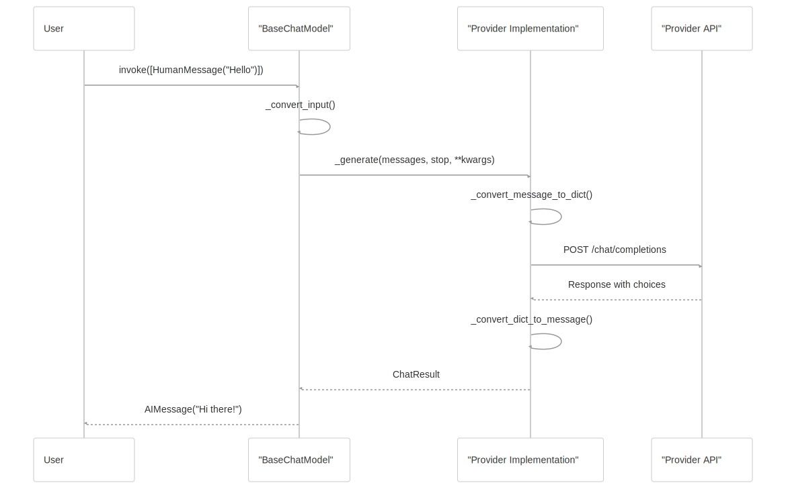

# Language Models and Chat Models

[Index your code with Devin](/private-repo)

[DeepWiki](https://deepwiki.com)

[DeepWiki](/)

[langchain-ai/langchain](https://github.com/langchain-ai/langchain "Open repository")

[Index your code with

Devin](/private-repo)Share

Last indexed: 29 September 2025 ([54ea62](https://github.com/langchain-ai/langchain/commits/54ea6205))

* [LangChain Overview](/langchain-ai/langchain/1-langchain-overview)
* [Package Ecosystem](/langchain-ai/langchain/1.1-package-ecosystem)
* [Core Architecture](/langchain-ai/langchain/2-core-architecture)
* [Runnable Interface and LCEL](/langchain-ai/langchain/2.1-runnable-interface-and-lcel)
* [Language Models and Chat Models](/langchain-ai/langchain/2.2-language-models-and-chat-models)
* [Messages and Communication](/langchain-ai/langchain/2.3-messages-and-communication)
* [Tools and Function Calling](/langchain-ai/langchain/2.4-tools-and-function-calling)
* [Provider Integrations](/langchain-ai/langchain/3-provider-integrations)
* [Major Provider Integrations](/langchain-ai/langchain/3.1-major-provider-integrations)
* [Local and Self-Hosted Models](/langchain-ai/langchain/3.2-local-and-self-hosted-models)
* [Community Integrations](/langchain-ai/langchain/3.3-community-integrations)
* [Application Development](/langchain-ai/langchain/4-application-development)
* [Common Patterns and Use Cases](/langchain-ai/langchain/4.1-common-patterns-and-use-cases)
* [CLI and Project Management](/langchain-ai/langchain/4.2-cli-and-project-management)
* [Text Processing and Document Handling](/langchain-ai/langchain/4.3-text-processing-and-document-handling)
* [Next-Generation Agents](/langchain-ai/langchain/4.4-next-generation-agents)
* [Evaluation and Testing](/langchain-ai/langchain/5-evaluation-and-testing)
* [Standard Testing Framework](/langchain-ai/langchain/5.1-standard-testing-framework)
* [LangSmith Evaluation](/langchain-ai/langchain/5.2-langsmith-evaluation)
* [Developer Experience](/langchain-ai/langchain/6-developer-experience)
* [Package Structure and Build System](/langchain-ai/langchain/6.1-package-structure-and-build-system)
* [CI/CD and Release Process](/langchain-ai/langchain/6.2-cicd-and-release-process)
* [Documentation System](/langchain-ai/langchain/7-documentation-system)
* [User Documentation](/langchain-ai/langchain/7.1-user-documentation)
* [API Reference Generation](/langchain-ai/langchain/7.2-api-reference-generation)

Menu

# Language Models and Chat Models

Relevant source files

* [libs/core/langchain\_core/language\_models/base.py](https://github.com/langchain-ai/langchain/blob/54ea6205/libs/core/langchain_core/language_models/base.py)
* [libs/core/langchain\_core/language\_models/chat\_models.py](https://github.com/langchain-ai/langchain/blob/54ea6205/libs/core/langchain_core/language_models/chat_models.py)
* [libs/core/langchain\_core/language\_models/fake\_chat\_models.py](https://github.com/langchain-ai/langchain/blob/54ea6205/libs/core/langchain_core/language_models/fake_chat_models.py)
* [libs/core/langchain\_core/language\_models/llms.py](https://github.com/langchain-ai/langchain/blob/54ea6205/libs/core/langchain_core/language_models/llms.py)
* [libs/core/langchain\_core/outputs/chat\_generation.py](https://github.com/langchain-ai/langchain/blob/54ea6205/libs/core/langchain_core/outputs/chat_generation.py)
* [libs/core/langchain\_core/outputs/chat\_result.py](https://github.com/langchain-ai/langchain/blob/54ea6205/libs/core/langchain_core/outputs/chat_result.py)
* [libs/core/langchain\_core/outputs/generation.py](https://github.com/langchain-ai/langchain/blob/54ea6205/libs/core/langchain_core/outputs/generation.py)
* [libs/core/langchain\_core/outputs/llm\_result.py](https://github.com/langchain-ai/langchain/blob/54ea6205/libs/core/langchain_core/outputs/llm_result.py)
* [libs/core/langchain\_core/outputs/run\_info.py](https://github.com/langchain-ai/langchain/blob/54ea6205/libs/core/langchain_core/outputs/run_info.py)
* [libs/core/langchain\_core/prompt\_values.py](https://github.com/langchain-ai/langchain/blob/54ea6205/libs/core/langchain_core/prompt_values.py)
* [libs/core/tests/unit\_tests/fake/test\_fake\_chat\_model.py](https://github.com/langchain-ai/langchain/blob/54ea6205/libs/core/tests/unit_tests/fake/test_fake_chat_model.py)
* [libs/core/tests/unit\_tests/language\_models/chat\_models/test\_base.py](https://github.com/langchain-ai/langchain/blob/54ea6205/libs/core/tests/unit_tests/language_models/chat_models/test_base.py)
* [libs/core/tests/unit\_tests/language\_models/chat\_models/test\_cache.py](https://github.com/langchain-ai/langchain/blob/54ea6205/libs/core/tests/unit_tests/language_models/chat_models/test_cache.py)
* [libs/core/tests/unit\_tests/language\_models/llms/test\_base.py](https://github.com/langchain-ai/langchain/blob/54ea6205/libs/core/tests/unit_tests/language_models/llms/test_base.py)
* [libs/langchain/tests/unit\_tests/chat\_models/test\_base.py](https://github.com/langchain-ai/langchain/blob/54ea6205/libs/langchain/tests/unit_tests/chat_models/test_base.py)
* [libs/partners/deepseek/langchain\_deepseek/chat\_models.py](https://github.com/langchain-ai/langchain/blob/54ea6205/libs/partners/deepseek/langchain_deepseek/chat_models.py)
* [libs/partners/deepseek/pyproject.toml](https://github.com/langchain-ai/langchain/blob/54ea6205/libs/partners/deepseek/pyproject.toml)
* [libs/partners/deepseek/scripts/check\_imports.py](https://github.com/langchain-ai/langchain/blob/54ea6205/libs/partners/deepseek/scripts/check_imports.py)
* [libs/partners/deepseek/tests/integration\_tests/test\_chat\_models.py](https://github.com/langchain-ai/langchain/blob/54ea6205/libs/partners/deepseek/tests/integration_tests/test_chat_models.py)
* [libs/partners/deepseek/tests/integration\_tests/test\_compile.py](https://github.com/langchain-ai/langchain/blob/54ea6205/libs/partners/deepseek/tests/integration_tests/test_compile.py)
* [libs/partners/deepseek/tests/unit\_tests/test\_chat\_models.py](https://github.com/langchain-ai/langchain/blob/54ea6205/libs/partners/deepseek/tests/unit_tests/test_chat_models.py)
* [libs/partners/deepseek/uv.lock](https://github.com/langchain-ai/langchain/blob/54ea6205/libs/partners/deepseek/uv.lock)
* [libs/partners/fireworks/pyproject.toml](https://github.com/langchain-ai/langchain/blob/54ea6205/libs/partners/fireworks/pyproject.toml)
* [libs/partners/fireworks/uv.lock](https://github.com/langchain-ai/langchain/blob/54ea6205/libs/partners/fireworks/uv.lock)
* [libs/partners/groq/pyproject.toml](https://github.com/langchain-ai/langchain/blob/54ea6205/libs/partners/groq/pyproject.toml)
* [libs/partners/groq/uv.lock](https://github.com/langchain-ai/langchain/blob/54ea6205/libs/partners/groq/uv.lock)
* [libs/partners/huggingface/pyproject.toml](https://github.com/langchain-ai/langchain/blob/54ea6205/libs/partners/huggingface/pyproject.toml)
* [libs/partners/huggingface/uv.lock](https://github.com/langchain-ai/langchain/blob/54ea6205/libs/partners/huggingface/uv.lock)
* [libs/partners/mistralai/langchain\_mistralai/embeddings.py](https://github.com/langchain-ai/langchain/blob/54ea6205/libs/partners/mistralai/langchain_mistralai/embeddings.py)
* [libs/partners/mistralai/pyproject.toml](https://github.com/langchain-ai/langchain/blob/54ea6205/libs/partners/mistralai/pyproject.toml)
* [libs/partners/mistralai/tests/integration\_tests/test\_compile.py](https://github.com/langchain-ai/langchain/blob/54ea6205/libs/partners/mistralai/tests/integration_tests/test_compile.py)
* [libs/partners/mistralai/tests/integration\_tests/test\_embeddings.py](https://github.com/langchain-ai/langchain/blob/54ea6205/libs/partners/mistralai/tests/integration_tests/test_embeddings.py)
* [libs/partners/mistralai/uv.lock](https://github.com/langchain-ai/langchain/blob/54ea6205/libs/partners/mistralai/uv.lock)
* [libs/partners/openai/langchain\_openai/chat\_models/base.py](https://github.com/langchain-ai/langchain/blob/54ea6205/libs/partners/openai/langchain_openai/chat_models/base.py)
* [libs/partners/openai/pyproject.toml](https://github.com/langchain-ai/langchain/blob/54ea6205/libs/partners/openai/pyproject.toml)
* [libs/partners/openai/tests/cassettes/test\_code\_interpreter.yaml.gz](https://github.com/langchain-ai/langchain/blob/54ea6205/libs/partners/openai/tests/cassettes/test_code_interpreter.yaml.gz)
* [libs/partners/openai/tests/cassettes/test\_image\_generation\_multi\_turn.yaml.gz](https://github.com/langchain-ai/langchain/blob/54ea6205/libs/partners/openai/tests/cassettes/test_image_generation_multi_turn.yaml.gz)
* [libs/partners/openai/tests/cassettes/test\_image\_generation\_streaming.yaml.gz](https://github.com/langchain-ai/langchain/blob/54ea6205/libs/partners/openai/tests/cassettes/test_image_generation_streaming.yaml.gz)
* [libs/partners/openai/tests/cassettes/test\_mcp\_builtin.yaml.gz](https://github.com/langchain-ai/langchain/blob/54ea6205/libs/partners/openai/tests/cassettes/test_mcp_builtin.yaml.gz)
* [libs/partners/openai/tests/integration\_tests/chat\_models/test\_azure.py](https://github.com/langchain-ai/langchain/blob/54ea6205/libs/partners/openai/tests/integration_tests/chat_models/test_azure.py)
* [libs/partners/openai/tests/integration\_tests/chat\_models/test\_base.py](https://github.com/langchain-ai/langchain/blob/54ea6205/libs/partners/openai/tests/integration_tests/chat_models/test_base.py)
* [libs/partners/openai/tests/integration\_tests/chat\_models/test\_responses\_api.py](https://github.com/langchain-ai/langchain/blob/54ea6205/libs/partners/openai/tests/integration_tests/chat_models/test_responses_api.py)
* [libs/partners/openai/tests/unit\_tests/chat\_models/test\_base.py](https://github.com/langchain-ai/langchain/blob/54ea6205/libs/partners/openai/tests/unit_tests/chat_models/test_base.py)
* [libs/partners/openai/tests/unit\_tests/chat\_models/test\_prompt\_cache\_key.py](https://github.com/langchain-ai/langchain/blob/54ea6205/libs/partners/openai/tests/unit_tests/chat_models/test_prompt_cache_key.py)
* [libs/partners/openai/tests/unit\_tests/test\_tools.py](https://github.com/langchain-ai/langchain/blob/54ea6205/libs/partners/openai/tests/unit_tests/test_tools.py)
* [libs/partners/openai/uv.lock](https://github.com/langchain-ai/langchain/blob/54ea6205/libs/partners/openai/uv.lock)
* [libs/partners/perplexity/pyproject.toml](https://github.com/langchain-ai/langchain/blob/54ea6205/libs/partners/perplexity/pyproject.toml)
* [libs/partners/perplexity/uv.lock](https://github.com/langchain-ai/langchain/blob/54ea6205/libs/partners/perplexity/uv.lock)
* [libs/partners/xai/pyproject.toml](https://github.com/langchain-ai/langchain/blob/54ea6205/libs/partners/xai/pyproject.toml)
* [libs/partners/xai/tests/unit\_tests/test\_chat\_models.py](https://github.com/langchain-ai/langchain/blob/54ea6205/libs/partners/xai/tests/unit_tests/test_chat_models.py)
* [libs/partners/xai/uv.lock](https://github.com/langchain-ai/langchain/blob/54ea6205/libs/partners/xai/uv.lock)

This document covers LangChain's core abstractions for language models and chat models, which form the foundation for interacting with Large Language Models (LLMs) across different providers. These abstractions enable consistent interfaces for text completion models and conversational chat models while supporting provider-specific optimizations.

For information about the Runnable interface that these models implement, see [Runnable Interface and LCEL](/langchain-ai/langchain/2.1-runnable-interface-and-lcel). For details about message types and communication patterns, see [Messages and Communication](/langchain-ai/langchain/2.3-messages-and-communication). For tool integration capabilities, see [Tools and Function Calling](/langchain-ai/langchain/2.4-tools-and-function-calling).

## Base Language Model Hierarchy

LangChain's language model abstractions follow a clear inheritance hierarchy that separates concerns between different model types while maintaining consistency through shared interfaces.

**Sources:** [libs/core/langchain\_core/language\_models/base.py111-169](https://github.com/langchain-ai/langchain/blob/54ea6205/libs/core/langchain_core/language_models/base.py#L111-L169) [libs/core/langchain\_core/language\_models/chat\_models.py224-299](https://github.com/langchain-ai/langchain/blob/54ea6205/libs/core/langchain_core/language_models/chat_models.py#L224-L299) [libs/core/langchain\_core/language\_models/llms.py293-304](https://github.com/langchain-ai/langchain/blob/54ea6205/libs/core/langchain_core/language_models/llms.py#L293-L304)

The `BaseLanguageModel` class serves as the root abstraction, parameterized by the output type `T` (either `str` for LLMs or `BaseMessage` for chat models). All language models implement the `Runnable` interface, enabling composition through LangChain Expression Language (LCEL).

## Chat Models vs Text Completion Models

LangChain distinguishes between two primary types of language models based on their interaction patterns:

| Aspect | Chat Models (`BaseChatModel`) | Text Completion Models (`BaseLLM`) |
| --- | --- | --- |
| Input Type | `list[BaseMessage]` or conversational prompts | `str` or string prompts |
| Output Type | `BaseMessage` (typically `AIMessage`) | `str` |
| Use Case | Conversational AI, structured interactions | Text completion, generation tasks |
| Provider Examples | GPT-4, Claude, Gemini | GPT-3.5 Instruct, text-davinci |
| Message Support | System, Human, AI, Tool messages | Plain text only |

**Sources:** [libs/core/langchain\_core/language\_models/chat\_models.py224-243](https://github.com/langchain-ai/langchain/blob/54ea6205/libs/core/langchain_core/language_models/chat_models.py#L224-L243) [libs/core/langchain\_core/language\_models/llms.py293-297](https://github.com/langchain-ai/langchain/blob/54ea6205/libs/core/langchain_core/language_models/llms.py#L293-L297)

## Core Interface Methods

Both chat models and LLMs implement a consistent set of methods for different interaction patterns:

**Sources:** [libs/core/langchain\_core/language\_models/chat\_models.py227-252](https://github.com/langchain-ai/langchain/blob/54ea6205/libs/core/langchain_core/language_models/chat_models.py#L227-L252) [libs/core/langchain\_core/language\_models/base.py164-169](https://github.com/langchain-ai/langchain/blob/54ea6205/libs/core/langchain_core/language_models/base.py#L164-L169)

### Key Method Signatures

The core methods defined in `BaseChatModel` include:

* `invoke(input, config, stop, **kwargs) -> BaseMessage` - Single synchronous request
* `ainvoke(input, config, stop, **kwargs) -> BaseMessage` - Single asynchronous request
* `stream(input, config, stop, **kwargs) -> Iterator[BaseMessageChunk]` - Streaming response
* `astream(input, config, stop, **kwargs) -> AsyncIterator[BaseMessageChunk]` - Async streaming
* `batch(inputs, config, stop, **kwargs) -> list[BaseMessage]` - Batch processing

**Sources:** [libs/core/langchain\_core/language\_models/chat\_models.py384-405](https://github.com/langchain-ai/langchain/blob/54ea6205/libs/core/langchain_core/language_models/chat_models.py#L384-L405) [libs/core/langchain\_core/language\_models/chat\_models.py408-427](https://github.com/langchain-ai/langchain/blob/54ea6205/libs/core/langchain_core/language_models/chat_models.py#L408-L427) [libs/core/langchain\_core/language\_models/chat\_models.py465-554](https://github.com/langchain-ai/langchain/blob/54ea6205/libs/core/langchain_core/language_models/chat_models.py#L465-L554)

## Provider Integration Architecture

LangChain's provider integration follows a standardized pattern where each provider implements the base abstractions while handling provider-specific details:

**Sources:** [libs/partners/openai/langchain\_openai/chat\_models/base.py438-815](https://github.com/langchain-ai/langchain/blob/54ea6205/libs/partners/openai/langchain_openai/chat_models/base.py#L438-L815) [libs/partners/openai/langchain\_openai/chat\_models/base.py134-199](https://github.com/langchain-ai/langchain/blob/54ea6205/libs/partners/openai/langchain_openai/chat_models/base.py#L134-L199) [libs/partners/openai/langchain\_openai/chat\_models/base.py247-316](https://github.com/langchain-ai/langchain/blob/54ea6205/libs/partners/openai/langchain_openai/chat_models/base.py#L247-L316)

### Provider Implementation Pattern

Each provider typically implements:

1. **Base Configuration**: Model name, API credentials, request parameters
2. **Message Conversion**: Transform between LangChain messages and provider formats
3. **Request Handling**: Construct API requests with proper authentication
4. **Response Processing**: Convert provider responses to LangChain message objects
5. **Streaming Support**: Handle real-time response chunks
6. **Error Handling**: Map provider errors to LangChain exceptions

**Sources:** [libs/partners/openai/langchain\_openai/chat\_models/base.py699-815](https://github.com/langchain-ai/langchain/blob/54ea6205/libs/partners/openai/langchain_openai/chat_models/base.py#L699-L815) [libs/partners/groq/pyproject.toml9](https://github.com/langchain-ai/langchain/blob/54ea6205/libs/partners/groq/pyproject.toml#L9-L9) [libs/partners/mistralai/pyproject.toml9-15](https://github.com/langchain-ai/langchain/blob/54ea6205/libs/partners/mistralai/pyproject.toml#L9-L15)

## Message Processing Flow

The following diagram illustrates how messages flow through a chat model from input to output:

**Sources:** [libs/core/langchain\_core/language\_models/chat\_models.py370-381](https://github.com/langchain-ai/langchain/blob/54ea6205/libs/core/langchain_core/language_models/chat_models.py#L370-L381) [libs/core/langchain\_core/language\_models/chat\_models.py384-405](https://github.com/langchain-ai/langchain/blob/54ea6205/libs/core/langchain_core/language_models/chat_models.py#L384-L405) [libs/partners/openai/langchain\_openai/chat\_models/base.py247-316](https://github.com/langchain-ai/langchain/blob/54ea6205/libs/partners/openai/langchain_openai/chat_models/base.py#L247-L316)

### Input Processing

Chat models accept multiple input formats through the `LanguageModelInput` type:

* `str` - Converted to `StringPromptValue` then to `HumanMessage`
* `list[BaseMessage]` - Used directly as conversation history
* `PromptValue` - Extracted to appropriate message format
* `Sequence[MessageLikeRepresentation]` - Converted to `BaseMessage` objects

**Sources:** [libs/core/langchain\_core/language\_models/chat\_models.py370-381](https://github.com/langchain-ai/langchain/blob/54ea6205/libs/core/langchain_core/language_models/chat_models.py#L370-L381) [libs/core/langchain\_core/language\_models/base.py101-104](https://github.com/langchain-ai/langchain/blob/54ea6205/libs/core/langchain_core/language_models/base.py#L101-L104)

## Streaming and Async Support

LangChain's language models provide comprehensive streaming and asynchronous capabilities:

**Sources:** [libs/core/langchain\_core/language\_models/chat\_models.py429-462](https://github.com/langchain-ai/langchain/blob/54ea6205/libs/core/langchain_core/language_models/chat_models.py#L429-L462) [libs/core/langchain\_core/language\_models/chat\_models.py514-554](https://github.com/langchain-ai/langchain/blob/54ea6205/libs/core/langchain_core/language_models/chat_models.py#L514-L554) [libs/core/langchain\_core/language\_models/chat\_models.py556-632](https://github.com/langchain-ai/langchain/blob/54ea6205/libs/core/langchain_core/language_models/chat_models.py#L556-L632)

### Streaming Configuration

Models support several streaming configuration options:

* `streaming: bool` - Enable/disable streaming globally
* `disable_streaming: Union[bool, Literal["tool_calling"]]` - Override streaming behavior
* `stream_usage: bool` - Include token usage in streaming responses
* Callback-based streaming detection for compatibility

**Sources:** [libs/core/langchain\_core/language\_models/chat\_models.py314-331](https://github.com/langchain-ai/langchain/blob/54ea6205/libs/core/langchain_core/language_models/chat_models.py#L314-L331) [libs/partners/openai/langchain\_openai/chat\_models/base.py467-472](https://github.com/langchain-ai/langchain/blob/54ea6205/libs/partners/openai/langchain_openai/chat_models/base.py#L467-L472)

## Token Usage and Metadata

Chat models provide detailed metadata about API calls, including token usage and model information:

**Sources:** [libs/core/langchain\_core/messages/ai.py67-71](https://github.com/langchain-ai/langchain/blob/54ea6205/libs/core/langchain_core/messages/ai.py#L67-L71) [libs/partners/openai/langchain\_openai/chat\_models/base.py889-891](https://github.com/langchain-ai/langchain/blob/54ea6205/libs/partners/openai/langchain_openai/chat_models/base.py#L889-L891) [libs/partners/openai/langchain\_openai/chat\_models/base.py849-872](https://github.com/langchain-ai/langchain/blob/54ea6205/libs/partners/openai/langchain_openai/chat_models/base.py#L849-L872)

## Advanced Features

### Structured Output Support

Many providers support structured output generation through response formatting:

* **JSON Schema**: Define expected output structure
* **Function Calling**: Use tools for structured responses
* **Pydantic Models**: Type-safe structured output parsing

**Sources:** [libs/partners/openai/langchain\_openai/chat\_models/base.py1598-1676](https://github.com/langchain-ai/langchain/blob/54ea6205/libs/partners/openai/langchain_openai/chat_models/base.py#L1598-L1676) [libs/core/langchain\_core/language\_models/chat\_models.py1049-1180](https://github.com/langchain-ai/langchain/blob/54ea6205/libs/core/langchain_core/language_models/chat_models.py#L1049-L1180)

### Caching and Rate Limiting

Language models integrate with LangChain's caching and rate limiting infrastructure:

* **Cache Integration**: Support for semantic and exact caching
* **Rate Limiting**: Built-in rate limiter support for API quotas
* **Retry Logic**: Configurable retry strategies for failed requests

**Sources:** [libs/core/langchain\_core/language\_models/base.py120-130](https://github.com/langchain-ai/langchain/blob/54ea6205/libs/core/langchain_core/language_models/base.py#L120-L130) [libs/core/langchain\_core/language\_models/chat\_models.py311-312](https://github.com/langchain-ai/langchain/blob/54ea6205/libs/core/langchain_core/language_models/chat_models.py#L311-L312) [libs/core/langchain\_core/language\_models/llms.py76-129](https://github.com/langchain-ai/langchain/blob/54ea6205/libs/core/langchain_core/language_models/llms.py#L76-L129)

### Configuration and Debugging

Models provide extensive configuration options and debugging capabilities:

* **Model Parameters**: Temperature, max tokens, stop sequences
* **API Configuration**: Base URLs, authentication, timeouts
* **Debugging**: Response headers, request/response logging
* **Validation**: Parameter validation and model-specific constraints

**Sources:** [libs/partners/openai/langchain\_openai/chat\_models/base.py441-632](https://github.com/langchain-ai/langchain/blob/54ea6205/libs/partners/openai/langchain_openai/chat_models/base.py#L441-L632) [libs/partners/openai/langchain\_openai/chat\_models/base.py580-581](https://github.com/langchain-ai/langchain/blob/54ea6205/libs/partners/openai/langchain_openai/chat_models/base.py#L580-L581) [libs/partners/openai/langchain\_openai/chat\_models/base.py708-730](https://github.com/langchain-ai/langchain/blob/54ea6205/libs/partners/openai/langchain_openai/chat_models/base.py#L708-L730)

Dismiss

Refresh this wiki

Enter email to refresh

### On this page

* [Language Models and Chat Models](#language-models-and-chat-models)
* [Base Language Model Hierarchy](#base-language-model-hierarchy)
* [Chat Models vs Text Completion Models](#chat-models-vs-text-completion-models)
* [Core Interface Methods](#core-interface-methods)
* [Key Method Signatures](#key-method-signatures)
* [Provider Integration Architecture](#provider-integration-architecture)
* [Provider Implementation Pattern](#provider-implementation-pattern)
* [Message Processing Flow](#message-processing-flow)
* [Input Processing](#input-processing)
* [Streaming and Async Support](#streaming-and-async-support)
* [Streaming Configuration](#streaming-configuration)
* [Token Usage and Metadata](#token-usage-and-metadata)
* [Advanced Features](#advanced-features)
* [Structured Output Support](#structured-output-support)
* [Caching and Rate Limiting](#caching-and-rate-limiting)
* [Configuration and Debugging](#configuration-and-debugging)

Ask Devin about langchain-ai/langchain

Deep Research