# Messages and Communication

[Index your code with Devin](/private-repo)

[DeepWiki](https://deepwiki.com)

[DeepWiki](/)

[langchain-ai/langchain](https://github.com/langchain-ai/langchain "Open repository")

[Index your code with

Devin](/private-repo)Share

Last indexed: 29 September 2025 ([54ea62](https://github.com/langchain-ai/langchain/commits/54ea6205))

* [LangChain Overview](/langchain-ai/langchain/1-langchain-overview)
* [Package Ecosystem](/langchain-ai/langchain/1.1-package-ecosystem)
* [Core Architecture](/langchain-ai/langchain/2-core-architecture)
* [Runnable Interface and LCEL](/langchain-ai/langchain/2.1-runnable-interface-and-lcel)
* [Language Models and Chat Models](/langchain-ai/langchain/2.2-language-models-and-chat-models)
* [Messages and Communication](/langchain-ai/langchain/2.3-messages-and-communication)
* [Tools and Function Calling](/langchain-ai/langchain/2.4-tools-and-function-calling)
* [Provider Integrations](/langchain-ai/langchain/3-provider-integrations)
* [Major Provider Integrations](/langchain-ai/langchain/3.1-major-provider-integrations)
* [Local and Self-Hosted Models](/langchain-ai/langchain/3.2-local-and-self-hosted-models)
* [Community Integrations](/langchain-ai/langchain/3.3-community-integrations)
* [Application Development](/langchain-ai/langchain/4-application-development)
* [Common Patterns and Use Cases](/langchain-ai/langchain/4.1-common-patterns-and-use-cases)
* [CLI and Project Management](/langchain-ai/langchain/4.2-cli-and-project-management)
* [Text Processing and Document Handling](/langchain-ai/langchain/4.3-text-processing-and-document-handling)
* [Next-Generation Agents](/langchain-ai/langchain/4.4-next-generation-agents)
* [Evaluation and Testing](/langchain-ai/langchain/5-evaluation-and-testing)
* [Standard Testing Framework](/langchain-ai/langchain/5.1-standard-testing-framework)
* [LangSmith Evaluation](/langchain-ai/langchain/5.2-langsmith-evaluation)
* [Developer Experience](/langchain-ai/langchain/6-developer-experience)
* [Package Structure and Build System](/langchain-ai/langchain/6.1-package-structure-and-build-system)
* [CI/CD and Release Process](/langchain-ai/langchain/6.2-cicd-and-release-process)
* [Documentation System](/langchain-ai/langchain/7-documentation-system)
* [User Documentation](/langchain-ai/langchain/7.1-user-documentation)
* [API Reference Generation](/langchain-ai/langchain/7.2-api-reference-generation)

Menu

# Messages and Communication

Relevant source files

* [libs/core/langchain\_core/messages/ai.py](https://github.com/langchain-ai/langchain/blob/54ea6205/libs/core/langchain_core/messages/ai.py)
* [libs/core/langchain\_core/messages/base.py](https://github.com/langchain-ai/langchain/blob/54ea6205/libs/core/langchain_core/messages/base.py)
* [libs/core/langchain\_core/messages/chat.py](https://github.com/langchain-ai/langchain/blob/54ea6205/libs/core/langchain_core/messages/chat.py)
* [libs/core/langchain\_core/messages/function.py](https://github.com/langchain-ai/langchain/blob/54ea6205/libs/core/langchain_core/messages/function.py)
* [libs/core/langchain\_core/messages/human.py](https://github.com/langchain-ai/langchain/blob/54ea6205/libs/core/langchain_core/messages/human.py)
* [libs/core/langchain\_core/messages/modifier.py](https://github.com/langchain-ai/langchain/blob/54ea6205/libs/core/langchain_core/messages/modifier.py)
* [libs/core/langchain\_core/messages/system.py](https://github.com/langchain-ai/langchain/blob/54ea6205/libs/core/langchain_core/messages/system.py)
* [libs/core/langchain\_core/messages/tool.py](https://github.com/langchain-ai/langchain/blob/54ea6205/libs/core/langchain_core/messages/tool.py)
* [libs/core/langchain\_core/messages/utils.py](https://github.com/langchain-ai/langchain/blob/54ea6205/libs/core/langchain_core/messages/utils.py)
* [libs/core/langchain\_core/output\_parsers/base.py](https://github.com/langchain-ai/langchain/blob/54ea6205/libs/core/langchain_core/output_parsers/base.py)
* [libs/core/langchain\_core/output\_parsers/json.py](https://github.com/langchain-ai/langchain/blob/54ea6205/libs/core/langchain_core/output_parsers/json.py)
* [libs/core/langchain\_core/output\_parsers/openai\_functions.py](https://github.com/langchain-ai/langchain/blob/54ea6205/libs/core/langchain_core/output_parsers/openai_functions.py)
* [libs/core/langchain\_core/output\_parsers/openai\_tools.py](https://github.com/langchain-ai/langchain/blob/54ea6205/libs/core/langchain_core/output_parsers/openai_tools.py)
* [libs/core/langchain\_core/output\_parsers/pydantic.py](https://github.com/langchain-ai/langchain/blob/54ea6205/libs/core/langchain_core/output_parsers/pydantic.py)
* [libs/core/langchain\_core/output\_parsers/transform.py](https://github.com/langchain-ai/langchain/blob/54ea6205/libs/core/langchain_core/output_parsers/transform.py)
* [libs/core/langchain\_core/utils/\_\_init\_\_.py](https://github.com/langchain-ai/langchain/blob/54ea6205/libs/core/langchain_core/utils/__init__.py)
* [libs/core/langchain\_core/utils/\_merge.py](https://github.com/langchain-ai/langchain/blob/54ea6205/libs/core/langchain_core/utils/_merge.py)
* [libs/core/langchain\_core/utils/input.py](https://github.com/langchain-ai/langchain/blob/54ea6205/libs/core/langchain_core/utils/input.py)
* [libs/core/langchain\_core/utils/json.py](https://github.com/langchain-ai/langchain/blob/54ea6205/libs/core/langchain_core/utils/json.py)
* [libs/core/langchain\_core/utils/strings.py](https://github.com/langchain-ai/langchain/blob/54ea6205/libs/core/langchain_core/utils/strings.py)
* [libs/core/langchain\_core/utils/utils.py](https://github.com/langchain-ai/langchain/blob/54ea6205/libs/core/langchain_core/utils/utils.py)
* [libs/core/tests/unit\_tests/messages/test\_utils.py](https://github.com/langchain-ai/langchain/blob/54ea6205/libs/core/tests/unit_tests/messages/test_utils.py)
* [libs/core/tests/unit\_tests/output\_parsers/test\_json.py](https://github.com/langchain-ai/langchain/blob/54ea6205/libs/core/tests/unit_tests/output_parsers/test_json.py)
* [libs/core/tests/unit\_tests/output\_parsers/test\_openai\_tools.py](https://github.com/langchain-ai/langchain/blob/54ea6205/libs/core/tests/unit_tests/output_parsers/test_openai_tools.py)
* [libs/core/tests/unit\_tests/output\_parsers/test\_pydantic\_parser.py](https://github.com/langchain-ai/langchain/blob/54ea6205/libs/core/tests/unit_tests/output_parsers/test_pydantic_parser.py)
* [libs/core/tests/unit\_tests/test\_messages.py](https://github.com/langchain-ai/langchain/blob/54ea6205/libs/core/tests/unit_tests/test_messages.py)
* [libs/core/tests/unit\_tests/utils/test\_imports.py](https://github.com/langchain-ai/langchain/blob/54ea6205/libs/core/tests/unit_tests/utils/test_imports.py)
* [libs/core/tests/unit\_tests/utils/test\_strings.py](https://github.com/langchain-ai/langchain/blob/54ea6205/libs/core/tests/unit_tests/utils/test_strings.py)
* [libs/core/tests/unit\_tests/utils/test\_utils.py](https://github.com/langchain-ai/langchain/blob/54ea6205/libs/core/tests/unit_tests/utils/test_utils.py)
* [libs/langchain/langchain/chains/structured\_output/\_\_init\_\_.py](https://github.com/langchain-ai/langchain/blob/54ea6205/libs/langchain/langchain/chains/structured_output/__init__.py)
* [libs/langchain/langchain/output\_parsers/pydantic.py](https://github.com/langchain-ai/langchain/blob/54ea6205/libs/langchain/langchain/output_parsers/pydantic.py)

This document covers the message system in LangChain, which provides the fundamental abstraction for representing conversations between users, AI models, and tools. Messages are the primary input and output format for all chat models and form the building blocks of conversational AI applications.

For information about language models and chat models that process these messages, see [Language Models and Chat Models](/langchain-ai/langchain/2.2-language-models-and-chat-models). For details about tools and function calling capabilities referenced in messages, see [Tools and Function Calling](/langchain-ai/langchain/2.4-tools-and-function-calling).

## Message Architecture Overview

LangChain's message system is built around a class hierarchy where all messages inherit from `BaseMessage`, with specialized message types for different conversation participants and streaming chunk variants for real-time applications.

**Core Message Type Hierarchy**



Sources: [libs/core/langchain\_core/messages/base.py20-288](https://github.com/langchain-ai/langchain/blob/54ea6205/libs/core/langchain_core/messages/base.py#L20-L288) [libs/core/langchain\_core/messages/\_\_init\_\_.py1-151](https://github.com/langchain-ai/langchain/blob/54ea6205/libs/core/langchain_core/messages/__init__.py#L1-L151)

## Core Message Types

### BaseMessage Structure

All messages share common fields defined in `BaseMessage`:

| Field | Type | Purpose |
| --- | --- | --- |
| `content` | `str | list[str | dict]` | Message content (text or multimodal) |
| `type` | `str` | Message type identifier for serialization |
| `additional_kwargs` | `dict` | Provider-specific metadata |
| `response_metadata` | `dict` | Response headers, logprobs, token counts |
| `name` | `str | None` | Optional human-readable name |
| `id` | `str | None` | Unique identifier from provider |

Sources: [libs/core/langchain\_core/messages/base.py26-62](https://github.com/langchain-ai/langchain/blob/54ea6205/libs/core/langchain_core/messages/base.py#L26-L62)

### Conversation Participant Messages

**HumanMessage** - Represents input from users:

```
HumanMessage(content="What is the weather like today?")
HumanMessage(content=[
    {"type": "text", "text": "Describe this image"},
    {"type": "image_url", "image_url": {"url": "https://..."}}
])
```

**AIMessage** - Represents responses from AI models:

* Contains `tool_calls` for function calling
* Includes `usage_metadata` for token tracking
* Has `invalid_tool_calls` for parsing errors

**SystemMessage** - Provides instructions and context:

```
SystemMessage(content="You are a helpful assistant specialized in weather.")
```

Sources: [libs/core/langchain\_core/messages/human.py8-65](https://github.com/langchain-ai/langchain/blob/54ea6205/libs/core/langchain_core/messages/human.py#L8-L65) [libs/core/langchain\_core/messages/ai.py154-286](https://github.com/langchain-ai/langchain/blob/54ea6205/libs/core/langchain_core/messages/ai.py#L154-L286) [libs/core/langchain\_core/messages/system.py8-58](https://github.com/langchain-ai/langchain/blob/54ea6205/libs/core/langchain_core/messages/system.py#L8-L58)

### Tool Integration Messages

**ToolMessage** - Returns tool execution results:

* `tool_call_id` links to the originating tool call
* `artifact` field for full tool output when content is summarized
* `status` field indicating success or error

**FunctionMessage** - Legacy tool message format without `tool_call_id`

Sources: [libs/core/langchain\_core/messages/tool.py23-147](https://github.com/langchain-ai/langchain/blob/54ea6205/libs/core/langchain_core/messages/tool.py#L23-L147) [libs/core/langchain\_core/messages/function.py15-63](https://github.com/langchain-ai/langchain/blob/54ea6205/libs/core/langchain_core/messages/function.py#L15-L63)

## Tool Call System

The tool calling system enables AI models to request external function execution through structured `ToolCall` objects embedded in `AIMessage` instances.

**Tool Call Data Flow**



**Tool Call Types:**

| Type | Purpose | Structure |
| --- | --- | --- |
| `ToolCall` | Valid tool request | `name`, `args` (dict), `id` |
| `ToolCallChunk` | Streaming tool call fragment | `name`, `args` (str), `id`, `index` |
| `InvalidToolCall` | Malformed tool call | `name`, `args` (str), `id`, `error` |

Sources: [libs/core/langchain\_core/messages/tool.py180-314](https://github.com/langchain-ai/langchain/blob/54ea6205/libs/core/langchain_core/messages/tool.py#L180-L314) [libs/core/langchain\_core/messages/ai.py170-178](https://github.com/langchain-ai/langchain/blob/54ea6205/libs/core/langchain_core/messages/ai.py#L170-L178)

## Message Chunks and Streaming

Message chunks enable real-time streaming of responses by providing concatenation operations that merge content and metadata incrementally.

**Chunk Merging Behavior**



**Key Chunk Features:**

* String content concatenation with configurable separators
* Metadata merging (response headers, usage tracking)
* Tool call chunk accumulation and parsing
* ID precedence (provider IDs override LangChain IDs)

Sources: [libs/core/langchain\_core/messages/base.py182-244](https://github.com/langchain-ai/langchain/blob/54ea6205/libs/core/langchain_core/messages/base.py#L182-L244) [libs/core/langchain\_core/messages/ai.py288-454](https://github.com/langchain-ai/langchain/blob/54ea6205/libs/core/langchain_core/messages/ai.py#L288-L454)

## Content Handling and Multimodal Support

Messages support both simple string content and complex multimodal content through structured content blocks.

**Content Block Types**



**Content Conversion Utilities:**

* `convert_to_openai_data_block()` - Formats content for OpenAI API
* `convert_to_openai_image_block()` - Handles image-specific formatting
* `is_data_content_block()` - Validates content block structure

Sources: [libs/core/langchain\_core/messages/content\_blocks.py10-156](https://github.com/langchain-ai/langchain/blob/54ea6205/libs/core/langchain_core/messages/content_blocks.py#L10-L156) [libs/core/langchain\_core/messages/base.py91-109](https://github.com/langchain-ai/langchain/blob/54ea6205/libs/core/langchain_core/messages/base.py#L91-L109)

## Message Utilities and Operations

LangChain provides comprehensive utilities for manipulating and processing message collections.

**Message Processing Pipeline**


### Key Utility Functions

| Function | Purpose | Key Parameters |
| --- | --- | --- |
| `convert_to_messages()` | Normalize various formats to `BaseMessage` | `messages: Iterable[MessageLikeRepresentation]` |
| `filter_messages()` | Filter by criteria with Runnable support | `include_types`, `exclude_names`, `exclude_tool_calls` |
| `merge_message_runs()` | Combine consecutive messages of same type | `chunk_separator: str = "\n"` |
| `trim_messages()` | Limit messages by token count | `max_tokens`, `token_counter`, `strategy: "first" | "last"` |
| `get_buffer_string()` | Convert to string representation | `human_prefix: str`, `ai_prefix: str` |

### Message Format Support

`convert_to_messages()` accepts multiple input formats:

```
# BaseMessage objects (passthrough)
[AIMessage("Hello")]

# String (becomes HumanMessage)
"Hello world"

# Tuple (role, content)
[("system", "You are helpful"), ("human", "Hi")]

# OpenAI-style dict
{"role": "assistant", "content": "Hello", "tool_calls": [...]}

# LangChain-style dict  
{"type": "ai", "content": "Hello", "tool_calls": [...]}
```

Sources: [libs/core/langchain\_core/messages/utils.py352-368](https://github.com/langchain-ai/langchain/blob/54ea6205/libs/core/langchain_core/messages/utils.py#L352-L368) [libs/core/langchain\_core/messages/utils.py297-349](https://github.com/langchain-ai/langchain/blob/54ea6205/libs/core/langchain_core/messages/utils.py#L297-L349)

## Usage Metadata and Token Tracking

The `UsageMetadata` system provides standardized token counting across different model providers.

**Usage Metadata Structure**



**Usage Operations:**

* `add_usage()` - Combine usage metadata from multiple chunks
* `subtract_usage()` - Calculate usage differences (with floor of 0)
* Automatic accumulation during chunk concatenation

Sources: [libs/core/langchain\_core/messages/ai.py106-152](https://github.com/langchain-ai/langchain/blob/54ea6205/libs/core/langchain_core/messages/ai.py#L106-L152) [libs/core/langchain\_core/messages/ai.py457-566](https://github.com/langchain-ai/langchain/blob/54ea6205/libs/core/langchain_core/messages/ai.py#L457-L566)

## Serialization and Persistence

Messages implement LangChain's serialization framework for storage and transmission:

* `message_to_dict()` / `messages_to_dict()` - Convert to JSON-serializable format
* `messages_from_dict()` - Reconstruct from serialized format
* `AnyMessage` type union - Discriminated union for all message types
* Load/dump support through `langchain_core.load`

The serialization format preserves all message metadata and supports round-trip conversion:

```
# Serialization format
{
    "type": "ai",
    "data": {
        "content": "Hello",
        "tool_calls": [...],
        "usage_metadata": {...},
        "additional_kwargs": {...}
    }
}
```

Sources: [libs/core/langchain\_core/messages/base.py246-268](https://github.com/langchain-ai/langchain/blob/54ea6205/libs/core/langchain_core/messages/base.py#L246-L268) [libs/core/langchain\_core/messages/utils.py141-182](https://github.com/langchain-ai/langchain/blob/54ea6205/libs/core/langchain_core/messages/utils.py#L141-L182) [libs/core/langchain\_core/messages/utils.py67-83](https://github.com/langchain-ai/langchain/blob/54ea6205/libs/core/langchain_core/messages/utils.py#L67-L83)

Dismiss

Refresh this wiki

Enter email to refresh

### On this page

* [Messages and Communication](#messages-and-communication)
* [Message Architecture Overview](#message-architecture-overview)
* [Core Message Types](#core-message-types)
* [BaseMessage Structure](#basemessage-structure)
* [Conversation Participant Messages](#conversation-participant-messages)
* [Tool Integration Messages](#tool-integration-messages)
* [Tool Call System](#tool-call-system)
* [Message Chunks and Streaming](#message-chunks-and-streaming)
* [Content Handling and Multimodal Support](#content-handling-and-multimodal-support)
* [Message Utilities and Operations](#message-utilities-and-operations)
* [Key Utility Functions](#key-utility-functions)
* [Message Format Support](#message-format-support)
* [Usage Metadata and Token Tracking](#usage-metadata-and-token-tracking)
* [Serialization and Persistence](#serialization-and-persistence)

Ask Devin about langchain-ai/langchain

Deep Research