# Tools and Function Calling

[Index your code with Devin](/private-repo)

[DeepWiki](https://deepwiki.com)

[DeepWiki](/)

[langchain-ai/langchain](https://github.com/langchain-ai/langchain "Open repository")

[Index your code with

Devin](/private-repo)Share

Last indexed: 29 September 2025 ([54ea62](https://github.com/langchain-ai/langchain/commits/54ea6205))

* [LangChain Overview](/langchain-ai/langchain/1-langchain-overview)
* [Package Ecosystem](/langchain-ai/langchain/1.1-package-ecosystem)
* [Core Architecture](/langchain-ai/langchain/2-core-architecture)
* [Runnable Interface and LCEL](/langchain-ai/langchain/2.1-runnable-interface-and-lcel)
* [Language Models and Chat Models](/langchain-ai/langchain/2.2-language-models-and-chat-models)
* [Messages and Communication](/langchain-ai/langchain/2.3-messages-and-communication)
* [Tools and Function Calling](/langchain-ai/langchain/2.4-tools-and-function-calling)
* [Provider Integrations](/langchain-ai/langchain/3-provider-integrations)
* [Major Provider Integrations](/langchain-ai/langchain/3.1-major-provider-integrations)
* [Local and Self-Hosted Models](/langchain-ai/langchain/3.2-local-and-self-hosted-models)
* [Community Integrations](/langchain-ai/langchain/3.3-community-integrations)
* [Application Development](/langchain-ai/langchain/4-application-development)
* [Common Patterns and Use Cases](/langchain-ai/langchain/4.1-common-patterns-and-use-cases)
* [CLI and Project Management](/langchain-ai/langchain/4.2-cli-and-project-management)
* [Text Processing and Document Handling](/langchain-ai/langchain/4.3-text-processing-and-document-handling)
* [Next-Generation Agents](/langchain-ai/langchain/4.4-next-generation-agents)
* [Evaluation and Testing](/langchain-ai/langchain/5-evaluation-and-testing)
* [Standard Testing Framework](/langchain-ai/langchain/5.1-standard-testing-framework)
* [LangSmith Evaluation](/langchain-ai/langchain/5.2-langsmith-evaluation)
* [Developer Experience](/langchain-ai/langchain/6-developer-experience)
* [Package Structure and Build System](/langchain-ai/langchain/6.1-package-structure-and-build-system)
* [CI/CD and Release Process](/langchain-ai/langchain/6.2-cicd-and-release-process)
* [Documentation System](/langchain-ai/langchain/7-documentation-system)
* [User Documentation](/langchain-ai/langchain/7.1-user-documentation)
* [API Reference Generation](/langchain-ai/langchain/7.2-api-reference-generation)

Menu

# Tools and Function Calling

Relevant source files

* [docs/api\_reference/\_static/css/custom.css](https://github.com/langchain-ai/langchain/blob/54ea6205/docs/api_reference/_static/css/custom.css)
* [libs/core/langchain\_core/\_api/beta\_decorator.py](https://github.com/langchain-ai/langchain/blob/54ea6205/libs/core/langchain_core/_api/beta_decorator.py)
* [libs/core/langchain\_core/\_api/deprecation.py](https://github.com/langchain-ai/langchain/blob/54ea6205/libs/core/langchain_core/_api/deprecation.py)
* [libs/core/langchain\_core/tools/base.py](https://github.com/langchain-ai/langchain/blob/54ea6205/libs/core/langchain_core/tools/base.py)
* [libs/core/langchain\_core/tools/convert.py](https://github.com/langchain-ai/langchain/blob/54ea6205/libs/core/langchain_core/tools/convert.py)
* [libs/core/langchain\_core/tools/simple.py](https://github.com/langchain-ai/langchain/blob/54ea6205/libs/core/langchain_core/tools/simple.py)
* [libs/core/langchain\_core/tools/structured.py](https://github.com/langchain-ai/langchain/blob/54ea6205/libs/core/langchain_core/tools/structured.py)
* [libs/core/langchain\_core/utils/function\_calling.py](https://github.com/langchain-ai/langchain/blob/54ea6205/libs/core/langchain_core/utils/function_calling.py)
* [libs/core/langchain\_core/utils/pydantic.py](https://github.com/langchain-ai/langchain/blob/54ea6205/libs/core/langchain_core/utils/pydantic.py)
* [libs/core/tests/unit\_tests/\_api/test\_beta\_decorator.py](https://github.com/langchain-ai/langchain/blob/54ea6205/libs/core/tests/unit_tests/_api/test_beta_decorator.py)
* [libs/core/tests/unit\_tests/\_api/test\_deprecation.py](https://github.com/langchain-ai/langchain/blob/54ea6205/libs/core/tests/unit_tests/_api/test_deprecation.py)
* [libs/core/tests/unit\_tests/test\_tools.py](https://github.com/langchain-ai/langchain/blob/54ea6205/libs/core/tests/unit_tests/test_tools.py)
* [libs/core/tests/unit\_tests/utils/test\_function\_calling.py](https://github.com/langchain-ai/langchain/blob/54ea6205/libs/core/tests/unit_tests/utils/test_function_calling.py)
* [libs/core/tests/unit\_tests/utils/test\_pydantic.py](https://github.com/langchain-ai/langchain/blob/54ea6205/libs/core/tests/unit_tests/utils/test_pydantic.py)

This page documents LangChain's tool system and function calling capabilities. Tools are the primary mechanism for enabling language models to perform actions and interact with external systems. The function calling system provides standardized interfaces for converting tools into formats compatible with various language model providers.

For information about agent systems that use tools, see [Next-Generation Agents](/langchain-ai/langchain/4.4-next-generation-agents). For integration with specific language model providers that support function calling, see [Major Provider Integrations](/langchain-ai/langchain/3.1-major-provider-integrations).

## Tool System Architecture

LangChain's tool system is built around a hierarchy of abstractions that enable flexible tool creation and execution:

Sources: [libs/core/langchain\_core/tools/base.py395-524](https://github.com/langchain-ai/langchain/blob/54ea6205/libs/core/langchain_core/tools/base.py#L395-L524) [libs/core/langchain\_core/tools/simple.py33-207](https://github.com/langchain-ai/langchain/blob/54ea6205/libs/core/langchain_core/tools/simple.py#L33-L207) [libs/core/langchain\_core/tools/structured.py39-209](https://github.com/langchain-ai/langchain/blob/54ea6205/libs/core/langchain_core/tools/structured.py#L39-L209) [libs/core/langchain\_core/tools/convert.py71-85](https://github.com/langchain-ai/langchain/blob/54ea6205/libs/core/langchain_core/tools/convert.py#L71-L85)

## BaseTool Interface

The `BaseTool` class provides the core abstraction for all tools in LangChain. It implements the `Runnable` interface and defines the essential tool contract:

Sources: [libs/core/langchain\_core/tools/base.py395-524](https://github.com/langchain-ai/langchain/blob/54ea6205/libs/core/langchain_core/tools/base.py#L395-L524) [libs/core/langchain\_core/tools/base.py623-700](https://github.com/langchain-ai/langchain/blob/54ea6205/libs/core/langchain_core/tools/base.py#L623-L700) [libs/core/langchain\_core/tools/base.py787-951](https://github.com/langchain-ai/langchain/blob/54ea6205/libs/core/langchain_core/tools/base.py#L787-L951)

## Tool Creation Patterns

### The @tool Decorator

The `@tool` decorator provides the most convenient way to create tools from functions:

| Feature | Description | Example Usage |
| --- | --- | --- |
| **Function Wrapping** | Convert any function to a tool | `@tool def my_function(x: str) -> str:` |
| **Schema Inference** | Automatically derive input schema | Function signature → Pydantic model |
| **Docstring Parsing** | Extract descriptions from docstrings | Google-style Args: sections |
| **Return Formats** | Support different output formats | `response_format="content_and_artifact"` |
| **Custom Schemas** | Override inferred schemas | `@tool(args_schema=MySchema)` |

Sources: [libs/core/langchain\_core/tools/convert.py71-85](https://github.com/langchain-ai/langchain/blob/54ea6205/libs/core/langchain_core/tools/convert.py#L71-L85) [libs/core/langchain\_core/tools/convert.py86-245](https://github.com/langchain-ai/langchain/blob/54ea6205/libs/core/langchain_core/tools/convert.py#L86-L245)

### StructuredTool.from\_function()

The `from_function()` class method provides more explicit control over tool creation:

Sources: [libs/core/langchain\_core/tools/structured.py128-209](https://github.com/langchain-ai/langchain/blob/54ea6205/libs/core/langchain_core/tools/structured.py#L128-L209) [libs/core/langchain\_core/tools/base.py283-381](https://github.com/langchain-ai/langchain/blob/54ea6205/libs/core/langchain_core/tools/base.py#L283-L381)

## Schema System

### Schema Inference and Validation

LangChain automatically infers tool schemas from function signatures and validates inputs using Pydantic:

| Schema Type | Source | Usage |
| --- | --- | --- |
| **Inferred Schema** | Function signature type hints | `create_schema_from_function()` |
| **Manual Pydantic** | Custom `BaseModel` subclass | `args_schema=MySchema` |
| **JSON Schema** | Raw JSON schema dictionary | `args_schema={"type": "object", ...}` |
| **Mixed V1/V2** | Pydantic v1 and v2 models | Automatic version detection |

### Injected Arguments

The tool system supports injecting runtime arguments that are not exposed to language models:

Sources: [libs/core/langchain\_core/tools/base.py557-579](https://github.com/langchain-ai/langchain/blob/54ea6205/libs/core/langchain_core/tools/base.py#L557-L579) [libs/core/langchain\_core/tools/base.py76-86](https://github.com/langchain-ai/langchain/blob/54ea6205/libs/core/langchain_core/tools/base.py#L76-L86) [libs/core/langchain\_core/tools/base.py350-354](https://github.com/langchain-ai/langchain/blob/54ea6205/libs/core/langchain_core/tools/base.py#L350-L354)

## Function Calling Integration

### OpenAI-Compatible Function Calling

The function calling system provides standardized conversion to OpenAI-compatible formats:

Sources: [libs/core/langchain\_core/utils/function\_calling.py392-506](https://github.com/langchain-ai/langchain/blob/54ea6205/libs/core/langchain_core/utils/function_calling.py#L392-L506) [libs/core/langchain\_core/utils/function\_calling.py523-599](https://github.com/langchain-ai/langchain/blob/54ea6205/libs/core/langchain_core/utils/function_calling.py#L523-L599)

### Cross-Provider Compatibility

The function calling system supports multiple provider formats through automatic conversion:

| Provider Format | Input Detection | Conversion Process |
| --- | --- | --- |
| **OpenAI** | `{"name": str, "parameters": dict}` | Direct passthrough |
| **Anthropic** | `{"name": str, "input_schema": dict}` | Map `input_schema` → `parameters` |
| **Bedrock** | `{"toolSpec": {"inputSchema": {...}}}` | Extract nested schema |
| **JSON Schema** | `{"title": str, "properties": dict}` | Map `title` → `name` |

Sources: [libs/core/langchain\_core/utils/function\_calling.py435-467](https://github.com/langchain-ai/langchain/blob/54ea6205/libs/core/langchain_core/utils/function_calling.py#L435-L467) [libs/core/langchain\_core/utils/function\_calling.py583-599](https://github.com/langchain-ai/langchain/blob/54ea6205/libs/core/langchain_core/utils/function_calling.py#L583-L599)

## Tool Execution Pipeline

### Execution Flow

Tool execution follows a standardized pipeline that handles input validation, argument injection, and error management:

Sources: [libs/core/langchain\_core/tools/base.py787-951](https://github.com/langchain-ai/langchain/blob/54ea6205/libs/core/langchain_core/tools/base.py#L787-L951) [libs/core/langchain\_core/tools/base.py953-1051](https://github.com/langchain-ai/langchain/blob/54ea6205/libs/core/langchain_core/tools/base.py#L953-L1051) [libs/core/langchain\_core/tools/base.py498-504](https://github.com/langchain-ai/langchain/blob/54ea6205/libs/core/langchain_core/tools/base.py#L498-L504)

### Async Execution Support

Tools support both synchronous and asynchronous execution with automatic fallback handling:

| Execution Mode | Method | Fallback Behavior |
| --- | --- | --- |
| **Sync Only** | `_run()` defined | `_arun()` runs `_run()` in thread pool |
| **Async Only** | `_arun()` defined | `_run()` raises `NotImplementedError` |
| **Both** | Both methods defined | Direct execution, no fallback |

Sources: [libs/core/langchain\_core/tools/base.py733-746](https://github.com/langchain-ai/langchain/blob/54ea6205/libs/core/langchain_core/tools/base.py#L733-L746) [libs/core/langchain\_core/tools/simple.py44-55](https://github.com/langchain-ai/langchain/blob/54ea6205/libs/core/langchain_core/tools/simple.py#L44-L55) [libs/core/langchain\_core/tools/structured.py55-66](https://github.com/langchain-ai/langchain/blob/54ea6205/libs/core/langchain_core/tools/structured.py#L55-L66)

## Advanced Features

### Argument Injection and Configuration

The tool system provides sophisticated argument injection for runtime context:

Sources: [libs/core/langchain\_core/tools/base.py1052-1107](https://github.com/langchain-ai/langchain/blob/54ea6205/libs/core/langchain_core/tools/base.py#L1052-L1107) [libs/core/langchain\_core/tools/structured.py88-93](https://github.com/langchain-ai/langchain/blob/54ea6205/libs/core/langchain_core/tools/structured.py#L88-L93) [libs/core/langchain\_core/tools/simple.py118-123](https://github.com/langchain-ai/langchain/blob/54ea6205/libs/core/langchain_core/tools/simple.py#L118-L123)

### Schema Customization and Validation

Tools support extensive schema customization through Pydantic integration:

| Customization Type | Implementation | Use Case |
| --- | --- | --- |
| **Field Descriptions** | `Field(description="...")` | Improve LLM understanding |
| **Validation Rules** | Pydantic validators | Enforce business rules |
| **Optional Parameters** | `Optional[T]` with defaults | Flexible tool interfaces |
| **Complex Types** | Nested BaseModel classes | Structured data handling |
| **Enum Constraints** | `Literal` or `Enum` types | Restrict valid values |

Sources: [libs/core/langchain\_core/tools/base.py283-381](https://github.com/langchain-ai/langchain/blob/54ea6205/libs/core/langchain_core/tools/base.py#L283-L381) [libs/core/langchain\_core/utils/pydantic.py274-302](https://github.com/langchain-ai/langchain/blob/54ea6205/libs/core/langchain_core/utils/pydantic.py#L274-L302) [libs/core/tests/unit\_tests/test\_tools.py321-353](https://github.com/langchain-ai/langchain/blob/54ea6205/libs/core/tests/unit_tests/test_tools.py#L321-L353)

Dismiss

Refresh this wiki

Enter email to refresh

### On this page

* [Tools and Function Calling](#tools-and-function-calling)
* [Tool System Architecture](#tool-system-architecture)
* [BaseTool Interface](#basetool-interface)
* [Tool Creation Patterns](#tool-creation-patterns)
* [The @tool Decorator](#the-tool-decorator)
* [StructuredTool.from\_function()](#structuredtoolfrom_function)
* [Schema System](#schema-system)
* [Schema Inference and Validation](#schema-inference-and-validation)
* [Injected Arguments](#injected-arguments)
* [Function Calling Integration](#function-calling-integration)
* [OpenAI-Compatible Function Calling](#openai-compatible-function-calling)
* [Cross-Provider Compatibility](#cross-provider-compatibility)
* [Tool Execution Pipeline](#tool-execution-pipeline)
* [Execution Flow](#execution-flow)
* [Async Execution Support](#async-execution-support)
* [Advanced Features](#advanced-features)
* [Argument Injection and Configuration](#argument-injection-and-configuration)
* [Schema Customization and Validation](#schema-customization-and-validation)

Ask Devin about langchain-ai/langchain

Deep Research