# Provider Integrations

[Index your code with Devin](/private-repo)

[DeepWiki](https://deepwiki.com)

[DeepWiki](/)

[langchain-ai/langchain](https://github.com/langchain-ai/langchain "Open repository")

[Index your code with

Devin](/private-repo)Share

Last indexed: 29 September 2025 ([54ea62](https://github.com/langchain-ai/langchain/commits/54ea6205))

* [LangChain Overview](/langchain-ai/langchain/1-langchain-overview)
* [Package Ecosystem](/langchain-ai/langchain/1.1-package-ecosystem)
* [Core Architecture](/langchain-ai/langchain/2-core-architecture)
* [Runnable Interface and LCEL](/langchain-ai/langchain/2.1-runnable-interface-and-lcel)
* [Language Models and Chat Models](/langchain-ai/langchain/2.2-language-models-and-chat-models)
* [Messages and Communication](/langchain-ai/langchain/2.3-messages-and-communication)
* [Tools and Function Calling](/langchain-ai/langchain/2.4-tools-and-function-calling)
* [Provider Integrations](/langchain-ai/langchain/3-provider-integrations)
* [Major Provider Integrations](/langchain-ai/langchain/3.1-major-provider-integrations)
* [Local and Self-Hosted Models](/langchain-ai/langchain/3.2-local-and-self-hosted-models)
* [Community Integrations](/langchain-ai/langchain/3.3-community-integrations)
* [Application Development](/langchain-ai/langchain/4-application-development)
* [Common Patterns and Use Cases](/langchain-ai/langchain/4.1-common-patterns-and-use-cases)
* [CLI and Project Management](/langchain-ai/langchain/4.2-cli-and-project-management)
* [Text Processing and Document Handling](/langchain-ai/langchain/4.3-text-processing-and-document-handling)
* [Next-Generation Agents](/langchain-ai/langchain/4.4-next-generation-agents)
* [Evaluation and Testing](/langchain-ai/langchain/5-evaluation-and-testing)
* [Standard Testing Framework](/langchain-ai/langchain/5.1-standard-testing-framework)
* [LangSmith Evaluation](/langchain-ai/langchain/5.2-langsmith-evaluation)
* [Developer Experience](/langchain-ai/langchain/6-developer-experience)
* [Package Structure and Build System](/langchain-ai/langchain/6.1-package-structure-and-build-system)
* [CI/CD and Release Process](/langchain-ai/langchain/6.2-cicd-and-release-process)
* [Documentation System](/langchain-ai/langchain/7-documentation-system)
* [User Documentation](/langchain-ai/langchain/7.1-user-documentation)
* [API Reference Generation](/langchain-ai/langchain/7.2-api-reference-generation)

Menu

# Provider Integrations

Relevant source files

* [docs/docs/how\_to/document\_loader\_web.ipynb](https://github.com/langchain-ai/langchain/blob/54ea6205/docs/docs/how_to/document_loader_web.ipynb)
* [docs/docs/integrations/chat/aimlapi.ipynb](https://github.com/langchain-ai/langchain/blob/54ea6205/docs/docs/integrations/chat/aimlapi.ipynb)
* [docs/docs/integrations/chat/anthropic.ipynb](https://github.com/langchain-ai/langchain/blob/54ea6205/docs/docs/integrations/chat/anthropic.ipynb)
* [docs/docs/integrations/chat/gradientai.ipynb](https://github.com/langchain-ai/langchain/blob/54ea6205/docs/docs/integrations/chat/gradientai.ipynb)
* [docs/docs/integrations/document\_loaders/hyperbrowser.ipynb](https://github.com/langchain-ai/langchain/blob/54ea6205/docs/docs/integrations/document_loaders/hyperbrowser.ipynb)
* [docs/docs/integrations/document\_loaders/index.mdx](https://github.com/langchain-ai/langchain/blob/54ea6205/docs/docs/integrations/document_loaders/index.mdx)
* [docs/docs/integrations/document\_loaders/notion.ipynb](https://github.com/langchain-ai/langchain/blob/54ea6205/docs/docs/integrations/document_loaders/notion.ipynb)
* [docs/docs/integrations/document\_loaders/xml.ipynb](https://github.com/langchain-ai/langchain/blob/54ea6205/docs/docs/integrations/document_loaders/xml.ipynb)
* [docs/docs/integrations/llms/aimlapi.ipynb](https://github.com/langchain-ai/langchain/blob/54ea6205/docs/docs/integrations/llms/aimlapi.ipynb)
* [docs/docs/integrations/providers/aimlapi.ipynb](https://github.com/langchain-ai/langchain/blob/54ea6205/docs/docs/integrations/providers/aimlapi.ipynb)
* [docs/docs/integrations/providers/anchor\_browser.mdx](https://github.com/langchain-ai/langchain/blob/54ea6205/docs/docs/integrations/providers/anchor_browser.mdx)
* [docs/docs/integrations/providers/anthropic.mdx](https://github.com/langchain-ai/langchain/blob/54ea6205/docs/docs/integrations/providers/anthropic.mdx)
* [docs/docs/integrations/providers/gradientai.mdx](https://github.com/langchain-ai/langchain/blob/54ea6205/docs/docs/integrations/providers/gradientai.mdx)
* [docs/docs/integrations/providers/hyperbrowser.mdx](https://github.com/langchain-ai/langchain/blob/54ea6205/docs/docs/integrations/providers/hyperbrowser.mdx)
* [docs/docs/integrations/providers/microsoft.mdx](https://github.com/langchain-ai/langchain/blob/54ea6205/docs/docs/integrations/providers/microsoft.mdx)
* [docs/docs/integrations/providers/notion.mdx](https://github.com/langchain-ai/langchain/blob/54ea6205/docs/docs/integrations/providers/notion.mdx)
* [docs/docs/integrations/providers/toolbox-langchain.mdx](https://github.com/langchain-ai/langchain/blob/54ea6205/docs/docs/integrations/providers/toolbox-langchain.mdx)
* [docs/docs/integrations/text\_embedding/aimlapi.ipynb](https://github.com/langchain-ai/langchain/blob/54ea6205/docs/docs/integrations/text_embedding/aimlapi.ipynb)
* [docs/docs/integrations/tools/anchor\_browser.ipynb](https://github.com/langchain-ai/langchain/blob/54ea6205/docs/docs/integrations/tools/anchor_browser.ipynb)
* [docs/docs/integrations/tools/hyperbrowser\_browser\_agent\_tools.ipynb](https://github.com/langchain-ai/langchain/blob/54ea6205/docs/docs/integrations/tools/hyperbrowser_browser_agent_tools.ipynb)
* [docs/docs/integrations/tools/hyperbrowser\_web\_scraping\_tools.ipynb](https://github.com/langchain-ai/langchain/blob/54ea6205/docs/docs/integrations/tools/hyperbrowser_web_scraping_tools.ipynb)
* [docs/docs/integrations/tools/toolbox.ipynb](https://github.com/langchain-ai/langchain/blob/54ea6205/docs/docs/integrations/tools/toolbox.ipynb)
* [docs/docs/integrations/vectorstores/opengauss.ipynb](https://github.com/langchain-ai/langchain/blob/54ea6205/docs/docs/integrations/vectorstores/opengauss.ipynb)
* [docs/docs/integrations/vectorstores/pgvectorstore.ipynb](https://github.com/langchain-ai/langchain/blob/54ea6205/docs/docs/integrations/vectorstores/pgvectorstore.ipynb)
* [docs/docs/integrations/vectorstores/sqlserver.ipynb](https://github.com/langchain-ai/langchain/blob/54ea6205/docs/docs/integrations/vectorstores/sqlserver.ipynb)
* [docs/scripts/packages\_yml\_get\_downloads.py](https://github.com/langchain-ai/langchain/blob/54ea6205/docs/scripts/packages_yml_get_downloads.py)
* [docs/scripts/partner\_pkg\_table.py](https://github.com/langchain-ai/langchain/blob/54ea6205/docs/scripts/partner_pkg_table.py)
* [docs/scripts/tool\_feat\_table.py](https://github.com/langchain-ai/langchain/blob/54ea6205/docs/scripts/tool_feat_table.py)
* [docs/scripts/vectorstore\_feat\_table.py](https://github.com/langchain-ai/langchain/blob/54ea6205/docs/scripts/vectorstore_feat_table.py)
* [docs/src/theme/FeatureTables.js](https://github.com/langchain-ai/langchain/blob/54ea6205/docs/src/theme/FeatureTables.js)
* [docs/src/theme/VectorStoreTabs.js](https://github.com/langchain-ai/langchain/blob/54ea6205/docs/src/theme/VectorStoreTabs.js)
* [libs/langchain/tests/unit\_tests/chat\_models/test\_base.py](https://github.com/langchain-ai/langchain/blob/54ea6205/libs/langchain/tests/unit_tests/chat_models/test_base.py)
* [libs/packages.yml](https://github.com/langchain-ai/langchain/blob/54ea6205/libs/packages.yml)
* [libs/partners/anthropic/langchain\_anthropic/\_client\_utils.py](https://github.com/langchain-ai/langchain/blob/54ea6205/libs/partners/anthropic/langchain_anthropic/_client_utils.py)
* [libs/partners/anthropic/langchain\_anthropic/chat\_models.py](https://github.com/langchain-ai/langchain/blob/54ea6205/libs/partners/anthropic/langchain_anthropic/chat_models.py)
* [libs/partners/anthropic/langchain\_anthropic/experimental.py](https://github.com/langchain-ai/langchain/blob/54ea6205/libs/partners/anthropic/langchain_anthropic/experimental.py)
* [libs/partners/anthropic/langchain\_anthropic/llms.py](https://github.com/langchain-ai/langchain/blob/54ea6205/libs/partners/anthropic/langchain_anthropic/llms.py)
* [libs/partners/anthropic/langchain\_anthropic/output\_parsers.py](https://github.com/langchain-ai/langchain/blob/54ea6205/libs/partners/anthropic/langchain_anthropic/output_parsers.py)
* [libs/partners/anthropic/pyproject.toml](https://github.com/langchain-ai/langchain/blob/54ea6205/libs/partners/anthropic/pyproject.toml)
* [libs/partners/anthropic/tests/cassettes/TestAnthropicStandard.test\_stream\_time.yaml.gz](https://github.com/langchain-ai/langchain/blob/54ea6205/libs/partners/anthropic/tests/cassettes/TestAnthropicStandard.test_stream_time.yaml.gz)
* [libs/partners/anthropic/tests/cassettes/test\_code\_execution.yaml.gz](https://github.com/langchain-ai/langchain/blob/54ea6205/libs/partners/anthropic/tests/cassettes/test_code_execution.yaml.gz)
* [libs/partners/anthropic/tests/cassettes/test\_redacted\_thinking.yaml.gz](https://github.com/langchain-ai/langchain/blob/54ea6205/libs/partners/anthropic/tests/cassettes/test_redacted_thinking.yaml.gz)
* [libs/partners/anthropic/tests/cassettes/test\_remote\_mcp.yaml.gz](https://github.com/langchain-ai/langchain/blob/54ea6205/libs/partners/anthropic/tests/cassettes/test_remote_mcp.yaml.gz)
* [libs/partners/anthropic/tests/cassettes/test\_thinking.yaml.gz](https://github.com/langchain-ai/langchain/blob/54ea6205/libs/partners/anthropic/tests/cassettes/test_thinking.yaml.gz)
* [libs/partners/anthropic/tests/cassettes/test\_web\_search.yaml.gz](https://github.com/langchain-ai/langchain/blob/54ea6205/libs/partners/anthropic/tests/cassettes/test_web_search.yaml.gz)
* [libs/partners/anthropic/tests/integration\_tests/test\_chat\_models.py](https://github.com/langchain-ai/langchain/blob/54ea6205/libs/partners/anthropic/tests/integration_tests/test_chat_models.py)
* [libs/partners/anthropic/tests/integration\_tests/test\_experimental.py](https://github.com/langchain-ai/langchain/blob/54ea6205/libs/partners/anthropic/tests/integration_tests/test_experimental.py)
* [libs/partners/anthropic/tests/integration\_tests/test\_llms.py](https://github.com/langchain-ai/langchain/blob/54ea6205/libs/partners/anthropic/tests/integration_tests/test_llms.py)
* [libs/partners/anthropic/tests/integration\_tests/test\_standard.py](https://github.com/langchain-ai/langchain/blob/54ea6205/libs/partners/anthropic/tests/integration_tests/test_standard.py)
* [libs/partners/anthropic/tests/unit\_tests/test\_chat\_models.py](https://github.com/langchain-ai/langchain/blob/54ea6205/libs/partners/anthropic/tests/unit_tests/test_chat_models.py)
* [libs/partners/anthropic/tests/unit\_tests/test\_client\_utils.py](https://github.com/langchain-ai/langchain/blob/54ea6205/libs/partners/anthropic/tests/unit_tests/test_client_utils.py)
* [libs/partners/anthropic/tests/unit\_tests/test\_output\_parsers.py](https://github.com/langchain-ai/langchain/blob/54ea6205/libs/partners/anthropic/tests/unit_tests/test_output_parsers.py)
* [libs/partners/anthropic/tests/unit\_tests/test\_standard.py](https://github.com/langchain-ai/langchain/blob/54ea6205/libs/partners/anthropic/tests/unit_tests/test_standard.py)
* [libs/partners/anthropic/uv.lock](https://github.com/langchain-ai/langchain/blob/54ea6205/libs/partners/anthropic/uv.lock)
* [libs/partners/deepseek/langchain\_deepseek/chat\_models.py](https://github.com/langchain-ai/langchain/blob/54ea6205/libs/partners/deepseek/langchain_deepseek/chat_models.py)
* [libs/partners/deepseek/pyproject.toml](https://github.com/langchain-ai/langchain/blob/54ea6205/libs/partners/deepseek/pyproject.toml)
* [libs/partners/deepseek/scripts/check\_imports.py](https://github.com/langchain-ai/langchain/blob/54ea6205/libs/partners/deepseek/scripts/check_imports.py)
* [libs/partners/deepseek/tests/integration\_tests/test\_chat\_models.py](https://github.com/langchain-ai/langchain/blob/54ea6205/libs/partners/deepseek/tests/integration_tests/test_chat_models.py)
* [libs/partners/deepseek/tests/integration\_tests/test\_compile.py](https://github.com/langchain-ai/langchain/blob/54ea6205/libs/partners/deepseek/tests/integration_tests/test_compile.py)
* [libs/partners/deepseek/tests/unit\_tests/test\_chat\_models.py](https://github.com/langchain-ai/langchain/blob/54ea6205/libs/partners/deepseek/tests/unit_tests/test_chat_models.py)
* [libs/partners/deepseek/uv.lock](https://github.com/langchain-ai/langchain/blob/54ea6205/libs/partners/deepseek/uv.lock)
* [libs/partners/fireworks/pyproject.toml](https://github.com/langchain-ai/langchain/blob/54ea6205/libs/partners/fireworks/pyproject.toml)
* [libs/partners/fireworks/uv.lock](https://github.com/langchain-ai/langchain/blob/54ea6205/libs/partners/fireworks/uv.lock)
* [libs/partners/groq/pyproject.toml](https://github.com/langchain-ai/langchain/blob/54ea6205/libs/partners/groq/pyproject.toml)
* [libs/partners/groq/uv.lock](https://github.com/langchain-ai/langchain/blob/54ea6205/libs/partners/groq/uv.lock)
* [libs/partners/huggingface/pyproject.toml](https://github.com/langchain-ai/langchain/blob/54ea6205/libs/partners/huggingface/pyproject.toml)
* [libs/partners/huggingface/uv.lock](https://github.com/langchain-ai/langchain/blob/54ea6205/libs/partners/huggingface/uv.lock)
* [libs/partners/mistralai/langchain\_mistralai/embeddings.py](https://github.com/langchain-ai/langchain/blob/54ea6205/libs/partners/mistralai/langchain_mistralai/embeddings.py)
* [libs/partners/mistralai/pyproject.toml](https://github.com/langchain-ai/langchain/blob/54ea6205/libs/partners/mistralai/pyproject.toml)
* [libs/partners/mistralai/tests/integration\_tests/test\_compile.py](https://github.com/langchain-ai/langchain/blob/54ea6205/libs/partners/mistralai/tests/integration_tests/test_compile.py)
* [libs/partners/mistralai/tests/integration\_tests/test\_embeddings.py](https://github.com/langchain-ai/langchain/blob/54ea6205/libs/partners/mistralai/tests/integration_tests/test_embeddings.py)
* [libs/partners/mistralai/uv.lock](https://github.com/langchain-ai/langchain/blob/54ea6205/libs/partners/mistralai/uv.lock)
* [libs/partners/openai/langchain\_openai/chat\_models/base.py](https://github.com/langchain-ai/langchain/blob/54ea6205/libs/partners/openai/langchain_openai/chat_models/base.py)
* [libs/partners/openai/pyproject.toml](https://github.com/langchain-ai/langchain/blob/54ea6205/libs/partners/openai/pyproject.toml)
* [libs/partners/openai/tests/cassettes/TestOpenAIResponses.test\_stream\_time.yaml.gz](https://github.com/langchain-ai/langchain/blob/54ea6205/libs/partners/openai/tests/cassettes/TestOpenAIResponses.test_stream_time.yaml.gz)
* [libs/partners/openai/tests/cassettes/TestOpenAIStandard.test\_stream\_time.yaml.gz](https://github.com/langchain-ai/langchain/blob/54ea6205/libs/partners/openai/tests/cassettes/TestOpenAIStandard.test_stream_time.yaml.gz)
* [libs/partners/openai/tests/cassettes/test\_code\_interpreter.yaml.gz](https://github.com/langchain-ai/langchain/blob/54ea6205/libs/partners/openai/tests/cassettes/test_code_interpreter.yaml.gz)
* [libs/partners/openai/tests/cassettes/test\_image\_generation\_multi\_turn.yaml.gz](https://github.com/langchain-ai/langchain/blob/54ea6205/libs/partners/openai/tests/cassettes/test_image_generation_multi_turn.yaml.gz)
* [libs/partners/openai/tests/cassettes/test\_image\_generation\_streaming.yaml.gz](https://github.com/langchain-ai/langchain/blob/54ea6205/libs/partners/openai/tests/cassettes/test_image_generation_streaming.yaml.gz)
* [libs/partners/openai/tests/cassettes/test\_mcp\_builtin.yaml.gz](https://github.com/langchain-ai/langchain/blob/54ea6205/libs/partners/openai/tests/cassettes/test_mcp_builtin.yaml.gz)
* [libs/partners/openai/tests/integration\_tests/chat\_models/test\_azure.py](https://github.com/langchain-ai/langchain/blob/54ea6205/libs/partners/openai/tests/integration_tests/chat_models/test_azure.py)
* [libs/partners/openai/tests/integration\_tests/chat\_models/test\_base.py](https://github.com/langchain-ai/langchain/blob/54ea6205/libs/partners/openai/tests/integration_tests/chat_models/test_base.py)
* [libs/partners/openai/tests/integration\_tests/chat\_models/test\_base\_standard.py](https://github.com/langchain-ai/langchain/blob/54ea6205/libs/partners/openai/tests/integration_tests/chat_models/test_base_standard.py)
* [libs/partners/openai/tests/integration\_tests/chat\_models/test\_responses\_api.py](https://github.com/langchain-ai/langchain/blob/54ea6205/libs/partners/openai/tests/integration_tests/chat_models/test_responses_api.py)
* [libs/partners/openai/tests/unit\_tests/chat\_models/test\_base.py](https://github.com/langchain-ai/langchain/blob/54ea6205/libs/partners/openai/tests/unit_tests/chat_models/test_base.py)
* [libs/partners/openai/tests/unit\_tests/chat\_models/test\_prompt\_cache\_key.py](https://github.com/langchain-ai/langchain/blob/54ea6205/libs/partners/openai/tests/unit_tests/chat_models/test_prompt_cache_key.py)
* [libs/partners/openai/tests/unit\_tests/test\_tools.py](https://github.com/langchain-ai/langchain/blob/54ea6205/libs/partners/openai/tests/unit_tests/test_tools.py)
* [libs/partners/openai/uv.lock](https://github.com/langchain-ai/langchain/blob/54ea6205/libs/partners/openai/uv.lock)
* [libs/partners/perplexity/pyproject.toml](https://github.com/langchain-ai/langchain/blob/54ea6205/libs/partners/perplexity/pyproject.toml)
* [libs/partners/perplexity/uv.lock](https://github.com/langchain-ai/langchain/blob/54ea6205/libs/partners/perplexity/uv.lock)
* [libs/partners/xai/pyproject.toml](https://github.com/langchain-ai/langchain/blob/54ea6205/libs/partners/xai/pyproject.toml)
* [libs/partners/xai/tests/unit\_tests/test\_chat\_models.py](https://github.com/langchain-ai/langchain/blob/54ea6205/libs/partners/xai/tests/unit_tests/test_chat_models.py)
* [libs/partners/xai/uv.lock](https://github.com/langchain-ai/langchain/blob/54ea6205/libs/partners/xai/uv.lock)

This page covers how LangChain integrates with external Language Model (LLM) providers through standardized interfaces and provider-specific adapters. It explains the architecture patterns, common integration approaches, and implementation details for major providers like OpenAI, Anthropic, MistralAI, Groq, and Fireworks.

For information about the core language model abstractions that these integrations implement, see [Language Models and Chat Models](/langchain-ai/langchain/2.2-language-models-and-chat-models). For details about message handling patterns, see [Messages and Communication](/langchain-ai/langchain/2.3-messages-and-communication). For tool integration patterns, see [Tools and Function Calling](/langchain-ai/langchain/2.4-tools-and-function-calling).

## Integration Architecture

LangChain's provider integration system follows a layered architecture where each provider package implements the core abstractions defined in `langchain-core`. This allows applications to switch between providers while maintaining consistent interfaces.

### Partner Ecosystem Overview

The LangChain partner ecosystem consists of 80+ integration packages managed through a central registry system:


### Provider Package Structure


**Sources:** [libs/packages.yml1-754](https://github.com/langchain-ai/langchain/blob/54ea6205/libs/packages.yml#L1-L754) [libs/partners/openai/langchain\_openai/chat\_models/base.py447-448](https://github.com/langchain-ai/langchain/blob/54ea6205/libs/partners/openai/langchain_openai/chat_models/base.py#L447-L448) [libs/partners/anthropic/langchain\_anthropic/chat\_models.py502](https://github.com/langchain-ai/langchain/blob/54ea6205/libs/partners/anthropic/langchain_anthropic/chat_models.py#L502-L502) [libs/partners/xai/pyproject.toml9-14](https://github.com/langchain-ai/langchain/blob/54ea6205/libs/partners/xai/pyproject.toml#L9-L14) [libs/partners/deepseek/pyproject.toml9-12](https://github.com/langchain-ai/langchain/blob/54ea6205/libs/partners/deepseek/pyproject.toml#L9-L12) [libs/partners/perplexity/pyproject.toml9-13](https://github.com/langchain-ai/langchain/blob/54ea6205/libs/partners/perplexity/pyproject.toml#L9-L13)

### Common Integration Patterns

All provider integrations implement several common patterns, enforced through the standard test suite:

| Pattern | Purpose | Implementation | Testing |
| --- | --- | --- | --- |
| **Message Conversion** | Transform LangChain messages to provider format | `_convert_message_to_dict()`, `_format_messages()` | `langchain-tests` message compatibility |
| **Response Parsing** | Convert provider responses to LangChain format | `_format_output()`, `_convert_dict_to_message()` | Standard response format tests |
| **Streaming Support** | Handle real-time response streaming | `_stream()`, `astream()` with chunk handling | Streaming compliance tests |
| **Tool Calling** | Support function/tool invocation | `bind_tools()`, tool call parsing and formatting | Tool calling standard tests |
| **Usage Tracking** | Monitor token consumption | `UsageMetadata` creation and aggregation | Usage metadata validation |
| **Error Handling** | Provider-specific error management | Custom exception handling and retries | Error handling compliance |
| **Feature Matrix** | Standardized capability reporting | Feature flags for tool calling, structured output, etc. | Feature compatibility validation |

### Integration Standards and Testing

The `langchain-tests` package provides standardized test suites ensuring consistent behavior across providers:


**Sources:** [libs/packages.yml293-297](https://github.com/langchain-ai/langchain/blob/54ea6205/libs/packages.yml#L293-L297) [libs/partners/openai/langchain\_openai/chat\_models/base.py251-319](https://github.com/langchain-ai/langchain/blob/54ea6205/libs/partners/openai/langchain_openai/chat_models/base.py#L251-L319) [libs/partners/anthropic/langchain\_anthropic/chat\_models.py282-491](https://github.com/langchain-ai/langchain/blob/54ea6205/libs/partners/anthropic/langchain_anthropic/chat_models.py#L282-L491) [docs/src/theme/FeatureTables.js7-273](https://github.com/langchain-ai/langchain/blob/54ea6205/docs/src/theme/FeatureTables.js#L7-L273) [libs/partners/openai/tests/unit\_tests/chat\_models/test\_base.py1-72](https://github.com/langchain-ai/langchain/blob/54ea6205/libs/partners/openai/tests/unit_tests/chat_models/test_base.py#L1-L72) [libs/partners/anthropic/tests/unit\_tests/test\_chat\_models.py1-50](https://github.com/langchain-ai/langchain/blob/54ea6205/libs/partners/anthropic/tests/unit_tests/test_chat_models.py#L1-L50)

## Major Provider Implementations

### OpenAI Integration

The OpenAI integration is the most comprehensive, supporting both the Chat Completions API and the newer Responses API.


Key features:

* **Dual API Support**: Both Chat Completions and Responses API via `use_responses_api` parameter
* **Advanced Streaming**: Token usage tracking with `stream_usage=True`
* **Structured Output**: Native JSON schema support and function calling
* **Client Caching**: Automatic client reuse for performance optimization

**Sources:** [libs/partners/openai/langchain\_openai/chat\_models/base.py447-818](https://github.com/langchain-ai/langchain/blob/54ea6205/libs/partners/openai/langchain_openai/chat_models/base.py#L447-L818) [libs/partners/openai/pyproject.toml14-16](https://github.com/langchain-ai/langchain/blob/54ea6205/libs/partners/openai/pyproject.toml#L14-L16)

### Anthropic Integration

The Anthropic integration provides comprehensive support for Claude models with advanced message merging and tool use capabilities.


Key features:

* **Message Merging**: Automatic combining of consecutive user/tool messages via `_merge_messages()`
* **Multimodal Support**: Native image and document handling through `_format_data_content_block()`
* **Built-in Tools**: Detection and handling of Anthropic's native tools like `computer_use`, `web_search`
* **System Message Handling**: Separate system parameter extraction from message sequence

**Sources:** [libs/partners/anthropic/langchain\_anthropic/chat\_models.py502-1200](https://github.com/langchain-ai/langchain/blob/54ea6205/libs/partners/anthropic/langchain_anthropic/chat_models.py#L502-L1200) [libs/partners/anthropic/langchain\_anthropic/chat\_models.py143-188](https://github.com/langchain-ai/langchain/blob/54ea6205/libs/partners/anthropic/langchain_anthropic/chat_models.py#L143-L188) [libs/partners/anthropic/pyproject.toml9-12](https://github.com/langchain-ai/langchain/blob/54ea6205/libs/partners/anthropic/pyproject.toml#L9-L12)

### MistralAI Integration

The MistralAI integration uses direct HTTP client communication and includes specialized tool call ID formatting.


Key features:

* **Direct HTTP**: Uses `httpx` instead of official SDK for maximum control
* **Tool Call ID Formatting**: Specialized 9-character base62 encoding for Mistral requirements
* **Server-Sent Events**: Custom SSE handling for streaming responses
* **Retry Logic**: Built-in tenacity-based retry mechanism

**Sources:** [libs/partners/mistralai/langchain\_mistralai/chat\_models.py385-600](https://github.com/langchain-ai/langchain/blob/54ea6205/libs/partners/mistralai/langchain_mistralai/chat_models.py#L385-L600) [libs/partners/mistralai/langchain\_mistralai/chat\_models.py104-133](https://github.com/langchain-ai/langchain/blob/54ea6205/libs/partners/mistralai/langchain_mistralai/chat_models.py#L104-L133) [libs/partners/mistralai/pyproject.toml9-15](https://github.com/langchain-ai/langchain/blob/54ea6205/libs/partners/mistralai/pyproject.toml#L9-L15)

## Message Format Translation

Each provider requires different message formats, handled by specialized conversion functions:

### OpenAI Message Format

**Sources:** [libs/partners/openai/langchain\_openai/chat\_models/base.py251-319](https://github.com/langchain-ai/langchain/blob/54ea6205/libs/partners/openai/langchain_openai/chat_models/base.py#L251-L319) [libs/partners/openai/langchain\_openai/chat\_models/base.py134-203](https://github.com/langchain-ai/langchain/blob/54ea6205/libs/partners/openai/langchain_openai/chat_models/base.py#L134-L203)

### Anthropic Message Format

Anthropic requires special handling for system messages and message merging:


**Sources:** [libs/partners/anthropic/langchain\_anthropic/chat\_models.py143-188](https://github.com/langchain-ai/langchain/blob/54ea6205/libs/partners/anthropic/langchain_anthropic/chat_models.py#L143-L188) [libs/partners/anthropic/langchain\_anthropic/chat\_models.py282-491](https://github.com/langchain-ai/langchain/blob/54ea6205/libs/partners/anthropic/langchain_anthropic/chat_models.py#L282-L491)

## Tool Calling Integration

Provider integrations implement tool calling through standardized interfaces but with provider-specific formatting:

### Tool Call Flow

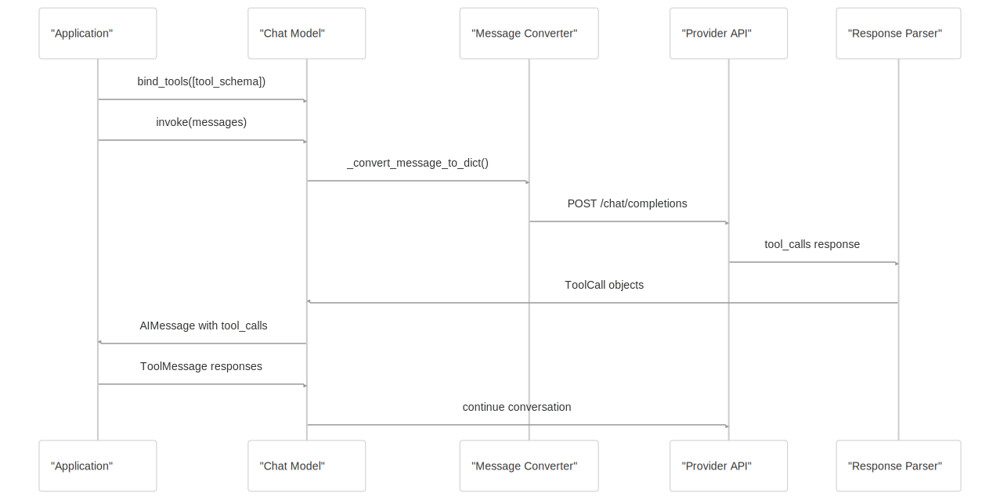

### Provider-Specific Tool Formatting

| Provider | Tool Call Format | ID Requirements | Special Features |
| --- | --- | --- | --- |
| **OpenAI** | `function` type with `name` and `arguments` | Any string | Parallel tool calls, structured output |
| **Anthropic** | `tool_use` content blocks | Generated UUIDs | Built-in tools, server tools (MCP) |
| **MistralAI** | `function` type | 9-character base62 | ID conversion required |
| **Groq** | OpenAI-compatible format | Any string | Same as OpenAI |

**Sources:** [libs/partners/openai/langchain\_openai/chat\_models/base.py272-290](https://github.com/langchain-ai/langchain/blob/54ea6205/libs/partners/openai/langchain_openai/chat_models/base.py#L272-L290) [libs/partners/anthropic/langchain\_anthropic/chat\_models.py333-366](https://github.com/langchain-ai/langchain/blob/54ea6205/libs/partners/anthropic/langchain_anthropic/chat_models.py#L333-L366) [libs/partners/mistralai/langchain\_mistralai/chat\_models.py294-319](https://github.com/langchain-ai/langchain/blob/54ea6205/libs/partners/mistralai/langchain_mistralai/chat_models.py#L294-L319)

## Streaming and Async Support

All provider integrations support both synchronous and asynchronous streaming:

### Streaming Architecture


### Usage Metadata Tracking

Providers implement usage tracking through the `UsageMetadata` interface:


**Sources:** [libs/partners/openai/langchain\_openai/chat\_models/base.py474-479](https://github.com/langchain-ai/langchain/blob/54ea6205/libs/partners/openai/langchain_openai/chat_models/base.py#L474-L479) [libs/partners/anthropic/langchain\_anthropic/chat\_models.py1410-1420](https://github.com/langchain-ai/langchain/blob/54ea6205/libs/partners/anthropic/langchain_anthropic/chat_models.py#L1410-L1420) [libs/partners/mistralai/langchain\_mistralai/chat\_models.py267-274](https://github.com/langchain-ai/langchain/blob/54ea6205/libs/partners/mistralai/langchain_mistralai/chat_models.py#L267-L274)

## Package Configuration

Each provider integration is packaged independently with specific dependencies:

### Dependency Management


**Sources:** [libs/partners/openai/pyproject.toml9-13](https://github.com/langchain-ai/langchain/blob/54ea6205/libs/partners/openai/pyproject.toml#L9-L13) [libs/partners/anthropic/pyproject.toml9-13](https://github.com/langchain-ai/langchain/blob/54ea6205/libs/partners/anthropic/pyproject.toml#L9-L13) [libs/partners/mistralai/pyproject.toml9-15](https://github.com/langchain-ai/langchain/blob/54ea6205/libs/partners/mistralai/pyproject.toml#L9-L15) [libs/partners/groq/pyproject.toml9](https://github.com/langchain-ai/langchain/blob/54ea6205/libs/partners/groq/pyproject.toml#L9-L9) [libs/partners/fireworks/pyproject.toml9-15](https://github.com/langchain-ai/langchain/blob/54ea6205/libs/partners/fireworks/pyproject.toml#L9-L15)

Dismiss

Refresh this wiki

Enter email to refresh

### On this page

* [Provider Integrations](#provider-integrations)
* [Integration Architecture](#integration-architecture)
* [Partner Ecosystem Overview](#partner-ecosystem-overview)
* [Provider Package Structure](#provider-package-structure)
* [Common Integration Patterns](#common-integration-patterns)
* [Integration Standards and Testing](#integration-standards-and-testing)
* [Major Provider Implementations](#major-provider-implementations)
* [OpenAI Integration](#openai-integration)
* [Anthropic Integration](#anthropic-integration)
* [MistralAI Integration](#mistralai-integration)
* [Message Format Translation](#message-format-translation)
* [OpenAI Message Format](#openai-message-format)
* [Anthropic Message Format](#anthropic-message-format)
* [Tool Calling Integration](#tool-calling-integration)
* [Tool Call Flow](#tool-call-flow)
* [Provider-Specific Tool Formatting](#provider-specific-tool-formatting)
* [Streaming and Async Support](#streaming-and-async-support)
* [Streaming Architecture](#streaming-architecture)
* [Usage Metadata Tracking](#usage-metadata-tracking)
* [Package Configuration](#package-configuration)
* [Dependency Management](#dependency-management)

Ask Devin about langchain-ai/langchain

Deep Research

Syntax error in textmermaid version 11.6.0