# Major Provider Integrations

[Index your code with Devin](/private-repo)

[DeepWiki](https://deepwiki.com)

[DeepWiki](/)

[langchain-ai/langchain](https://github.com/langchain-ai/langchain "Open repository")

[Index your code with

Devin](/private-repo)Share

Last indexed: 29 September 2025 ([54ea62](https://github.com/langchain-ai/langchain/commits/54ea6205))

* [LangChain Overview](/langchain-ai/langchain/1-langchain-overview)
* [Package Ecosystem](/langchain-ai/langchain/1.1-package-ecosystem)
* [Core Architecture](/langchain-ai/langchain/2-core-architecture)
* [Runnable Interface and LCEL](/langchain-ai/langchain/2.1-runnable-interface-and-lcel)
* [Language Models and Chat Models](/langchain-ai/langchain/2.2-language-models-and-chat-models)
* [Messages and Communication](/langchain-ai/langchain/2.3-messages-and-communication)
* [Tools and Function Calling](/langchain-ai/langchain/2.4-tools-and-function-calling)
* [Provider Integrations](/langchain-ai/langchain/3-provider-integrations)
* [Major Provider Integrations](/langchain-ai/langchain/3.1-major-provider-integrations)
* [Local and Self-Hosted Models](/langchain-ai/langchain/3.2-local-and-self-hosted-models)
* [Community Integrations](/langchain-ai/langchain/3.3-community-integrations)
* [Application Development](/langchain-ai/langchain/4-application-development)
* [Common Patterns and Use Cases](/langchain-ai/langchain/4.1-common-patterns-and-use-cases)
* [CLI and Project Management](/langchain-ai/langchain/4.2-cli-and-project-management)
* [Text Processing and Document Handling](/langchain-ai/langchain/4.3-text-processing-and-document-handling)
* [Next-Generation Agents](/langchain-ai/langchain/4.4-next-generation-agents)
* [Evaluation and Testing](/langchain-ai/langchain/5-evaluation-and-testing)
* [Standard Testing Framework](/langchain-ai/langchain/5.1-standard-testing-framework)
* [LangSmith Evaluation](/langchain-ai/langchain/5.2-langsmith-evaluation)
* [Developer Experience](/langchain-ai/langchain/6-developer-experience)
* [Package Structure and Build System](/langchain-ai/langchain/6.1-package-structure-and-build-system)
* [CI/CD and Release Process](/langchain-ai/langchain/6.2-cicd-and-release-process)
* [Documentation System](/langchain-ai/langchain/7-documentation-system)
* [User Documentation](/langchain-ai/langchain/7.1-user-documentation)
* [API Reference Generation](/langchain-ai/langchain/7.2-api-reference-generation)

Menu

# Major Provider Integrations

Relevant source files

* [docs/docs/integrations/chat/anthropic.ipynb](https://github.com/langchain-ai/langchain/blob/54ea6205/docs/docs/integrations/chat/anthropic.ipynb)
* [docs/docs/integrations/chat/xai.ipynb](https://github.com/langchain-ai/langchain/blob/54ea6205/docs/docs/integrations/chat/xai.ipynb)
* [docs/docs/integrations/providers/xai.ipynb](https://github.com/langchain-ai/langchain/blob/54ea6205/docs/docs/integrations/providers/xai.ipynb)
* [libs/langchain/tests/unit\_tests/chat\_models/test\_base.py](https://github.com/langchain-ai/langchain/blob/54ea6205/libs/langchain/tests/unit_tests/chat_models/test_base.py)
* [libs/partners/anthropic/langchain\_anthropic/\_client\_utils.py](https://github.com/langchain-ai/langchain/blob/54ea6205/libs/partners/anthropic/langchain_anthropic/_client_utils.py)
* [libs/partners/anthropic/langchain\_anthropic/chat\_models.py](https://github.com/langchain-ai/langchain/blob/54ea6205/libs/partners/anthropic/langchain_anthropic/chat_models.py)
* [libs/partners/anthropic/langchain\_anthropic/experimental.py](https://github.com/langchain-ai/langchain/blob/54ea6205/libs/partners/anthropic/langchain_anthropic/experimental.py)
* [libs/partners/anthropic/langchain\_anthropic/llms.py](https://github.com/langchain-ai/langchain/blob/54ea6205/libs/partners/anthropic/langchain_anthropic/llms.py)
* [libs/partners/anthropic/langchain\_anthropic/output\_parsers.py](https://github.com/langchain-ai/langchain/blob/54ea6205/libs/partners/anthropic/langchain_anthropic/output_parsers.py)
* [libs/partners/anthropic/pyproject.toml](https://github.com/langchain-ai/langchain/blob/54ea6205/libs/partners/anthropic/pyproject.toml)
* [libs/partners/anthropic/tests/cassettes/TestAnthropicStandard.test\_stream\_time.yaml.gz](https://github.com/langchain-ai/langchain/blob/54ea6205/libs/partners/anthropic/tests/cassettes/TestAnthropicStandard.test_stream_time.yaml.gz)
* [libs/partners/anthropic/tests/cassettes/test\_code\_execution.yaml.gz](https://github.com/langchain-ai/langchain/blob/54ea6205/libs/partners/anthropic/tests/cassettes/test_code_execution.yaml.gz)
* [libs/partners/anthropic/tests/cassettes/test\_redacted\_thinking.yaml.gz](https://github.com/langchain-ai/langchain/blob/54ea6205/libs/partners/anthropic/tests/cassettes/test_redacted_thinking.yaml.gz)
* [libs/partners/anthropic/tests/cassettes/test\_remote\_mcp.yaml.gz](https://github.com/langchain-ai/langchain/blob/54ea6205/libs/partners/anthropic/tests/cassettes/test_remote_mcp.yaml.gz)
* [libs/partners/anthropic/tests/cassettes/test\_thinking.yaml.gz](https://github.com/langchain-ai/langchain/blob/54ea6205/libs/partners/anthropic/tests/cassettes/test_thinking.yaml.gz)
* [libs/partners/anthropic/tests/cassettes/test\_web\_search.yaml.gz](https://github.com/langchain-ai/langchain/blob/54ea6205/libs/partners/anthropic/tests/cassettes/test_web_search.yaml.gz)
* [libs/partners/anthropic/tests/integration\_tests/test\_chat\_models.py](https://github.com/langchain-ai/langchain/blob/54ea6205/libs/partners/anthropic/tests/integration_tests/test_chat_models.py)
* [libs/partners/anthropic/tests/integration\_tests/test\_experimental.py](https://github.com/langchain-ai/langchain/blob/54ea6205/libs/partners/anthropic/tests/integration_tests/test_experimental.py)
* [libs/partners/anthropic/tests/integration\_tests/test\_llms.py](https://github.com/langchain-ai/langchain/blob/54ea6205/libs/partners/anthropic/tests/integration_tests/test_llms.py)
* [libs/partners/anthropic/tests/integration\_tests/test\_standard.py](https://github.com/langchain-ai/langchain/blob/54ea6205/libs/partners/anthropic/tests/integration_tests/test_standard.py)
* [libs/partners/anthropic/tests/unit\_tests/test\_chat\_models.py](https://github.com/langchain-ai/langchain/blob/54ea6205/libs/partners/anthropic/tests/unit_tests/test_chat_models.py)
* [libs/partners/anthropic/tests/unit\_tests/test\_client\_utils.py](https://github.com/langchain-ai/langchain/blob/54ea6205/libs/partners/anthropic/tests/unit_tests/test_client_utils.py)
* [libs/partners/anthropic/tests/unit\_tests/test\_output\_parsers.py](https://github.com/langchain-ai/langchain/blob/54ea6205/libs/partners/anthropic/tests/unit_tests/test_output_parsers.py)
* [libs/partners/anthropic/tests/unit\_tests/test\_standard.py](https://github.com/langchain-ai/langchain/blob/54ea6205/libs/partners/anthropic/tests/unit_tests/test_standard.py)
* [libs/partners/anthropic/uv.lock](https://github.com/langchain-ai/langchain/blob/54ea6205/libs/partners/anthropic/uv.lock)
* [libs/partners/deepseek/langchain\_deepseek/chat\_models.py](https://github.com/langchain-ai/langchain/blob/54ea6205/libs/partners/deepseek/langchain_deepseek/chat_models.py)
* [libs/partners/deepseek/pyproject.toml](https://github.com/langchain-ai/langchain/blob/54ea6205/libs/partners/deepseek/pyproject.toml)
* [libs/partners/deepseek/scripts/check\_imports.py](https://github.com/langchain-ai/langchain/blob/54ea6205/libs/partners/deepseek/scripts/check_imports.py)
* [libs/partners/deepseek/tests/integration\_tests/test\_chat\_models.py](https://github.com/langchain-ai/langchain/blob/54ea6205/libs/partners/deepseek/tests/integration_tests/test_chat_models.py)
* [libs/partners/deepseek/tests/integration\_tests/test\_compile.py](https://github.com/langchain-ai/langchain/blob/54ea6205/libs/partners/deepseek/tests/integration_tests/test_compile.py)
* [libs/partners/deepseek/tests/unit\_tests/test\_chat\_models.py](https://github.com/langchain-ai/langchain/blob/54ea6205/libs/partners/deepseek/tests/unit_tests/test_chat_models.py)
* [libs/partners/deepseek/uv.lock](https://github.com/langchain-ai/langchain/blob/54ea6205/libs/partners/deepseek/uv.lock)
* [libs/partners/fireworks/langchain\_fireworks/\_\_init\_\_.py](https://github.com/langchain-ai/langchain/blob/54ea6205/libs/partners/fireworks/langchain_fireworks/__init__.py)
* [libs/partners/fireworks/langchain\_fireworks/chat\_models.py](https://github.com/langchain-ai/langchain/blob/54ea6205/libs/partners/fireworks/langchain_fireworks/chat_models.py)
* [libs/partners/fireworks/langchain\_fireworks/embeddings.py](https://github.com/langchain-ai/langchain/blob/54ea6205/libs/partners/fireworks/langchain_fireworks/embeddings.py)
* [libs/partners/fireworks/langchain\_fireworks/llms.py](https://github.com/langchain-ai/langchain/blob/54ea6205/libs/partners/fireworks/langchain_fireworks/llms.py)
* [libs/partners/fireworks/pyproject.toml](https://github.com/langchain-ai/langchain/blob/54ea6205/libs/partners/fireworks/pyproject.toml)
* [libs/partners/fireworks/tests/integration\_tests/test\_chat\_models.py](https://github.com/langchain-ai/langchain/blob/54ea6205/libs/partners/fireworks/tests/integration_tests/test_chat_models.py)
* [libs/partners/fireworks/tests/integration\_tests/test\_compile.py](https://github.com/langchain-ai/langchain/blob/54ea6205/libs/partners/fireworks/tests/integration_tests/test_compile.py)
* [libs/partners/fireworks/tests/integration\_tests/test\_llms.py](https://github.com/langchain-ai/langchain/blob/54ea6205/libs/partners/fireworks/tests/integration_tests/test_llms.py)
* [libs/partners/fireworks/tests/integration\_tests/test\_standard.py](https://github.com/langchain-ai/langchain/blob/54ea6205/libs/partners/fireworks/tests/integration_tests/test_standard.py)
* [libs/partners/fireworks/tests/unit\_tests/\_\_snapshots\_\_/test\_standard.ambr](https://github.com/langchain-ai/langchain/blob/54ea6205/libs/partners/fireworks/tests/unit_tests/__snapshots__/test_standard.ambr)
* [libs/partners/fireworks/tests/unit\_tests/test\_embeddings\_standard.py](https://github.com/langchain-ai/langchain/blob/54ea6205/libs/partners/fireworks/tests/unit_tests/test_embeddings_standard.py)
* [libs/partners/fireworks/tests/unit\_tests/test\_llms.py](https://github.com/langchain-ai/langchain/blob/54ea6205/libs/partners/fireworks/tests/unit_tests/test_llms.py)
* [libs/partners/fireworks/tests/unit\_tests/test\_standard.py](https://github.com/langchain-ai/langchain/blob/54ea6205/libs/partners/fireworks/tests/unit_tests/test_standard.py)
* [libs/partners/fireworks/uv.lock](https://github.com/langchain-ai/langchain/blob/54ea6205/libs/partners/fireworks/uv.lock)
* [libs/partners/groq/langchain\_groq/chat\_models.py](https://github.com/langchain-ai/langchain/blob/54ea6205/libs/partners/groq/langchain_groq/chat_models.py)
* [libs/partners/groq/pyproject.toml](https://github.com/langchain-ai/langchain/blob/54ea6205/libs/partners/groq/pyproject.toml)
* [libs/partners/groq/scripts/check\_imports.py](https://github.com/langchain-ai/langchain/blob/54ea6205/libs/partners/groq/scripts/check_imports.py)
* [libs/partners/groq/tests/integration\_tests/test\_chat\_models.py](https://github.com/langchain-ai/langchain/blob/54ea6205/libs/partners/groq/tests/integration_tests/test_chat_models.py)
* [libs/partners/groq/tests/integration\_tests/test\_compile.py](https://github.com/langchain-ai/langchain/blob/54ea6205/libs/partners/groq/tests/integration_tests/test_compile.py)
* [libs/partners/groq/tests/integration\_tests/test\_standard.py](https://github.com/langchain-ai/langchain/blob/54ea6205/libs/partners/groq/tests/integration_tests/test_standard.py)
* [libs/partners/groq/tests/unit\_tests/\_\_snapshots\_\_/test\_standard.ambr](https://github.com/langchain-ai/langchain/blob/54ea6205/libs/partners/groq/tests/unit_tests/__snapshots__/test_standard.ambr)
* [libs/partners/groq/tests/unit\_tests/fake/callbacks.py](https://github.com/langchain-ai/langchain/blob/54ea6205/libs/partners/groq/tests/unit_tests/fake/callbacks.py)
* [libs/partners/groq/tests/unit\_tests/test\_chat\_models.py](https://github.com/langchain-ai/langchain/blob/54ea6205/libs/partners/groq/tests/unit_tests/test_chat_models.py)
* [libs/partners/groq/tests/unit\_tests/test\_standard.py](https://github.com/langchain-ai/langchain/blob/54ea6205/libs/partners/groq/tests/unit_tests/test_standard.py)
* [libs/partners/groq/uv.lock](https://github.com/langchain-ai/langchain/blob/54ea6205/libs/partners/groq/uv.lock)
* [libs/partners/huggingface/pyproject.toml](https://github.com/langchain-ai/langchain/blob/54ea6205/libs/partners/huggingface/pyproject.toml)
* [libs/partners/huggingface/uv.lock](https://github.com/langchain-ai/langchain/blob/54ea6205/libs/partners/huggingface/uv.lock)
* [libs/partners/mistralai/langchain\_mistralai/chat\_models.py](https://github.com/langchain-ai/langchain/blob/54ea6205/libs/partners/mistralai/langchain_mistralai/chat_models.py)
* [libs/partners/mistralai/langchain\_mistralai/embeddings.py](https://github.com/langchain-ai/langchain/blob/54ea6205/libs/partners/mistralai/langchain_mistralai/embeddings.py)
* [libs/partners/mistralai/pyproject.toml](https://github.com/langchain-ai/langchain/blob/54ea6205/libs/partners/mistralai/pyproject.toml)
* [libs/partners/mistralai/tests/integration\_tests/test\_chat\_models.py](https://github.com/langchain-ai/langchain/blob/54ea6205/libs/partners/mistralai/tests/integration_tests/test_chat_models.py)
* [libs/partners/mistralai/tests/integration\_tests/test\_compile.py](https://github.com/langchain-ai/langchain/blob/54ea6205/libs/partners/mistralai/tests/integration_tests/test_compile.py)
* [libs/partners/mistralai/tests/integration\_tests/test\_embeddings.py](https://github.com/langchain-ai/langchain/blob/54ea6205/libs/partners/mistralai/tests/integration_tests/test_embeddings.py)
* [libs/partners/mistralai/tests/integration\_tests/test\_standard.py](https://github.com/langchain-ai/langchain/blob/54ea6205/libs/partners/mistralai/tests/integration_tests/test_standard.py)
* [libs/partners/mistralai/tests/unit\_tests/\_\_snapshots\_\_/test\_standard.ambr](https://github.com/langchain-ai/langchain/blob/54ea6205/libs/partners/mistralai/tests/unit_tests/__snapshots__/test_standard.ambr)
* [libs/partners/mistralai/tests/unit\_tests/test\_chat\_models.py](https://github.com/langchain-ai/langchain/blob/54ea6205/libs/partners/mistralai/tests/unit_tests/test_chat_models.py)
* [libs/partners/mistralai/tests/unit\_tests/test\_standard.py](https://github.com/langchain-ai/langchain/blob/54ea6205/libs/partners/mistralai/tests/unit_tests/test_standard.py)
* [libs/partners/mistralai/uv.lock](https://github.com/langchain-ai/langchain/blob/54ea6205/libs/partners/mistralai/uv.lock)
* [libs/partners/openai/langchain\_openai/chat\_models/base.py](https://github.com/langchain-ai/langchain/blob/54ea6205/libs/partners/openai/langchain_openai/chat_models/base.py)
* [libs/partners/openai/pyproject.toml](https://github.com/langchain-ai/langchain/blob/54ea6205/libs/partners/openai/pyproject.toml)
* [libs/partners/openai/tests/cassettes/TestOpenAIResponses.test\_stream\_time.yaml.gz](https://github.com/langchain-ai/langchain/blob/54ea6205/libs/partners/openai/tests/cassettes/TestOpenAIResponses.test_stream_time.yaml.gz)
* [libs/partners/openai/tests/cassettes/TestOpenAIStandard.test\_stream\_time.yaml.gz](https://github.com/langchain-ai/langchain/blob/54ea6205/libs/partners/openai/tests/cassettes/TestOpenAIStandard.test_stream_time.yaml.gz)
* [libs/partners/openai/tests/cassettes/test\_code\_interpreter.yaml.gz](https://github.com/langchain-ai/langchain/blob/54ea6205/libs/partners/openai/tests/cassettes/test_code_interpreter.yaml.gz)
* [libs/partners/openai/tests/cassettes/test\_image\_generation\_multi\_turn.yaml.gz](https://github.com/langchain-ai/langchain/blob/54ea6205/libs/partners/openai/tests/cassettes/test_image_generation_multi_turn.yaml.gz)
* [libs/partners/openai/tests/cassettes/test\_image\_generation\_streaming.yaml.gz](https://github.com/langchain-ai/langchain/blob/54ea6205/libs/partners/openai/tests/cassettes/test_image_generation_streaming.yaml.gz)
* [libs/partners/openai/tests/cassettes/test\_mcp\_builtin.yaml.gz](https://github.com/langchain-ai/langchain/blob/54ea6205/libs/partners/openai/tests/cassettes/test_mcp_builtin.yaml.gz)
* [libs/partners/openai/tests/integration\_tests/chat\_models/test\_azure.py](https://github.com/langchain-ai/langchain/blob/54ea6205/libs/partners/openai/tests/integration_tests/chat_models/test_azure.py)
* [libs/partners/openai/tests/integration\_tests/chat\_models/test\_base.py](https://github.com/langchain-ai/langchain/blob/54ea6205/libs/partners/openai/tests/integration_tests/chat_models/test_base.py)
* [libs/partners/openai/tests/integration\_tests/chat\_models/test\_base\_standard.py](https://github.com/langchain-ai/langchain/blob/54ea6205/libs/partners/openai/tests/integration_tests/chat_models/test_base_standard.py)
* [libs/partners/openai/tests/integration\_tests/chat\_models/test\_responses\_api.py](https://github.com/langchain-ai/langchain/blob/54ea6205/libs/partners/openai/tests/integration_tests/chat_models/test_responses_api.py)
* [libs/partners/openai/tests/unit\_tests/chat\_models/\_\_snapshots\_\_/test\_azure\_standard.ambr](https://github.com/langchain-ai/langchain/blob/54ea6205/libs/partners/openai/tests/unit_tests/chat_models/__snapshots__/test_azure_standard.ambr)
* [libs/partners/openai/tests/unit\_tests/chat\_models/\_\_snapshots\_\_/test\_base\_standard.ambr](https://github.com/langchain-ai/langchain/blob/54ea6205/libs/partners/openai/tests/unit_tests/chat_models/__snapshots__/test_base_standard.ambr)
* [libs/partners/openai/tests/unit\_tests/chat\_models/test\_base.py](https://github.com/langchain-ai/langchain/blob/54ea6205/libs/partners/openai/tests/unit_tests/chat_models/test_base.py)
* [libs/partners/openai/tests/unit\_tests/chat\_models/test\_prompt\_cache\_key.py](https://github.com/langchain-ai/langchain/blob/54ea6205/libs/partners/openai/tests/unit_tests/chat_models/test_prompt_cache_key.py)
* [libs/partners/openai/tests/unit\_tests/test\_tools.py](https://github.com/langchain-ai/langchain/blob/54ea6205/libs/partners/openai/tests/unit_tests/test_tools.py)
* [libs/partners/openai/uv.lock](https://github.com/langchain-ai/langchain/blob/54ea6205/libs/partners/openai/uv.lock)
* [libs/partners/perplexity/pyproject.toml](https://github.com/langchain-ai/langchain/blob/54ea6205/libs/partners/perplexity/pyproject.toml)
* [libs/partners/perplexity/uv.lock](https://github.com/langchain-ai/langchain/blob/54ea6205/libs/partners/perplexity/uv.lock)
* [libs/partners/xai/Makefile](https://github.com/langchain-ai/langchain/blob/54ea6205/libs/partners/xai/Makefile)
* [libs/partners/xai/langchain\_xai/chat\_models.py](https://github.com/langchain-ai/langchain/blob/54ea6205/libs/partners/xai/langchain_xai/chat_models.py)
* [libs/partners/xai/pyproject.toml](https://github.com/langchain-ai/langchain/blob/54ea6205/libs/partners/xai/pyproject.toml)
* [libs/partners/xai/scripts/check\_imports.py](https://github.com/langchain-ai/langchain/blob/54ea6205/libs/partners/xai/scripts/check_imports.py)
* [libs/partners/xai/tests/integration\_tests/test\_chat\_models\_standard.py](https://github.com/langchain-ai/langchain/blob/54ea6205/libs/partners/xai/tests/integration_tests/test_chat_models_standard.py)
* [libs/partners/xai/tests/integration\_tests/test\_compile.py](https://github.com/langchain-ai/langchain/blob/54ea6205/libs/partners/xai/tests/integration_tests/test_compile.py)
* [libs/partners/xai/tests/unit\_tests/\_\_snapshots\_\_/test\_chat\_models\_standard.ambr](https://github.com/langchain-ai/langchain/blob/54ea6205/libs/partners/xai/tests/unit_tests/__snapshots__/test_chat_models_standard.ambr)
* [libs/partners/xai/tests/unit\_tests/test\_chat\_models.py](https://github.com/langchain-ai/langchain/blob/54ea6205/libs/partners/xai/tests/unit_tests/test_chat_models.py)
* [libs/partners/xai/tests/unit\_tests/test\_secrets.py](https://github.com/langchain-ai/langchain/blob/54ea6205/libs/partners/xai/tests/unit_tests/test_secrets.py)
* [libs/partners/xai/uv.lock](https://github.com/langchain-ai/langchain/blob/54ea6205/libs/partners/xai/uv.lock)

This document covers the major LLM provider integrations in LangChain, including OpenAI, Anthropic, MistralAI, Groq, and Fireworks. These integrations provide the primary chat model implementations that power LangChain applications, each implementing the core `BaseChatModel` abstraction while exposing provider-specific capabilities.

For information about local models, see [Local and Self-Hosted Models](/langchain-ai/langchain/3.2-local-and-self-hosted-models). For community-maintained integrations, see [Community Integrations](/langchain-ai/langchain/3.3-community-integrations). For core chat model concepts, see [Language Models and Chat Models](/langchain-ai/langchain/2.2-language-models-and-chat-models).

## Provider Integration Architecture

All major provider integrations follow a consistent architectural pattern, implementing LangChain's `BaseChatModel` abstraction while interfacing with provider-specific SDKs and APIs.


Sources: [libs/partners/openai/langchain\_openai/chat\_models/base.py447](https://github.com/langchain-ai/langchain/blob/54ea6205/libs/partners/openai/langchain_openai/chat_models/base.py#L447-L447) [libs/partners/anthropic/langchain\_anthropic/chat\_models.py502](https://github.com/langchain-ai/langchain/blob/54ea6205/libs/partners/anthropic/langchain_anthropic/chat_models.py#L502-L502) [libs/partners/mistralai/langchain\_mistralai/chat\_models.py385](https://github.com/langchain-ai/langchain/blob/54ea6205/libs/partners/mistralai/langchain_mistralai/chat_models.py#L385-L385) [libs/partners/groq/langchain\_groq/chat\_models.py65](https://github.com/langchain-ai/langchain/blob/54ea6205/libs/partners/groq/langchain_groq/chat_models.py#L65-L65) [libs/partners/fireworks/langchain\_fireworks/chat\_models.py60](https://github.com/langchain-ai/langchain/blob/54ea6205/libs/partners/fireworks/langchain_fireworks/chat_models.py#L60-L60)

## Provider Comparison

| Provider | Package | Key Models | Special Features | API Pattern |
| --- | --- | --- | --- | --- |
| OpenAI | `langchain-openai` | GPT-4, GPT-3.5, o1, o3, o4-mini | Structured output, Responses API, reasoning models, well-known tools | OpenAI-compatible |
| Anthropic | `langchain-anthropic` | Claude 3.5, Claude 3 | Computer use, thinking/reasoning blocks, caching, Files API | Messages API |
| MistralAI | `langchain-mistralai` | Mixtral, Mistral Large | Direct HTTP client, custom tool ID handling | OpenAI-compatible |
| Groq | `langchain-groq` | Fast inference, Llama models | High-speed inference, reasoning format | OpenAI-compatible |
| Fireworks | `langchain-fireworks` | Open models, custom deployments | Model flexibility, Firebase integration | OpenAI-compatible |
| xAI | `langchain-xai` | Grok models | xAI platform integration | OpenAI-compatible |
| DeepSeek | `langchain-deepseek` | DeepSeek models | DeepSeek platform integration | OpenAI-compatible |

Sources: [libs/partners/openai/pyproject.toml14](https://github.com/langchain-ai/langchain/blob/54ea6205/libs/partners/openai/pyproject.toml#L14-L14) [libs/partners/anthropic/pyproject.toml14](https://github.com/langchain-ai/langchain/blob/54ea6205/libs/partners/anthropic/pyproject.toml#L14-L14) [libs/partners/mistralai/pyproject.toml16](https://github.com/langchain-ai/langchain/blob/54ea6205/libs/partners/mistralai/pyproject.toml#L16-L16) [libs/partners/groq/pyproject.toml10](https://github.com/langchain-ai/langchain/blob/54ea6205/libs/partners/groq/pyproject.toml#L10-L10) [libs/partners/fireworks/pyproject.toml16](https://github.com/langchain-ai/langchain/blob/54ea6205/libs/partners/fireworks/pyproject.toml#L16-L16)

## OpenAI Integration

### ChatOpenAI Implementation

`ChatOpenAI` is implemented through the `BaseChatOpenAI` class, which provides the core functionality for OpenAI's models including GPT-4, GPT-3.5, and reasoning models like o1.


Sources: [libs/partners/openai/langchain\_openai/chat\_models/base.py438-851](https://github.com/langchain-ai/langchain/blob/54ea6205/libs/partners/openai/langchain_openai/chat_models/base.py#L438-L851) [libs/partners/openai/langchain\_openai/chat\_models/base.py497-534](https://github.com/langchain-ai/langchain/blob/54ea6205/libs/partners/openai/langchain_openai/chat_models/base.py#L497-L534) [libs/partners/openai/langchain\_openai/chat\_models/base.py670-677](https://github.com/langchain-ai/langchain/blob/54ea6205/libs/partners/openai/langchain_openai/chat_models/base.py#L670-L677) [libs/partners/openai/langchain\_openai/chat\_models/base.py123-131](https://github.com/langchain-ai/langchain/blob/54ea6205/libs/partners/openai/langchain_openai/chat_models/base.py#L123-L131)

### OpenAI Message Conversion

OpenAI integration includes comprehensive message conversion between LangChain messages and OpenAI API format, with support for multimodal content and tool calls.


Sources: [libs/partners/openai/langchain\_openai/chat\_models/base.py251-319](https://github.com/langchain-ai/langchain/blob/54ea6205/libs/partners/openai/langchain_openai/chat_models/base.py#L251-L319) [libs/partners/openai/langchain\_openai/chat\_models/base.py134-203](https://github.com/langchain-ai/langchain/blob/54ea6205/libs/partners/openai/langchain_openai/chat_models/base.py#L134-L203) [libs/partners/openai/langchain\_openai/chat\_models/base.py206-248](https://github.com/langchain-ai/langchain/blob/54ea6205/libs/partners/openai/langchain_openai/chat_models/base.py#L206-L248)

## Anthropic Integration

### ChatAnthropic Implementation

`ChatAnthropic` provides integration with Claude models, featuring advanced capabilities like computer use, thinking blocks, and prompt caching.


Sources: [libs/partners/anthropic/langchain\_anthropic/chat\_models.py502-1400](https://github.com/langchain-ai/langchain/blob/54ea6205/libs/partners/anthropic/langchain_anthropic/chat_models.py#L502-L1400) [libs/partners/anthropic/langchain\_anthropic/chat\_models.py142-188](https://github.com/langchain-ai/langchain/blob/54ea6205/libs/partners/anthropic/langchain_anthropic/chat_models.py#L142-L188) [libs/partners/anthropic/langchain\_anthropic/chat\_models.py282-490](https://github.com/langchain-ai/langchain/blob/54ea6205/libs/partners/anthropic/langchain_anthropic/chat_models.py#L282-L490)

### Anthropic Content Block System

Anthropic uses a sophisticated content block system for handling different types of content within messages, including support for the Files API.


Sources: [libs/partners/anthropic/langchain\_anthropic/chat\_models.py98-142](https://github.com/langchain-ai/langchain/blob/54ea6205/libs/partners/anthropic/langchain_anthropic/chat_models.py#L98-L142) [libs/partners/anthropic/langchain\_anthropic/chat\_models.py193-282](https://github.com/langchain-ai/langchain/blob/54ea6205/libs/partners/anthropic/langchain_anthropic/chat_models.py#L193-L282) [libs/partners/anthropic/langchain\_anthropic/chat\_models.py145-190](https://github.com/langchain-ai/langchain/blob/54ea6205/libs/partners/anthropic/langchain_anthropic/chat_models.py#L145-L190) [docs/docs/integrations/chat/anthropic.ipynb788-815](https://github.com/langchain-ai/langchain/blob/54ea6205/docs/docs/integrations/chat/anthropic.ipynb#L788-L815)

## MistralAI Integration

### ChatMistralAI Implementation

`ChatMistralAI` implements direct HTTP communication with Mistral's API using `httpx`, featuring custom tool call ID handling and server-sent events for streaming.


Sources: [libs/partners/mistralai/langchain\_mistralai/chat\_models.py385-445](https://github.com/langchain-ai/langchain/blob/54ea6205/libs/partners/mistralai/langchain_mistralai/chat_models.py#L385-L445) [libs/partners/mistralai/langchain\_mistralai/chat\_models.py82-133](https://github.com/langchain-ai/langchain/blob/54ea6205/libs/partners/mistralai/langchain_mistralai/chat_models.py#L82-L133) [libs/partners/mistralai/langchain\_mistralai/chat\_models.py208-231](https://github.com/langchain-ai/langchain/blob/54ea6205/libs/partners/mistralai/langchain_mistralai/chat_models.py#L208-L231)

## Groq Integration

### ChatGroq Implementation

`ChatGroq` provides high-speed inference capabilities with support for reasoning models and custom reasoning formats.


Sources: [libs/partners/groq/langchain\_groq/chat\_models.py65-300](https://github.com/langchain-ai/langchain/blob/54ea6205/libs/partners/groq/langchain_groq/chat_models.py#L65-L300) [libs/partners/groq/langchain\_groq/chat\_models.py90-105](https://github.com/langchain-ai/langchain/blob/54ea6205/libs/partners/groq/langchain_groq/chat_models.py#L90-L105)

## Fireworks Integration

### ChatFireworks Implementation

`ChatFireworks` leverages the Fireworks platform for access to open-source models and custom deployments, using OpenAI-compatible interfaces.


Sources: [libs/partners/fireworks/langchain\_fireworks/chat\_models.py60-400](https://github.com/langchain-ai/langchain/blob/54ea6205/libs/partners/fireworks/langchain_fireworks/chat_models.py#L60-L400) [libs/partners/fireworks/pyproject.toml11-14](https://github.com/langchain-ai/langchain/blob/54ea6205/libs/partners/fireworks/pyproject.toml#L11-L14)

## Common Integration Patterns

### Tool Calling Implementation

All major providers implement tool calling capabilities with provider-specific adaptations for their underlying APIs.

| Provider | Tool Implementation | Special Features |
| --- | --- | --- |
| OpenAI | Native `tools` parameter | Parallel calls, well-known tools (file\_search, code\_interpreter, etc.) |
| Anthropic | `convert_to_anthropic_tool` conversion | Built-in tools (computer\_use, text\_editor, bash, web\_search) |
| MistralAI | `_format_tool_call_for_mistral` conversion | 9-character alphanumeric IDs, base62 encoding |
| Groq | OpenAI-compatible format | High-speed parallel execution |
| Fireworks | OpenAI-compatible format | Model-dependent support |
| xAI | OpenAI-compatible format | Grok model optimizations |
| DeepSeek | OpenAI-compatible format | DeepSeek model optimizations |


Sources: [libs/partners/openai/langchain\_openai/chat\_models/base.py123-130](https://github.com/langchain-ai/langchain/blob/54ea6205/libs/partners/openai/langchain_openai/chat_models/base.py#L123-L130) [libs/partners/anthropic/langchain\_anthropic/chat\_models.py26-44](https://github.com/langchain-ai/langchain/blob/54ea6205/libs/partners/anthropic/langchain_anthropic/chat_models.py#L26-L44) [libs/partners/mistralai/langchain\_mistralai/chat\_models.py294-305](https://github.com/langchain-ai/langchain/blob/54ea6205/libs/partners/mistralai/langchain_mistralai/chat_models.py#L294-L305)

### Streaming Architecture

All providers implement consistent streaming interfaces while adapting to different underlying streaming mechanisms.


Sources: [libs/partners/openai/langchain\_openai/chat\_models/base.py472-478](https://github.com/langchain-ai/langchain/blob/54ea6205/libs/partners/openai/langchain_openai/chat_models/base.py#L472-L478) [libs/partners/anthropic/langchain\_anthropic/chat\_models.py1300-1400](https://github.com/langchain-ai/langchain/blob/54ea6205/libs/partners/anthropic/langchain_anthropic/chat_models.py#L1300-L1400) [libs/partners/mistralai/langchain\_mistralai/chat\_models.py234-291](https://github.com/langchain-ai/langchain/blob/54ea6205/libs/partners/mistralai/langchain_mistralai/chat_models.py#L234-L291)

### Message Format Standardization

Each provider implements message conversion functions to translate between LangChain's standardized message format and provider-specific API formats.

| Provider | Key Conversion Functions | Special Handling |
| --- | --- | --- |
| OpenAI | `_convert_message_to_dict`, `_convert_dict_to_message` | Multimodal content, tool calls |
| Anthropic | `_format_messages`, `_merge_messages` | Content blocks, thinking blocks |
| MistralAI | `_convert_message_to_mistral_chat_message` | Tool ID conversion |
| Groq | OpenAI-compatible conversion | Reasoning content extraction |
| Fireworks | OpenAI-compatible conversion | Model-specific adaptations |

Sources: [libs/partners/openai/langchain\_openai/chat\_models/base.py251-319](https://github.com/langchain-ai/langchain/blob/54ea6205/libs/partners/openai/langchain_openai/chat_models/base.py#L251-L319) [libs/partners/anthropic/langchain\_anthropic/chat\_models.py282-490](https://github.com/langchain-ai/langchain/blob/54ea6205/libs/partners/anthropic/langchain_anthropic/chat_models.py#L282-L490) [libs/partners/mistralai/langchain\_mistralai/chat\_models.py322-382](https://github.com/langchain-ai/langchain/blob/54ea6205/libs/partners/mistralai/langchain_mistralai/chat_models.py#L322-L382)

## API Integration Patterns

### Dual API Support

The OpenAI integration supports both OpenAI's Chat Completions API and the newer Responses API, with automatic selection based on usage patterns.


Sources: [libs/partners/openai/langchain\_openai/chat\_models/base.py675-682](https://github.com/langchain-ai/langchain/blob/54ea6205/libs/partners/openai/langchain_openai/chat_models/base.py#L675-L682) [libs/partners/openai/tests/integration\_tests/chat\_models/test\_responses\_api.py55-114](https://github.com/langchain-ai/langchain/blob/54ea6205/libs/partners/openai/tests/integration_tests/chat_models/test_responses_api.py#L55-L114)

### Client Management and Caching

The integration implements efficient client caching to avoid creating multiple HTTP connections for similar configurations.

| Client Feature | Implementation | Purpose |
| --- | --- | --- |
| Client Caching | LRU cache based on config | Performance optimization |
| Connection Pooling | httpx client reuse | Resource efficiency |
| Proxy Support | `openai_proxy` parameter | Network configuration |
| Timeout Management | Configurable timeouts | Reliability |

Sources: [libs/partners/openai/tests/unit\_tests/chat\_models/test\_base.py83-105](https://github.com/langchain-ai/langchain/blob/54ea6205/libs/partners/openai/tests/unit_tests/chat_models/test_base.py#L83-L105) [libs/partners/openai/langchain\_openai/chat\_models/base.py754-817](https://github.com/langchain-ai/langchain/blob/54ea6205/libs/partners/openai/langchain_openai/chat_models/base.py#L754-L817)

### Error Handling and Validation

The integration includes comprehensive error handling for common OpenAI API issues and model limitations.


Sources: [libs/partners/openai/langchain\_openai/chat\_models/base.py405-428](https://github.com/langchain-ai/langchain/blob/54ea6205/libs/partners/openai/langchain_openai/chat_models/base.py#L405-L428) [libs/partners/openai/langchain\_openai/chat\_models/base.py715-737](https://github.com/langchain-ai/langchain/blob/54ea6205/libs/partners/openai/langchain_openai/chat_models/base.py#L715-L737) [libs/partners/openai/langchain\_openai/chat\_models/base.py588-604](https://github.com/langchain-ai/langchain/blob/54ea6205/libs/partners/openai/langchain_openai/chat_models/base.py#L588-L604)

Dismiss

Refresh this wiki

Enter email to refresh

### On this page

* [Major Provider Integrations](#major-provider-integrations)
* [Provider Integration Architecture](#provider-integration-architecture)
* [Provider Comparison](#provider-comparison)
* [OpenAI Integration](#openai-integration)
* [ChatOpenAI Implementation](#chatopenai-implementation)
* [OpenAI Message Conversion](#openai-message-conversion)
* [Anthropic Integration](#anthropic-integration)
* [ChatAnthropic Implementation](#chatanthropic-implementation)
* [Anthropic Content Block System](#anthropic-content-block-system)
* [MistralAI Integration](#mistralai-integration)
* [ChatMistralAI Implementation](#chatmistralai-implementation)
* [Groq Integration](#groq-integration)
* [ChatGroq Implementation](#chatgroq-implementation)
* [Fireworks Integration](#fireworks-integration)
* [ChatFireworks Implementation](#chatfireworks-implementation)
* [Common Integration Patterns](#common-integration-patterns)
* [Tool Calling Implementation](#tool-calling-implementation)
* [Streaming Architecture](#streaming-architecture)
* [Message Format Standardization](#message-format-standardization)
* [API Integration Patterns](#api-integration-patterns)
* [Dual API Support](#dual-api-support)
* [Client Management and Caching](#client-management-and-caching)
* [Error Handling and Validation](#error-handling-and-validation)

Ask Devin about langchain-ai/langchain

Deep Research